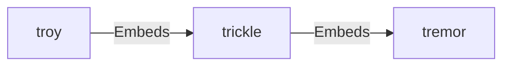
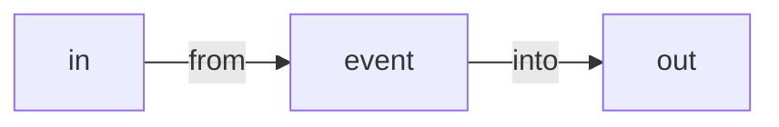
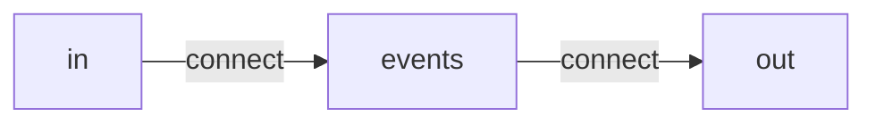
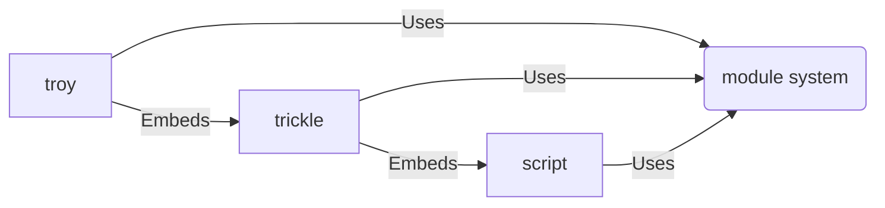

# Grammar

Tremor contains a number of related domain specific languages that are
designed to simplify development and operations of event based production
systems.

Tremor provides an expression oriented scripting language that is optimized
for transforming nested heirarchic data structures with a rich suite of
data transformation operations on nominal ( named ) record ( object ),
array ( list, set ) and primitive ( string, integral, floating point, boolean )
data types.

Tremor provides a statement oriented query like language that embeds the
scripting language that is flow oriented. Tremor queries are compiled to
directed-acyclic graphs represent streaming transformations based on builtin
operations such as `select` queries, or custom user defined scripted operations
via the `script` operator.

Tremor provides a statement oriented deployment language that embeds
the query and scripting langauges allows complex flows composed of
query pipelines, and connectors to external data sources and streams
to be interconnected and deployed into the tremor runtime.

## High Level Overview



## UNIX philosophy

Tremor follows UNIX philosophy. The scripting langauge encapsulates
the computation and manipulation of events. The query language composes
multiple streams of events into event processing graphs. The deployment
language connects the outside world to event flow applications in units
of deployment called a flow.

### Scripting

The simplest useful operation in an event based system is to pass an
inbound event in real time from some stream of origin to some target
stream preserving the event data.

In the scripting language this is a 1 line program:

```tremor
event
```

The `event` keyword in tremor represents the current event being processed.

### Querying

In the query language, this is also a 1 line program:

```trickle
select event from in into out;
```

Visually, this might render as follows:



The event originates at a standard builtin stream called `in` and
is distributed to a standard builtin stream called `out`.

### Deploying

In the deployment language, this is slightly longer:

```troy
###
### A simple console echo application
### Given json input line by line on stdin
### Produces json input line by lin on stdout
### Preserving order of events in distribution order
###

define flow main
flow
  # Define a pipeline with our passthrough logic
  define pipeline passthrough
  pipeline
    select event from in into out;
  end;

  # Define a connector that can read from stdin, write to stdio
  # and expects line delimited json messages
  define connector console from stdio
  with
    codec = "json",
    preprocessors = ["lines"],
    postprocessors = ["lines"],
  end;

  create connector out from console;       # Our output to `stdout`
  create connector in from console;        # Our input from `stdin`
  create pipeline main from passthrough;   # Our application

  connect /connector/in to /pipeline/main;  # Connect stdout to the app
  connect /pipeline/main to /connector/out; # Connect the app to stdout

end;

# The deploy command does all the work
deploy flow main;
```

Although the command that instructs tremor to deploy our 2 instances
of the `stdio` connector and our query application pipeline is a single
line, the flow `main` is a reusable template. So we can store our flow
in a separate file and reuse the definitions.

In fact, we have much more flexibility than this. We could further
modularise by separating the definitions of `pipeline`s and `connector`s
from their use in `flow` definitions.

This would enable us to have the same logic with different connectivity.
Perhaps instead of the console ( useful for developing and debugging ) we
might wish to use kafka connectors. Perhaps our kafka configuration will
be different depending on whether we're in a staging, development or production environment. Perhaps we are migrating from a legacy kafka cluster
to a high performance `redpanda` Kafka compatible cluster.

We can compose many different variants and reuse the parts as appropriate.

All of these possible `flow` variants have a similar structure:



### Running

```bash
$ tremor server run echo.troy
> tremor version: 0.12
> tremor instance: tremor
> rd_kafka version: 0x000002ff, 1.8.2
> allocator: snmalloc
> Listening at: http://0.0.0.0:9898
> 1
< 1
> {}
< {}
> "snot"
< "snot"
```

### Modularity

All tremor DSLs share a common set of compiler and runtime infrastructure.

The module system is itself defined as a [tremor-module](module_system) DSL.

The primary domain specific languages are:

| Guide                           | Description                       | Extension |
|---------------------------------|-----------------------------------|-----------|
| [tremor-module[](module_system) | - The tremor module system.       | `none`    |
| [tremor-deploy](deploy)         | - The tremor deployment language. | troy      |
| [tremor-query](query)           | - The tremor query language.      | trickle   |
| [tremor-script](script)         | - the tremor scripting language.  | script    |

## Module system

The DSLs in tremor share a common module system. The module system allows
multiple modular scripts to be loaded via one or many mount points. Each
mount point provides a heirarchy of modules where nesting and namespacing
is indicated by the relative folder structure, including the file's basename.

Scripts can load other scripts.
Queries can load scripts, and other queries.
Deployments can load queries, can load scripts and can load other deployments.



