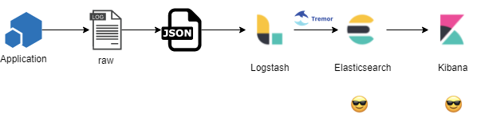

# Traffic Shaping

## Happened Before

This is our origin story. The simplified high level architecture of our
logging systems at  the time of tremor’s birth is:

## Identified Need

Enable load shedding and consistent capacity management at production
scale of the logging and metrics firehoses within Wayfair’s production,
staging and development environments; even when our live production
working set exceeds planned capacity, but especially when catastrophic
failure of infrastructure overwhelms our storage tier.

## Required Outcome

Our network operations center, system reliability and service
organization engineers should never be in a position where in-flight
mission-critical events are unavailable or lagging ( seconds or even
minutes ) the live working set state of our production systems.

Stale operational events direct limited resources under time constraints
and production service level objective pressures to curing or tending to
the wrong problems, at the wrong times and lead to missed opportunities
for early and cheap resolution.

### Characteristics

It is understood that, if a critical system ( such as a production
database ) fails - query failures won’t have a single point of origin in
the logs - whether over time, or across application or business units.
When under extreme load beyond capacity - only a subset of the firehose
is required for in-flight diagnostics of our production estate.

> In-flight categorization, classification & rate limiting enables
> **just-in-time traffic shaping**, load-shedding and bending critical
> infrastructure to available capacity even as capacity   changes in
> planned or surprising ways.

It is understood that, regardless of the system state - that some logs
from a subset of systems, applications or services are relatively more
important than others. This is even more true when our systems and
services are under extraordinary strain due to unplanned failures and
outages. Unplanned failures and outages are expected at Wayfair
production scale.

> The **relative priority** of classified and categorized events is known
> and the relative priority is subject to change over time, as are the event
> classifications and categorizations.

It is likely impossible to convince thousands of engineers in hundreds
of teams across our technology organization to stop using JSON format in
the short, medium and possibly even longer term.

Snot. It’s a JSON rock’n’roll world. I guess we’ll just have to deal
with it

### Solution

This works fine 99% of the time - but under extreme load it just does
not work at our scale and the impact to our network operations and
service reliability and technical communities is severe at the exact
moments when we are at peak trading periods and impact to the business
is highest - a perfect storm.

In our ELK ( ElasticSearch, Logstash, Kibana ) based logging and Influx
( Telegraf, Chronograf, InfluxDB ) based metrics environments there are
limited means to dynamically tune the production system to accommodate
highly variant working sets. As we are an online eCommerce system we
often go through sustained periods of nominal activity followed by
insane periods of extreme peak activity - often hitting peaks we’ve
never before experienced.

We do however, have a very experienced infrastructure and platform
engineering organization that are deeply attuned to our working set and
changing business and operational needs.

The initial version of tremor simply preserved the overall pipeline:

-   Applications in a number of programming languages generate logs
-   A Logstash sidecar receives, normalizes and forwards logs to
    elasticsearch
-   ElasticSearch indexes logs for display by SRE’s and developers in
    Kibana

The processing stages remained unchanged ( and largely serviced by
Logstash ):

-   Enrich raw logs with business unit, organization, application and
    environment metadata
-   Normalize schemas - map logs to a common structure and well known
    field names
-   Known unknowns - isolate user defined fields and extensions to a
    well known slush field

But added an extra processing stage, a tremor cluster that added
back-pressure detection and load-adaptive rate-limiting based on
in-flight analysis of the business events in the firehose based on
real-time categorization and classification of those event streams.

Now, in the ( significantly less than 1% ) of time when our systems are
over-capacity or experiencing catastrophic unplanned events - tremor can
*discard* events based rate limits and event classifications that can be
tuned by our SRE, NOC and systems architects and developers.

## Conclusion

Tremor’s core mission and mandate started out with, and continues to be
the non-functional quality of service of mission critical at scale event
based systems. Providing system operators with first class means to
shape and tune capacity, load and production countermeasures of the
production firehose without compromising the business with system
downtime is the core requirement.

The most effective way to achieve this in a highly fluid and ever
changing environment is what has yielded the tremor project as it became
to be - a general purpose event processing system designed for at scale
distributed mission critical systems.

When at or over capacity systems no longer bend to the business - tremor
is how we inject a little elasticity into our production quality of
service - enriching our systems and services with just-in-time
load-adaptive bendability.

