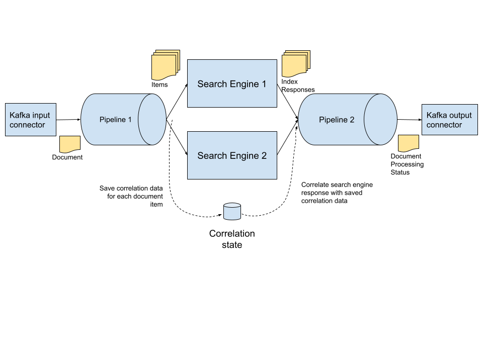

# Multi-Participant Transaction Orchestration

The support for multi-participant transaction orchestration in tremor
originates with this use case from Wayfair's Search platform services
team.

## Identified Need

One of the frequent requests made of the tremor team by peers in the
Infrastructure organization at Wayfair has come from the search domain.
Search is a critical service at Wayfair and it is the powerplant behind
many other services - ranging from recommendation engines through to
auditing of data streams that are continually being ingested and indexed
into multiple searchable databases.

At a very high level - streams of documents need to be elementized and
broken down into one or many indexable items of interest - these items
then need to be indexed ( successfully ) into one or many search
engines.

Many of the use cases that are battle tested with tremor are relevant in
this domain:

- Cleansing, normalization and enrichment of documents and indexable
  elementization and tracking documents and elementized items
- Rate limiting, capacity-based load-shedding, with domain classification
  similar to the traffic shaping use cases where tremor started
- Sourcing, transformation and distribution of documents and the
  synthetic events in real-time at low or very low latencies

But, for the use case at hand, there are additional needs:

- All documents must be processed transactionally, without loss and
  with proper reporting of processing outcome to upstream services and
  the documents must be processed in arrival order. The guaranteed
  delivery and circuit-breaker mechanisms in tremor now need to be
  multi-pipeline.
- All indexable elements of all documents must be indexed in multiple
  downstream engines successfully ( or operator errors produced for
  exceptions ) while all possible error cases need to be caught and
  reported upstream in order to issue retries or let operators
  intervene. This is a reasonably orchestration mapping processed elements and tracing
  back to the documents the elements were produced from before publication
  down stream.
- There is significant variability, variant on a case by case basis, to the exact semantics
  required for different document types to be processed to a varying number of downstream
  indexing systems and technologies. The solution needs to be modular

Gathering and aggregating multiple parallel processing outcomes and
subsuming them under a common transaction is outside of the baseline
scope of message-based and message-like systems as they typically only
support point-to-point transactions. Correlation across multiple event
streams usually needs to be solved on the application level. Where
systems support orchestrated transactions - these are typically
constrained by transport/protocol or other factors beyond the
application authors control, and therefore inflexible under variant (
and often fast-changing ) production needs.

## Required Outcome

Expand on tremor’s QoS facilities so that multi-participant transaction
orchestration is possible, easily composable and user programmable.

### Characteristics

The original use cases for tremor were relatively straightforward and
data distribution applications with a requirement for traffic shaping
and rate limiting for data streams when downstream systems were prone to
being overwhelmed at peak traffic conditions.

These occurrences were rare - but their impact was high when they
happened. And in an infrastructure with higher high peaks year on year
this is an ever-present hazard of doing business.

More recently, delivery guarantees are expanding as new domains adopt
tremor in production. In these domains data loss, even user defined and
strictly capacity managed traffic shaping, is not tolerable.  
  
Like with many real-time systems - the percentage of the overall
in-flight volumetric that requires transactional delivery is typically a
small subset of the overall firehose. Take financial trading systems for
example - orders and trades are transactional and they need to be
processed, each and every one, correctly - as there are fiscal and
regulatory conditions that need to be strictly met.  
  
But pricing - the ability to buy or sell and equity, or the current
currency rate is often naturally continuously changing due to supply and
demand, and naturally redundant - as you can buy or sell the same stock
on many different venues.

The search case stretches the QoS mechanisms in tremor and the internal
mechanisms used to track events as they are processed from a single set
of flows and a small set of participants - to larger and more complex
user defined flows that orchestrate transactions of arbitrary
complexity.  
  
This is compounded by tremor-based applications today being large,
increasingly sophisticated and modular. So the QoS mechanisms that were
originally constrained to the boundary of a single pipeline - now need
to be preserved and propagated across an entire deployment.

## Solution

Tremor’s core processing element - pipelines - are executable
directed-acyclic graphs.

A tremor user designs a workflow or pipeline using the tremor query
language.

Tremor converts this to a directed graph and makes sure that it is
acyclic.

Tremor transforms and optimizes the user defined graph to an executable
form that is well-structured for easily supporting easy to understand
and easy to define qualities of service.

If we imagine the pipeline graph as a single larger directed-acyclic
graph we have what tremor actually uses for event distribution
internally. Tremor can distribute and process user defined events -
these are business or data events that originate from connectors or user
defined logic.  
  
Tremor can inject control events - these are runtime events that tremor
uses for quality of service and they are not ordinarily user visible.
Tremor can also inject events originating at outputs ( or that propagate
from downstream systems ) backwards to inputs ( or for propagation to
upstream systems ). But, we can do so without introducing cycles.

The user-defined graph is acyclic. But the tremor runtime has, in
effect, the ability to coordinate acknowledgements for user-defined
events and an ability to signal upstream breaks in connectivity to
downstream systems, or downstream breaks to upstream systems. These
runtime control events - we call them signal-flow and contra-flow - are
transparent to users.  
  
Our `wal` ( write-ahead-log ) operator produces and consumes
signal-flow and contra-flow events.  
  
So, given a simple tremor application that has no defined QoS ( it does
not use guaranteed delivery )  
  
```trickle title="/etc/tremor/config/lossy.trickle"
select patch event of
  insert hostname = system::hostname()
end
from in into out;
```

### We can configure the `wal` operator

```trickle title="/etc/tremor/config/mostly_guaranteed.trickle"

use tremor::system;

define qos::wal operator in_memory_wal

with  
 read_count = 20,
  max_elements = 1000, # Capacity limit of 1000 stored events
  max_bytes = 10485760 # Capacity limit of 1MB of events
end;

create operator in_memory_wal;
select patch event of
  insert hostname = system::hostname()
end
from in into in_memory_wal;

select event from in_memory_wal into out;
```

This is a logically equivalent application - but we can tolerate a lag
of up to 1000 events or 1 megabyte of data before losing data. Under the
hood of course - events are now tracked and traced. If connectors are
QoS aware then we now have a more robust application.

So if we are consuming from a kafka cluster upstream and distributing to
another kafka cluster downstream ( such as in another data center ) -
those systems can go offline briefly or be disconnected. The connectors
themselves handle lossless delivery ( that’s handled by kafka in both
cases in this example ). Connectors with less strong guarantees can
still be ( mostly ) lossless - so if our downstream system is HTTP-based
( like elasticsearch ) - we can tolerate transient service loss and
fully recover.  
  
What if tremor or the host it is deployed on is rebooted?

```trickle title="/etc/tremor/config/mostly_guaranteed.trickle"
use tremor::system;
define qos::wal operator in_memory_wal
with  
  dir = ”./recovery”, # Persistent file-based recovery file
  read_count = 20,
  max_elements = 1000, # Capacity limit of 1000 stored events
  max_bytes = 10485760 # Capacity limit of 1MB of events
end;

create operator in_memory_wal;
select patch event of
  insert hostname = system::hostname()
end

from in into in_memory_wal;

select event from in_memory_wal into out;
```

The tremor developer doesn’t need to be too concerned with the internal
mechanisms, or their implementation. And for simple applications with a
single primary data flow, its as easy as the examples above to
selectively introduce grades of guaranteed delivery with a spectrum of
robustness that derives from choice of connectivity ( kafka vs http ) or
how the [qos](https://www.tremor.rs/docs/tremor-query/operators/)
operators are chosen, placed in a flow, and configured.

Orchestration however, is different. In an orchestrated transaction the
user defined logic provided by the tremor developer also needs to do
some tracking. This is achieved through using tremor’s state mechanism
alongside the `qos` capabilities and operators that tremor provides to
compose a solution.  
  
So, in our search case - let us say we have two downstream search
engines - and both need to index a different set of items of interest
elementized from a single document - we use the state mechanism to track
progress of the items for each participant - and when all participants
have indexes up to date - we issue a synthetic event ( that can be
recorded in a wal ) that publishes the document processing status
downstream.


  
So our document source is kafka, our indexing engines for elementized
items and our destination for successfully elementized documents ( which
may now be enriched with elementization metadata and index metadata )
can now be published ( let’s assume kafka again for simplicity ) to an
audited topic.  
  
The state mechanism in tremor is a readable/writable value - so
persistent and recoverable state is a relatively simple composition:  

```trickle
define script remember
script
  let state = event;
  event
end;

define qos::wal operator forget_me_not
with
  dir = "./brain",
  read_count = 1,
  max_elements = 1000, # Capacity limit of 1000 stored events
  max_bytes = 10485760 # Capacity limit of 1MB of events
end;

create script remember;
create operator forget_me_not;
select event from in into remember;
select event from remember into forget_me_not;
select event from forget_me_not into out;
```

Please don’t run out of disk space!

## Conclusion

Most of the changes required to evolve tremor form supporting great qos
for simple single pipeline applications to complex multi-pipeline and
multi-participant stateful orchestrations did not expose new features to
the tremor developer or user.  
  
It has been a significant change to tremor internals, however and the
work reaches a stable point with our `0.12` release - the ability to
`pause` and `resume` connectors, and the ability for the tremor
runtime itself to detect and act on `quiescence` will mean that tremor
is flexible enough for the demands and use cases that originated in the
search domain.
