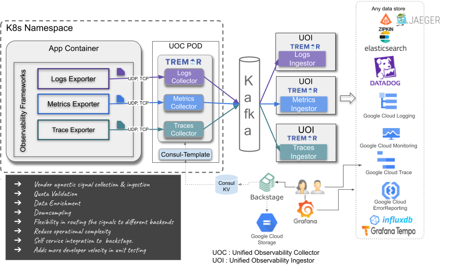
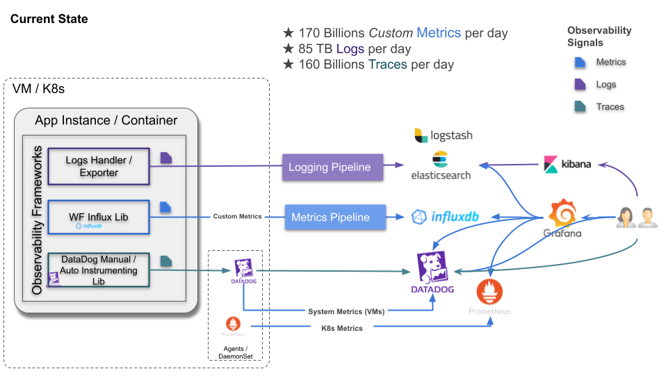

# Unified Observability Platform

As Wayfair's technology organization modernizes its infrastructure services to meet
new volumetric peaks they continually adapt, adopt and atrophy out systems and services.

This is particularly difficult with shared infrastructure and services that are ever-present
but seldom seen by many of the engineers in the organization.

The rise of OpenTelemetry provides an opportunity for developers to consolidate on SDKs that
are consistent across programming languages and frameworks. For our SRE's and operators it
offers ease of integration and ease of migration of services.

Tremor is a core enabling component of Wayfair's migration strategy. Tremor supports
but is endpoint, protocol and service agnostic. This allows our operational teams to
switch from on-premise to cloud native services with minimal coordination with others.

This also allows switching from in-house to managed or out of the box services supported
by cloud providers.

Moving 1000s of developers to a new technology stack when you are operating continuously
with no downtime and at a large scale is hard.

## Identified Need

Tremor emerged from production needs in existing systems, specifically
in the logging and metrics or observability domains in a large
hypergrowth and heavily speciated and specialized production environment
that operates 24x7x365.

As this infrastructure is migrated from a largely on-premise data-centre
based environment to a cloud native environment and the wider technology
organization it operates within doubles in size, change is inevitable.
You can bet your roadmap on it.

One great emerging de facto standard is the observability sub-domain
that cloud-native computing is propelling forward with standards such as
the CNCF’s OpenTelemetry.

Tremor added initial support for OpenTelemetry in February 2021.  
  
For decades, observability - whether logging, metrics or distributed
tracing has been common. But, lacking in a unified approach, lacking in
a core set of interoperable and interworking standards.

OpenTelemetry has good support for capturing and distributing logs,
metrics and trace spans. It has sufficient out of the box to suit the
most common needs, most of the time. It affords developers an
opportunity to rationalize libraries and frameworks around shared
concepts, shared understanding and shared effort. This is especially
valuable in large, complex production operations such as Wayfair’s
eCommerce production estate.

Languages and platforms change over time. System and component
infrastructure are continuously evolving. As SaaS environments continue
to evolve and innovate new forms of observability; or production
operations, system reliability engineers or network operations teams who
often need to move faster than the pace of application or infrastructure
developers can develop new software and systems - this is a hard
problem.

By targeting OpenTelemetry - developers can depend on a consistent set
of SDKs for most common observability needs. Production focused teams
can depend on a consistent wire-format and protocol allowing them to
move from data-centre to the cloud, and rewire the infrastructure and
services just in time.  
  
Through OpenTelemetry, we can normalize the concepts, the code and the
inner workings of our cloud-based systems and services - whilst
introducing far more flexibility than ever before as observability
services and software vendors provide a standards-based and
interoperable path.  
  
It is a win-win for all concerned.

## Required Outcome

In production at Wayfair, logging and metrics data distribution
pipelines are all handled by tremor. With OpenTelemetry, distributed
tracing can now be standardized across our production estate.

### Solution

Standardize an Tremor and OpenTelemetry together.

### Characteristics

The introduction of OpenTelemetry allows developers to standardize on
Observability in applications, services and code for logging, metrics
and distributed tracing. As OpenTelemetry is natively supported in
tremor, it means only minor configuration changes to our existing
logging and metrics services.

With OpenTelemetry, distributed tracing can benefit from the same
traffic shaping and adaptive rate limiting as the rest of our
observability stack. The unification of the source, collector and
distribution tiers via kafka provides scalable and recoverable telemetry
shipping and distribution.

Tremor adds adaptive load shedding and traffic shaping that are tunable
in production. Tremor also allows legacy observability frameworks to
co-exist with OpenTelemetry for a gradual migration across the
programming languages and frameworks in production use. Finally, tremor
enables multiple downstream services to participate in the overall
solution.

As a heterogeneous ecosystem of interconnected services - the unified
observability platform based on tremor has no preferred upstream or
downstream endpoint. It is system and service agnostic. It is
bendable.  
  
This allows teams that prefer the GCP ecosystem to normalize to those
native services for visualization, debugging and troubleshooting. For
our ElasticSearch population, Elastic’s APM may be a better alternative.
For other teams, and our operational staff and folk with more ad hoc
needs - DataDog may be preferable.

It’s a cloud native decentralized rock’n’roll observability world out
there. Getting 5000 and growing engineers to choose a single
observability path is impossible. So, as the population cannot bend, the
unified observability leans on tremor for this purpose.

As improved services, frameworks and methods are onboarded our
tremor-based systems can be incrementally adjusted to meet changing
demands.

### Insights

This application of tremor does not introduce new features or
capabilities per se.

However, it is the first unified tremor-based system that spans the
entire observability spectrum. It centralizes common capabilities and
facilities for greater operational freedom, whilst decentralizing the
point-to-point endpoint connectivity for the widest applicability across
our production estate.

As tremor exposes OpenTelemetry as a client, and as an embedded server -
it is effectively used to disintermediate, interpose and intework with
legacy environments and to standardise on OpenTelemetry.  
  
It does this as an incremental update. Existing users have time to
migrate their systems to the new OpenTelemetry-based best-practice.
Existing processes, practices and battle-tested systems are
maintained.  
  
Operators have better tools to manage the production estate and to tune
capacity, performance and cost.

This is also the first tremor-based system where tremor is a key
architectural primitive allowing our observability community to
bend to the changing needs of our development and operational community
with minimal effort, and at short notice.

## Conclusion

As tremor expands to new domains such as search, service orchestration
and supply-chain and logistics to name but a few - our early adopters in
the logging domain have evolved from using tremor as a point solution
for traffic shaping - to building our entire observability
infrastructure based on tremor.  
  
New domains will extend tremor’s capabilities in multi-participant
transaction processing and distributed orchestration. The now unified
observability domain will further expand and extract capabilities that
enhance modularity and flexibility of tremor to build large distributed
systems with a relatively simple and easy to program and growing set of
languages designed for large-scale event-based processing.
