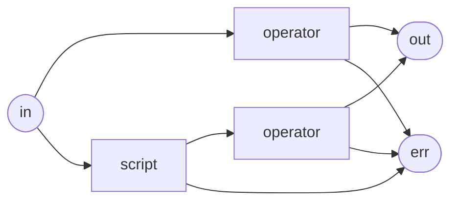
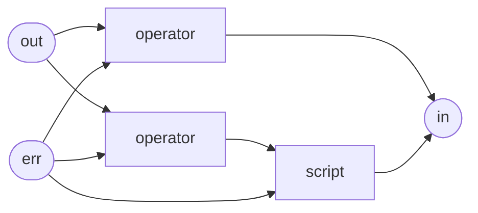

# Runtime Capabilities

The Tremor runtime is the part of the system that takes your Troy configuration, brings it to live and has your CPUs pump events through your pipelines as fast as we could make it do. We tried to follow a few principles we took from years long experience in writing event processing engines, distributes systems and high performance code:

#### Keep the hot path as free from allocations as possible

The hot path is the way your events take from the input connector through all pipelines towards the output connector. While we need to allocate some memory for the events themselves and for mutations on those events throughout [Pipeline] and [Script] processing, we try to move events from end to end without additional allocations.

E.g. for turning JSON encoded data into events, we keep the raw event bytes around and reference that data directly for our JSON strings (with a few exceptions). This avoids one copy of the incoming data.

We preallocate all the dataßstructures we need for bookkeeping and shuffling events around and try to keep the actual event flwo mechanics as simple as possible. At best we only move some pointers.

#### Execute each entity of the runtime on their own task

As our runtime is built upon async Rust, our unit of concurrency is a [Task], which can be scheduled on an executor thread. When and where this task is executed is a decided by the underlying executor. We run every entity, that is [Pipelines] and [Connectors], on their own task. All entities communicate via channels (Multi-producer-multi-consumer queues) and this is also the way events take. This decouples event receiving from event handling and sending and allows for smoother spreading of load to multiple CPUs in parallel, especially in the case of multiple [Flows] being deployed to a Tremor instance in parallel.

This has the nice effect, that you can vertically scale high event volumes by pumping them through multiple parallel flows:

```tremor
define flow kafka_consumer
flow

    # import connector and pipeline definitions
    use my_connectors;
    use my_pipelines;
    
    create connector kafka_in from my_connectors::kafka_consumer
    with
        consumer_group = "snot",
        topic = "my_topic",
        brokers = ["localhost:9092", "example.org:9092"]
    end;
    create connector elastic_out from my_connectors::elastic;

    create pipeline consume from my_pipelines::consume;
    
    connect /connector/kafka_in to /pipeline/consume;
    connect /pipeline/consume to /connector/elastic_out;
end;

# deploy three instances of the above flow to leverage available CPU and memory resources
# we will have three kafka consumers in one consumer group, consuming in parallel
# 3 pipelines processing in parallel
# and 3 elastic connectors pushing events to elasticsearch in parallel (with configurable concurrency)
deploy flow kafka_consumer_01 from kafka_consumer;
deploy flow kafka_consumer_02 from kafka_consumer;
deploy flow kafka_consumer_03 from kafka_consumer;
```

#### Leverage your CPUs capabilities

Our CPUs have crazy instruction sets (SSE, AVX2, Neon, ...) for data parallel programming that we mostly only use unintended by some optimizing compiler rewriting our crufty loops. Think of them as turning your CPU into a poor mans GPU. Very intelligent people came up with incredibly clever algorithms for leveraging those instruction sets for e.g. parsing JSON, UTF-8 validation or finding bytes in strings. We try to use those whenever possible. Most of the time, we are standing on the shoulders of giants providing all the goodness for us in existing crates we pull in as dependencies, sometimes we roll our own, as we did with a Rust port of [simdjson](https://github.com/simdjson/simdjson): https://crates.io/crates/simd-json


## Contraflow

Tremors runtime was built to enable traffic shaping and improving quality of service for high volumetric data streams. It was built with very real possibility of failure in mind. In a system of many connected computers, either any computer or the network could fail in arbitrarily scary and harmful ways. Tremor, as the safeguard of downstream systems, the harbinger of quality of service, needs to be a good citizen and stop pounding downstream systems that are already known to be out of service.

To that end, the contraflow mechanism was built to allow signals to be propagated back along the [Pipeline graph](../language/pipelines.md) to all upstream [Connectors].

All the pipeline graphs you can build form a directed acyclic graph (or **DAG**). The reason for this is that we can take this DAG and turn it around and still have a DAG. This *reversed* pipeline graph can be used to propagate special events back the pipeline to all reachable inputs.

Event flow:



Contraflow: 



Contraflow is used to transport signals for successful or failed event delivery, for transmitting topological knowledge between connected connectors (for knowing what other connectors are reachable via the connected pipelines) and for managing the circuit breaker mechanism.


### The Circuit Breaker Mechanism

Circuit breakers are used to avoid pounding downstream systems with requests (or events in our case) if we know those are doomed anyways. Then the circuit breaker opens and it fails those events early or buffers them (e.g. when using kafka as a buffer) until the downstream system is healthy again. This mechanism is also builtin to our runtime.

It is possible for any operator node in a pipeline and for all connectors to open and close the runtimes builtin circuit breaker by sending a special contraflow event to all reachable upstream pipeline operators and connectors. Each upstream connector receiving such a message will stop pulling data from the external system it connects to, thus stopping to send events downstream. The issuer of the circuit breaker message will check if the downstream system is healthy again and if so, it will close the circuit breaker again in order to start receiving events again.

The runtime even makes use of this mechanism for a controlled start of all elements of a [Flow]. Every connector, when connected as an event-*source* (on the left hand side of a [connect statement](../language/reference/deploy.md#rule-connect)), starts with an opened circuit breaker. This ensures that it doesn't start sending events before downstream connectors are prepared to receive them. And every event-*sink* connector (on the right-hand side of a [connect statement](../language/reference/deploy.md#rule-connect)) will close the circuit breaker upon startup, so that only when all upstream connectors signal their readiness for events, events actually start to flow from event-source to event-sink.

The [`qos::backpressure` operator](../reference/operators/backpressure.md) can be used with `method = pause` to make use of the circuit breaker mechanism to apply backpressure towards upstream system, otherwise it discards messages by sending them to the `overflow` port, where they are usually discarded. The `pause` method is great when backpressure should preserve all events.

The [`qos::roundrobin` operator](../reference/operators/roundrobin.md) will distribute events to the given outputs in a roundrobin fashion and take outputs out of rotation if they error repeatedly or their circuit breaker is triggered. It will only forward circuit breaker contraflow events if all outputs are unavailable.

Both the [`elastic` connector](../reference/connectors/elastic.md) and the [`http_client` connector](../reference/connectors/http.md#client) use the circuit breaker mechanism to limit concurrent in-flight outgoing requests and stop upstream connectors from sending further events if the supported concurrency is exceeded.

### Garuanteed Delivery

Tremor uses the contraflow mechanism to implement **Event delivery acknowledgements**. In a nutshell it works like this:

* When a connector receives an event and handles it successfully without error (e.g. sends it off via TCP) and event delivery acknowledgement is sent backwards via contraflow, if required, which is flagged in each event, usually by the originating connector.
* When a connector fails to handle an event a delivery failure message is sent backwards via contraflow, if required.
* Pipeline operators and connectors emitting events can handle those messages to implement guaranteed delivery.

An event acknowledgement contraflow message is only handled by the connector (or operator) that did send the event. E.g. a [`kafka_consumer` connector](../reference/connectors/kafka.md#consumer) will commit the offset of the event upon receiving an event acknowledgment.

This has the effect that we have 1 contraflow event flowing backwards for each event reaching its destination. The forward traffic volume will be mirrored by the contraflow volume, just that the contraflow itself is not leaving the system but is handled internally by [Operators] and [Connectors].

Not all connectors support event acknowledgements, as their nature doesn't support the notion of marking parts of a data stream as successfully handled. For example [UDP](../reference/connectors/udp.md) cannot support this feature. 

Connectors like [`kafka_consumer`](../reference/connectors/kafka.md#consumer) [`wal`](../reference/connectors/wal.md) support event delivery acknowledgements and are well suited for implementing workloads that can guarantee **at-least-once* delivery.

For the circuit breaker mechanism a successful event acknowledgement is used a signal for the circuit breaker to close as the downstream system seems to be back to normal.

## Pause / Resume

With the [Contraflow mechanism](#contraflow) and the [Circuit Breaking](#the-circuit-breaker-mechanism) we have all the bits and pieces in place to automatically stop upstreams from producing and events when they are not going to be successful. Turns out we can also use this to manually stop events from flowing.

We do expose API endpoints to change the current status of Flows: [Patch flow status](../api/index.md#tag/flows/operation/patch_flow_status) 
and single Connectors inside Flows: [Patch flow connector status](../api/index.md#tag/connectors/operation/patch_flow_connector_status).

Here we see that the current status of the flow `main` is `running`. It is accepting events from and emitting events into the runtime from stdin.

```console
$ curl -s localhost:9898/v1/flows/main | jq .
{
  "alias": "main",
  "status": "running",
  "connectors": [
    "console"
  ]
}
```

We can patch the flow status to *pause* all connectors inside that flow. It will return the new status of the flow in the response:

```console
curl -s -XPATCH -H'application/json' localhost:9898/v1/flows/main -d'{"status": "paused"}' | jq .
{
  "alias": "main",
  "status": "paused",
  "connectors": [
    "console"
  ]
}
```

The connector `console` is receiving string events for each line sent to it via stdin. The whole flow is set up to echo events back to stdout. If we try typing something into the processes terminal, we won't see anythign echoed to stdout, because the connector is paused. It will not pull new data from `stdin` until it is *resumed* again.

We can resume the flow by patching its status back to *running*. It will return the new status of the flow in the response:

```console
curl -s -XPATCH -H'application/json' localhost:9898/v1/flows/main -d'{"status": "running"}' | jq .
{
  "alias": "main",
  "status": "running",
  "connectors": [
    "console"
  ]
}
```

## Quiescence

TBD

[Connectors]: ../reference/connectors/index.md
[Operators]: ../reference/operators/index.md
[Pipeline]: ../language/pipelines.md
[Pipelines]: ../language/pipelines.md
[Script]: ../language/scripts.md
[Task]: https://book.async.rs/concepts/tasks.html
[Flows]: ../language/index.md#flows