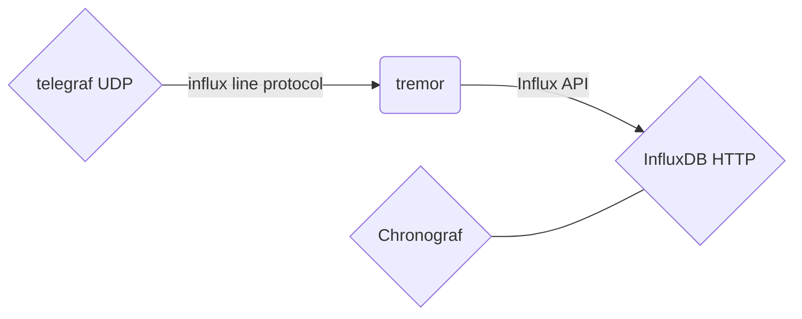
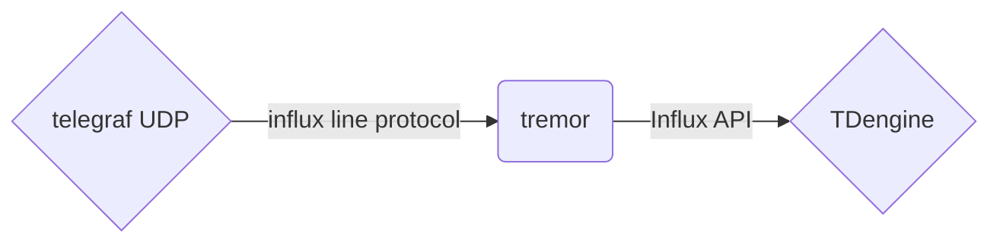
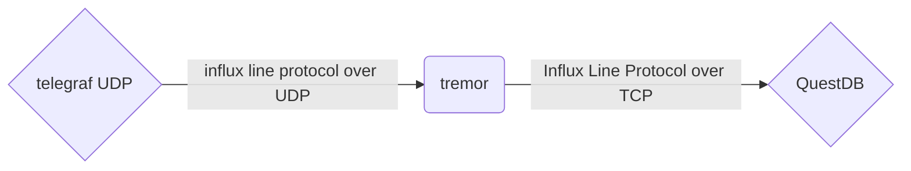

--- 
sidebar_position: 1
---

# Metrics

One case you can deploy tremor for is to work with metrics. Not as a store but as a preprocessor, aggregator, and filter for metrics stores.

In this guide, we'll see how to use tremor for this. We'll set up an example where tremor batch, aggregates, and then forwards metrics. In addition, we'll take a look at tremor's metrics.

:::note
   This example expects that you have some knowledge of tremor or went through the [basics guide](basics.md). We won't explain the concepts covered there again here.

   In addition, we use `docker compose` for this guide as it requires additional software, and we want to avoid you having to install and configure a bunch of other services. We expect some familiarity with this as we will not explain the details.
:::

All code for this guide can found [on github](__GIT__/../code/metrics/).


## Topics

This guide introduces the following new concepts.

* codecs
* Post- and Preprocessors
* Connector configuration
* pipeline operators
* streams
* aggregation
* time-based windows
* tremors internal metrics

## Foundation

Let us start with the basic deployment:

* influxdb for storage
* chronograph for display
* telegraf as an agent to collect some data
* tremor for aggregation and filtering

A high level visualization of the application components:



The docker-compose file for this is [here](__GIT__/../code/metrics/01_basic).


### UDP Server

Something new here is that we fully define our connectors instead of using a pre-defined canned connector.

For the input, we use a [`udp_server`](../reference/connectors/udp.md) connector. In the `with` clause, we can pass in the configuration.

Here are the fields of interest we have not discussed before.

`codec` is an option that can be passed to (nearly) all connectors, and it defines how data that arrives over this connection is decoded. In our case we use [`influx`](../reference/codecs/influx.md) to decode the influxdb line protocol.

`preprocessors` are also an option that can be passed to (nearly) all connectors. You can use preprocessors to perform some processing on the byte stream that the connector provides. In our case, we use [`separate`](../reference/preprocessors/separate.md). This preprocessor will separate the byte stream with a given character or byte, by default, the `\n` newline.

:::note
   Some connectors provide structured output instead of a byte stream. Structured connectors can't use a `codec`, `preprocessors` or `postprocessor` - after all, their output is already well defined.
::::

The `config` section holds a specific configuration to the connector type selected. Since we use the [`udp_server`](../reference/connectors/udp.md), we only have to specify the `URL` we want to listen on.

With this, we get:

```tremor
define flow metrics
flow
  # define the udp server
  define connector upd_in from udp_server
  with
    # define the codec we use, in this case `influx` for the influx wire protocol
    codec = "influx",
    # define the preprocessors, we use separate to seperate events by lines
    preprocessors = ["separate"],
    # configure the connector itself, we listen to `0.0.0.0` on port `4242`
    config = {
      "url": "0.0.0.0:4242",
    }
  end;
end;
```

### HTTP Client

On the other side we use a [`http_client`](../reference/connectors/http.md). Since influxdb does not have a custom transport we are not forced to implement a `influx` connector. Instead we can use the [`influx` codec](../reference/codecs/influx.md) and a http or udp connectors.

:::info
   Connector naming follows a scheme here. Generally, something is named `server` if it accepts connections and `client` if it initiates connections.
   While there is a correlation between clients writing and servers reading, this is incidental and not a rule. A `client` connection could be reading and not a writing connector.
:::

Our connector config here is slightly more elaborate. In addition to the `URL`, defining the target to write to, we also have a `headers` map that specifies the HTTP headers. This demonstrates nicely that more complex configurations are possible.

```tremor
define flow metrics
flow
  # define the udp server
  define connector upd_in from udp_server
  with
    # define the codec we use, in this case `influx` for the influx wire protocol
    codec = "influx",
    # define the preprocessors, we use separate to seperate events by lines
    preprocessors = ["separate"],
    # configure the connector itself, we listen to `0.0.0.0` on port `4242`
    config = {
      "url": "0.0.0.0:4242",
    }
  end;
  
  # define our http client
  define connector influx_out from http_client
  with
    # we use the influx codec here as well
    codec = "influx",
    # configure the endpoint we're writing to
    config = {
      "url": "http://influxdb:8086/write?db=tremor",
      # We use a custom header to identify that we're tremor
      "headers": {"Client": ["Tremor"]}
    }
  end;
end;

deploy flow metrics;
```

### Pipeline, wiring up and running

As in the basics tutorial, we will use the `passthrough` pipeline from the `tremor::pipelines` module. If you went through the [basics guide](basics.md), this is the same as before.

```tremor
define flow metrics
flow
  # import the pipeline module
  use tremor::pipelines;
  # define the udp server
  define connector upd_in from udp_server
  with
    # define the codec we use, in this case `influx` for the influx wire protocol
    codec = "influx",
    # define the preprocessors, we use separate to seperate events by lines
    preprocessors = ["separate"],
    # configure the connector itself, we listen to `0.0.0.0` on port `4242`
    config = {
      "url": "0.0.0.0:4242",
    }
  end;
  
  # define our http client
  define connector influx_out from http_client
  with
    # we use the influx codec here as well
    codec = "influx",
    # configure  the endpoint we're writing to
    config = {
      "url": "http://influxdb:8086/write?db=tremor",
      # We use a custom header to identify that we're tremor
      "headers": {"Client": ["Tremor"]}
    }
  end;

  # Create the UDP server
  create connector upd_in;

  # Create the HTTP client
  create connector influx_out;

  # Create our pipeline
  create pipeline passthrough from pipelines::passthrough;

  # Connect the udp server to the pipeline
  connect /connector/upd_in to /pipeline/passthrough;
  # Connect the pipeline to the inflix client
  connect /pipeline/passthrough to /connector/influx_out;

end;

# start our 
deploy flow metrics;
```

Now with that set you can grab [the entire config from github](__GIT__/../code/metrics/01_basic) and start it with `docker-compose up`.

You can find the chronograf UI at [`http://localhost:8888`](http://localhost:8888).

## Batching

Tremor processes events one by one, meaning that each metric is considered its event. The upside of this is how events arrive. If it's one event per UDP message or 100 makes no difference. The downside is that InfluxDB requires events to be submitted in batches to maintain performance.

Since InfluxDB isn't the only destination that benefits from batched events, tremor provides a [batching operator](../reference/operators#genericbatch).

:::note
   Batching using the [batching operator](../reference/operators#genericbatch) is handled inside the connector. HTTP, for example, will combine a batch into a single request, but different connectors might handle this differently.
:::

### Adding the Batch operator

Operators are small pieces of logic that are written in rust. You can put them inside of a pipeline to perform specific actions. In our example, we use the batch operator.

Their use is similar to what you already know from pipelines and connectors. You first define operators with a set of configuration parameters, then create them for use.

We then use `select` to wire it up in the pipeline.

We use a maximum of `3000` events and a maximum delay of `5s` for our operator.

Note that we select from `in` into `batch` and from `batch` into `out`, wiring up the event chain.

We also need to update our HTTP Client to use a postprocessor, namely the `separate` one, to join batch elements back together with newlines.

```tremor
define flow metrics
flow

  # define the udp server
  define connector upd_in from udp_server
  with
    # define the codec we use, in this case `influx` for the influx wire protocol
    codec = "influx",
    # define the preprocessors, we use separate to seperate events by lines
    preprocessors = ["separate"],
    # configure the connector itself, we listen to `0.0.0.0` on port `4242`
    config = {
      "url": "0.0.0.0:4242",
    }
  end;


  # define our http client
  define connector influx_out from http_client
  with
    # we use the influx codec here as well
    codec = "influx",
    # define the postprocessor, we use separate to seperate events by lines
    postprocessor = ["separate"],       
    # configure  the endpoint we're writing to
    config = {
      "url": "http://influxdb:8086/write?db=tremor",
      # We use a custom header to identify that we're tremor
      "headers": {"Client": ["Tremor"]}
    }
  end;

  # define our metrics pipeline to batch metrics
  define pipeline metrics
  pipeline
    # define our batch operator.
    # A batch will collect up to 3000 events, but never wait more then 5 seconds
    # before emitting.
    define operator batch from generic::batch
    with
      count = 3000,
      timeout = nanos::from_seconds(5)
    end;

    create operator batch;

    select event from in into batch;
    select event from batch into out;
  end;

  # Create the udp server
  create connector upd_in;

  # Create the http client
  create connector influx_out;

  # Create our pipeline
  create pipeline metrics from metrics;

  # Connect the udp server to the pipeline
  connect /connector/upd_in to /pipeline/metrics;
  # Connect the pipeline to the inflix client
  connect /pipeline/metrics to /connector/influx_out;

end;

# start our 
deploy flow metrics;
```

### Running

Now with that set you can grab [the entire config from github](__GIT__/../code/metrics/02_batching) and start it with `docker-compose up`.

You can find the chronograf UI at [`http://localhost:8888`](http://localhost:8888).

## Aggregation

Let's talk about aggregation. Sometimes it's helpful to aggregate some metrics before they're stored in a database. One reason could be to downsample the input. Another could be to create histograms for databases that don't natively support them.

:::note
   The techniques used for aggregation aren't specific to metrics. You can apply the same methods to any event stream.
:::

The aggregation we're looking for is "The histogram for each metric over a 10s and 1min window."


### Grouping

To aggregate the metrics, we get in a useful we need to group our data by the `"each metric"` from our definition. Since we're using influx data as our input, a metric is identified by three fields:

* The `measurement`
* The `tags`
* The `field`

Since influx combines multiple fields in a message, we first have to unroll this into each field being a single event.

::: note
    We use `create stream` here. Streams are just named nodes that have no own function or overhead. They serve as a way to chain up selects.
:::

```tremor
    # use types for checking if values are a number
    use std::type;

    # use record for exploding keys
    use std::record;

    # create our pre-aggregation stream
    create stream aggregate;

    # We change the structure of our event to be easier digestible for aggregation
    select {
        "measurement": event.measurement,
        "tags": event.tags,
        "field": group[2],
        "value": event.fields[group[2]],
        "timestamp": event.timestamp,
    }
    from in
    group by set(event.measurement, event.tags, each(record::keys(event.fields)))
    into aggregate
    having type::is_number(event.value);
```

What we do here is for `each` `key` in `fields`, we create a metric, so if our record has two fields, we flatten that out and have two events. We then create a set of this field, the tags for the metric, and the measurement for the metric. This gives us a unique identifier for the metric/

This is needed to not confuse the values for different fields.

:::note
   We use `group[2]` here, which refers to the second element of the current group (indexing starts at 0). For a string of the entire group, you can access `n+1`( in our example, since we have three elements, it would be `group[3]`).
:::

### Windowing

To aggregate over a time range, we use time-based tumbling windows. We can define them the same way we define everything else, a `define` statement. They are, however, not created. Instead, they're bound to the select statement they're used in.

```tremor
    # use nanos for time
    use std::time::nanos;

    # define a 10 second window
    define window `10secs` from tumbling
    with
      interval = nanos::from_seconds(10)
    end;

    # define a 1 minute window
    define window `1min` from tumbling
    with
      interval = nanos::from_minutes(1)
    end;
```

### Aggregating

Once we have defined the windows, we can now use them to aggregate our data. We do this in a new select statement. After the `from` section, we have a square bracket and the window names. This syntax is what we call tilt frames. They're chained windows that will emit based on conditions.

We use the  [`aggr::stats::hdr`](../reference/stdlib/aggr/stats#hdrnumber-array) function that creates a histogram from the incoming data and outputs the given set of percentiles.

In addition we use the [`aggr::win::first`](../reference/stdlib/aggr/win#first) to get the first timestamp.

:::note
   We are using two windows here, a 10s one and a 1min one. The upside of using the tilt framing mechanism here is that we can do this without a loss in precision, as the 1min window is not an aggregate of six 10s windows but rather an aggregate of the raw data of them without having to duplicate it.
:::

```tremor
    # create a stream for normalization
    create stream normalize;

    select
    {
        "measurement": event.measurement,
        "tags": patch event.tags of insert "window" => window end,
        "stats": aggr::stats::hdr(event.value, [ "0.5", "0.9", "0.99", "0.999" ]),
        "field": event.field,
        "timestamp": aggr::win::first(event.timestamp), # we can't use min since it's a float
    }
    from aggregate[`10secs`, `1min`]
    group by set(event.measurement, event.tags, event.field)
    into normalize;
```

### Normalisation

Last but not least we need to normalize this data basck to something the [influx codec](../reference/codecs/influx.md) understands.

We can do this with another select statement.

```tremor
select {
  "measurement":  event.measurement,
  "tags":  event.tags,
  "fields":  {
    "count_#{event.field}":  event.stats.count,
    "min_#{event.field}":  event.stats.min,
    "max_#{event.field}":  event.stats.max,
    "mean_#{event.field}":  event.stats.mean,
    "stdev_#{event.field}":  event.stats.stdev,
    "var_#{event.field}":  event.stats.var,
    "p50_#{event.field}":  event.stats.percentiles["0.5"],
    "p90_#{event.field}":  event.stats.percentiles["0.9"],
    "p99_#{event.field}":  event.stats.percentiles["0.99"],
    "p99.9_#{event.field}":  event.stats.percentiles["0.999"]
  },
  "timestamp": event.timestamp,
}
from normalize
into batch;
```


### Running

Now with that set you can grab [the entire config from github](__GIT__/../code/metrics/03_aggregation) and start it with `docker-compose up`.

You can find the chronograf UI at [`http://localhost:8888`](http://localhost:8888).


## Tremor metrics

Finally, let us talk about how to access tremors own metrics. We choose to allow tremor to process them and forward them as required. This avoids an extra step for configuring metrics, implementing connectivity, or forcing the users into a specific way of monitoring.

This is done using the [`metrics connector`](../reference/connectors/metrics.md).

### Connectors

To enable metrics collection for connectors, we need to update their configuration. Namely we add the `metrics_interval_s` option. We choose 5 seconds to keep the overhead low.

```tremor
  # define the udp server
  define connector upd_in from udp_server
  with
    # define metrics interval
    metrics_interval_s = 5,
    # define the codec we use, in this case `influx` for the influx wire protocol
    codec = "influx",
    # define the preprocessors, we use separate to seperate events by lines
    preprocessors = ["separate"],
    # configure the connector itself, we listen to `0.0.0.0` on port `4242`
    config = {
      "url": "0.0.0.0:4242",
    }
  end;
  
  # define our http client
  define connector influx_out from http_client
  with
    # define metrics interval
    metrics_interval_s = 5,
    # we use the influx codec here as well
    codec = "influx",
    # define the postprocessors, we use separate to seperate events by lines
    postprocessors = ["separate"],
    # configure  the endpoint we're writing to    
    config = {
      "url": "http://influxdb:8086/write?db=tremor",
      # We use a custom header to identify that we're tremor
      "headers": {"Client": ["Tremor"]}
    }
  end;
```

### Pipeline

The pipeline has to be set up as well. As pipelines don't come with a `with` section, it is configured as part of a configuration directive with the same name.

We choose the same 5-second interval.

```tremor
  define connector metrics from metrics;

  # define our metrics pipeline to batch metrics
  define pipeline metrics
  pipeline
    #!config metrics_interval_s = 5
  # ...
```

### Metric Connector & Wiring

So with all our connectors and pipelines configured, we have to wire up the connector to the metrics pipeline. This works since, for internal metrics, we use the same structure as the [`influx` codec](../reference/codecs/influx.md).

```tremor
define flow metrics
flow
  # ...

  # Define our hasher
  define connector metrics from metrics;
  # Create the internal metrics collector
  create connector metrics;
  # Connect the metrics to the pipeline
  connect /connector/metrics to /pipeline/metrics;
  
  #...
```

Now with that set you can grab [the entire config from github](__GIT__/../code/metrics/04_interal) and start it with `docker-compose up`.

You can find the chronograf UI at [`http://localhost:8888`](http://localhost:8888).


## Other backends

While this example is written using InfluxDB as a backend, it works equally with other backends.

### TDengine

TDengine can quickly replace influx. The only difference is that we need to change the `url` in the `http_client`

A high-level visualization of TDengine replacing InfluxDB via the Influx API:



The connector definition for `TDengine` has a slightly different endpoint
specification, but the application is otherwise the same:

```tremor
  # define our http client
  define connector influx_out from http_client
  with
    # define metrics interval
    metrics_interval_s = 5,
    # we use the influx codec here as well
    codec = "influx",
    # define the postprocessors, we use separate to seperate events by lines
    postprocessors = ["separate"],
    # configure  the endpoint we're writing to    
    config = {
      "url": "http://tdengine:6041/influxdb/v1/write?db=tremor&u=root&p=taosdata",
      # We use a custom header to identify that we're tremor
      "headers": {"Client": ["Tremor"]}
    }
  end;
```

Now with that set you can grab [the entire config from github](__GIT__/../code/metrics/05_tdengine) and start it with `docker-compose up`.

You can find the grafana UI at [`http://localhost:3000`](http://localhost:3000).

Note that you need to log in with user `admin` and password `admin`

### QuestDB

QuestDB can also replace influx. There are a few differences however as Quest has
constraints on column names and does not support the HTTP protocol for Influx Line
Protocol. We can choose UDP based or TCP based distribution for QuestDB.

A high-level visualization of QuestDB replacing InfluxDB via the Influx API:



The connector definition for `QuestDB` has a slightly different endpoint
specification and uses the TCP protocol for connectivity, but the
configuration is otherwise the same:

```troy
  # define our http client
  define connector influx_out from tcp_client
  with
    # define metrics interval
    metrics_interval_s = 5,
    # we use the influx codec here as well
    codec = "influx",
    # define the postprocessors, we use separate to seperate events by lines
    postprocessors = ["separate"],
    config = {
      "url": "questdb:9009",
    },
  end;
```

We also need to replace some column names to conform to quest db constraints, we do this
through the `re::replace_all` regular expression from tremor's standard library for convenience.

```troy
    # We change the structure of our event to be easier digestible for aggregation
    select {
        "measurement": re::replace_all("[ :\\./]", event.measurement, "_"), # QuestDB limitations
        "tags": event.tags,
        "field": group[2],
        "value": event.fields[group[2]],
        "timestamp": event.timestamp,
    }
    from in
    group by set(event.measurement, event.tags, each(record::keys(event.fields)))
    into aggregate
    having type::is_number(event.value);
```

Now with that set you can grab [the entire config from github](__GIT__/../code/metrics/06_questdb) and start it with `docker-compose up`.

You can find the grafana UI at [`http://localhost:3000`](http://localhost:3000).
You can find the QuestDB Console UI at [`http://localhost:9000`](http://localhost:9000).

Note that you need to log in with user `admin` and password `admin` in the Grafana UI.
