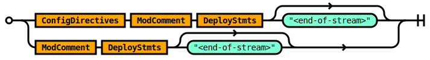
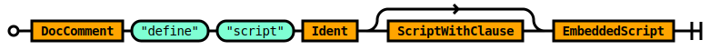
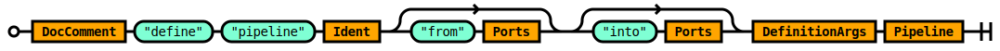
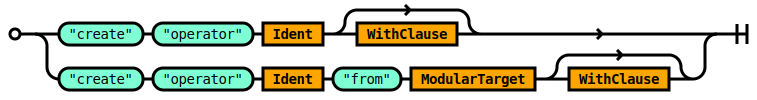
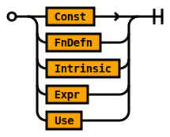
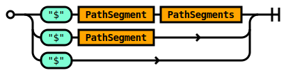
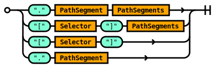
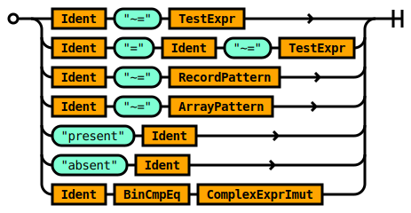
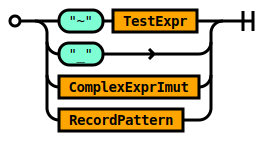
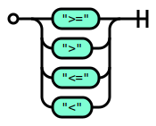

# Full Grammar

## Rule Use

Imports definitions from an external source for use in the current source file.

The contents of a source file form a module.

### TREMOR_PATH

The `TREMOR_PATH` environment path variable is a `:` delimited set of paths.

Each path is an absolute or relative path to a directory.

When using relative paths - these are relative to the working directory where the
`tremor` executable is executed from.

The tremor standard library MUST be added to the path to be accessible to scripts.


```ebnf
rule Use ::=
     'use' ModularTarget 
  |  'use' ModularTarget  'as' Ident 
  ;

```


Imports definitions from an external source for use in the current source file.

The contents of a source file form a module.

### TREMOR_PATH

The `TREMOR_PATH` environment path variable is a `:` delimited set of paths.

Each path is an absolute or relative path to a directory.

When using relative paths - these are relative to the working directory where the
`tremor` executable is executed from.

The tremor standard library MUST be added to the path to be accessible to scripts.


## Rule ConfigDirectives

The `ConfigDirectives` rule allows line delimited compiler, interpreter or
runtime hints to be specified.


```ebnf
rule ConfigDirectives ::=
    ConfigDirective ConfigDirectives 
  | ConfigDirective 
  ;

```


The `ConfigDirectives` rule allows line delimited compiler, interpreter or
runtime hints to be specified.


## Rule ConfigDirective

A `ConfigDirective` is a directive to the tremor runtime.

Directives MUST begin on a new line with the `#!config` shebang  config token.


```ebnf
rule ConfigDirective ::=
     '#!config' WithExpr 
  ;

```


A `ConfigDirective` is a directive to the tremor runtime.

Directives MUST begin on a new line with the `#!config` shebang  config token.


## Rule ArgsWithEnd

The `ArgsWithEnd` rule defines an arguments block with an `end` block.


```ebnf
rule ArgsWithEnd ::=
    ArgsClause ?  WithEndClause 
  ;

```


The `ArgsWithEnd` rule defines an arguments block with an `end` block.


## Rule DefinitionArgs

The `DefinitionArgs` rule defines an arguments block without an `end` block.


```ebnf
rule DefinitionArgs ::=
    ArgsClause ?  
  ;

```


The `DefinitionArgs` rule defines an arguments block without an `end` block.


## Rule ArgsClause

The `ArgsClause` rule marks the beginning of an arguments block.

A valid clause has one or many argument expressions delimited by a ',' comma.


```ebnf
rule ArgsClause ::=
     'args' ArgsExprs 
  ;

```


The `ArgsClause` rule marks the beginning of an arguments block.

A valid clause has one or many argument expressions delimited by a ',' comma.


## Rule ArgsEndClause

The `ArgsEndClause` rule defines an argument block with an `end`


```ebnf
rule ArgsEndClause ::=
    ArgsClause  'end' 
  ;

```


The `ArgsEndClause` rule defines an argument block with an `end`


## Rule ArgsExprs

The `ArgsExpr` rule is a macro rule invocation based on the `Sep` separator macro rule.

An args expression is a comma delimited set of argument expressions.


```ebnf
rule ArgsExprs ::=
    Sep!(ArgsExprs, ArgsExpr, ",") 
  ;

```


The `ArgsExpr` rule is a macro rule invocation based on the `Sep` separator macro rule.

An args expression is a comma delimited set of argument expressions.


## Rule ArgsExpr


```ebnf
rule ArgsExpr ::=
    Ident  '=' ExprImut 
  | Ident 
  ;

```


## Rule CreationWithEnd

The `CreationWithEnd` rule defines a `with` block of expressions with a terminal `end` keyword.


```ebnf
rule CreationWithEnd ::=
    WithEndClause ?  
  ;

```


The `CreationWithEnd` rule defines a `with` block of expressions with a terminal `end` keyword.


## Rule CreationWith

The `CreationWit` rule defines an optional `with` block of expressions without a terminal `end` keyword.


```ebnf
rule CreationWith ::=
    WithClause ?  
  ;

```


The `CreationWit` rule defines an optional `with` block of expressions without a terminal `end` keyword.


## Rule WithClause

The `WithClause` rule defines a `with` block with a `,` comma delimited set of `WithExpr` rules.


```ebnf
rule WithClause ::=
     'with' WithExprs 
  ;

```


The `WithClause` rule defines a `with` block with a `,` comma delimited set of `WithExpr` rules.


## Rule WithEndClause


```ebnf
rule WithEndClause ::=
    WithClause  'end' 
  ;

```


## Rule WithExprs

The `WithExprs` rule defines a `,` comma delimited set of `WithExpr` rules.


```ebnf
rule WithExprs ::=
    Sep!(WithExprs, WithExpr, ",") 
  ;

```


The `WithExprs` rule defines a `,` comma delimited set of `WithExpr` rules.


## Rule WithExpr

The `WithExpr` rule defines a name value binding.


```ebnf
rule WithExpr ::=
    Ident  '=' ExprImut 
  ;

```


The `WithExpr` rule defines a name value binding.


## Rule ModuleBody

The `ModuleBody` rule defines the structure of a valid module in tremor.

Modules begin with optional module comments.

Modules MUST define at least one statement, but may define many.

Statements are `;` semi-colon delimited.


```ebnf
rule ModuleBody ::=
    ModComment ModuleStmts 
  ;

```


The `ModuleBody` rule defines the structure of a valid module in tremor.

Modules begin with optional module comments.

Modules MUST define at least one statement, but may define many.

Statements are `;` semi-colon delimited.


## Rule ModuleFile

The `ModuleFile` rule defines a module in tremor.

A module is a unit of compilation.


```ebnf
rule ModuleFile ::=
    ModuleBody  '<end-of-stream>' 
  ;

```


The `ModuleFile` rule defines a module in tremor.

A module is a unit of compilation.


## Rule ModuleStmts

The `ModuleStmts` rule defines a set of module statements.

Module statements are a `;` semi-colon delimited set of `ModuleStmt` rules


```ebnf
rule ModuleStmts ::=
    ModuleStmt  ';' ModuleStmts 
  | ModuleStmt  ';' ?  
  ;

```


The `ModuleStmts` rule defines a set of module statements.

Module statements are a `;` semi-colon delimited set of `ModuleStmt` rules


## Rule ModuleStmt

The `ModuleStmt` rule defines the statement types that are valid in a tremor module.


```ebnf
rule ModuleStmt ::=
    Use 
  | Const 
  | FnDefn 
  | Intrinsic 
  | DefineWindow 
  | DefineOperator 
  | DefineScript 
  | DefinePipeline 
  | DefineConnector 
  | DefineFlow 
  ;

```


The `ModuleStmt` rule defines the statement types that are valid in a tremor module.


## Rule ModularTarget

A `ModularTarget` indexes into tremor's module path.

In tremor a `module` is a file on the file system.

A `module` is also a unit of compilation.

A `ModularTarget` is a `::` double-colon delimited set of identifiers.

Leading `::` are not supported in a modular target..

Trailing `::` are not supported in a modular target.


```ebnf
rule ModularTarget ::=
    Ident 
  | ModPath  '::' Ident 
  ;

```


A `ModularTarget` indexes into tremor's module path.

In tremor a `module` is a file on the file system.

A `module` is also a unit of compilation.

A `ModularTarget` is a `::` double-colon delimited set of identifiers.

Leading `::` are not supported in a modular target..

Trailing `::` are not supported in a modular target.


## Rule DocComment

The `DocComment` rule specifies documentation comments in tremor.

Documentation comments are optional.

A documentation comment begins with a `##` double-hash and they are line delimited.

Muliple successive comments are coalesced together to form a complete comment.

The content of a documentation comment is markdown syntax.


```ebnf
rule DocComment ::=
    ( DocComment_ ) ?  
  ;

```


The `DocComment` rule specifies documentation comments in tremor.

Documentation comments are optional.

A documentation comment begins with a `##` double-hash and they are line delimited.

Muliple successive comments are coalesced together to form a complete comment.

The content of a documentation comment is markdown syntax.


## Rule DocComment_

The `DocComment_` rule is an internal part of the `DocComment` rule


```ebnf
rule DocComment_ ::=
     '<doc-comment>' 
  | DocComment_  '<doc-comment>' 
  ;

```


The `DocComment_` rule is an internal part of the `DocComment` rule


## Rule ModComment

The `ModComment` rule specifies module comments in tremor.

Documentation comments for modules are optional.

A module documentation comment begins with a `###` triple-hash and they are line delimited.

Muliple successive comments are coalesced together to form a complete comment.

The content of a module documentation comment is markdown syntax.


```ebnf
rule ModComment ::=
    ( ModComment_ ) ?  
  ;

```


The `ModComment` rule specifies module comments in tremor.

Documentation comments for modules are optional.

A module documentation comment begins with a `###` triple-hash and they are line delimited.

Muliple successive comments are coalesced together to form a complete comment.

The content of a module documentation comment is markdown syntax.


## Rule ModComment_

The `ModComment_` rule is an internal part of the `ModComment` rule


```ebnf
rule ModComment_ ::=
     '<mod-comment>' 
  | ModComment_  '<mod-comment>' 
  ;

```


The `ModComment_` rule is an internal part of the `ModComment` rule


## Rule Deploy

### Deployment Language Entrypoint

This is the top level rule of the tremor deployment language `troy`




```ebnf
rule Deploy ::=
    ConfigDirectives ModComment DeployStmts  '<end-of-stream>' ?  
  | ModComment DeployStmts  '<end-of-stream>' ?  
  ;

```


### Deployment Language Entrypoint

This is the top level rule of the tremor deployment language `troy`


## Rule DeployStmts

The `DeployStmts` rule defines the statements that are legal in a deployment
module.

Statements in a deployment modules are `;` semi-colon delimited.

There MUST be at least one.

There MAY be more than one.


```ebnf
rule DeployStmts ::=
    DeployStmt  ';' DeployStmts 
  | DeployStmt  ';' ?  
  ;

```


The `DeployStmts` rule defines the statements that are legal in a deployment
module.

Statements in a deployment modules are `;` semi-colon delimited.

There MUST be at least one.

There MAY be more than one.


## Rule DeployStmt

The `DeployStmt` rule constrains the statements that are legal in a `.troy` deployment module.

Importing modules via the `use` clause is allowed.

Flow definitions and `deploy` commands are allowed.


```ebnf
rule DeployStmt ::=
    DefineFlow 
  | DeployFlowStmt 
  | Use 
  ;

```


The `DeployStmt` rule constrains the statements that are legal in a `.troy` deployment module.

Importing modules via the `use` clause is allowed.

Flow definitions and `deploy` commands are allowed.


## Rule DeployFlowStmt


```ebnf
rule DeployFlowStmt ::=
    DocComment  'deploy'  'flow' Ident  'from' ModularTarget CreationWithEnd 
  | DocComment  'deploy'  'flow' Ident CreationWithEnd 
  ;

```


## Rule ConnectorKind

The `ConnectorKind` rule identifies a builtin connector in tremor.

Connectors in tremor are provided by the runtime and builtin. They can be resolved
through an identifier. 

### Examples

The `http_server` identifies a HTTP server connector.

The `metronome` identifies a periodic metronome.


```ebnf
rule ConnectorKind ::=
    Ident 
  ;

```


The `ConnectorKind` rule identifies a builtin connector in tremor.

Connectors in tremor are provided by the runtime and builtin. They can be resolved
through an identifier. 

### Examples

The `http_server` identifies a HTTP server connector.

The `metronome` identifies a periodic metronome.


## Rule FlowStmts

The `FlowStmts` rule defines a mandatory `;` semi-colon delimited sequence of `FlowStmtInner` rules.


```ebnf
rule FlowStmts ::=
    FlowStmts_ 
  ;

```


The `FlowStmts` rule defines a mandatory `;` semi-colon delimited sequence of `FlowStmtInner` rules.


## Rule FlowStmts_

The `FlowStmts_` rule defines a `;` semi-colon delimited sequence of `FlowStmtInner` rules.


```ebnf
rule FlowStmts_ ::=
    Sep!(FlowStmts_, FlowStmtInner, ";") 
  ;

```


The `FlowStmts_` rule defines a `;` semi-colon delimited sequence of `FlowStmtInner` rules.


## Rule CreateKind

The `CreateKind` rule encapsulates the artefact types that can be created in the tremor deploymant language.


```ebnf
rule CreateKind ::=
     'connector' 
  |  'pipeline' 
  ;

```


The `CreateKind` rule encapsulates the artefact types that can be created in the tremor deploymant language.


## Rule FlowStmtInner

The `FlowStmtInner` rule defines the body of a flow definition.


```ebnf
rule FlowStmtInner ::=
    Define 
  | Create 
  | Connect 
  | Use 
  ;

```


The `FlowStmtInner` rule defines the body of a flow definition.


## Rule Define

The `Define` rule allows connectors and pipelines to be specified.


```ebnf
rule Define ::=
    DefinePipeline 
  | DefineConnector 
  ;

```


The `Define` rule allows connectors and pipelines to be specified.


## Rule Create

The `Create` rule creates instances of connectors and pipelines in a flow.


```ebnf
rule Create ::=
     'create' CreateKind Ident  'from' ModularTarget CreationWithEnd 
  |  'create' CreateKind Ident CreationWithEnd 
  ;

```


The `Create` rule creates instances of connectors and pipelines in a flow.


## Rule Connect

The `Connect` rule defines routes between connectors and pipelines running in a flow.


```ebnf
rule Connect ::=
     'connect'  '/' ConnectFromConnector  'to'  '/' ConnectToPipeline 
  |  'connect'  '/' ConnectFromPipeline  'to'  '/' ConnectToConnector 
  |  'connect'  '/' ConnectFromPipeline  'to'  '/' ConnectToPipeline 
  ;

```


The `Connect` rule defines routes between connectors and pipelines running in a flow.


## Rule ConnectFromConnector

The `ConnectFromConnector` rule defines a route from a connector instance.


```ebnf
rule ConnectFromConnector ::=
     'connector'  '/' Ident MaybePort 
  ;

```


The `ConnectFromConnector` rule defines a route from a connector instance.


## Rule ConnectFromPipeline

The `ConnectFromPipeline` rule defines route from a pipeline instance.


```ebnf
rule ConnectFromPipeline ::=
     'pipeline'  '/' Ident MaybePort 
  ;

```


The `ConnectFromPipeline` rule defines route from a pipeline instance.


## Rule ConnectToPipeline

The `ConnectToPipeline` rule defines route to a pipeline instance.


```ebnf
rule ConnectToPipeline ::=
     'pipeline'  '/' Ident MaybePort 
  ;

```


The `ConnectToPipeline` rule defines route to a pipeline instance.


## Rule ConnectToConnector

The `ConnectToConnector` rule defines a route to a connector instance.


```ebnf
rule ConnectToConnector ::=
     'connector'  '/' Ident MaybePort 
  ;

```


The `ConnectToConnector` rule defines a route to a connector instance.


## Rule DefineConnector

The `DefineConnector` rule defines a connector.

A connector is a runtime artefact that allows tremor to connect to the outside
world, or for the outside connector to connect to tremor to send and/or receive
data.

The named connector can be parameterized and instanciated via the `Create` rule


```ebnf
rule DefineConnector ::=
    DocComment  'define'  'connector' Ident  'from' ConnectorKind ArgsWithEnd ?  
  ;

```


The `DefineConnector` rule defines a connector.

A connector is a runtime artefact that allows tremor to connect to the outside
world, or for the outside connector to connect to tremor to send and/or receive
data.

The named connector can be parameterized and instanciated via the `Create` rule


## Rule DefineFlow


```ebnf
rule DefineFlow ::=
    DocComment  'define'  'flow' Ident DefinitionArgs  'flow' FlowStmts  'end' 
  ;

```


## Rule Query

### Query Language Entrypoint

This is the top level rule of the tremor query language `trickle`


```ebnf
rule Query ::=
    ConfigDirectives Stmts  '<end-of-stream>' ?  
  | Stmts  '<end-of-stream>' ?  
  ;

```


### Query Language Entrypoint

This is the top level rule of the tremor query language `trickle`


## Rule Stmts

The `Stmts` rule defines a `;` semi-colon delimited sequence of `Stmt` rules.


```ebnf
rule Stmts ::=
    Stmt  ';' Stmts 
  | Stmt  ';' ?  
  ;

```


The `Stmts` rule defines a `;` semi-colon delimited sequence of `Stmt` rules.


## Rule Stmt

The `Stmt` rule defines the legal statements in a query script.

Queries in tremor support:
* Defining named `window`, `operator`, `script` and `pipeline` definitions.
* Creating node instances of `stream`, `pipeline`, `operator` and `script` operations.
* Linking nodes togther to form an execution graph via the `select` operation.


```ebnf
rule Stmt ::=
    Use 
  | DefineWindow 
  | DefineOperator 
  | DefineScript 
  | DefinePipeline 
  | CreateOperator 
  | CreateScript 
  | CreatePipeline 
  |  'create'  'stream' Ident 
  |  'select' ComplexExprImut  'from' StreamPort WindowClause WhereClause GroupByClause  'into' StreamPort HavingClause 
  ;

```


The `Stmt` rule defines the legal statements in a query script.

Queries in tremor support:
* Defining named `window`, `operator`, `script` and `pipeline` definitions.
* Creating node instances of `stream`, `pipeline`, `operator` and `script` operations.
* Linking nodes togther to form an execution graph via the `select` operation.


## Rule DefineWindow

The `DefineWindow` rule defines a temporal window specification.

A window is a mechanism that caches, stores or buffers events for processing
over a finite temporal range. The time range can be based on the number of
events, the wall clock or other defined parameters.

The named window can be instanciated via operations that support windows such
as the `select` operation.


```ebnf
rule DefineWindow ::=
    DocComment  'define'  'window' Ident  'from' WindowKind CreationWith EmbeddedScriptImut  'end' 
  ;

```


The `DefineWindow` rule defines a temporal window specification.

A window is a mechanism that caches, stores or buffers events for processing
over a finite temporal range. The time range can be based on the number of
events, the wall clock or other defined parameters.

The named window can be instanciated via operations that support windows such
as the `select` operation.


## Rule DefineOperator

The `DefineOperator` rule defines an operator.

An operator is a query operation composed using the builtin 
operators provided by tremor written in the rust programming language.

The named operator can be parameterized and instanciated via the `CreateOperator` rule


```ebnf
rule DefineOperator ::=
    DocComment  'define'  'operator' Ident  'from' OperatorKind ArgsWithEnd ?  
  ;

```


The `DefineOperator` rule defines an operator.

An operator is a query operation composed using the builtin 
operators provided by tremor written in the rust programming language.

The named operator can be parameterized and instanciated via the `CreateOperator` rule


## Rule DefineScript

The `DefineScript` rule defines a named operator based on a tremor script.

A script operator is a query operation composed using the scripting language
DSL rather than the builtin operators provided by tremor written in the
rust programming language.

The named script can be parameterized and instanciated via the `CreateScript` rule
 




```ebnf
rule DefineScript ::=
    DocComment  'define'  'script' Ident DefinitionArgs EmbeddedScript 
  ;

```


The `DefineScript` rule defines a named operator based on a tremor script.

A script operator is a query operation composed using the scripting language
DSL rather than the builtin operators provided by tremor written in the
rust programming language.

The named script can be parameterized and instanciated via the `CreateScript` rule
 


## Rule DefinePipeline

The `DefinePipeline` rule creates a named pipeline.

A pipeline is a query operation composed using the query langauge DSL
instead of a builtin operation provided by tremor written in the rust
programming language.

The named pipeline can be parameterized and instanciated via the `CreatePipeline` rule




```ebnf
rule DefinePipeline ::=
    DocComment  'define'  'pipeline' Ident (  'from' Ports ) ?  (  'into' Ports ) ?  DefinitionArgs Pipeline 
  ;

```


The `DefinePipeline` rule creates a named pipeline.

A pipeline is a query operation composed using the query langauge DSL
instead of a builtin operation provided by tremor written in the rust
programming language.

The named pipeline can be parameterized and instanciated via the `CreatePipeline` rule


## Rule CreateScript

The `CreateScript` rule creates an operator based on a tremor script.

A script operator is a query operation composed using the scripting language
DSL rather than the builtin operators provided by tremor written in the
rust programming language.

The rule causes an instance of the referenced script definition to be
created an inserted into the query processing execution graph.


```ebnf
rule CreateScript ::=
     'create'  'script' Ident CreationWithEnd 
  |  'create'  'script' Ident  'from' ModularTarget CreationWithEnd 
  ;

```


The `CreateScript` rule creates an operator based on a tremor script.

A script operator is a query operation composed using the scripting language
DSL rather than the builtin operators provided by tremor written in the
rust programming language.

The rule causes an instance of the referenced script definition to be
created an inserted into the query processing execution graph.


## Rule CreateOperator

The `CreateOperator` rule creates an operator.

An operator is a query operation composed using the builtin 
operators provided by tremor written in the rust programming language.

The rule causes an instance of the referenced operator definition to be
created an inserted into the query processing execution graph.




```ebnf
rule CreateOperator ::=
     'create'  'operator' Ident CreationWithEnd 
  |  'create'  'operator' Ident  'from' ModularTarget CreationWithEnd 
  ;

```


The `CreateOperator` rule creates an operator.

An operator is a query operation composed using the builtin 
operators provided by tremor written in the rust programming language.

The rule causes an instance of the referenced operator definition to be
created an inserted into the query processing execution graph.


## Rule CreatePipeline

The `CreatePipeline` rule creates a pipeline.

A pipeline is a query operation composed using the query langauge DSL
instead of a builtin operation provided by tremor written in the rust
programming language.

The rule causes an instance of the referenced pipeline definition to be
created an inserted into the query processing execution graph.


```ebnf
rule CreatePipeline ::=
     'create'  'pipeline' Ident CreationWithEnd 
  |  'create'  'pipeline' Ident  'from' ModularTarget CreationWithEnd 
  ;

```


The `CreatePipeline` rule creates a pipeline.

A pipeline is a query operation composed using the query langauge DSL
instead of a builtin operation provided by tremor written in the rust
programming language.

The rule causes an instance of the referenced pipeline definition to be
created an inserted into the query processing execution graph.


## Rule MaybePort

The `MaybePort` rule defines an optional `Port`.


```ebnf
rule MaybePort ::=
    (  '/' Ident ) ?  
  ;

```


The `MaybePort` rule defines an optional `Port`.


## Rule StreamPort

The `StreamPort` rule defines a stream by name with an optional named `Port`.

When the `Port` is omitted, tremor will internally default the `Port` to the
appropriate `in` or `out` port. Where the `err` or user defined `Port`s are
preferred, the optional `Port` specification SHOULD be provided.


```ebnf
rule StreamPort ::=
    Ident MaybePort 
  ;

```


The `StreamPort` rule defines a stream by name with an optional named `Port`.

When the `Port` is omitted, tremor will internally default the `Port` to the
appropriate `in` or `out` port. Where the `err` or user defined `Port`s are
preferred, the optional `Port` specification SHOULD be provided.


## Rule WindowKind

### Tumbling

A `tumbling` window defines a wall-clock-bound or data-bound window of non-overlapping
time for storing events. The windows can not overlap, and there are no gaps between
windows permissible.

### Sliding

A `sliding` window defines a wall-clock-bound or data-bound window of events that captures
an intervalic window of events whose extent derives from the size of the window. A sliding
window of size 2 captures up to to events. Every subsequent event will evict the oldest and
retain the newest event with the previous ( now oldest ) event.

### Conditioning

Both kinds of window store events in arrival order


```ebnf
rule WindowKind ::=
     'sliding' 
  |  'tumbling' 
  ;

```


### Tumbling

A `tumbling` window defines a wall-clock-bound or data-bound window of non-overlapping
time for storing events. The windows can not overlap, and there are no gaps between
windows permissible.

### Sliding

A `sliding` window defines a wall-clock-bound or data-bound window of events that captures
an intervalic window of events whose extent derives from the size of the window. A sliding
window of size 2 captures up to to events. Every subsequent event will evict the oldest and
retain the newest event with the previous ( now oldest ) event.

### Conditioning

Both kinds of window store events in arrival order


## Rule WindowClause

The `WindowClause` rule defines an optional window definition for a supporting operation.


```ebnf
rule WindowClause ::=
    ( WindowDefn ) ?  
  ;

```


The `WindowClause` rule defines an optional window definition for a supporting operation.


## Rule Windows

The `Windows` rule defines a sequence of window definitions that are `,` comma delimited.


```ebnf
rule Windows ::=
    Windows_ 
  ;

```


The `Windows` rule defines a sequence of window definitions that are `,` comma delimited.


## Rule Windows_

The `Windows_` rule defines a sequence of window definitions that are `,` comma delimited.


```ebnf
rule Windows_ ::=
    Sep!(Windows_, Window, ",") 
  ;

```


The `Windows_` rule defines a sequence of window definitions that are `,` comma delimited.


## Rule Window

The `Window` rule defines a modular target to a window definition.


```ebnf
rule Window ::=
    ModularTarget 
  ;

```


The `Window` rule defines a modular target to a window definition.


## Rule WindowDefn

The `WindowDefn` defines a temporal basis over which a stream of events is applicable.


```ebnf
rule WindowDefn ::=
     '[' Windows  ']' 
  ;

```


The `WindowDefn` defines a temporal basis over which a stream of events is applicable.


## Rule WhereClause

The `WhereClause` defines a predicate expression used to filter ( forward or discard ) events in an operation.

The `where` clause is executed before a operation processes an event.


```ebnf
rule WhereClause ::=
    (  'where' ComplexExprImut ) ?  
  ;

```


The `WhereClause` defines a predicate expression used to filter ( forward or discard ) events in an operation.

The `where` clause is executed before a operation processes an event.


## Rule HavingClause

The `HavingClause` defines a predicate expression used to filter ( forward or discard ) events in an operation.

The `having` clause is executed after an operation has processed an event.


```ebnf
rule HavingClause ::=
    (  'having' ComplexExprImut ) ?  
  ;

```


The `HavingClause` defines a predicate expression used to filter ( forward or discard ) events in an operation.

The `having` clause is executed after an operation has processed an event.


## Rule GroupByClause

The `GroupByClause` defines the group by clause of a supporting operation in tremor.

An operator that uses a group by clause maintains the operation for each group captured
by the grouping dimensions specified in this clause.


```ebnf
rule GroupByClause ::=
    (  'group'  'by' GroupDef ) ?  
  ;

```


The `GroupByClause` defines the group by clause of a supporting operation in tremor.

An operator that uses a group by clause maintains the operation for each group captured
by the grouping dimensions specified in this clause.


## Rule GroupDef

The `GroupDef` rule defines the parts of a grouping dimension.

Group segments can be derived from:
* Expressions - for which their serialized values are used.
* Set expressions - which computes a set based on an expression.
* Each expressions - which iterates an expression to compute a set.


```ebnf
rule GroupDef ::=
    ExprImut 
  |  'set'  '(' GroupDefs  ')' 
  |  'each'  '(' ExprImut  ')' 
  ;

```


The `GroupDef` rule defines the parts of a grouping dimension.

Group segments can be derived from:
* Expressions - for which their serialized values are used.
* Set expressions - which computes a set based on an expression.
* Each expressions - which iterates an expression to compute a set.


## Rule GroupDefs

The `GroupDefs` rule defines a `,` comma delimited set of `GroupDef` rules.


```ebnf
rule GroupDefs ::=
    GroupDefs_ 
  ;

```


The `GroupDefs` rule defines a `,` comma delimited set of `GroupDef` rules.


## Rule GroupDefs_

The `GroupDefs_` rule defines a `,` comma delimited set of `GroupDef` rules.


```ebnf
rule GroupDefs_ ::=
    Sep!(GroupDefs_, GroupDef, ",") 
  ;

```


The `GroupDefs_` rule defines a `,` comma delimited set of `GroupDef` rules.


## Rule EmbeddedScriptImut

The `EmbeddedScriptImut` rule defines an optional embedded `script`.
 


```ebnf
rule EmbeddedScriptImut ::=
    (  'script' EmbeddedScriptContent ) ?  
  ;

```


The `EmbeddedScriptImut` rule defines an optional embedded `script`.
 


## Rule EmbeddedScriptContent

The `EmbeddedScriptContent` rule defines an embedded script expression. 


```ebnf
rule EmbeddedScriptContent ::=
    ExprImut 
  ;

```


The `EmbeddedScriptContent` rule defines an embedded script expression. 


## Rule Ports

The `Ports` rule defines a `,` comma delimited set of stream ports.


```ebnf
rule Ports ::=
    Sep!(Ports, <Ident>, ",") 
  ;

```


The `Ports` rule defines a `,` comma delimited set of stream ports.


## Rule OperatorKind

The `OperatorKind` rule defines a modular path like reference to a builtin tremor operator.

Operators are programmed in rust native code and referenced via a virtual module path.


```ebnf
rule OperatorKind ::=
    Ident  '::' Ident 
  ;

```


The `OperatorKind` rule defines a modular path like reference to a builtin tremor operator.

Operators are programmed in rust native code and referenced via a virtual module path.


## Rule EmbeddedScript

The `EmbeddedScript` rule defines a script using the [Script DSL](/docs/language/Script) [ [Full](/docs/language/Full#rule-script) ].

The script is enclosed in `script` .. `end` blocks.


```ebnf
rule EmbeddedScript ::=
     'script' TopLevelExprs  'end' 
  ;

```


The `EmbeddedScript` rule defines a script using the [Script DSL](/docs/language/Script) [ [Full](/docs/language/Full#rule-script) ].

The script is enclosed in `script` .. `end` blocks.


## Rule Pipeline

The `Pipeline` rule defines a block of statements in a `pipeline` .. `end` block.

The block MAY begin with an optional set of `ConfigDirectives`.


```ebnf
rule Pipeline ::=
     'pipeline' ConfigDirectives ?  PipelineCreateInner  'end' 
  ;

```


The `Pipeline` rule defines a block of statements in a `pipeline` .. `end` block.

The block MAY begin with an optional set of `ConfigDirectives`.


## Rule PipelineCreateInner

The `PipelineCreateInner` is an internal rule of the `Pipeline` rule.

The rule defines a `;` semi-colon delimited set of one or many `Stmt`s.


```ebnf
rule PipelineCreateInner ::=
    Stmt  ';' Stmts 
  | Stmt  ';' ?  
  ;

```


The `PipelineCreateInner` is an internal rule of the `Pipeline` rule.

The rule defines a `;` semi-colon delimited set of one or many `Stmt`s.


## Rule Script

The `Script` rule defines the logical entry point into Tremor's expression
oriented scripting language. The scripting langauge can be embedded into
queries via the `script` operator. The scripting language is also used to
specify configuration of connectors, pipelines, flows, and operators in
the query language.

A legal script is composed of:
* An optional set of module comments
* A sequence of top level expressions. There must be at least one defined.
* An optional end of stream token


```ebnf
rule Script ::=
    ModComment TopLevelExprs  '<end-of-stream>' ?  
  ;

```


The `Script` rule defines the logical entry point into Tremor's expression
oriented scripting language. The scripting langauge can be embedded into
queries via the `script` operator. The scripting language is also used to
specify configuration of connectors, pipelines, flows, and operators in
the query language.

A legal script is composed of:
* An optional set of module comments
* A sequence of top level expressions. There must be at least one defined.
* An optional end of stream token


## Rule TopLevelExprs

The `TopLevelExprs` rule defines semi-colon separated sequence of top level
tremor expressions with an optional terminating semi-colon


```ebnf
rule TopLevelExprs ::=
    TopLevelExpr  ';' TopLevelExprs 
  | TopLevelExpr  ';' ?  
  ;

```


The `TopLevelExprs` rule defines semi-colon separated sequence of top level
tremor expressions with an optional terminating semi-colon


## Rule InnerExprs

The `InnerExprs` rule defines the expression forms permissible within another
containing scope. Like `TopLevelExprs`, inner expressions are separated by semi-colons.
The semi-colon is optional for the last expression in a set of expressions.

At least one expression MUST be provided.


```ebnf
rule InnerExprs ::=
    Expr  ';' InnerExprs 
  | Expr  ';' ?  
  ;

```


The `InnerExprs` rule defines the expression forms permissible within another
containing scope. Like `TopLevelExprs`, inner expressions are separated by semi-colons.
The semi-colon is optional for the last expression in a set of expressions.

At least one expression MUST be provided.


## Rule TopLevelExpr

The `TopLevelExpr` rule specifies the expression forms that are legal at the
outer most scope of a tremor script definition.

The legal forms are:
* Use declarations - these allow external modules to be referenced.
* Constant expressions - these are immutable compile time constants.
* Function definitions - these are user defined functions.
* Intrinsic function definitions - these are builtin funtions provided by the runtime.




```ebnf
rule TopLevelExpr ::=
    Const 
  | FnDefn 
  | Intrinsic 
  | Expr 
  | Use 
  ;

```


The `TopLevelExpr` rule specifies the expression forms that are legal at the
outer most scope of a tremor script definition.

The legal forms are:
* Use declarations - these allow external modules to be referenced.
* Constant expressions - these are immutable compile time constants.
* Function definitions - these are user defined functions.
* Intrinsic function definitions - these are builtin funtions provided by the runtime.


## Rule Const

The `Const` rule defines a rule that binds an immutable expression to an identifier.

As the value cannot be changed at runtime.


```ebnf
rule Const ::=
    DocComment  'const' Ident  '=' ComplexExprImut 
  ;

```


The `Const` rule defines a rule that binds an immutable expression to an identifier.

As the value cannot be changed at runtime.


## Rule Expr

The `Expr` rule aliases the `SimpleExpr` rule.

The alias allows higher levels of the DSL such as the rules
in the deployment or query language to avoid some of the internal
complexity in the scripting language.

Within the scripting DSLs grammar the different forms and
variations of expression are significant.

Hoewver, in the higher level we limit exposure to a subset of
these forms. This is done for convenience, and for consistency
of usage, and ease of learning the language.


```ebnf
rule Expr ::=
    SimpleExpr 
  ;

```


The `Expr` rule aliases the `SimpleExpr` rule.

The alias allows higher levels of the DSL such as the rules
in the deployment or query language to avoid some of the internal
complexity in the scripting language.

Within the scripting DSLs grammar the different forms and
variations of expression are significant.

Hoewver, in the higher level we limit exposure to a subset of
these forms. This is done for convenience, and for consistency
of usage, and ease of learning the language.


## Rule SimpleExpr

The `SimpleExpr` rule defines all the structural and simple expressions and literals in tremor.


```ebnf
rule SimpleExpr ::=
    Match 
  | For 
  | Let 
  | Drop 
  | Emit 
  | ExprImut 
  ;

```


The `SimpleExpr` rule defines all the structural and simple expressions and literals in tremor.


## Rule AlwaysImutExpr

The `AlwaysImutExpr` defines the immutable expression forms in tremor.

Immutable expressions can be reduced at compile time and folded into literals.


```ebnf
rule AlwaysImutExpr ::=
    Patch 
  | Merge 
  | Invoke 
  | Literal 
  | Path 
  | Record 
  | List 
  | StringLiteral 
  | BytesLiteral 
  | Recur 
  ;

```


The `AlwaysImutExpr` defines the immutable expression forms in tremor.

Immutable expressions can be reduced at compile time and folded into literals.


## Rule Recur

The `Recur` rule defines stack-depth-limited tail-recursion in tremor functions.


```ebnf
rule Recur ::=
     'recur'  '('  ')' 
  |  'recur'  '(' InvokeArgs  ')' 
  ;

```


The `Recur` rule defines stack-depth-limited tail-recursion in tremor functions.


## Rule ExprImut

The `ExprImut` is the root of immutable expressions in tremor.


```ebnf
rule ExprImut ::=
    OrExprImut 
  ;

```


The `ExprImut` is the root of immutable expressions in tremor.


## Rule OrExprImut

The `OrExprImut` rule supports logical or expressions in tremor.

Binary logical or expressions take precedence over logical exclusive or expressions.


```ebnf
rule OrExprImut ::=
    BinOp!(BinOr, ExprImut, XorExprImut) 
  | XorExprImut 
  ;

```


The `OrExprImut` rule supports logical or expressions in tremor.

Binary logical or expressions take precedence over logical exclusive or expressions.


## Rule XorExprImut

The `XorExprImut` rule supports logical exclusive or expressions in tremor.

Binary logical exclusive or expressions take precedence over logical and expressions.


```ebnf
rule XorExprImut ::=
    BinOp!(BinXor, XorExprImut, AndExprImut) 
  | AndExprImut 
  ;

```


The `XorExprImut` rule supports logical exclusive or expressions in tremor.

Binary logical exclusive or expressions take precedence over logical and expressions.


## Rule AndExprImut

The `AndExprImut` rule supports logical and expressions in tremor.

Binary logical and expressions take precedence over bitwise or expressions.


```ebnf
rule AndExprImut ::=
    BinOp!(BinAnd, AndExprImut, BitOrExprImut) 
  | BitOrExprImut 
  ;

```


The `AndExprImut` rule supports logical and expressions in tremor.

Binary logical and expressions take precedence over bitwise or expressions.


## Rule BitOrExprImut

The `BitOrExprImut` rule supports bitwise or expressions in tremor.

Binary bitwise or expressions take precedence over bitwise exclusive or expressions.


```ebnf
rule BitOrExprImut ::=
    BitXorExprImut 
  ;

```


The `BitOrExprImut` rule supports bitwise or expressions in tremor.

Binary bitwise or expressions take precedence over bitwise exclusive or expressions.


## Rule BitXorExprImut

The `BitXorExprImut` rule supports bitwise exclusive or expressions in tremor.

Binary bitwise exclusive or expressions take precedence over bitwise and expressions.


```ebnf
rule BitXorExprImut ::=
    BinOp!(BinBitXor, BitXorExprImut, BitAndExprImut) 
  | BitAndExprImut 
  ;

```


The `BitXorExprImut` rule supports bitwise exclusive or expressions in tremor.

Binary bitwise exclusive or expressions take precedence over bitwise and expressions.


## Rule BitAndExprImut

The `BitAndExprImut` rule supports bitwise and expressions in tremor.

Binary bitwise and expressions take precedence over equality expressions.


```ebnf
rule BitAndExprImut ::=
    BinOp!(BinBitAnd, BitAndExprImut, EqExprImut) 
  | EqExprImut 
  ;

```


The `BitAndExprImut` rule supports bitwise and expressions in tremor.

Binary bitwise and expressions take precedence over equality expressions.


## Rule EqExprImut

The `EqExprImut` rule supports equality expressions in tremor.

Binary equality expressions take precedence over comparitive expressions.


```ebnf
rule EqExprImut ::=
    BinOp!(BinEq, EqExprImut, CmpExprImut) 
  | CmpExprImut 
  ;

```


The `EqExprImut` rule supports equality expressions in tremor.

Binary equality expressions take precedence over comparitive expressions.


## Rule CmpExprImut

The `CmpExprImut` rule supports comparative expressions in tremor.

Binary comparative expressions take precedence over bit shift expressions.


```ebnf
rule CmpExprImut ::=
    BinOp!(BinCmp, CmpExprImut, BitShiftExprImut) 
  | BitShiftExprImut 
  ;

```


The `CmpExprImut` rule supports comparative expressions in tremor.

Binary comparative expressions take precedence over bit shift expressions.


## Rule BitShiftExprImut

The `BitShiftExprImut` rule supports bit shift expressions in tremor.

Binary bit shift expressions take precedence over bitwise additive expressions.


```ebnf
rule BitShiftExprImut ::=
    BinOp!(BinBitShift, BitShiftExprImut, AddExprImut) 
  | AddExprImut 
  ;

```


The `BitShiftExprImut` rule supports bit shift expressions in tremor.

Binary bit shift expressions take precedence over bitwise additive expressions.


## Rule AddExprImut

The `AddExprImut` rule supports additive expressions in tremor.

Binary additive expressions take precedence over multiplicative expressions.


```ebnf
rule AddExprImut ::=
    BinOp!(BinAdd, AddExprImut, MulExprImut) 
  | MulExprImut 
  ;

```


The `AddExprImut` rule supports additive expressions in tremor.

Binary additive expressions take precedence over multiplicative expressions.


## Rule MulExprImut

The `MulExprImut` rule supports multiplicative expressions in tremor.

Binary multiplicative expressions take precedence over unary expressions.


```ebnf
rule MulExprImut ::=
    BinOp!(BinMul, MulExprImut, UnaryExprImut) 
  | UnaryExprImut 
  ;

```


The `MulExprImut` rule supports multiplicative expressions in tremor.

Binary multiplicative expressions take precedence over unary expressions.


## Rule UnaryExprImut

The `UnaryExprImut` rule specifies unary expression operations.

Expressions can be marked as `+` positive, `-` negative explicitly when needed.

Otherwise, the expression reduces to a simple unary expression.

The simple unary expression has lower precedence.


```ebnf
rule UnaryExprImut ::=
     '+' UnaryExprImut 
  |  '-' UnaryExprImut 
  | UnarySimpleExprImut 
  ;

```


The `UnaryExprImut` rule specifies unary expression operations.

Expressions can be marked as `+` positive, `-` negative explicitly when needed.

Otherwise, the expression reduces to a simple unary expression.

The simple unary expression has lower precedence.


## Rule UnarySimpleExprImut

The `UnarySimpleExprImut` rule specifies predicate unary expression operations.

Expressions can be marked explicitly with `not` or `!` to negate the target simple presence expression.

Otherwise, the expression reduces to a simple presence expression.

The simple presence expression has lower precedence.


```ebnf
rule UnarySimpleExprImut ::=
     'not' UnarySimpleExprImut 
  |  '!' UnarySimpleExprImut 
  | PresenceSimplExprImut 
  ;

```


The `UnarySimpleExprImut` rule specifies predicate unary expression operations.

Expressions can be marked explicitly with `not` or `!` to negate the target simple presence expression.

Otherwise, the expression reduces to a simple presence expression.

The simple presence expression has lower precedence.


## Rule PresenceSimplExprImut

The `PresenceSimplExprImut` rule specifies presence and simple expressions

Expressions path predicate tests based on the `present` and `absent` predicate test
expressions, or a simple expression.

Otherwise, the expression reduces to a simple expression.

The simple expression has lower precedence.


```ebnf
rule PresenceSimplExprImut ::=
     'present' Path 
  |  'absent' Path 
  | SimpleExprImut 
  ;

```


The `PresenceSimplExprImut` rule specifies presence and simple expressions

Expressions path predicate tests based on the `present` and `absent` predicate test
expressions, or a simple expression.

Otherwise, the expression reduces to a simple expression.

The simple expression has lower precedence.


## Rule ComplexExprImut

The `ComplexExprImut` rule defines complex immutable expression in tremor.


```ebnf
rule ComplexExprImut ::=
    MatchImut 
  | ForImut 
  | ExprImut 
  ;

```


The `ComplexExprImut` rule defines complex immutable expression in tremor.


## Rule Intrinsic

The `intrinsic` rule defines intrinsic function signatures.

This rule allows tremor maintainers to document the builtin functions implemented as
native rust code. The facility also allows document generation tools to document builtin
intrinsic functions in the same way as user defined functions.

In short, these can be thought of as runtime provided.

For information on how to define user defined functions see the [function](#rule-fndecl) rule.


```ebnf
rule Intrinsic ::=
    DocComment  'intrinsic'  'fn' Ident  '('  ')'  'as' ModularTarget 
  | DocComment  'intrinsic'  'fn' Ident  '(' FnArgs  ')'  'as' ModularTarget 
  | DocComment  'intrinsic'  'fn' Ident  '(' FnArgs  ','  '.'  '.'  '.'  ')'  'as' ModularTarget 
  | DocComment  'intrinsic'  'fn' Ident  '('  '.'  '.'  '.'  ')'  'as' ModularTarget 
  ;

```


The `intrinsic` rule defines intrinsic function signatures.

This rule allows tremor maintainers to document the builtin functions implemented as
native rust code. The facility also allows document generation tools to document builtin
intrinsic functions in the same way as user defined functions.

In short, these can be thought of as runtime provided.

For information on how to define user defined functions see the [function](#rule-fndefn) rule.


## Rule FnDefn


```ebnf
rule FnDefn ::=
    DocComment  'fn' Ident  '('  '.'  '.'  '.'  ')'  'with' InnerExprs  'end' 
  | DocComment  'fn' Ident  '(' FnArgs  ','  '.'  '.'  '.'  ')'  'with' InnerExprs  'end' 
  | DocComment  'fn' Ident  '('  ')'  'with' InnerExprs  'end' 
  | DocComment  'fn' Ident  '(' FnArgs  ')'  'with' InnerExprs  'end' 
  | DocComment  'fn' Ident  '('  ')'  'of' FnCases  'end' 
  | DocComment  'fn' Ident  '(' FnArgs  ')'  'of' FnCases  'end' 
  ;

```


## Rule FnCases

The `FnCases` rule defines a sequence of cases for structural pattern matching in tremor pattern functions.


```ebnf
rule FnCases ::=
    FnCaseClauses FnCaseDefault 
  | FnCaseDefault 
  ;

```


The `FnCases` rule defines a sequence of cases for structural pattern matching in tremor pattern functions.


## Rule FnCaseDefault

The `FnCaseDefines` rule defines a default match clause for use in pattern match function signatures in tremor.


```ebnf
rule FnCaseDefault ::=
     'default' Effectors 
  ;

```


The `FnCaseDefines` rule defines a default match clause for use in pattern match function signatures in tremor.


## Rule FnCase

The `FnCase` rule defines an array predicate pattern supporting match clause for use in pattern match function signatures in tremor.


```ebnf
rule FnCase ::=
     'case'  '(' ArrayPredicatePatterns  ')' WhenClause Effectors 
  ;

```


The `FnCase` rule defines an array predicate pattern supporting match clause for use in pattern match function signatures in tremor.


## Rule FnCaseClauses

The `FnCaseClauses` defines the case syntax to structurally matched function signatures in tremor.


```ebnf
rule FnCaseClauses ::=
    FnCase 
  | FnCaseClauses FnCase 
  ;

```


The `FnCaseClauses` defines the case syntax to structurally matched function signatures in tremor.


## Rule FnArgs

The `FnArgs` rule defines `,` comma delimited arguments to a tremor function.


```ebnf
rule FnArgs ::=
    Ident 
  | FnArgs  ',' Ident 
  ;

```


The `FnArgs` rule defines `,` comma delimited arguments to a tremor function.


## Rule SimpleExprImut

The `SimpleExprImut` rule defines optionally parenthesized simple immutable expressions in tremor.


```ebnf
rule SimpleExprImut ::=
     '(' ComplexExprImut  ')' 
  | AlwaysImutExpr 
  ;

```


The `SimpleExprImut` rule defines optionally parenthesized simple immutable expressions in tremor.


## Rule Literal

The `Literal` rule defines the set of primitive literals supported in tremor.


```ebnf
rule Literal ::=
    Nil 
  | Bool 
  | Int 
  | Float 
  ;

```


The `Literal` rule defines the set of primitive literals supported in tremor.


## Rule Nil


```ebnf
rule Nil ::=
     'nil' 
  ;

```


## Rule Bool

The `Bool` rule defines the syntax of boolean literal in tremor.


```ebnf
rule Bool ::=
     'bool' 
  ;

```


The `Bool` rule defines the syntax of boolean literal in tremor.


## Rule Int

The `Int` rule literal specifes the syntax of integer literals in tremor.


```ebnf
rule Int ::=
     'int' 
  ;

```


The `Int` rule literal specifes the syntax of integer literals in tremor.


## Rule Float

The `Float` rule literal specifes the syntax of IEEE float literals in tremor.


```ebnf
rule Float ::=
     'float' 
  ;

```


The `Float` rule literal specifes the syntax of IEEE float literals in tremor.


## Rule StringLiteral

The `StringLiteral` rule defines a string literal in tremor.

Strings are `"` single-quote or `"""` triple-quote delimited blocks of UTF-8 text.

A single-quote string is a single line string, supporting sting interpolation.

A triple-quote string is a multi-line string, supporting sting interpolation.


```ebnf
rule StringLiteral ::=
     'heredoc_start' StrLitElements  'heredoc_end' 
  |  '\\' StrLitElements  '\\' 
  |  '\\'  '\\' 
  ;

```


The `StringLiteral` rule defines a string literal in tremor.

Strings are `"` single-quote or `"""` triple-quote delimited blocks of UTF-8 text.

A single-quote string is a single line string, supporting sting interpolation.

A triple-quote string is a multi-line string, supporting sting interpolation.


## Rule StrLitElements

The `StrLitElements` rule defines the internal structure of a string literal in tremor.

String literal in tremor support string interpolation via the `#{` and `}` escape
sequence. Content within the escape sequence can be any legal and valid tremor
expression.


```ebnf
rule StrLitElements ::=
    StringPart StrLitElements 
  |  '\\\\#' StrLitElements 
  |  '#{' ExprImut  '}' StrLitElements 
  | StringPart 
  |  '\\\\#' 
  |  '#{' ExprImut  '}' 
  ;

```


The `StrLitElements` rule defines the internal structure of a string literal in tremor.

String literal in tremor support string interpolation via the `#{` and `}` escape
sequence. Content within the escape sequence can be any legal and valid tremor
expression.


## Rule StringPart

The `StringPart` rule defines a simple or heredoc style string part.


```ebnf
rule StringPart ::=
     'string' 
  |  'heredoc' 
  ;

```


The `StringPart` rule defines a simple or heredoc style string part.


## Rule List

The `List` rule defines a `[` and `]` square bracket delimited sequence of zero or many ',' delimited expressions.


```ebnf
rule List ::=
     '[' ListElements  ']' 
  |  '['  ']' 
  ;

```


The `List` rule defines a `[` and `]` square bracket delimited sequence of zero or many ',' delimited expressions.


## Rule ListElements

The `ListElements` rule defines a `,` comma delimited sequence of expression elements.


```ebnf
rule ListElements ::=
    ListElements_ 
  ;

```


The `ListElements` rule defines a `,` comma delimited sequence of expression elements.


## Rule ListElements_

The `ListElements_` rule is internal to the `ListElements` rule.

The rule defines a sequence of `,` comma delimited expression elements using the `Sep` macro rule.


```ebnf
rule ListElements_ ::=
    Sep!(ListElements_, ComplexExprImut, ",") 
  ;

```


The `ListElements_` rule is internal to the `ListElements` rule.

The rule defines a sequence of `,` comma delimited expression elements using the `Sep` macro rule.


## Rule Record

The `Record` rule defines a set of name-value pairs delimited by `,` a comma.

Records are enclosed in `{` and `}` curly braces.

The record structure in tremor is backwards compatible with JSON.

All JSON records can be read by tremor.

Not all tremor records can be read by a JSON reader as tremor supports computations, comments and trailiing `,` commas
in its record and array structures.


```ebnf
rule Record ::=
     '{' Fields  '}' 
  |  '{'  '}' 
  ;

```


The `Record` rule defines a set of name-value pairs delimited by `,` a comma.

Records are enclosed in `{` and `}` curly braces.

The record structure in tremor is backwards compatible with JSON.

All JSON records can be read by tremor.

Not all tremor records can be read by a JSON reader as tremor supports computations, comments and trailiing `,` commas
in its record and array structures.


## Rule Field

The `Field` rule defines a `:` colon delimited name value pair for a record literal.

The name is a string literal.

The value is an expression.


```ebnf
rule Field ::=
    StringLiteral  ':' ComplexExprImut 
  ;

```


The `Field` rule defines a `:` colon delimited name value pair for a record literal.

The name is a string literal.

The value is an expression.


## Rule Path

The `Path` rule defines path operations over expressions.

Path operations structures to be tersely indexed in a path like structure.

Path operations are supported on
* A subset of expressions ( record, array, function )
* Meta keywords like `$`, `args`, `state`, `event`, `group`, `window`


```ebnf
rule Path ::=
    MetaPath 
  | EventPath 
  | StatePath 
  | LocalPath 
  | ConstPath 
  | AggrPath 
  | ArgsPath 
  | ExprPath 
  ;

```


The `Path` rule defines path operations over expressions.

Path operations structures to be tersely indexed in a path like structure.

Path operations are supported on
* A subset of expressions ( record, array, function )
* Meta keywords like `$`, `args`, `state`, `event`, `group`, `window`


## Rule ExprPathRoot

The `ExprPathRoot` rule defines a subset of expressions where path operations are supported.

These are:
* Record literals or references to records.
* Array literals or references to arrays.
* The result of function invocations.
* The result of Parenthetic expressions.


```ebnf
rule ExprPathRoot ::=
     '(' ComplexExprImut  ')' 
  | Invoke 
  | Record 
  | List 
  ;

```


The `ExprPathRoot` rule defines a subset of expressions where path operations are supported.

These are:
* Record literals or references to records.
* Array literals or references to arrays.
* The result of function invocations.
* The result of Parenthetic expressions.


## Rule ExprPath

The `ExprPath` rule defines path operations for expressions.


```ebnf
rule ExprPath ::=
    ExprPathRoot PathSegments 
  ;

```


The `ExprPath` rule defines path operations for expressions.


## Rule MetaPath

The `MetaPath` rule defines path operations for event metadata references.

In the context of a streaming event, allows metadata generated by the runtime
to be accessed via path operations.

It is also possible to write to metadata to hint at the runtime to perform
certain functions on the event data being forwarded. Tremor operators and
connectors can read and write metadata.




```ebnf
rule MetaPath ::=
     '$' Ident PathSegments 
  |  '$' Ident 
  |  '$' 
  ;

```


The `MetaPath` rule defines path operations for event metadata references.

In the context of a streaming event, allows metadata generated by the runtime
to be accessed via path operations.

It is also possible to write to metadata to hint at the runtime to perform
certain functions on the event data being forwarded. Tremor operators and
connectors can read and write metadata.


## Rule AggrPath

The `AggrPath` rule defines path operations for `group` and `window` references.

In the context of a windowed operation, enables the `group` and `window` meta
keywords to partipcate in path operations.


```ebnf
rule AggrPath ::=
     'group' PathSegments 
  |  'group' 
  |  'window' PathSegments 
  |  'window' 
  ;

```


The `AggrPath` rule defines path operations for `group` and `window` references.

In the context of a windowed operation, enables the `group` and `window` meta
keywords to partipcate in path operations.


## Rule ArgsPath

The `ArgsPath` rule defines path operations for `args` references.


```ebnf
rule ArgsPath ::=
     'args' PathSegments 
  |  'args' 
  ;

```


The `ArgsPath` rule defines path operations for `args` references.


## Rule LocalPath

The `LocalPath` rule enables path operations on locally scoped identifiers.


```ebnf
rule LocalPath ::=
    Ident PathSegments 
  | Ident 
  ;

```


The `LocalPath` rule enables path operations on locally scoped identifiers.


## Rule ConstPath

The `ConstPath` rule enables path operations on module scoped references.


```ebnf
rule ConstPath ::=
    ModPath  '::' LocalPath 
  ;

```


The `ConstPath` rule enables path operations on module scoped references.


## Rule StatePath

The `StatePath` rule defines path operations for user defined in memory state in tremor.

Allows the `state` value to be dereferenced via path operations.


```ebnf
rule StatePath ::=
     'state' PathSegments 
  |  'state' 
  ;

```


The `StatePath` rule defines path operations for user defined in memory state in tremor.

Allows the `state` value to be dereferenced via path operations.


## Rule EventPath

The `EventPath` rule defines path operations for streaming events in tremor.

Allows the current streaming `event` to be dereferenced via path operations.


```ebnf
rule EventPath ::=
     'event' PathSegments 
  |  'event' 
  ;

```


The `EventPath` rule defines path operations for streaming events in tremor.

Allows the current streaming `event` to be dereferenced via path operations.


## Rule PathSegments

The `PathSegments` rule specifies the continuation of a path rule.

|Form Variation|Description|
|---|---|
|`.<Ident>`|A terminal segment dereferencing a record field|
|`<Ident><PathSegments>`|A non-terminal segment dereferencing a record field|
|`[<Selector>]`|A range or index segment dereferencing an array|
|`[<Selector>]`|A terminal range or index segment dereferencing an array|
|`[<Selector>]<PathSegments>`|A non-terminal range or index segment dereferencing an array|




```ebnf
rule PathSegments ::=
     '.' Ident PathSegments 
  |  '[' Selector  ']' PathSegments 
  |  '[' Selector  ']' 
  |  '.' Ident 
  ;

```


The `PathSegments` rule specifies the continuation of a path rule.

|Form Variation|Description|
|---|---|
|`.<Ident>`|A terminal segment dereferencing a record field|
|`<Ident><PathSegments>`|A non-terminal segment dereferencing a record field|
|`[<Selector>]`|A range or index segment dereferencing an array|
|`[<Selector>]`|A terminal range or index segment dereferencing an array|
|`[<Selector>]<PathSegments>`|A non-terminal range or index segment dereferencing an array|


## Rule Selector

The `Selector` rule specifies an index or range of an array.

A range is a `:` colon separated pair of expressions.

An index is a single expression.


```ebnf
rule Selector ::=
    ComplexExprImut  ':' ComplexExprImut 
  | ComplexExprImut 
  ;

```


The `Selector` rule specifies an index or range of an array.

A range is a `:` colon separated pair of expressions.

An index is a single expression.


## Rule Invoke

The `Invoke` rule specifies the syntax of a function invocation.


```ebnf
rule Invoke ::=
    FunctionName  '(' InvokeArgs  ')' 
  | FunctionName  '('  ')' 
  ;

```


The `Invoke` rule specifies the syntax of a function invocation.


## Rule FunctionName

The `FunctionName` rule defines a path to a function in tremor.

It can be an `Ident` for functions defined in local scope.

It can be a `ModPath` for functions in a modular scope.


```ebnf
rule FunctionName ::=
    Ident 
  | ModPath  '::' Ident 
  ;

```


The `FunctionName` rule defines a path to a function in tremor.

It can be an `Ident` for functions defined in local scope.

It can be a `ModPath` for functions in a modular scope.


## Rule ModPath

The `ModPath` rule defines a modular path.

A modular path is a sequence of `Ident`s separated by a `::` double-colon.


```ebnf
rule ModPath ::=
    ModPath  '::' Ident 
  | Ident 
  ;

```


The `ModPath` rule defines a modular path.

A modular path is a sequence of `Ident`s separated by a `::` double-colon.


## Rule InvokeArgs

The `InvokeArgs` rule defines a sequence of expression statements.


```ebnf
rule InvokeArgs ::=
    InvokeArgs_ 
  ;

```


The `InvokeArgs` rule defines a sequence of expression statements.


## Rule InvokeArgs_

The `InvokeArgs_` rule is an internal rule of the `InvokeArgs` rule.

The rule specifies a `;` semi-colon delimited sequence of expression statements.


```ebnf
rule InvokeArgs_ ::=
    Sep!(InvokeArgs_, ComplexExprImut, ",") 
  ;

```


The `InvokeArgs_` rule is an internal rule of the `InvokeArgs` rule.

The rule specifies a `;` semi-colon delimited sequence of expression statements.


## Rule Drop

Drop halts event processing for the current event being processed returning
control to the tremor runtime, dropping the event.

### Constraints

The `drop` operation should be used with care as the in-flight event is
discarded by the runtime. Where circuit breakers, guaranteed delivery and
quality of service operations are being managed by the engine downstream
these should be carefully programmed so that `drop` operations have no
side-effects on non-functional behaviours of the tremor runtime.

Here be dragons!


```ebnf
rule Drop ::=
     'drop' 
  ;

```


Drop halts event processing for the current event being processed returning
control to the tremor runtime, dropping the event.

### Constraints

The `drop` operation should be used with care as the in-flight event is
discarded by the runtime. Where circuit breakers, guaranteed delivery and
quality of service operations are being managed by the engine downstream
these should be carefully programmed so that `drop` operations have no
side-effects on non-functional behaviours of the tremor runtime.

Here be dragons!


## Rule Emit

###

Emit halts event processing for the current event being processed returning
control to the tremor runtime, emitting a synthetic event as output.

By default, the emit operation will emit events to the standard output port `out`.

The operation can be redirected to an alternate output port.


```ebnf
rule Emit ::=
     'emit' ComplexExprImut  '=>' StringLiteral 
  |  'emit' ComplexExprImut 
  |  'emit'  '=>' StringLiteral 
  |  'emit' 
  ;

```


###

Emit halts event processing for the current event being processed returning
control to the tremor runtime, emitting a synthetic event as output.

By default, the emit operation will emit events to the standard output port `out`.

The operation can be redirected to an alternate output port.


## Rule Let

The `Let` rule allows an expression to be bound to a `Path`.

The `Path` references the subject of the assignment based on tremor's `Path` rules.

The bound `Path` is mutable.


```ebnf
rule Let ::=
     'let' Assignment 
  ;

```


The `Let` rule allows an expression to be bound to a `Path`.

The `Path` references the subject of the assignment based on tremor's `Path` rules.

The bound `Path` is mutable.


## Rule Assignment

The `Assignment` rule allows an expression to be bound to a `Path`.

The `Path` references the subject of the assignment based on tremor's `Path` rules.


```ebnf
rule Assignment ::=
    Path  '=' SimpleExpr 
  ;

```


The `Assignment` rule allows an expression to be bound to a `Path`.

The `Path` references the subject of the assignment based on tremor's `Path` rules.


## Rule Patch

The `Patch` rule defines the `patch` statement in tremor.


```ebnf
rule Patch ::=
     'patch' ComplexExprImut  'of' PatchOperations  'end' 
  ;

```


The `Patch` rule defines the `patch` statement in tremor.


## Rule PatchOperations

The `PatchOperations` rule defines a sequence of semi-colon delimited patch operations.


```ebnf
rule PatchOperations ::=
    PatchOperationClause 
  | PatchOperations  ';' PatchOperationClause 
  ;

```


The `PatchOperations` rule defines a sequence of semi-colon delimited patch operations.


## Rule PatchField

The `PatchField` is a string literal identifying a the field of a record to which a `PatchOperationClause` is being applied.


```ebnf
rule PatchField ::=
    StringLiteral 
  ;

```


The `PatchField` is a string literal identifying a the field of a record to which a `PatchOperationClause` is being applied.


## Rule PatchOperationClause

The `PatchOperationClause` rule defines operations of a `patch` statement.

A patch operation can:
* Insert, update, copy ( clone ), move ( rename ), merge or erase fields in a record.
* Apply a default operation on a field or on the whole input record.


```ebnf
rule PatchOperationClause ::=
     'insert' PatchField  '=>' ComplexExprImut 
  |  'upsert' PatchField  '=>' ComplexExprImut 
  |  'update' PatchField  '=>' ComplexExprImut 
  |  'erase' PatchField 
  |  'move' PatchField  '=>' PatchField 
  |  'copy' PatchField  '=>' PatchField 
  |  'merge' PatchField  '=>' ComplexExprImut 
  |  'merge'  '=>' ComplexExprImut 
  |  'default' PatchField  '=>' ComplexExprImut 
  |  'default'  '=>' ComplexExprImut 
  ;

```


The `PatchOperationClause` rule defines operations of a `patch` statement.

A patch operation can:
* Insert, update, copy ( clone ), move ( rename ), merge or erase fields in a record.
* Apply a default operation on a field or on the whole input record.


## Rule Merge

The `Merge` rule defines a merge operation of two complex immutable expressions.


```ebnf
rule Merge ::=
     'merge' ComplexExprImut  'of' ComplexExprImut  'end' 
  ;

```


The `Merge` rule defines a merge operation of two complex immutable expressions.


## Rule For

The `For` rule defines an mutable `for` comprehension.


```ebnf
rule For ::=
     'for' ComplexExprImut  'of' ForCaseClauses  'end' 
  ;

```


The `For` rule defines an mutable `for` comprehension.


## Rule ForCaseClauses

The `ForCaseClausest` defines a sequence of case clauses in an mutable `for` comprehension.


```ebnf
rule ForCaseClauses ::=
    ForCaseClause 
  | ForCaseClauses ForCaseClause 
  ;

```


The `ForCaseClausest` defines a sequence of case clauses in an mutable `for` comprehension.


## Rule ForCaseClause

The `ForCaseClause` defines the case clause for mutable `for` comprehensions.


```ebnf
rule ForCaseClause ::=
     'case'  '(' Ident  ',' Ident  ')' WhenClause Effectors 
  ;

```


The `ForCaseClause` defines the case clause for mutable `for` comprehensions.


## Rule ForImut

The `ForImut` rule defines an immutable `for` comprehension.


```ebnf
rule ForImut ::=
     'for' ComplexExprImut  'of' ForCaseClausesImut  'end' 
  ;

```


The `ForImut` rule defines an immutable `for` comprehension.


## Rule ForCaseClausesImut

The `ForCaseClausesImut` defines a sequence of case clauses in an immutable `for` comprehension.


```ebnf
rule ForCaseClausesImut ::=
    ForCaseClauseImut 
  | ForCaseClausesImut ForCaseClauseImut 
  ;

```


The `ForCaseClausesImut` defines a sequence of case clauses in an immutable `for` comprehension.


## Rule ForCaseClauseImut

The `ForCaseClauseImut` defines the case clause for immutable `for` comprehensions.


```ebnf
rule ForCaseClauseImut ::=
     'case'  '(' Ident  ',' Ident  ')' WhenClause EffectorsImut 
  ;

```


The `ForCaseClauseImut` defines the case clause for immutable `for` comprehensions.


## Rule Match

The `Match` rule defines a mutable match statement in tremor.


```ebnf
rule Match ::=
     'match' ComplexExprImut  'of' Predicates  'end' 
  ;

```


The `Match` rule defines a mutable match statement in tremor.


## Rule Predicates

The `Predicates` rule defines a sequence of mutable `PredicateClause` rules in tremor.


```ebnf
rule Predicates ::=
    PredicateClause 
  | Predicates PredicateClause 
  ;

```


The `Predicates` rule defines a sequence of mutable `PredicateClause` rules in tremor.


## Rule PredicateClause

The `PredicateClause` rule defines the forms of a mutable match statement in tremor.


```ebnf
rule PredicateClause ::=
     'case' CasePattern WhenClause Effectors 
  |  'default' Effectors 
  ;

```


The `PredicateClause` rule defines the forms of a mutable match statement in tremor.


## Rule Effectors

The `Effectors` rule defines an effect block.


```ebnf
rule Effectors ::=
     '=>' Block 
  ;

```


The `Effectors` rule defines an effect block.


## Rule Block

The `Block` rule defines a semi-colon delimited set of `Expr` rules.


```ebnf
rule Block ::=
    Expr 
  | Block  ';' Expr 
  ;

```


The `Block` rule defines a semi-colon delimited set of `Expr` rules.


## Rule MatchImut

The `MatchImut` rule defines a `match` statement in tremor.


```ebnf
rule MatchImut ::=
     'match' ComplexExprImut  'of' PredicatesImut  'end' 
  ;

```


The `MatchImut` rule defines a `match` statement in tremor.


## Rule PredicatesImut

The `PredicatesImut` rule defines a sequence of `PredicateClauseImut` rules.


```ebnf
rule PredicatesImut ::=
    PredicateClauseImut 
  | PredicatesImut PredicateClauseImut 
  ;

```


The `PredicatesImut` rule defines a sequence of `PredicateClauseImut` rules.


## Rule CasePattern

The `CasePattern` rule defines the valid structural pattern matching forms
available in a match statement's `case` clause.


```ebnf
rule CasePattern ::=
    RecordPattern 
  | ArrayPattern 
  | TuplePattern 
  | ComplexExprImut 
  |  '_' 
  |  '~' TestExpr 
  | Ident  '=' CasePattern 
  ;

```


The `CasePattern` rule defines the valid structural pattern matching forms
available in a match statement's `case` clause.


## Rule PredicateClauseImut

The `PredicateClauseImut` rule defines valid clauses of a match statement.

Two forms are supported:

* A `case` expression with optional guard expression and mandatory effector block.
* A `default` case expression with effector block.


```ebnf
rule PredicateClauseImut ::=
     'case' CasePattern WhenClause EffectorsImut 
  |  'default' EffectorsImut 
  ;

```


The `PredicateClauseImut` rule defines valid clauses of a match statement.

Two forms are supported:

* A `case` expression with optional guard expression and mandatory effector block.
* A `default` case expression with effector block.


## Rule EffectorsImut

The `EffectorsImut` rule defines the result value block sequence of pattern rule.

The effectors block provides the result value of `case` and `default` clauses in
match statements, for comprehensions.


```ebnf
rule EffectorsImut ::=
     '=>' BlockImut 
  ;

```


The `EffectorsImut` rule defines the result value block sequence of pattern rule.

The effectors block provides the result value of `case` and `default` clauses in
match statements, for comprehensions.


## Rule BlockImut

The `BlockImut` rule defines a comma delimited sequence of complex immutable expressions.


```ebnf
rule BlockImut ::=
    ComplexExprImut 
  | BlockImut  ',' ComplexExprImut 
  ;

```


The `BlockImut` rule defines a comma delimited sequence of complex immutable expressions.


## Rule WhenClause

The `WhenClause` rule defines an optional guard expression.


```ebnf
rule WhenClause ::=
    (  'when' ComplexExprImut ) ?  
  ;

```


The `WhenClause` rule defines an optional guard expression.


## Rule PredicateFieldPattern

The `PredicateFieldPattern` rule defines the legal predicate tests available
within record patterns.

Record patterns can use:
* Extractor test expressions against fields.
* Record, array and tuple patterns against fields.
* Equality and comparison predicate patterns against fields.
* Presence patterns against fields.




```ebnf
rule PredicateFieldPattern ::=
    Ident  '~=' TestExpr 
  | Ident  '=' Ident  '~=' TestExpr 
  | Ident  '~=' RecordPattern 
  | Ident  '~=' ArrayPattern 
  | Ident  '~=' TuplePattern 
  |  'present' Ident 
  |  'absent' Ident 
  | Ident BinCmpEq ComplexExprImut 
  ;

```


The `PredicateFieldPattern` rule defines the legal predicate tests available
within record patterns.

Record patterns can use:
* Extractor test expressions against fields.
* Record, array and tuple patterns against fields.
* Equality and comparison predicate patterns against fields.
* Presence patterns against fields.


## Rule TestExpr

The `TestExpr` defines an extractor with an optional microformat body.

A test expression has a predicate component. The `Ident` defines the
expected microformat the value being tested in a structural pattern
match should conform to.

If this validates, then an optional microformat expression that is
specific to the extractor named by the `Ident` is employed to extract
content from the value into a value that tremor can process.


```ebnf
rule TestExpr ::=
    Ident TestLiteral 
  ;

```


The `TestExpr` defines an extractor with an optional microformat body.

A test expression has a predicate component. The `Ident` defines the
expected microformat the value being tested in a structural pattern
match should conform to.

If this validates, then an optional microformat expression that is
specific to the extractor named by the `Ident` is employed to extract
content from the value into a value that tremor can process.


## Rule RecordPattern

The `RecordPattern` defines structural patterns against record values.

Record patterns start with the `%{` operator and end with '}'.

Patterns may be empty `%{}`, or a sequence of record pattern fields.

Record patterns are search oriented based on predicate matching.

Ordinal, order or position based matching in records is not defined.


```ebnf
rule RecordPattern ::=
     '%{' PatternFields  '}' 
  |  '%{'  '}' 
  ;

```


The `RecordPattern` defines structural patterns against record values.

Record patterns start with the `%{` operator and end with '}'.

Patterns may be empty `%{}`, or a sequence of record pattern fields.

Record patterns are search oriented based on predicate matching.

Ordinal, order or position based matching in records is not defined.


## Rule ArrayPattern

The `ArrayPattern` defines structural patterns against array values.

Array patterns start with the `%[` operator and end with `]`.

Patterns may be empty `%[]`, or a sequence of array predicate patterns.

Array patterns are search oriented based on predicate matching.

Where ordinal matching is needed then a `TuplePattern` may be preferential.


```ebnf
rule ArrayPattern ::=
     '%[' ArrayPredicatePatterns  ']' 
  |  '%['  ']' 
  ;

```


The `ArrayPattern` defines structural patterns against array values.

Array patterns start with the `%[` operator and end with `]`.

Patterns may be empty `%[]`, or a sequence of array predicate patterns.

Array patterns are search oriented based on predicate matching.

Where ordinal matching is needed then a `TuplePattern` may be preferential.


## Rule TuplePattern

The `TuplePattern` defines structural patterns against tuple values.

Tuple patterns start with the `%(` operator and end with `)`.

Patterns may be empty `%()`, `%(...)` any, or a sequence of tuple patterns
followed by an optional open tuple `...` match.

Tuple patterns are ordinal patterns defined against arrays.

Where search like predicate filters are preferential the `ArrayPattern` may be a better choice.


```ebnf
rule TuplePattern ::=
     '%(' TuplePredicatePatterns OpenTuple  ')' 
  |  '%('  ')' 
  |  '%('  '.'  '.'  '.'  ')' 
  ;

```


The `TuplePattern` defines structural patterns against tuple values.

Tuple patterns start with the `%(` operator and end with `)`.

Patterns may be empty `%()`, `%(...)` any, or a sequence of tuple patterns
followed by an optional open tuple `...` match.

Tuple patterns are ordinal patterns defined against arrays.

Where search like predicate filters are preferential the `ArrayPattern` may be a better choice.


## Rule OpenTuple

The `OpenTuple` rule defines a tuple pattern that matches any element in a tuple
from the position it is used and subseuent elements.

It can only be used as an optional final predicate in a `TuplePattern`.


```ebnf
rule OpenTuple ::=
    (  ','  '.'  '.'  '.' ) ?  
  ;

```


The `OpenTuple` rule defines a tuple pattern that matches any element in a tuple
from the position it is used and subseuent elements.

It can only be used as an optional final predicate in a `TuplePattern`.


## Rule TuplePredicatePatterns

The `TuplePredicatePatterns` rule defines a set of comma delimited `TuplePredicatePattern` rules.


```ebnf
rule TuplePredicatePatterns ::=
    TuplePredicatePatterns  ',' TuplePredicatePattern 
  | TuplePredicatePattern 
  ;

```


The `TuplePredicatePatterns` rule defines a set of comma delimited `TuplePredicatePattern` rules.


## Rule TuplePredicatePattern

The syntax of the `TuplePredicatePattern` is the same as that of the `ArrayPredicatePattern`.


```ebnf
rule TuplePredicatePattern ::=
    ArrayPredicatePattern 
  ;

```


The syntax of the `TuplePredicatePattern` is the same as that of the `ArrayPredicatePattern`.


## Rule ArrayPredicatePattern

The `ArrayPredicatePattern` rule defines predicate patterns for structural pattern matching
against array values.




```ebnf
rule ArrayPredicatePattern ::=
     '~' TestExpr 
  |  '_' 
  | ComplexExprImut 
  | RecordPattern 
  ;

```


The `ArrayPredicatePattern` rule defines predicate patterns for structural pattern matching
against array values.


## Rule ArrayPredicatePatterns

The `ArrayPredicatePatterns` rule defines a set of comma delimited `ArrayPredicatePattern` rules.


```ebnf
rule ArrayPredicatePatterns ::=
    ArrayPredicatePatterns  ',' ArrayPredicatePattern 
  | ArrayPredicatePattern 
  ;

```


The `ArrayPredicatePatterns` rule defines a set of comma delimited `ArrayPredicatePattern` rules.


## Rule PatternFields

The `PatternFields` rule defines a set of comma delimited `PredicateFieldPattern` rules.


```ebnf
rule PatternFields ::=
    PatternFields_ 
  ;

```


The `PatternFields` rule defines a set of comma delimited `PredicateFieldPattern` rules.


## Rule PatternFields_

The `PatternFields_` rule is a rule that defines a comma separated set of `PatternField` definitions.

The rule follows the semantics defined in the `Sep` macro.


```ebnf
rule PatternFields_ ::=
    Sep!(PatternFields_, PredicateFieldPattern, ",") 
  ;

```


The `PatternFields_` rule is a rule that defines a comma separated set of `PatternField` definitions.

The rule follows the semantics defined in the `Sep` macro.


## Rule Fields

The `Fields` rule defines a set of comma delimited `Field` rules.


```ebnf
rule Fields ::=
    Fields_ 
  ;

```


The `Fields` rule defines a set of comma delimited `Field` rules.


## Rule Fields_

The `Fields_` rule is a rule that defines a comma separated set of field definitions.

The rule follows the semantics defined in the `Sep` macro.


```ebnf
rule Fields_ ::=
    Sep!(Fields_, Field, ",") 
  ;

```


The `Fields_` rule is a rule that defines a comma separated set of field definitions.

The rule follows the semantics defined in the `Sep` macro.


## Rule Ident

An `Ident` is an identifier - a user defined name for a tremor value.


```ebnf
rule Ident ::=
     '<ident>' 
  ;

```


An `Ident` is an identifier - a user defined name for a tremor value.


## Rule TestLiteral

The `TestLiteral` rule specifies an extractor microformat block.

An extractor takes the general form:

```ebnf
Ident '|' MicroFormat '|'
```

Where

The `ident` is the name of a builtin extractor such as `json` or `base64`.

The `Microformat` content depends on the extractor being used


```ebnf
rule TestLiteral ::=
     '<extractor>' 
  ;

```


The `TestLiteral` rule specifies an extractor microformat block.

An extractor takes the general form:

```ebnf
Ident '|' MicroFormat '|'
```

Where

The `ident` is the name of a builtin extractor such as `json` or `base64`.

The `Microformat` content depends on the extractor being used


## Rule BytesLiteral

The `BytesLiteral` is a representation of opaque binary data literals in tremor

The syntax is a subset of the [bit syntax](https://www.erlang.org/doc/reference_manual/expressions.html#bit_syntax) representation in the Erlang Programming Language. 

We ❤️  Erlang. 

We ❤️  bit syntax!


```ebnf
rule BytesLiteral ::=
     '<<'  '>>' 
  |  '<<' Bytes  '>>' 
  ;

```


The `BytesLiteral` is a representation of opaque binary data literals in tremor

The syntax is a subset of the [bit syntax](https://www.erlang.org/doc/reference_manual/expressions.html#bit_syntax) representation in the Erlang Programming Language. 

We ❤️  Erlang. 

We ❤️  bit syntax!


## Rule Bytes

The `Bytes` rule defines a sequence of bit syntax patterns in a binary tremor literal representation.

A legal sequence of bytes MUST contain at least one byte part segment.

Byte part segments are comma ( ',' ) delimited.


```ebnf
rule Bytes ::=
    BytesPart 
  | Bytes  ',' BytesPart 
  ;

```


The `Bytes` rule defines a sequence of bit syntax patterns in a binary tremor literal representation.

A legal sequence of bytes MUST contain at least one byte part segment.

Byte part segments are comma ( ',' ) delimited.


## Rule BytesPart

The `BytesPart` rule represents sub segment of a binary encoded literal

If the part is the last segment in a bytes literal, it can be of arbitrary length.

If the part is not the last segment, it must specify its length in bits.


```ebnf
rule BytesPart ::=
    SimpleExprImut 
  | SimpleExprImut  ':'  'int' 
  | SimpleExprImut  '/' Ident 
  | SimpleExprImut  ':'  'int'  '/' Ident 
  ;

```


The `BytesPart` rule represents sub segment of a binary encoded literal

If the part is the last segment in a bytes literal, it can be of arbitrary length.

If the part is not the last segment, it must specify its length in bits.


## Rule Sep

The `Sep` rule is a [LALRPOP](http://lalrpop.github.io/lalrpop/) convenience that allows defining
a [macro rule](http://lalrpop.github.io/lalrpop/tutorial/006_macros.html) template for a common 
sub rule sequence.

The `Sep` macro rule definition in tremor DSLs allows lists or sequences of expressions to
be separated by a specified delimiter. The delimiter is optional for the final item in a list
or sequence.


|Argument|Description|
|---|---|
|T|The term rule - specifies what is to be separated|
|D|The delimiter rule - specifies how elements are separated|
|L|A list of accumulated terms|


```ebnf
macro Sep<L, T, D> ::=
    T D L 
  | T D ?  
  ;

```


The `Sep` rule is a [LALRPOP](http://lalrpop.github.io/lalrpop/) convenience that allows defining
a [macro rule](http://lalrpop.github.io/lalrpop/tutorial/006_macros.html) template for a common 
sub rule sequence.

The `Sep` macro rule definition in tremor DSLs allows lists or sequences of expressions to
be separated by a specified delimiter. The delimiter is optional for the final item in a list
or sequence.


|Argument|Description|
|---|---|
|T|The term rule - specifies what is to be separated|
|D|The delimiter rule - specifies how elements are separated|
|L|A list of accumulated terms|


## Rule BinOp

The `BinOp` rule is a [LALRPOP](http://lalrpop.github.io/lalrpop/) convenience that allows defining
a [macro rule](http://lalrpop.github.io/lalrpop/tutorial/006_macros.html) template for a common 
sub rule sequence.

The `BinOp` macro rule definition in tremor DSLs allows binary operations to be defined tersely

|Argument|Description|
|---|---|
|Current|The current rule permissible for the LHS of the expression|
|Operation|The operation to be performeed|
|Next|The current rule permissible for the RHS of the expression|

The macro imposes rule precedence where the left hand side expression takes
higher precedence relative to the right hand side expression when interpreted
by tremor.

### Considerations

Tremor performs compile time optimizations such as constant folding. So literal expressions
of the form `1 + 2` may compile to a constant ( `3` in this case ) and have no runtime cost.


```ebnf
macro BinOp<Op, Current, Next> ::=
    ( Current ) ( Op ) Next 
  ;

```


The `BinOp` rule is a [LALRPOP](http://lalrpop.github.io/lalrpop/) convenience that allows defining
a [macro rule](http://lalrpop.github.io/lalrpop/tutorial/006_macros.html) template for a common 
sub rule sequence.

The `BinOp` macro rule definition in tremor DSLs allows binary operations to be defined tersely

|Argument|Description|
|---|---|
|Current|The current rule permissible for the LHS of the expression|
|Operation|The operation to be performeed|
|Next|The current rule permissible for the RHS of the expression|

The macro imposes rule precedence where the left hand side expression takes
higher precedence relative to the right hand side expression when interpreted
by tremor.

### Considerations

Tremor performs compile time optimizations such as constant folding. So literal expressions
of the form `1 + 2` may compile to a constant ( `3` in this case ) and have no runtime cost.


## Rule BinCmpEq

The `BinCmpEq` rule allows binary or comparative operations

Comparitive and Equality operations have the same precedence.


```ebnf
rule BinCmpEq ::=
    BinEq 
  | BinCmp 
  ;

```


The `BinCmpEq` rule allows binary or comparative operations

Comparitive and Equality operations have the same precedence.


## Rule BinOr

The `BinOr` rule defines binary or operation

|Operator|Description|
|---|---|
|`xor`|Binary or|


```ebnf
rule BinOr ::=
     'or' 
  ;

```


The `BinOr` rule defines binary or operation

|Operator|Description|
|---|---|
|`xor`|Binary or|


## Rule BinXor

The `BinXor` rule defines binary exclusive or operation

|Operator|Description|
|---|---|
|`xor`|Binary exlusive or|


```ebnf
rule BinXor ::=
     'xor' 
  ;

```


The `BinXor` rule defines binary exclusive or operation

|Operator|Description|
|---|---|
|`xor`|Binary exlusive or|


## Rule BinAnd

The `BinAnd` rule defines binary and operation

|Operator|Description|
|---|---|
|`and`|Binary and|


```ebnf
rule BinAnd ::=
     'and' 
  ;

```


The `BinAnd` rule defines binary and operation

|Operator|Description|
|---|---|
|`and`|Binary and|


## Rule BinBitXor

The `BinBitXor` rule defines binary bitwise exlusive-or operation

|Operator|Description|
|---|---|
|`^`|Binary logical `xor` exclusive or|


```ebnf
rule BinBitXor ::=
     '^' 
  ;

```


The `BinBitXor` rule defines binary bitwise exlusive-or operation

|Operator|Description|
|---|---|
|`^`|Binary logical `xor` exclusive or|


## Rule BinBitAnd

The `BinBitAnd` rule defines binary bitwise and operation

|Operator|Description|
|---|---|
|`&`|Binary logical `and`|


```ebnf
rule BinBitAnd ::=
     '&' 
  ;

```


The `BinBitAnd` rule defines binary bitwise and operation

|Operator|Description|
|---|---|
|`&`|Binary logical `and`|


## Rule BinEq

The `BinEq` rule defines binary equality operations

|Operator|Description|
|---|---|
|`==`|Binary equality|
|`!=`|Binary non-equality|


```ebnf
rule BinEq ::=
     '==' 
  |  '!=' 
  ;

```


The `BinEq` rule defines binary equality operations

|Operator|Description|
|---|---|
|`==`|Binary equality|
|`!=`|Binary non-equality|


## Rule BinCmp

The `BinCmp` rule defines binary comparitive operations

|Operator|Description|
|---|---|
|`>=`|Binary greater than or equal to|
|`>`|Binary greater than|
|`<=`|Binary less than or equal to|
|`<`|Binary less than|




```ebnf
rule BinCmp ::=
     '>=' 
  |  '>' 
  |  '<=' 
  |  '<' 
  ;

```


The `BinCmp` rule defines binary comparitive operations

|Operator|Description|
|---|---|
|`>=`|Binary greater than or equal to|
|`>`|Binary greater than|
|`<=`|Binary less than or equal to|
|`<`|Binary less than|


## Rule BinBitShift

The `BinBitShift` rule defines bit shift operations

|Operator|Description|
|---|---|
|`>>>`|Binary bit shift right, with `1` injected|
|`>>`|Binary bit shift right, with `0` injected|
|`<<`|Binary bit shift left, with `0` injected|


```ebnf
rule BinBitShift ::=
     '>>' 
  |  '>>>' 
  |  '<<' 
  ;

```


The `BinBitShift` rule defines bit shift operations

|Operator|Description|
|---|---|
|`>>>`|Binary bit shift right, with `1` injected|
|`>>`|Binary bit shift right, with `0` injected|
|`<<`|Binary bit shift left, with `0` injected|


## Rule BinAdd

The `BinAdd` rule defines additive operations

|Operator|Description|
|---|---|
|`+`|Binary addition|
|`-`|Binary subtraction|

Note that the `+` binary operation is also used for string concatenation.


```ebnf
rule BinAdd ::=
     '+' 
  |  '-' 
  ;

```


The `BinAdd` rule defines additive operations

|Operator|Description|
|---|---|
|`+`|Binary addition|
|`-`|Binary subtraction|

Note that the `+` binary operation is also used for string concatenation.


## Rule BinMul

The `BinMul` rule defines multiplicative operations

|Operator|Description|
|---|---|
|`*`|Binary multiplication|
|`/`|Binary division|
|`%`|Binary modulo|


```ebnf
rule BinMul ::=
     '*' 
  |  '/' 
  |  '%' 
  ;

```


The `BinMul` rule defines multiplicative operations

|Operator|Description|
|---|---|
|`*`|Binary multiplication|
|`/`|Binary division|
|`%`|Binary modulo|


