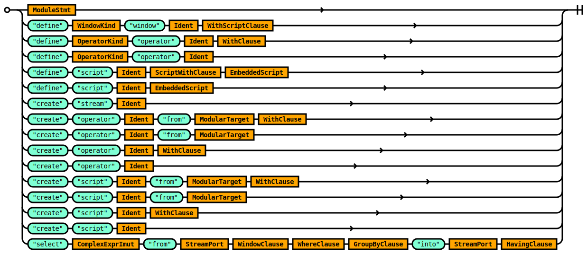
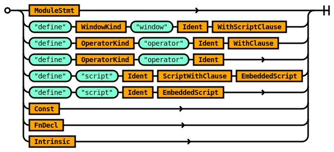
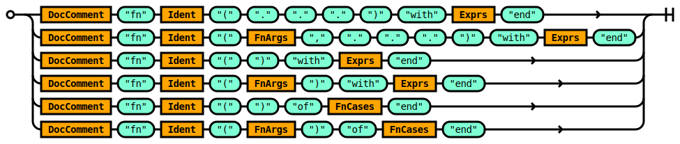
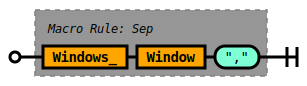

# Query Grammar

## Rule Query

### Query Language Entrypoint

This is the top level rule of the tremor query language `trickle`


```ebnf
rule Query ::=
    ConfigDirectives Stmts  '<end-of-stream>' ?  
  | Stmts  '<end-of-stream>' ?  
  ;

```


### Query Language Entrypoint

This is the top level rule of the tremor query language `trickle`


## Rule ConfigDirectives

The `ConfigDirectives` rule allows line delimited compiler, interpreter or
runtime hints to be specified.


```ebnf
rule ConfigDirectives ::=
    ConfigDirective ConfigDirectives 
  | ConfigDirective 
  ;

```


The `ConfigDirectives` rule allows line delimited compiler, interpreter or
runtime hints to be specified.


## Rule Stmts

The `Stmts` rule defines a `;` semi-colon delimited sequence of `Stmt` rules.


```ebnf
rule Stmts ::=
    Stmt  ';' Stmts 
  | Stmt  ';' ?  
  ;

```


The `Stmts` rule defines a `;` semi-colon delimited sequence of `Stmt` rules.


## Rule ConfigDirective

A `ConfigDirective` is a directive to the tremor runtime.

Directives MUST begin on a new line with the `#!config` shebang  config token.


```ebnf
rule ConfigDirective ::=
     '#!config' WithExpr 
  ;

```


A `ConfigDirective` is a directive to the tremor runtime.

Directives MUST begin on a new line with the `#!config` shebang  config token.


## Rule WithExpr

The `WithExpr` rule defines a name value binding.


```ebnf
rule WithExpr ::=
    Ident  '=' ExprImut 
  ;

```


The `WithExpr` rule defines a name value binding.


## Rule Stmt

The `Stmt` rule defines the legal statements in a query script.

Queries in tremor support:
* Defining named `window`, `operator`, `script` and `pipeline` definitions.
* Creating node instances of `stream`, `pipeline`, `operator` and `script` operations.
* Linking nodes togther to form an execution graph via the `select` operation.




```ebnf
rule Stmt ::=
    ModuleStmt 
  |  'define' WindowKind  'window' Ident WithScriptClause 
  |  'define' OperatorKind  'operator' Ident WithClause 
  |  'define' OperatorKind  'operator' Ident 
  |  'define'  'script' Ident ScriptWithClause EmbeddedScript 
  |  'define'  'script' Ident EmbeddedScript 
  |  'create'  'stream' Ident 
  |  'create'  'operator' Ident  'from' ModularTarget WithClause 
  |  'create'  'operator' Ident  'from' ModularTarget 
  |  'create'  'operator' Ident WithClause 
  |  'create'  'operator' Ident 
  |  'create'  'script' Ident  'from' ModularTarget WithClause 
  |  'create'  'script' Ident  'from' ModularTarget 
  |  'create'  'script' Ident WithClause 
  |  'create'  'script' Ident 
  |  'select' ComplexExprImut  'from' StreamPort WindowClause WhereClause GroupByClause  'into' StreamPort HavingClause 
  ;

```


The `Stmt` rule defines the legal statements in a query script.

Queries in tremor support:
* Defining named `window`, `operator`, `script` and `pipeline` definitions.
* Creating node instances of `stream`, `pipeline`, `operator` and `script` operations.
* Linking nodes togther to form an execution graph via the `select` operation.


## Rule ModuleStmt

The `ModuleStmt` rule defines the statement types that are valid in a tremor module.


```ebnf
rule ModuleStmt ::=
     'mod' Ident  'with' ModComment ModuleStmts  'end' 
  ;

```


The `ModuleStmt` rule defines the statement types that are valid in a tremor module.


## Rule Ident

An `Ident` is an identifier - a user defined name for a tremor value.


```ebnf
rule Ident ::=
     '<ident>' 
  ;

```


An `Ident` is an identifier - a user defined name for a tremor value.


## Rule ModComment

The `ModComment` rule specifies module comments in tremor.

Documentation comments for modules are optional.

A module documentation comment begins with a `###` triple-hash and they are line delimited.

Muliple successive comments are coalesced together to form a complete comment.

The content of a module documentation comment is markdown syntax.


```ebnf
rule ModComment ::=
    ( ModComment_ ) ?  
  ;

```


The `ModComment` rule specifies module comments in tremor.

Documentation comments for modules are optional.

A module documentation comment begins with a `###` triple-hash and they are line delimited.

Muliple successive comments are coalesced together to form a complete comment.

The content of a module documentation comment is markdown syntax.


## Rule ModuleStmts

The `ModuleStmts` rule defines a set of module statements.

Module statements are a `;` semi-colon delimited set of `ModuleStmt` rules


```ebnf
rule ModuleStmts ::=
    ModuleInnerStmt  ';' ModuleStmts 
  | ModuleInnerStmt  ';' ?  
  ;

```


The `ModuleStmts` rule defines a set of module statements.

Module statements are a `;` semi-colon delimited set of `ModuleStmt` rules


## Rule ModuleInnerStmt



```ebnf
rule ModuleInnerStmt ::=
    ModuleStmt 
  |  'define' WindowKind  'window' Ident WithScriptClause 
  |  'define' OperatorKind  'operator' Ident WithClause 
  |  'define' OperatorKind  'operator' Ident 
  |  'define'  'script' Ident ScriptWithClause EmbeddedScript 
  |  'define'  'script' Ident EmbeddedScript 
  | Const 
  | FnDecl 
  | Intrinsic 
  ;

```


## Rule WindowKind

### Tumbling

A `tumbling` window defines a wall-clock-bound or data-bound window of non-overlapping
time for storing events. The windows can not overlap, and there are no gaps between
windows permissible.

### Sliding

A `sliding` window defines a wall-clock-bound or data-bound window of events that captures
an intervalic window of events whose extent derives from the size of the window. A sliding
window of size 2 captures up to to events. Every subsequent event will evict the oldest and
retain the newest event with the previous ( now oldest ) event.

### Conditioning

Both kinds of window store events in arrival order


```ebnf
rule WindowKind ::=
     'sliding' 
  |  'tumbling' 
  ;

```


### Tumbling

A `tumbling` window defines a wall-clock-bound or data-bound window of non-overlapping
time for storing events. The windows can not overlap, and there are no gaps between
windows permissible.

### Sliding

A `sliding` window defines a wall-clock-bound or data-bound window of events that captures
an intervalic window of events whose extent derives from the size of the window. A sliding
window of size 2 captures up to to events. Every subsequent event will evict the oldest and
retain the newest event with the previous ( now oldest ) event.

### Conditioning

Both kinds of window store events in arrival order


## Rule WithScriptClause


```ebnf
rule WithScriptClause ::=
     'with' WithExprs EmbeddedScriptImut  'end' 
  ;

```


## Rule OperatorKind

The `OperatorKind` rule defines a modular path like reference to a builtin tremor operator.

Operators are programmed in rust native code and referenced via a virtual module path.


```ebnf
rule OperatorKind ::=
    Ident  '::' Ident 
  ;

```


The `OperatorKind` rule defines a modular path like reference to a builtin tremor operator.

Operators are programmed in rust native code and referenced via a virtual module path.


## Rule WithClause

The `WithClause` rule defines a `with` block with a `,` comma delimited set of `WithExpr` rules.


```ebnf
rule WithClause ::=
    ScriptWithClause  'end' 
  ;

```


The `WithClause` rule defines a `with` block with a `,` comma delimited set of `WithExpr` rules.


## Rule ScriptWithClause


```ebnf
rule ScriptWithClause ::=
     'with' WithExprs 
  ;

```


## Rule EmbeddedScript

The `EmbeddedScript` rule defines a script using the [Script DSL](/docs/language/Script) [ [Full](/docs/language/Full#rule-script) ].

The script is enclosed in `script` .. `end` blocks.


```ebnf
rule EmbeddedScript ::=
     'script' Exprs  'end' 
  ;

```


The `EmbeddedScript` rule defines a script using the [Script DSL](/docs/language/Script) [ [Full](/docs/language/Full#rule-script) ].

The script is enclosed in `script` .. `end` blocks.


## Rule Const

The `Const` rule defines a rule that binds an immutable expression to an identifier.

As the value cannot be changed at runtime.


```ebnf
rule Const ::=
    DocComment  'const' Ident  '=' SimpleExprImut 
  ;

```


The `Const` rule defines a rule that binds an immutable expression to an identifier.

As the value cannot be changed at runtime.


## Rule FnDecl

The `FnDecl` rule allows user defined functions to be defined.

This rule allows tremor users to create functions for reuse in one or many tremor applications.




```ebnf
rule FnDecl ::=
    DocComment  'fn' Ident  '('  '.'  '.'  '.'  ')'  'with' Exprs  'end' 
  | DocComment  'fn' Ident  '(' FnArgs  ','  '.'  '.'  '.'  ')'  'with' Exprs  'end' 
  | DocComment  'fn' Ident  '('  ')'  'with' Exprs  'end' 
  | DocComment  'fn' Ident  '(' FnArgs  ')'  'with' Exprs  'end' 
  | DocComment  'fn' Ident  '('  ')'  'of' FnCases  'end' 
  | DocComment  'fn' Ident  '(' FnArgs  ')'  'of' FnCases  'end' 
  ;

```


The `FnDecl` rule allows user defined functions to be defined.

This rule allows tremor users to create functions for reuse in one or many tremor applications.


## Rule Intrinsic

The `intrinsic` rule defines intrinsic function signatures.

This rule allows tremor maintainers to document the builtin functions implemented as
native rust code. The facility also allows document generation tools to document builtin
intrinsic functions in the same way as user defined functions.

In short, these can be thought of as runtime provided.

For information on how to define user defined functions see the [function](#rule-fndecl) rule.


```ebnf
rule Intrinsic ::=
    DocComment  'intrinsic'  'fn' Ident  '('  ')'  'as' ModularTarget 
  | DocComment  'intrinsic'  'fn' Ident  '(' FnArgs  ')'  'as' ModularTarget 
  | DocComment  'intrinsic'  'fn' Ident  '(' FnArgs  ','  '.'  '.'  '.'  ')'  'as' ModularTarget 
  | DocComment  'intrinsic'  'fn' Ident  '('  '.'  '.'  '.'  ')'  'as' ModularTarget 
  ;

```


The `intrinsic` rule defines intrinsic function signatures.

This rule allows tremor maintainers to document the builtin functions implemented as
native rust code. The facility also allows document generation tools to document builtin
intrinsic functions in the same way as user defined functions.

In short, these can be thought of as runtime provided.

For information on how to define user defined functions see the [function](#rule-fndefn) rule.


## Rule ModularTarget

A `ModularTarget` indexes into tremor's module path.

In tremor a `module` is a file on the file system.

A `module` is also a unit of compilation.

A `ModularTarget` is a `::` double-colon delimited set of identifiers.

Leading `::` are not supported in a modular target..

Trailing `::` are not supported in a modular target.


```ebnf
rule ModularTarget ::=
    Ident 
  | ModPath  '::' Ident 
  ;

```


A `ModularTarget` indexes into tremor's module path.

In tremor a `module` is a file on the file system.

A `module` is also a unit of compilation.

A `ModularTarget` is a `::` double-colon delimited set of identifiers.

Leading `::` are not supported in a modular target..

Trailing `::` are not supported in a modular target.


## Rule ComplexExprImut

The `ComplexExprImut` rule defines complex immutable expression in tremor.


```ebnf
rule ComplexExprImut ::=
    MatchImut 
  | ForImut 
  | ExprImut 
  ;

```


The `ComplexExprImut` rule defines complex immutable expression in tremor.


## Rule StreamPort

The `StreamPort` rule defines a stream by name with an optional named `Port`.

When the `Port` is omitted, tremor will internally default the `Port` to the
appropriate `in` or `out` port. Where the `err` or user defined `Port`s are
preferred, the optional `Port` specification SHOULD be provided.


```ebnf
rule StreamPort ::=
    Ident MaybePort 
  ;

```


The `StreamPort` rule defines a stream by name with an optional named `Port`.

When the `Port` is omitted, tremor will internally default the `Port` to the
appropriate `in` or `out` port. Where the `err` or user defined `Port`s are
preferred, the optional `Port` specification SHOULD be provided.


## Rule WindowClause

The `WindowClause` rule defines an optional window definition for a supporting operation.


```ebnf
rule WindowClause ::=
    ( WindowDefn ) ?  
  ;

```


The `WindowClause` rule defines an optional window definition for a supporting operation.


## Rule WhereClause

The `WhereClause` defines a predicate expression used to filter ( forward or discard ) events in an operation.

The `where` clause is executed before a operation processes an event.


```ebnf
rule WhereClause ::=
    (  'where' ComplexExprImut ) ?  
  ;

```


The `WhereClause` defines a predicate expression used to filter ( forward or discard ) events in an operation.

The `where` clause is executed before a operation processes an event.


## Rule GroupByClause

The `GroupByClause` defines the group by clause of a supporting operation in tremor.

An operator that uses a group by clause maintains the operation for each group captured
by the grouping dimensions specified in this clause.


```ebnf
rule GroupByClause ::=
    (  'group'  'by' GroupDef ) ?  
  ;

```


The `GroupByClause` defines the group by clause of a supporting operation in tremor.

An operator that uses a group by clause maintains the operation for each group captured
by the grouping dimensions specified in this clause.


## Rule HavingClause

The `HavingClause` defines a predicate expression used to filter ( forward or discard ) events in an operation.

The `having` clause is executed after an operation has processed an event.


```ebnf
rule HavingClause ::=
    (  'having' ComplexExprImut ) ?  
  ;

```


The `HavingClause` defines a predicate expression used to filter ( forward or discard ) events in an operation.

The `having` clause is executed after an operation has processed an event.


## Rule MaybePort

The `MaybePort` rule defines an optional `Port`.


```ebnf
rule MaybePort ::=
    (  '/' Ident ) ?  
  ;

```


The `MaybePort` rule defines an optional `Port`.


## Rule ModPath

The `ModPath` rule defines a modular path.

A modular path is a sequence of `Ident`s separated by a `::` double-colon.


```ebnf
rule ModPath ::=
    ModPath  '::' Ident 
  | Ident 
  ;

```


The `ModPath` rule defines a modular path.

A modular path is a sequence of `Ident`s separated by a `::` double-colon.


## Rule WindowDefn

The `WindowDefn` defines a temporal basis over which a stream of events is applicable.


```ebnf
rule WindowDefn ::=
     '[' Windows  ']' 
  ;

```


The `WindowDefn` defines a temporal basis over which a stream of events is applicable.


## Rule Window

The `Window` rule defines a modular target to a window definition.


```ebnf
rule Window ::=
    Ident 
  | ModPath  '::' Ident 
  ;

```


The `Window` rule defines a modular target to a window definition.


## Rule Windows

The `Windows` rule defines a sequence of window definitions that are `,` comma delimited.


```ebnf
rule Windows ::=
    Windows_ 
  ;

```


The `Windows` rule defines a sequence of window definitions that are `,` comma delimited.


## Rule Windows_

The `Windows_` rule defines a sequence of window definitions that are `,` comma delimited.




```ebnf
rule Windows_ ::=
    Sep!(Windows_, Window, ",") 
  ;

```


The `Windows_` rule defines a sequence of window definitions that are `,` comma delimited.


## Rule GroupDef

The `GroupDef` rule defines the parts of a grouping dimension.

Group segments can be derived from:
* Expressions - for which their serialized values are used.
* Set expressions - which computes a set based on an expression.
* Each expressions - which iterates an expression to compute a set.


```ebnf
rule GroupDef ::=
    ExprImut 
  |  'set'  '(' GroupDefs  ')' 
  |  'each'  '(' ExprImut  ')' 
  ;

```


The `GroupDef` rule defines the parts of a grouping dimension.

Group segments can be derived from:
* Expressions - for which their serialized values are used.
* Set expressions - which computes a set based on an expression.
* Each expressions - which iterates an expression to compute a set.


## Rule ExprImut

The `ExprImut` is the root of immutable expressions in tremor.


```ebnf
rule ExprImut ::=
    OrExprImut 
  ;

```


The `ExprImut` is the root of immutable expressions in tremor.


## Rule GroupDefs

The `GroupDefs` rule defines a `,` comma delimited set of `GroupDef` rules.


```ebnf
rule GroupDefs ::=
    GroupDefs_ 
  ;

```


The `GroupDefs` rule defines a `,` comma delimited set of `GroupDef` rules.


## Rule GroupDefs_

The `GroupDefs_` rule defines a `,` comma delimited set of `GroupDef` rules.


```ebnf
rule GroupDefs_ ::=
    Sep!(GroupDefs_, GroupDef, ",") 
  ;

```


The `GroupDefs_` rule defines a `,` comma delimited set of `GroupDef` rules.


## Rule EmbeddedScriptImut

The `EmbeddedScriptImut` rule defines an optional embedded `script`.
 


```ebnf
rule EmbeddedScriptImut ::=
    (  'script' EmbeddedScriptContent ) ?  
  ;

```


The `EmbeddedScriptImut` rule defines an optional embedded `script`.
 


## Rule EmbeddedScriptContent

The `EmbeddedScriptContent` rule defines an embedded script expression. 


```ebnf
rule EmbeddedScriptContent ::=
    ExprImut 
  ;

```


The `EmbeddedScriptContent` rule defines an embedded script expression. 


## Rule WithExprs

The `WithExprs` rule defines a `,` comma delimited set of `WithExpr` rules.


```ebnf
rule WithExprs ::=
    WithExprs_ 
  ;

```


The `WithExprs` rule defines a `,` comma delimited set of `WithExpr` rules.


## Rule WithExprs_


```ebnf
rule WithExprs_ ::=
    Sep!(WithExprs_, WithExpr, ",") 
  ;

```


## Rule Exprs


```ebnf
rule Exprs ::=
    MayBeConstExpr  ';' Exprs 
  | MayBeConstExpr  ';' ?  
  ;

```


