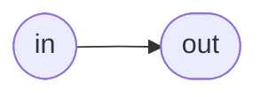
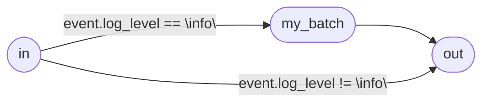

# Language

Tremor provides a scripting language for defining and deploying event flows.
It is called [Troy] - The Tremor Deployment language.

* [Connectors] providing connectivity to the outside world, 
* [Pipelines] representing the actual stream processing and event handling 
* and the Connections of both, forming a complete and self-contained Flow of Events.

Troy is used on every level of event processing, starting from the plumbing that provides connectivity to the outside world in the form of a [Flow], ranging over [Pipelines] and [Scripts] for expressing complex event routing, filtering, event introspection and transformation, towards the final step of deploying your application and bringing it to production via [Deploy].

## Flows

A Flow encapsulates your event flow: the definition of where events should come from, how you want to handle, route, slice and dice them and where to they are sent out: The physical routing, or as we call it, the plumbing. This is where you get your hands dirty and greasy. It is also the unit of Deployment in Tremor. You bring a whole Flow live by [Deploy]ing it. Any Tremor server can host many Flows in parallel. You can deploy multiple versions of your Flow to increase parallelism (e.g. have multiple consumers consumer from your kafka topic and send the events downstream after normalizing them to a common format).

Flows are self-contained, sealed units and cannot communicate with each other. Thus users usually want to encapsulate their application in a single Flow and put unrelated event flows in separate [Flows].

### Definition

As all other entities in Tremor, [Flows] need to be defined:

```tremor
define flow flowy_mc_flowface
args
    url = "localhost:12345"
flow
    # import some predefined pipelines
    use tremor::pipelines;
    
    # lets define a connector and parameterize it by the url
    define connector my_udp from udp_server
    args
        url
    with
        config = {
            "url": args.url # pass on the url from the arguments
        },
        codec = "json"
    end;

    # create an instance from the pipeline definitions imported above
    create pipeline passthrough from pipelines::passthrough;
    
    # create a connector instance and pass through the url argument from the flow definition
    create connector my_udp
    with
        url = args.url
    end;

    # let the events flow from conny through passthrough and then back to my_udp
    connect /connector/my_udp to /pipeline/passthrough;
    connect /pipeline/passthrough to /connector/my_udp;
end;
```

Here we have all the bits and pieces that comprise a full fledged Tremor Application:

 * We define where events should come from by defining a connector. In this case we receive events from UDP packets and interpret them as JSON.
 * We define how to handle events. In this case we just want to pass them through unchanged, so we use a predefined `passthrough` pipeline.
 * We define the final event flow by using the [`connect`](../language/reference/deploy.md#rule-connect) statements to route events from our connector `conny` through our passthrough pipeline `pippi` and back to our `udp_server` connector. We essentially formed a UDP echo server.

This definition will also make the [Flow] with the id `flowy_mc_flowface` available for [Deploy]ing it in order to bring it to live and let the events flow through it.

### Deploy

:::note

It is important to know that a [`define`](#define-and-create) will never start or deploy anything, it will only create a configuration template that can be [`created`](#define-and-create).

So don't forget to [`deploy`] your flow!

:::

How to actually deploy this flow, you might ask? Wait no longer, your thirst for answer will be satisfied:

```tremor
deploy flow flowy_mc_flowface;
```

This statement will deploy an instance of `flowy_mc_flowface` and bring it live with the provided port. You can deploy multiple different `flowy_mc_flowface` Flows with different settings provided as parameters in the `with` clause. Your Flow acts as a configurable template. For more details, see [Arguments](#arguments).

## Pipelines

In the above [Flow](#flows) we used a very simple `passthrough` pipeline, as we didn't want to modify the events we got in in any form.
The thing is, usually you do. Or you want to inspect them and route them based on their log-level, for example, or just drop them because you just got too much events from the upstream system. This is what pipelines are for.

Pipelines are self-contained units that define your application logic, the logical routing. It is usually independent of where the input events come from and go to. As with all entities in Tremor, [Pipelines] need to be defined and created. They also need to be [`connect`](../language/reference/deploy.md#rule-connect)ed to have events flow through them. This is all done inside a [Flow], as we have seen in action above.

Pipelines have input (`in`) and output (`out`, `err`) ports, which can be configured upon definition. All events come from one of the configured input ports. Every pipelines actually forms a graph (a directed acyclic graph) with edges spanning from the input ports to operators and finally to the output ports. Events flow along the edges and are processed by the operators.

[Select] statements are what connects the input/output ports and the processing operators. As the name suggests, they are similar to the `SQL SELECT`. They support filtering out events by a [`where`](../language/reference/query.md#rule-whereclause) clause,  

The simplest kind of pipeline is the passthrough pipeline we used above:

```tremor
define pipeline passthrough
pipeline
    select event from in into out;
end;
```



Lets add an operator in the middle and only send those events through it that have a `log_level` field with the value `"info"`:

```tremor
define pipeline passthrough
pipeline
    # define the operator - here we batch events up in groups of 100
    define operator batch from generic::batch
    with
        count = 100
    end;
    # create an instance of the operator
    create operator my_batch from batch;

    # select the log_level = "info" events into the batch operator and into the out port
    select event from in where event.log_level == "info" into my_batch;
    select event from my_batch into out;
    # pass through all the others
    select event from in where event.log_level != "info" into out;
end;
```



This looks more interesting, doesn't it? We defined and created an operator, which now forms a node in out event processing graph. We used the [Select] statements to route only certain events into the operator, all others go straight to the `out` port and leave the pipeline.

This is the basic structure of a Pipeline. The basic concepts you need to understand to work with them. For more details check out our [Pipeline] article.

### Operators

Operators are the nodes in a Pipeline graph, connected by [Select] statements. Similar to [Pipelines], Operators have ports for connecting them to other operators or pipeline input/output ports. The default ports are `in` for input and `out` for output and `err` for erroneous output. Some Operators have custom ports. To find out which, check the [Documentation](../reference/operators/index.md).

They can keep internal state between events flowing through them, which makes them quite powerful.

Tremor provides a list of builtin [Operators]. E.g. for [`generic::batch`](../reference/operators/batch.md) for batching up events or [`qos::backpressure`](../reference/operators/backpressure.md) for applying backpressure towards upstream systems if a downstream system fails or takes to long to handle events.

If you want to create your own custom operator, you can use a [Script], which is handled in the next section.


## Scripts

Scripts are a special kind of Operator. While others are simply configured and perform their event-processing in optimized Rust code, Scripts execute your Tremor code. They also have a special syntax:

```tremor
define script my_script
script
    let value = 
      match event of
        case %{ present snot } => "badger"
        case "stringy" => "string"
        case 42 => "the answer"
      end;
    emit {
      "original_event": event,
      "derived_value": value
    };
end;
create script my_script;
```

This script inspects the event and derives a value depending on the type and shape of the event. It then emits a transformed value containing the original event and the derived value as the outgoing event.

Scripts give users the most control over how to inspect, filter and transform an event. With their [state](../language/expressions.md#state) mechanism, they can also work on streams of events (e.g. for creating aggregates or implementing state machines).

So, if you want to implement some complex ETL logic on your event streams, if you want to manipulate event metadata or implement other more complex logic than is expressable in a [Select] statement, a [Script] should be your tool of choice.

## Events

So what exactly is this event thing that is routed from [Connectors] through pipelines and processed in and emitted from scripts?

An event is a discrete unit of an event stream. An incoming raw data stream is separated into distinct byte chunks either by the [Connector] itself (e.g. in the case of UDP, each packet will be treated as distinct unit) or by [Preprocessors](../reference/preprocessors) configured on the input [Connector]. Then the configured [Codec] is decoding the byte chunk into the structured event payload.

Each event consists of:

 * payload (accessible via the reserved [`event` path](./expressions.md#reserved-paths)
 * event metadata, initially added by the [Connector] this event originated at, accessible via the reserved [`$` path](./expressions.md#reserved-paths) modifiable by [Scripts] 
 * an event id, for uniquely identifying the event inside the system
 * an [ingestion timestamp](../reference/stdlib/tremor/system.md#ingestns) in nanosecond resolution
 * an [`origin_uri`](../reference/stdlib/tremor/origin.md) for identifying the event origin (e.g. a TCP connection peer)

## Type system

All values in Tremor, be it event payload, metadata, local variables, state or anything else, everything is a part of the Tremor type system. The type system is roughly modelled to support all values that can be represented as JSON, with some extensions.

Tremor is dynamically typed, that means variables do not have a static type determined at compile time. But they can have any possible type. Treating values as different types than they actually are will lead to errors. E.g. accessing a nested field on a value that is actually a string.

Possible types for tremor values are:

* [`null`](./expressions.md#null) - represents a JSON `null`, an otherwise undefined value
* [booleans](./expressions.md#boolean) - `true` and `false`
* [integers](./expressions.md#integer-numerics) - integers
* [floats](./expressions.md#floating-point-numerics) - floating point numbers
* [strings](./expressions.md#utf-8-encoded-strings) - UTF-8 encoded strings
* [arrays](./expressions.md#arrays) - arrays of arbitrarily typed values, also different types
* [records](./expressions.md#records) - mappings from string names to arbitrarily typed values
* [binary](./expressions.md#binary) - raw binary data

To check for the type of a value, use either a function in the [`std::type` module](../reference/stdlib/std/type.md) or some of the modules for handling specific types, like integers: [std::integer](../reference/stdlib/std/integer) inside a [match](./expressions.md#match).

## Define and Create

We tried to keep the language as consistent and free of surprises as possible. As such, all entities in Tremor: [Flows], [Connectors], [Pipelines], [Operators], [Scripts] and others, all follow the same pattern: **Define and Create**.

### Define 

If you want to use an entity, you first have to define it, providing configuration, actual code etc. The Definition Step never creates an instance or somehow affect the runtime, it just makes the preconfigured definition available for creating as many instances from it as you might want.

The most important aspect of the split of `define` and `create` is to enable modularity of your code base. `defines` can live in a separate file. You can group regularly used pipelines, scripts or connectors in separate files, and dont repeat yourself too much by reusing recurring bits of your code.
### Create

The Create step actually creates a runtime instance of the defined entity, with the configuration provided at the Definition step and with the [Arguments](#arguments) provided with the create statement.

Created operators and scripts (actually also an operator) can be referenced by [Select] statements in a pipeline and thus can become part of the [Pipeline] graph.

Created [Connectors] and [Pipelines] can be referenced in [Connect] statements and so become part of the event flow that actually routes incoming events towards pipelines and outgoing connectors.

One special case are [Flows]. They are not created, but [Deploy]ed. This is because deploying a [Flow] is also starting all the contained instances of the flow, so the operation is somewhat different and required a different name.


## Modules

Troy is built to enable modularization. Instead of cramming all your applications code into a huge single file, you can extract your preconfigured [Connector] definitions or even a full-grown [Flow] (or anything you can define in Troy) into separate files and simply [`use`](../language/reference/deploy.md#rule-use) in your applications main Troy file.

### Example


```tremor title="main.troy"
# importing the module `my_flows` from `my_flows.tremor`
# making its definitions available in this file
use my_flows;

# refer to a flow defined the `my_flows` module and deploy it
deploy flow cool_flow_01 from my_flows::cool_flow;
```

```tremor title="my_flows.tremor"

define flow cool_flow
flow
    # make the `pipelines` module within the `troy` namespace available.
    use tremor::pipelines;

    # make the `connectors` module within the `troy` namespace available.
    use tremor::connectors;

    # refer to the definition of `console` inside the `connectors` module
    create connector my_console from connectors::console;
    # refer to the definition of `passthrough` inside the `pipelines` module
    create pipeline my_passthrough from pipelines::passthrough;

    connect /connector/my_console to /pipeline/my_passthrough;
    connect /pipeline/my_passthrough to /connector/my_console;
end;
```

In this example we put the actual [Flow] definition in a separate file `my_flows.tremor` and [`use`](../language/reference/deploy.md#rule-use)d it in our main Troy file.

Even more interestingly, within our `my_flows.tremor` file, we made good use of predefined [Connectors] and [Pipelines] within the [Standard Library] modules [`tremor::pipelines`](../reference/stdlib/tremor/pipelines.md) and [`tremor::connectors`](../reference/stdlib/tremor/connectors.md). All standard library modules are available for `use` by default.

It is also important to note that you can use `use` statements on all levels of your code. In the top level, in a [Flow] definition, a [Pipeline] definition or a [Script] operator definition. A `use` statement on an outer scope, say inside a [Flow] definition, like above, will not be available on an inner scope, say a [Pipeline] definition. `use` statements only make the definition of modules available in the current scope.

### TREMOR_PATH

Tremor modules you want to `use`, need to be available on a path listed in the environment variable `$TREMOR_PATH`.
It follows the same format as the well known `$PATH` variable. It should contain 0 or more directories, separated by a colon (`:`).

Getting back to the example above: If you want to `use` the `my_flows.tremor` file, its directory needs to be present in `$TREMOR_PATH` and provided to the `tremor` executable on startup.

An example command line to start tremor with the files above, assuming `my_flows.tremor` is in the `$HOME/modules` directory, would be:

```console
$ TREMOR_PATH="${TREMOR_PATH}:${HOME}/modules tremor server run main.troy
```

## Arguments

All Tremor entities have a define step, at which they can define arguments, they require upon creation (or upon `deploy`). The syntax for this is illustrated by the following example:

```tremor
define flow with_args
args
    url = "localhost:12345",    # optional argument with default value
    codec                       # required argument
flow
    define connector conn_with_args from udp_server
    args
        url,                    # required argument
        codec                   # required argument
    with
        config = {
            "url": args.url
        },
        codec = args.codec
    end;

    create connector conn_with_args
    with
        url = args.url,         # the value from the flow args are passed through to the connector
        codec = args.codec      # the same happens here
    end;

    # ... the rest redacted for the sake of brevity
end;

deploy flow with_args
with
    codec = "json"              # we need to provide the required arguments
end;
```

Arguments are defined after the `args` keyword. It is possible to define required arguments, by omitting a default value, and optional arguments, by providing a default value.

Parameter values are provided on `create` or `deploy` statements after the `with` keyword.

You can refer to arguments within the body of the entity having arguments defined by the special `args` path expression. It is not possible to refer to `args` from the outer scope. E.g. inside a script we cannot reference the `args` of the outer [Pipeline] or outer [Flow], only the own `args` can be referenced.


[YAML]: https://yaml.org/
[Deploy]: #deploy
[Connectors]: ../reference/connectors
[Connector]: ../reference/connectors
[Flows]: #flows
[Flow]: #flows
[Pipelines]: ../language/pipelines.md
[Pipeline]: ../language/pipelines.md
[Scripts]: ../language/scripts.md
[Script]: ../language/scripts.md
[Standard Library]: ../reference/stdlib
[Select]: ../language/pipelines.md#select-queries
[Operators]: ../reference/operators
[Connect]: ../language/reference/deploy.md#rule-connec
[Codec]: ../reference/codecs
