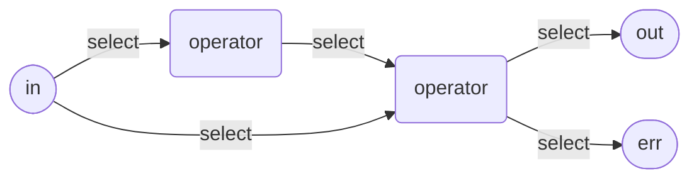
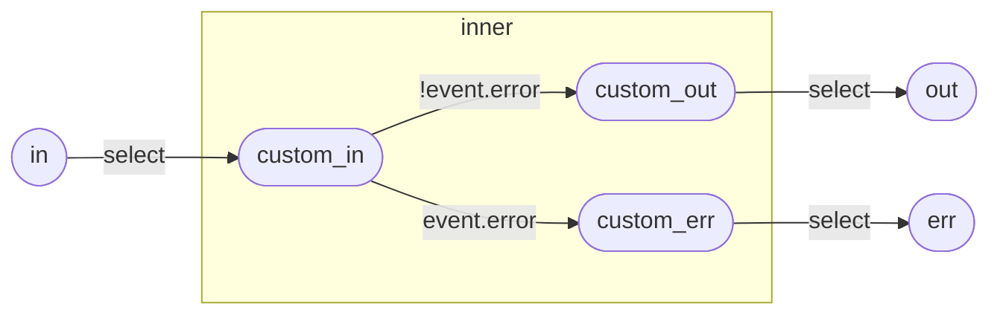
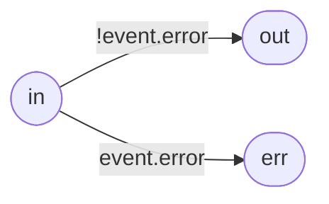

# Pipelines

This section details the major concepts of Pipelines in Tremor.

Pipelines form a directed acyclic graph or **DAG** from input ports over [Operators] towards output ports. The edges of this graph are constructed from [Select] queries.



At its core, Pipelines are defined using [Operators] and [Scripts] (a highly customizable operator) and [Select] queries for combining them into an executable graph that can process events. [Select] queries can filter, transform, route and group streams of events. Events can be aggregated into [Windows]. [Stream Definitions] can be used to perform more complex query graph algorithms, like branching, joining or interleaving.

The [Select] queries in a Pipeline consume and produce unstructured data. The Pipeline runtime does not impose schema based constraints on data flowing through the system, although accessing data that is not present produces runtime errors and thus a schema can by dynamically enforced by user-defined pipeline code.

## Definitions

As all other entities in Tremor, pipelines need to be defined and created. They can have [Arguments] and they can specify their input and output ports. [Connectors] and other Pipelines can be connected to those ports only. The default ports are:

* `in` as the single input port
* `out` as output port for regular events
* `err` for events signalling a processing error

Example:

```tremor
define pipeline my_fancy_pipeline
args
  required_argument,
  optional_argument = 42
from 
  in1, in2
into
  out, err, exhaust
pipeline
  # simples pipeline ever
  select event from in into out;
end;
```

Pipelines can be created inside a [Flow](../language/index.md#flows) using a [Create statement](#create-statements).


## Statements

The body of a pipeline is also called a **Query**. It consists of one or many [Statements](#statements) and is introduced with the `pipeline` keyword. Such a Query consists of zero or more [Config Directives](#config-directives) followed by one or many [Statements](#statements) separated by `;`.  A **Query** needs to contain at least one [Select] statement that defines the event flow graph and connects input and output port and operators. 

This directed acyclic graph or **DAG** of operators connected by [Select]s is compiled into a DAG of operator nodes and validated at compile time. At runtime, the resulting executable tremor pipeline is evaluated/interpreted.

#### Grammar

> 

Stmt: <a name="Stmt"></a>
> 

Statements can be one of:

- [Select statements](#select-queries)
- [Stream definitions](#stream-definitions)
- [Window definitions](#window-definitions)
- [Operator definitions](#operator-definitions)
- [`script` Operator definitions](#script-definitions)
- [Embedded Pipeline Definitions](#pipeline-definitions)
- [Create statements](#create-statements)


### Stream Definitions

Stream definitions in Pipelines allow private intermediate streams to be named so that they can be used as the source or sinks in other continuous queries. At runtime they are represented as a passthrough operator that will be optimized out if possible, so there is nearly no runtime overhead in defining and using streams.

#### Grammar

#### Example

```trickle
create stream passthrough;

select event from in into passthrough; # select default public 'in' stream into passthrough
select event from passthrough into out; # select passthrough into default public 'out' stream
```

### Window Definitions

> 

Tremor supports the definition of tumbling windows.

A tumbling window is a window configured with a fixed non-overlapping interval. The window aggregates events once opened, and continues aggregating until it closes. The window can emit synthetic events upon closing. The window reopens for its next cycle when it closes.

Support for sliding windows has not been implemented yet (it has an [open RFC](https://www.tremor.rs/rfc/accepted/sliding-window-mechanism) and it will be picked up for a future release).

#### Tumbling Windows

Tremor supports tumbling windows by number of events or by time.

General configuration Parameters:

* `max_groups`: maximum number of groups to maintain simultaneously in memory. Groups added beyond that number will be ignored. Per default, tremor does not impose any limit on the number of groups kept simultaneously.

Each select statement maintains the groups for the current windows in an in memory data-structure. This contains the group values as well as the aggregate states.
If your grouping values possibly have a very high cardinality it is possible to end up with runaway memory growth, as per default the group data structures won't be evicted as long asd they hold data.
To configure an upper bound on the number of groups that should be maintained simultaneously for a window, set `max_groups`.

A [Select] query using one or more windows is generating _new_ synthetic events, aggregated from the events feeded into it. Even if a window only consists of a single event, it needs to be considered a new event. The shape of the new event is determined by the [`select`](#select-queries) _Target Expression_. Those new events will have an empty metadata and the [origin uri](../reference/stdlib/tremor/origin) is pointing to the windowed [Select] query.

##### Windows based on number of events

Tumbling windows based on the number of events close when a certain number of events has been received.

Configuration Parameters:

- `size`: Number of events until this window closes and emits a downstream event.

The size increment for each event defaults to `1` but can be customized by the embedded script in the window definition.
This script needs to return an unsigned integer denoting the number of events to use for this event.
It is possible to ignore the current event by emitting `0`.

##### Windows Based on Time

Time based tumbling windows close when a certain duration has elapsed. The source for measuring the duration
is the `ingest` timestamp of the events flowing through by default. The provided embedded script can be used to customize the
source of time measurement. The embedded script must return a number representing a timestamp in nanoseconds.
This way windows using timestamps other than the event ingest time can be built.

Only windows using the event ingest timestamp can be closed when the time in `interval` is elapsed measured by wall-clock time
independent from event flow with a granularity of `100ms`. It is thus possible that empty windows are emitted. Windows using scripts to determine the window elapsed time are considered to deviate from wall clock time and will only close and emit when events flow through them.

Configuration Parameters:

- `interval`: Time interval in nanoseconds after which the window closes.


#### Examples

For example a 15 second tumbling window based on the event ingest timestamp can be defined as follows

```trickle
define tumbling window fifteen_secs
with
    interval = core::datetime::with_seconds(15),
end;
```

The same window can be defined using a timestamp that is extracted from the message instead of the ingest time:

```trickle
define tumbling window fifteen_secs
with
    interval = core::datetime::with_seconds(15),
script
    event.timestamp
end;
```

A tumbling window based on number of events that will discard windows when 2 hours have been passed:

```trickle
define tumbling window with_size
with
    size = 1000,
    eviction_period = core::datetime::with_hours(2)
end;
```

### Operator Definitions

Operators form the nodes in the [Flow] graph. They process events in various forms and are built in to the Tremor runtime. Use a [Script] for building a custom operator with your own event processing logic.

Operators need to be created from a definition using the `create` statement before they can be referenced in [Select] statements and thus be part of the Pipeline graph. This additional step allows us to provide [Arguments](./index.md#arguments) for operators to customize definitions upon creation.

See the [Operator Reference](../reference/operators) for a list of all supported operators.

#### Grammar

Operator Definition:
> 

Operator Creation:

> 


#### Example

```trickle
# create a bucketing operator
define operator kfc from grouper::bucket;

create operator kfc;

# ...

select event from categorize into kfc;
select event from kfc into out;
```

### Script Definitions

Scripts are custom pipeline [operators](#operator-definitions) with a special syntax. They allow users to define their custom event processing logic in Tremor code.

A script is interpreted and executed for each event that is sent to it. Inside a script the special [path](./expressions.md#paths) `event` is referring to the event payload, while `$` is referring to the event metadata (which is always a [record](./expressions.md#records)). 

Same as with all operators, scripts have ports. If a script encounters an error, an event describing the error is sent to the `err` port. Otherwise, events can be [emitted](./expressions.md#emit) to arbitrary ports.
The last expression in a script determines the event payload emitted to the `out` port. Alternatively, one can always manually [emit](./expressions.md#emit) events to arbitrary ports. An `emit` will always terminate the script.

For more details on writing scripts, please consult our [Scripts documentation](./scripts.md).

#### Grammar

Script Definition Grammar:
> 


Script Creation Grammar:
> 

#### Example

```trickle
define operator kfc from grouper::bucket;

define script categorize
script
  # add some values to the event metadata
  # those are required by the `grouper::bucket` operator defined above
  let $rate = 1;
  let $class = event.`group`;

  # this is the last expression that will form the output event payload
  { "event": event, "rate": $rate, "class": $class };
end;

create script categorize;

# Stream ingested data into categorize script
select event from in into categorize;

create operator kfc;
# Stream scripted events into kfc bucket operator
select event from categorize into kfc;

# route script error events to the pipeline `err` port
select event from categorize/err into err;

# Stream bucketed events into out stream
select event from kfc into out;
```

### Pipeline Definitions

> 

> 

Pipelines can contain and reference other pipelines. Those need to be either defined inside the current pipeline or referenced from another module via [use](./reference/query.md#rule-use). 
Inline pipelines then need to be created in order to reference them in [Select] statements. It is possible to select `into` the input ports of a pipeline and to select `from` the pipelines output ports.

Example:

```
define pipeline container
pipeline

  define pipeline inner_defn
  from
    custom_in
  into
    custom_out, custom_err
  pipeline
    select event from custom_in where !event.error into custom_out;

    select event from custom_in where event.error into custom_err;
  end;

  create pipeline inner from inner_defn;

  select event from in into inner/custom_in;
  select event from inner/custom_out into out;
  select event from inner/custom_err into err;

end;
```

This pipeline will create a graph like this:



During pipeline compilation and optimization those pipelines will be inlined into the containing pipeline, at runtime the ports and operators of the inline pipeline will be part of the containing pipeline graph.
The above pipeline will be optimize to a graph similar to the following semantically equivalent graph. The pipeline has been inlined and was actually optimized away completely as we were just forwarding events.



### Create Statements

> 

> 

> 

> 

All entities in a pipeline need to be [defined and created](./index.md#define-and-create) before they can be used to form a pipeline graph.

The only exception is the [Window](#window-definitions), which don't need to be created, only referenced in a [Select].

## Select Queries

Select Grammar:
> 

The select query is a builtin operation that is the workhorse of Tremor pipelines. A select query describes from where to where an event should be routed (and under which conditions) and how it is transformed along the way.

An example select operation configured to pass through data from a pipeline's default `in` stream to a pipeline's default `out` stream:

```trickle
select event from in into out;
```

Select operations can filter ingested data with the specification of a [`where` clause](#WhereClause). The clause forms a predicate check on the inbound events before any further processing takes place.
That means the `event` available to the [`where` clause](#WhereClause) is the unprocessed inbound event from the input stream (`in` in this case):

```trickle
select event from in where event.is_interesting into out;
```

The _Target Expression_ of a select query is used to describe transformations of the event. To pass through the event without changes, use `select event`, otherwise you can construct arbitrary [literals](./scripts#literals) (numbers, records, arrays, ...), call functions, aggregate functions, reference the event metadata via `$` or other [path expressions](./scripts#paths). Nearly everything is possible:

```trickle
use std::string;
use tremor::system;

select
  {
      "accumulated": [event.first, "middle", event.last],
      "metadata": $meta.nested[0].deep,
      "shouted": "#{ string::uppercase(event.message) }!",
      "now": system::nanotime(),
      "awesome": true
  }
from in into out;
```

Select operations can filter data being forwarded to other operators with the specification of a `having` clause. The clause forms a predicate check on outbound synthetic events after any other processing has taken place.
That means the `event` available to the `having` clause is the result of evaluating the `select` target clause (the expression between `select` and `from`).

```trickle
select event from in into out having event.is_interesting;
```

Select operations can be windowed by **applying** a [Window] to the inbound data stream.

```trickle
define window fifteen_secs from tumbling
with
    interval = datetime::with_seconds(15),
end;

select 
  { "count": aggr::stats::count() } 
from 
  in[fifteen_secs] 
into 
  out 
having 
  event.count > 0;
```

In the above operation, we emit a synthetic count every fifteen seconds if at least one event has been witnessed during a 15 second window of time.

Windows emit new events which are an aggregation of the events feeded into them. Those new events will have an empty event metadata (accessible via `$`).
The same is true for the [origin uri](../reference/stdlib/tremor/origin), which will point to the windowed query, not the origin of any event feeded into the window.

To drag event metadata across a windowed query, it needs to be selected into the event payload:

```trickle
define window take_two from tumbling
with
    size = 2,
    eviction_period = core::datetime::with_seconds(5)
end;

select
  {
    "first": aggr::win::first($.kafka.key),
    "all_metas": aggr::win::collect_flattened($),
  }
from 
  in[take_two]
into 
  out;
```

Select operations can be grouped through defining a [`group by` clause](#GroupByClause).

```trickle
define tumbling window fifteen_secs
with
    interval = datetime::with_seconds(15),
end;

select 
  { "count": aggr::stats::count() }
from 
  in[fifteen_secs]
group by 
  set(event.partition)
into 
  out
having 
  event.count > 0;
```

In the above operation, we partition the input events into groups defined by a required `event.partition` data field on the inbound event. Each of these groups maintains an independent fifteen second tumbling window. And each window, upon closing, generates an outbound synthetic event which is gated by a having clause checking the count for that group.

The current implementation of `select` allows [set-based](#SetBasedGroup) and [each-based](#EachBasedGroup) grouping. These can be composed concatenatively. However `cube` and `rollup` based grouping dimensions are not currently supported.

In windowed queries any event related data can only be referenced in those two cases:

* it is used as an argument to an aggregate function
* it is used as expression in the `group by` clause

Here is an example of good and bad references:

```trickle
define window my_window from tumbling
with
  size = 12
end;

select 
  {
    "last": aggr::win::last(event.other), # ok, inside aggregate function
    "foo": event.foo + 1,                 # ok, expression is used in the `group by` clause
    "bad": event.other,                   # NOT OK
    "bad_meta": $my_meta,                 # NOT OK, same rules apply to event metadata
  } 
from 
  in[my_window]
group 
  by set(event.foo, event.bar)
into 
  out;
```

### Branching

Branching data into multiple streams is performed via [Select] operations

Branch data into 3 different output stream ports:

```tremor
select event from in into out/a;
select event from in into out/b;
select event from in into out/c;
```

```mermaid
graph LR
```

Branch data into 3 different intermediate [Streams]:

```tremor
create stream a;
create stream b;
create stream c;

select event from in into a;
select event from in into b;
select event from in into c;
```

### Combining

Multiple data streams can also be combined via [Select] operations.

Combine 3 data streams into a single output stream

```tremor
...

select event from a into out;
select event from b into out;
select event from c into out;
```

Combine 3 data stream ports from 1 or many streams into a single output stream

```tremor
...

select event from a/1 into out;
select event from a/2 into out;
select event from b into out;
```

### Aggregations

A key feature of the [Select] queries are aggregations. These are supported with:

- Windows - A window is a range of events, clock or data time. There can be many different types of windows.
- Aggregate functions - An aggregate function is a function that runs in the context of a window of events, emitting results intermittently
- Tilt Frames - A tilt frame is a chain of compatible windows with **decreasing** resolution used to reduce memory pressure and preserve relative accuracy of windowed aggregate functions

An example clock-driven tumbling window:

```
define tumbling window `15secs`
with
   interval = core::datetime::with_seconds(15),
end;

select {
    "count": aggr::stats::count(), # Aggregate 'count' function
    "min": aggr::stats::min(event.value),
    "max": aggr::stats::max(event.value),
    "mean": aggr::stats::mean(event.value),
    "stdev": aggr::stats::stdev(event.value),
    "var": aggr::stats::var(event.value),
}
from in[`15secs`] # We apply the window nominally to streams
into out;
```

To use a window we need to define the window specifications, such as a 15 second clock-based
tumbling window called `15secs` as above. We can then create instances of these windows at runtime by
applying those windows to streams. This is done in the `from` clause of a `select` statement.

Wherever windows are applied, aggregate functions can be used. In the above example, we are calculating
the minimum, maximum, average, standard deviation and variance of a `value` numeric field in data streaming
into the query via the standard input stream.

The query language is not constrained to clock-driven window definitions. Windows can also be
data-driven or fully programmatic.

A more complete example:

```tremor
select {
    "measurement": event.measurement,
    "tags": patch event.tags of insert "window" => window end,
    "stats": aggr::stats::hdr(event.fields[group[2]], [ "0.5", "0.9", "0.99", "0.999" ]),
    "class": group[2],
    "timestamp": aggr::win::first(event.timestamp),
}
from in[`10secs`, `1min`, `10min`, `1h`]
where event.measurement == "udp_lb_test"
   or event.measurement == "kafka-proxy.endpoints"
   or event.measurement == "burrow_group"
   or event.measurement == "burrow_partition"
   or event.measurement == "burrow_topic"
group by set(event.measurement, event.tags, each(record::keys(event.fields)))
into normalize;
```

In the above example we use a single aggregate function called `aggr::stats::hdr` which uses a high dynamic range
or HDR Histogram to compute quantile estimates and basic statistics against a number of dynamic grouping fields
set by the `group` clause. A group clause effectively partitions our operation by the group expressions provided
by the trickle query programmer. In the example, we're using the field names of the nested 'fields' record on inbound
events to compose a component of a group that is also qualified by tags and a measurement name. The field component
is used as a numeric input to the histogram aggregate function.

In the `from` clause, we are using a tilt frame, or a succession of window resolutions over which this aggregate
function is producing results. So a `10secs` window is emitting on a 10-second repeating basis into a `1min` frame.
So 6 times per second the state of the 10 second window is merged into the `1min` frame. This merge process is
performed for each frame in the tilt frame.

The advantage of tilt-frames is that as the target expression is **the same** for each frame, we can _merge_ across
each frame without amplifying error - in short, we get the **effect** of summarisation without loss of accuracy.

#### Windowing

Assuming a periodic event delivered every 2 seconds into tremor.


A size based window of size 2 would emit a synthetic output event every 2 events.
So the lifespan of a size based window is 2 events, repeated and non-overlapping for tumbling style windows.
In the illustration above events `1` and `2` in the first window `w0` produce a single synthetic or derivate event `a`
Events `3` and `4` in the second window `w1` produce a single synthetic or derivate event `b`
As there is no 6th event in the example illustration, we will _never_ get another synthetic output event

Contrast this with the 10 second or clock-based tumbling window. In the first window `w0`s lifetime we capture
all events in the illustration.

#### Tilt Frames

Assuming a continuous flow of events into tremor...


All the synthetic outputs of successive 5 minute windows that fit into a 15 minute interval are **merged**
into the 15 minute window. All the outputs of successive 15 minute intervals that fit into a 1 hour interval
are **merged** into the 1 hour window. By chaining and merging, tremor can optimise ( reduce ) the amount
of memory required across the chain when compared to multiple independent windows `select` expressions.
In the case of aggregate functions like ` aggr::stats::hdr`` or `aggr::stats::dds``` the savings are significant.

If we imagine 1M events per second, that is 300M events every 5 minutes. 900M every 15, 3.6B every hour.

By using tilt frames we can maximally minimize internal memory consumption, whilst reducing the volume of
incremental computation ( per event, per frame ), and further whilst preserving relative accuracy for
merge-capable aggregate functions.

The converged statistics under merge exhibit the same relative accuracy at a fraction of the computational
and memory overhead without the using the tilt-frame mechanism.

## Config Directives

Config directives can be used to customize metadata of a pipeline.

Its syntax is the following:

```
#!config <id> = <expr>
```

Example:

```tremor
define pipeline foo
pipeline
  #!config metrics_interval_s = 5
  select event from in into out;
end;
```

### `metrics_interval_s`

The only supported config directive is `metrics_interval_s` for enabling the production of pipeline metrics data and the interval (in seconds) in which to emit metrics events to the [Metrics Connector](../reference/connectors/metrics.md).


[Operators]: ../reference/operators
[Scripts]: ./scripts
[Select]: #select-queries
[Windows]: #windowing-semantics
[Window]: #windowing-semantics
[Stream Definitions]: #stream-definitions
[Streams]: #stream-definitions
[Connectors]: ../reference/connectors
[Arguments]: ../index.md#arguments