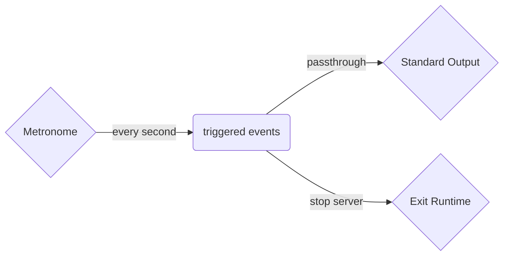

# The `crononome` Connector

The crononome connector generates a periodic flow of events at a configured periodicity
based on the modern Gregorian calendar system.

As the name suggests - the connector is configured using `cron` like schedules and
a user configurable data event provider by authors with the business event which
can be used to trigger downstream processing.

The connector is particularly useful when using transient or persistent state via the
[`kv`](./kv) connector or via the state mechanism to evict and remove `stale` data
that is no longer current or relevant to the running system.

The connector is also useful for driving periodic events when used in concert with
other connectors or pipelines to periodically poll to retrieve meta data updates to
merge with in-memory state in the current solution. 

## Configuration

One or many `cron` like specifications for the event schedule and a user defined data
payload.

```tremor title="config.troy"
define connector crononome from crononome
with
  config = {
    "entries": [{
      "name": "test",                # A symbolic name for this schedule
      "expr": "* * * * * *",         # A cron schedule
      "payload": {"snot": "badger"}  # A user configurable payload value
    }]
  }
end;
```

## Illustrative example

A simple tremor application that issues a single crononome event and uses it to
trigger an exit of the tremor runtime - a common quiescence pattern in our tests
driven by the crononome in this illustration.

A high level summary of this flow's logic:



The application source for this example:

```tremor
define flow main
flow
  use tremor::connectors;
  use integration;
  define connector crononome from crononome
  with
    config = {
      "entries": [{
        "name": "test",
        "expr": "* * * * * *",
        "payload": {"snot": "badger"}
      }]
    }
  end;

  define pipeline main
  pipeline 
    select event.trigger from in into out;
  end;

  define pipeline exit
  pipeline 
    select {
      "exit": 0,
      "delay": 1
    } from in into out;
  end;

  create connector file from integration::write_file;
  create connector crononome;
  create connector exit from connectors::exit;
  create pipeline main;
  create pipeline exit;

  connect /connector/crononome to /pipeline/main;
  connect /connector/crononome to /pipeline/exit;
  connect /pipeline/main to /connector/file;
  connect /pipeline/exit to /connector/exit;
end;
deploy flow main;
```

## Exercises

To further explore the `crononome`:

* Modify the application to stop after N events by introducing a counter
* Modify the application to trigger a HTTP `GET` request and serialize the response to a log file
* Replace the `crononome` with a `crononome` for periodic scheduled calendar driven events
