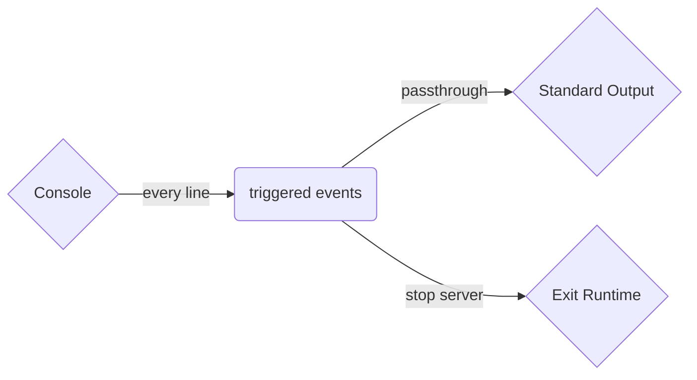

# The `exit` Connector

:::info

This connector is not intended for production use, but for testing the Tremor runtime itself. To enable it pass `--debug-connectors` to tremor.

:::


The `exit` connector generates is a convenience designed for tremor based systems
that need to deterministically stop.

THe connector is particularly useful for integration tests to halt a process when
testing has completed. The connector is also useful for interactive testing when
console redirection is being used to test processing behaviour allowing an "exit"
command to halt the tremor server process.

## Configuration

The connector needs no configuration

```tremor
  define connector stop from exit;
```

## Illustrative example

A simple tremor application that starts and shuts down when an event is
received.

A high level summary of this flow's logic:



The application source for this example:

```tremor title="stopper.troy"
define flow stopper
flow
  use tremor::connectors; # Use predefined console and exit connector definitions
  use tremor::pipelines;  # Use predefined passthrough pipeline definition

  create connector console from connectors::console;
  create connector stop from connectors::exit;
  create pipeline passthrough from pipelines::passthrough;
  
  connect /connector/console to /pipeline/passthrough;
  connect /pipeline/passthrough to /connector/console;
  connect /pipeline/passthrough to /connector/stop;
end;

deploy flow stopper;
```

:::note
Tremor supports a `quiescence` protocol. As we connect our `console` to the
passthrough before the exit connector `stop` - this means our event from the
console's `stdin` flows through the passthrough to `stdout` in the same connector
before the event is passed to the `stop` exit connector instance.

So we should see our event echo'd once.

```shell
$ tremor server run stopper.troy
tremor version: 0.12.0 (RELEASE)
tremor instance: tremor
rd_kafka version: 0x000002ff, 1.8.2
allocator: snmalloc
Listening at: http://0.0.0.0:9898
Beep!
Beep!
```

:::
