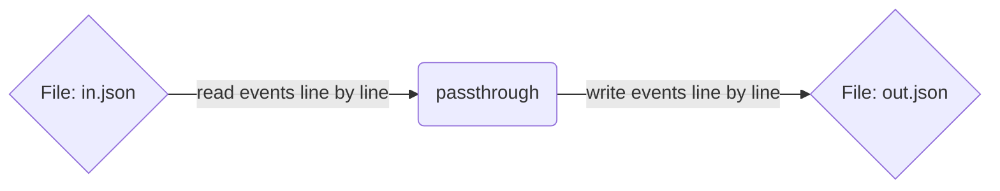

# The `file` Connector

The file connector enables reading and writing to files accessible via the file system.


## Configuration

File based event processint can be read oriented by setting the `mode` configuration
field to `read` or write based by setting the mode to one of:

* `write` or `truncate` - Creates or Opens and truncates the target file
* `append` - Creates or Opens the target file without truncation
* `overwrite` - Creates or Opens without truncation and overwrites existing data

### Reader

An example file reader

```tremor
  define connector in_file from file
  with 
    codec = "json"
    preprocessors = ["separate"], # line by line processing
    config = {
      "path": "in.json",
      "mode": "read",

      # Override the default builtin internal buffer chunk size
      # chunk_size = 8192,
    },
  end;
```

Other useful `codec` options might be `base64`, `string` or `influx`.


### Writer

An example file writer

```tremor
  define connector out_file from file
  with 
    codec = "json-sorted", # Json sorted creates a consistent field order in record types
    postprocessors = ["separate"], # line by line processing
    config = {
      "path": "out.log",
      "mode": "truncate",

      # Override the default builtin internal buffer chunk size
      # chunk_size = 8192,
    },
  end;


## How do I copy files with tremor?



For this use case we need a file reader and writer

```tremor
define flow main
flow  
  use tremor::connectors;
  use integration;

  # we could use the connectors in integration but this is the file integration test
  # so it makes more sense to define them here
  define connector out_file from file
  with 
    codec = "json-sorted", # Json sorted creates a consistent field order in record types
    postprocessors = ["separate"], # line by line processing
    config = {
      "path": "out.log",
      "mode": "truncate"
    },
  end;

  define connector in_file from file
  with 
    codec = "json",
    preprocessors = ["separate"], # line by line processing
    config = {
      "path": "in.json",
      "mode": "read"
    },
  end;

  create connector in_file;
  create connector out_file;
  create connector exit from connectors::exit;
  create pipeline main from integration::out_or_exit;

  connect /connector/in_file to /pipeline/main;
  connect /pipeline/main to /connector/out_file;
  connect /pipeline/main/exit to /connector/exit;
  
end;
deploy flow main;
```

## How do I transform files with tremor?

For example we can read a line delimited JSON file and write it as base64 encoded YAML
by changing our copy example above to use a different file writer configuration:

```tremor
  define connector out_file from file
  with 
    codec = "yaml", 
    postprocessors = ["base64", "separate"], # line by line processing
    config = {
      "path": "out.log",
      "mode": "truncate"
    },
  end;
```

