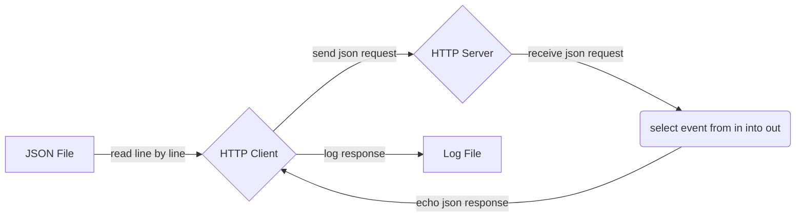

# The `http` Connector

The `http` connector provides integration against the HTTP protocol suite.

## Configuration

### Client

```tremor title="config.troy"
define connector `http-out` from http_client
with
  use std::time::nanos;
  config = {
    # Target URL for this HTTP client
    "url": "http://host:80",

    # Optional Transport Level Security configuration
    # If url schme in `url` is `https` then TLS configuration is required
    # "tls": { ... },

    # Optional authentication method, can be one of
    # * "basic" - basic authentication
    #   ```tremor
    #      "auth": { "basic": { "username": "snot", "password": "badger" } },
    #   ```
    # * "gcp"   - Google Cloud Platform
    #   ```tremor
    #    "auth": "gcp", # See https://cloud.google.com/docs/authentication/getting-started
    #  ```
    # By default, no authentication is used
    # "auth": "none",

    # HTTP method - defaults to `POST`, case insensitive
    # "method": "get",
    
    # Concurrency - number of simultaneous in-flight requests ( defaults to 4 )
    # "concurrency": 4,

    # Request timeout - default is unset ( do not timeout )
    # "timeout": nanos::from_secs(10), # nanoseconds

    # Optional default HTTP headers
    # "headers": { "key": "value", "other-key": ["v1", "v2"] },

    # Custom Mime Codec Map, overrides default `codec`
    # "mime_mapping": {
    #    # key defines the MIME type, value defines codec by name 
    #    "application/json": "json",
    #    "application/yaml": "yaml"
    #    "*/*": "json"               # default codec
    # }
  }
end;
```

### Server

```tremor title="config.troy"
define connector `http-in` from http_server
with
  config = { 
    "url": "http://localhost:8080",

    # Optional Transport Level Security configuration
    # "tls": { ... },

    # Custom Mime Codec Map, overrides default `codec`
    # "mime_mapping": {
    #    # key defines the MIME type, value defines codec by name 
    #    "application/json": "json",
    #    "application/yaml": "yaml"
    #    "*/*": "json"               # default codec
    # }
  }
end;
```

## Codecs

The HTTP connectors are somewhast special as they handle the encoding and decoding based on the content-type header not by a single defined codec.

By default tremor supplies a  mapping of mime-type to it's codecs as part of the base implementation. However it is possible to overwrite this with the `mime_mapping` option.

Once the `mime_mapping` config option is defined it will completely replace the default mappings. To combine the two the `tremor::http::mime_to_codec` constant can be uased as a baseline.

For a "default" mapping the entrey `*/*` as a mime type can be configured and will be used for any mime type not otherwise defined.

## Metadata

The `http` connector supports metadata allowing request and response
protocol metadata to be inspected, checked, and manipulated in advanced
integrations.

Metadata allows context information related to the payload data represented as a value in tremor to be decorated with context from
connectors and operators to control specific behaviours in a running
pipeline.

### Request metadata

Request metadata allows the HTTP method, headers and other other request parameters of the HTTP request to be overridden.

Request metadata can be set for an event

```tremor
let $request = ...
```

The request metadata is applied per request, and should be of `record` type and structured as follows:

```tremor
{
  # Overrides the connector's default method HTTP for this request  
  # -  Setting to an illegal HTTP VERB results in an error
  "method": "GET", 
  # Overrides the endpoint, path and parameters for this request
  # -  Care should be taken where authentication is use
  # -  Setting to a non-http URL results in an error
  "url": "https://some_host:8080/foo/bar/baz?a=b",
  # Overrides the headers for this request, passing through unchanged default headers from configuration
  "headers": { "x-snot": "y-badger", }
}
```

#### Special cases

- If a transfer encoding is specified as `chunked` then chunked transfer encoding will be used for the request transfer
- If a mime type is set, and custom mime codec mappings are provided the
  user supplied matching codec will be applied
- If a mime type is set, and no custom mapping matches, then the configured
  connector codec will be applied, or the `json` default if none is configured.
- If possible the connector will attempt to set an appropriate content type
- If authentication is configured, authentication headers will follow the method supplied to the connector

### Response metadata

Response metadata allows records the response parameters set against a HTTP request that
a response is issued against recording the decisions the `http_server` connector makes
when responding to requests.

The response can be read from the `$response` metadata.

Response metadata takes the following general form:

```tremor
{
  # The HTTP status code
  "status": 200, 
  # Headers
  "headers": { "x-snot": "y-badger", }
  # The HTTP protocol version negotiated
  "version": "1.1",
}
```

### Correlation metadata

Setting the `$correlation` metadata on an outbound request will result in the response
being tagged with the `$correlation` value set in the corresponding request.


## Example implementation

This is a relatively basic client server system that replays JSON formatted lines of data from a text file over HTTP to a server. The
server receives the JSON events and echo's them back to the HTTP client.

The client and server are implemented as tremor flows.

A high level summary of the overall flow:



The complete source and a runnable example can be found in the [http integration test](https://github.com/tremor-rs/tremor-runtime/blob/main/tremor-cli/tests/integration/http/config.troy)