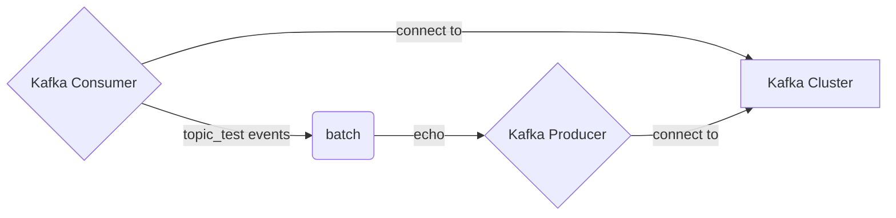

# The Kafka Connectors

The Kafka connectors [`kafka_consumer`](#consumer) and [`kafka_producer`](#producer) provide integration with [Apache Kafka](https://kafka.apache.org/) and compatible
products such as [Confluent Kafka](https://www.confluent.io/) and [Redpanda](https://redpanda.com/). Consuming from Kafka and producing to Kafka are handled by two separate connectors.

Both Kafka connectors in Tremor are built on top of [librdkafka](https://github.com/edenhill/librdkafka) version 1.8.0 and expose the full complement
of [configuration settings](https://github.com/edenhill/librdkafka/blob/v1.8.0/CONFIGURATION.md). Care __SHOULD__ be
taken when configuring `kafka` with tremor to ensure that the configuration settings make sense given the logic
required of the resulting system.

## Consumer


To consume from kafka, one needs to define a connector from `kafka_consumer`. 

### Configuration

It supports the following configuration options:

| Option              | Description                                                                                                                                                                                                                                                   | Type                           | Required | Default Value                                                                                         |
|---------------------|---------------------------------------------------------------------------------------------------------------------------------------------------------------------------------------------------------------------------------------------------------------|--------------------------------|----------|-------------------------------------------------------------------------------------------------------|
| group_id            | The consumer group id to register with to the kafka cluster. Corresponds to the librdkafka `group.id` setting.                                                                                                                                                | string                         | yes      |                                                                                                       |
| topics              | The topics to consumer from.                                                                                                                                                                                                                                  | list of strings                | yes      |                                                                                                       |
| brokers             | URLs to the cluster bootstrap servers to connect to. Corresponds to the librdkafka `bootstrap.servers` setting.                                                                                                                                               | list of strings                | yes      |                                                                                                       |
| rdkafka_options     | librdkafka configuration. For possible options consult the [librdkafka configuration docs](https://github.com/edenhill/librdkafka/blob/v1.8.0/CONFIGURATION.md).                                                                                              | json record with string values | no       | By default, only `group.id`, `client.id` and `bootstrap.servers` is set, but can be overwritten here. |
| retry_failed_events | If set to `true` this connector will reset the consumer offset to the offset of a message corresponding to a failed event, so it will effectively retry this kafka message. Only takes effect if `enable.auto.commit` is set to `false` in `rdkafka_options`. | boolean                        | no       | `false`                                                                                               |

For detailed semantics on how the consumer behaves with which settings, please consult the [librdkafka documentation](https://github.com/edenhill/librdkafka/blob/v1.8.0/CONFIGURATION.md).

Example configuration for `kafka_consumer`:

```tremor title="config.troy"
define connector consumer from kafka_consumer
with
    metrics_interval_s = 1,
    reconnect = {
            "retry": {
                "interval_ms": 3000,
                "max_retries": 10
            }
        },
    codec = "json",
    # Kafka specific consumer configuration
    config = {
        # List of broker bootstrap servers
        "brokers": [
            "127.0.0.1:9092"
        ],
        "group_id": "test1", # Consumer group id

        # required - list of subscription topics to register with
        "topics": [
            "tremor_test"
        ],
        # Whether or not to retry failed attempts
        # When true - resets the offset to a failed message for retry
        #  - Warning: where persistent failure is expected, this will lead to persistent errors
        # When false - Only commits offset for a successful acknowledgement
        "retry_failed_events": false,

        # librdkafka configuration settings ( indicative illustrative example )
        "rdkafka_options": {
            "enable.auto.commit": "false",      # this will only commit a message offset if the event has been handled successfully
            "auto.commit.interval.ms": "5000",  # this will auto-commit the current offset every 5s
            "enable.auto.offset.store": "true", 
            "enable.partition.eof": "false",    # do not send an EOF if a partition becomes empty
            "auto.offset.reset": "beginning",   # always start consuming from the beginning of all partitions
        }
    }
end;
```

### Event Metadata

Events consumed from a `kafka_consumer` connector will have the following event metadata:

```js
{
    "kafka_consumer": {
        "key": ..., # binary message key
        "headers": {
            "kafka_message_header": ..., # binary header value
            ...
        },
        "topic": "my_topic",    # topic name
        "partition": 1,         # numeric parition id of the message
        "offset": 12,           # numeric message offset in the given partition
        "timestamp": 1230000000 # optional message timestamp in nanoseconds           
    }
}
```

It can be accessed in [scripts](../../language/scripts.md) or [`select` statements](../../language/pipelines.md) in the following way:

```tremor
match $ of
    case %{ present kafka_consumer } => $kafka_consumer.partition
    default => -1 # invalid partition
end;
```


## Producer

To produce events as kafka messages, the a connector needs to be defined from the `kafka_producer` connector type.

### Configuration

It supports the following configuration options:

| Option          | Description                                                                                                                                                      | Type                           | Required | Default Value                                               |
|-----------------|------------------------------------------------------------------------------------------------------------------------------------------------------------------|--------------------------------|----------|-------------------------------------------------------------|
| brokers         | URLs to the cluster bootstrap servers to connect to. Corresponds to the librdkafka `bootstrap.servers` setting.                                                  | list of strings                | yes      |                                                             |
| topic           | The topic to produce events to.                                                                                                                                  | string                         | yes      |                                                             |
| key             | The message key to add to the produced kafka messages. Can be overwritten by event metadata value `$kafka_producer.key`.                                         | string                         | no       |                                                             |
| rdkafka_options | librdkafka configuration. For possible options consult the [librdkafka configuration docs](https://github.com/edenhill/librdkafka/blob/v1.8.0/CONFIGURATION.md). | json record with string values | no       | By default only `client.id` and `bootstrap.servers` is set. |

Example configuration for `kafka_producer`:

```tremor
    define connector producer from kafka_producer
    with
        # Enables metrics at a 1 second interval
        metrics_interval_s = 1,
        # event payload is serialized to JSON
        codec = "json",

        # Kafka specific producer configuration
        config = {
	        # List of broker bootstrap servers
            "brokers": [
                "127.0.0.1:9092",
            ],
            # the topic to send to
            "topic": "tremor_test"
        }
    end;
```

### Event Metadata

To control how the `kafka_producer` produces events as kafka messages, the following metadata options are available:

```tremor
let $kafka_producer = {
    "key": "message_key",   # kafka message key as string or bytes
    "headers": {            # message headers  
        "my_bytes_header": <<"badger"/binary>>,
        "my_string_header": "string"
    },
    "timestamp": 12345,     # message timestamp
    "partition": 3          # numeric partition id to publish message on
};
```

:::note

It is important to provide the metadata options underneath the key `kafka_producer`, otherwise they will be ignored.

:::


## Kafka Echo Service example

A complete kafka example echo service that bubbles consumed events to a topic.

In this example both the producer and consumer are connected to the same kafka
cluster and consume from and produce to the same topic.



The actual logic is a little more verbose. However, the basic structure will be similar for
other Kafka `consumer` and `producer` configurations and can be modularised.

```tremor title="config.troy"
# Kafka producer flow
define flow kafka_produce
flow

    use tremor::connectors;
    use tremor::pipelines;
    use integration;

    # Producer Kafka connector
    define connector producer from kafka_producer
    with
        metrics_interval_s = 1,
        reconnect = {
            "retry": {
                "interval_ms": 3000,
                "max_retries": 10
            }
        },
        codec = "json",
        config = {
            "brokers": [
                "127.0.0.1:9092",
            ],
            "topic": "tremor_test",
            "key": "snot"
        }
    end;

    # Producer logic
    define pipeline produce
    pipeline
        use std::time::nanos;

        define script add_kafka_meta
        script
            let $kafka_producer = event.meta;
            emit event["event"]
        end;
        create script add_kafka_meta;

        # Batch events by two or emit after 1 second otherwise
        define operator batch from generic::batch
        with
            count = 2,
            timeout = nanos::from_seconds(1)
        end;
        create operator batch;

        select event from in into add_kafka_meta;

        select event from add_kafka_meta 
        where 
            match event of
              case %{ batch == true } => false
              default => true
            end
        into out;
        select event from add_kafka_meta 
        where 
            match event of 
              case %{ batch == true } => true 
              default => false 
            end 
        into batch;
        select event from add_kafka_meta/err into err;

        select event from batch/err into err;
        select event from batch into out;
    end;
    
    create connector read_file from integration::read_file;
    create connector producer;
    create connector stderr from connectors::console;

    create pipeline passthrough from pipelines::passthrough;
    create pipeline produce from produce;

    connect /connector/read_file to /pipeline/produce;
    connect /connector/read_file/err to /pipeline/passthrough;
    connect /pipeline/produce/out to /connector/producer;
    connect /pipeline/produce/err to /connector/stderr/stderr;
    connect /pipeline/passthrough to /connector/stderr/stderr;

end;

# Kafka consumer flow
define flow kafka_consume
flow
    use tremor::connectors;
    use tremor::pipelines;
    use integration;

    # Consumer Kafka connector
    define connector consumer from kafka_consumer
    with
        metrics_interval_s = 1,
        reconnect = {
                "retry": {
                    "interval_ms": 3000,
                    "max_retries": 10
                }
            },
        codec = "json",
        config = {
                "brokers": [
                    "127.0.0.1:9092"
                ],
                "group_id": "test1",
                "topics": [
                    "tremor_test"
                ],
                "retry_failed_events": false,
                "rdkafka_options": {
                    "enable.auto.commit": "false",
                    "auto.offset.reset": "beginning",
                }
            }
    end;

    define pipeline consume
    into out, exit, err
    pipeline
        define script clean_kafka_meta
        script
            use std::string;
            let $kafka_consumer.key = string::from_utf8_lossy($kafka_consumer.key);
            let $kafka_consumer.timestamp = null;
            event
        end;
        create script clean_kafka_meta;

        select event from in into clean_kafka_meta;
        select {"event": event, "meta": $} from clean_kafka_meta where event != "exit" into out;
        select event from clean_kafka_meta where event == "exit" into exit;
        select event from clean_kafka_meta/err into err;
    end;
    
    create connector exit from integration::exit;
    create connector write_file from integration::write_file;
    create connector consumer;
    create connector stderr from connectors::console;

    create pipeline consume;
    create pipeline passthrough from pipelines::passthrough;

    # main logic
    connect /connector/consumer to /pipeline/consume;
    connect /pipeline/consume/out to /connector/write_file;
    connect /pipeline/consume/exit to /connector/exit;

    # debugging
    connect /connector/consumer/err to /pipeline/passthrough;
    connect /pipeline/consume/err to /connector/stderr/stderr;
    connect /pipeline/passthrough to /connector/stderr/stderr;
end;

deploy flow kafka_produce;
deploy flow kafka_consume;
```


## Exercises

* Modify the example to introduce guaranteed delivery of the tremor logic based on the [wal](./wal) write-ahead log connector
* Use a separate cluster for the consumer and producer
* Modify the `rdkafka_options` configuration to reflect production configuration in your system
* Use `$kafka_consumer.key` metadata from received kafka events
* Use `$kafka_consumer.headers` metadata from received kafka events
* Use `$kafka_consumer.topic` metadata from received kafka events
* Use `$kafka_consumer.partition` metadata from received kafka events
* Use `$kafka_consumer.offset` metadata from received kafka events
* Use `$kafka_consumer.timestamp` metadata from received kafka events
* Set `$kafka_producer.headers` metadata to propagate kafka header metadata
* Set `$kafka_producer.timestamp` metadata to alter timestamp metadata
* Set `$kafka_producer.partition` metadata to alter kafka partition metadata

