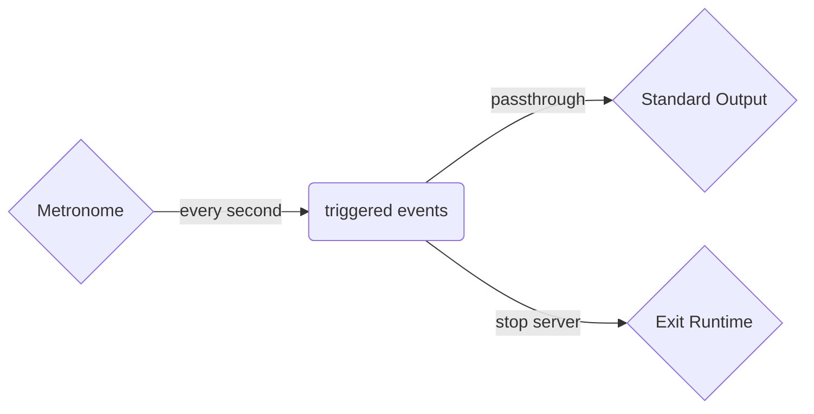

# The `metronome` Connector

The metronome connector generates a periodic flow of events at a configured interval.

The connector is particularly useful when using transient or persistent state via the
[`kv`](./kv) connector or via the state mechanism to evict and remove `stale` data
that is no longer current or relevant to the running system.

The connector is also sueful for driving periodic events when used in concert with
other connectors or pipelines to periodically poll to retrieve meta data updates to
merge with in-memory state in the current solution. 

## Configuration

An `interval` in milliseconds is required to use the metronome

```tremor
  define connector every_second from metronome
  with
     config = {"interval": 1000}
  end;
```

## Illustrative example

A simple tremor application that issues a single metronome event and uses it to
trigger an exit of the tremor runtime - a common quiescence pattern in our tests
driven by the metronome in this illustration.

A high level summary of this flow's logic:



The application source for this example:

```tremor
define flow main
flow
  use tremor::connectors;
  use integration;

  # Define our periodic source of events
  define connector every_second from metronome
  with
    config = {"interval": 1000}
  end;
 
  # Triggered for every periodic event from our metronome 
  define pipeline main
  pipeline
    select "triggered" from in into out;
  end;

  # An `exit` event used in integration tests to stop tremor
  define pipeline exit
  pipeline    
    select { "exit": 0, } from in into out;
  end;

  create connector exit from connectors::exit;
  create connector file from integration::write_file;
  create connector metronome;

  create pipeline main;
  create pipeline exit;

  connect /connector/every_second to /pipeline/main;
  connect /connector/every_second to /pipeline/exit;
  connect /pipeline/main to /connector/file;
  connect /pipeline/exit to /connector/exit;
end;

deploy flow main;
```

## Exercises

To further explore the `metronome`:

* Modify the application to stop after N events by introducing a counter
* Modify the application to trigger a HTTP `GET` request and serialize the response to a log file
* Replace the `metronome` with a `crononome` for periodic scheduled calendar driven events
