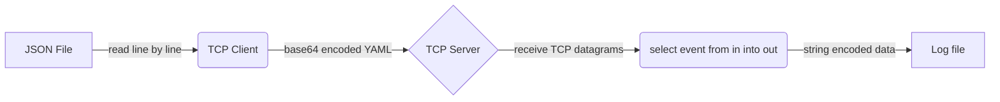
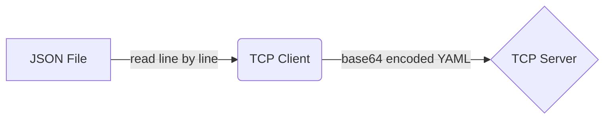
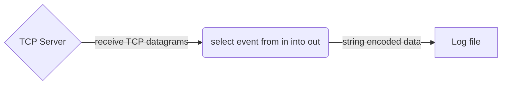

# The TCP Connectors

The [`tcp_server`](#tcp_server) and [`tcp_client`](#tcp_client) connectors allow TCP-based clients and servers to be integrated with tremor.

## `tcp_server`

This connector listens for incoming TCP connections on the host and port configured in `url`. Each connection starts its own stream of events. Each TCP packet is received into a local buffer of `buf_size` bytes, which should be equal or bigger than the maximum expected packet size. Each packet is processed by the configured `preprocessors` and `codec`.

Each event will contain information about the TCP connection it comes from in a metadata record accessible via `$tcp_server`. The record is of the following form:

```js
{
  "tls": true, // boolean, indicating if this connection has tls configured or not
  "peer": {
    "host": "127.0.0.1", // ip of the connection peer
    "port": 443          // port of the connection peer
  }
}
```

When a connection is established and events are received, it is possible to send events to any open connection. In order to achieve this, a pipeline needs to be connected to the `in` port of this connector and send events to it. There are multiple ways to target a certain connection with a specific event:

* Send the event you just received from the `tcp_server` right back to it. It will be able to track the the event to its TCP connection. You can even do this with an aggregate event coming from a select with a window. If an event is the result of events from multiple TCP connections, it will send the event back down to each TCP connection.
* Attach the same metadata you receive on the connection under `$tcp_server` to the event you want to send to that connection.

### Configuration

| Option         | Description                                                                                                 | Type             | Required | Default value                                                                |
|----------------|-------------------------------------------------------------------------------------------------------------|------------------|----------|------------------------------------------------------------------------------|
| url            | Host and port to listen on.                                                                                 | string           | yes      |                                                                              |
| tls            | Optional Transport Level Security configuration. See [TLS configuration](./common_configuration.md#server). | record           | no       | No TLS configured.                                                           |
| buf_size       | TCP receive buffer size. This should be greater than or equal to the expected maximum packet size.          | positive integer | no       | 8192                                                                         |
| backlog        | The maximum size of the queue of pending connections not yet `accept`ed.                                    | positive integer | no       | 128                                                                          |
| socket_options | See [TCP socket options](./common_configuration.md#tcp-socket-options).                                     | record           | no       | See [TCP socket options defaults](./common_configuration#tcp-socket-options) |

Example:

```tremor title="config.troy"
define connector `tcp-in` from tcp_server
with
  codec = "string",
  config = { 
    "url": "localhost:4242",
    "socket_options": {
      # tweaking the Nagle alhorithm, true by default
      "TCP_NODELAY": false,
      # enable multiple tcp servers sharing the same port
      "SO_REUSEPORT": true
    },
    # Optional Transport Level Security configuration
    # "tls" = { ... }

    # Data buffer size ( default: 8K, limits maximum message size )
    # "buf_size" = "16K",
  }
end;
```


## `tcp_client`

This connector establishes and maintains one TCP connection to the host and port configured in `url`.
Every event this connector receives via its `in` port will be sent to that connection. 
It will emit events for the data it receives on that connection on the `out` port of this connector. Emitted events contain information about the TCP connection they originate from in the metadata available via `$tcp_client`. It is a record of the following form:

```js
{
  "tls": false, // whether or not TLS is configured on the connection
  "peer": {
    "host": "::1", // ip address of the connection peer
    "port": 12345  // port of the connection peer
  }
}
```

### Configuration

| Option         | Description                                                                                                 | Type              | Required | Default value                                                                |
|----------------|-------------------------------------------------------------------------------------------------------------|-------------------|----------|------------------------------------------------------------------------------|
| url            | Host and port to connect to.                                                                                | string            | yes      |                                                                              |
| tls            | Optional Transport Level Security configuration. See [TLS configuration](./common_configuration.md#client). | record or boolean | no       | No TLS configured.                                                           |
| buf_size       | TCP receive buffer size. This should be greater than or equal to the expected maximum packet size.          | positive integer  | no       | 8192                                                                         |
| socket_options | See [TCP socket options](./common_configuration.md#tcp-socket-options).                                     | record            | no       | See [TCP socket options defaults](./common_configuration#tcp-socket-options) |


Example:

```tremor title="config.troy"
define connector `tcp-out` from tcp_client
with
  codec = "yaml",
  postprocessors = ["base64"],
  config = {
    "url": "localhost:4242",

    # Optional Transport Level Security configuration
    # "tls" = { ... },

    # Data buffer size ( default: 8K, limits maximum message size )
    # "buf_size" = "16_000",
  }
end;
```


## Example

This is a relatively simple client server system that replays JSON formatted lines of data
from a text file over TCP to a server. The JSON data is transformed to `base64` encoded YAML
before sending to the TCP server. The server receives TCP datagrams and writes them to a
log file encoding the log entries as naked string data.

The client and server are implemented as treomr flows.

A high level summary of the overall flow:



### JSON file over TCP as base64 encoded YAML

A tremor flow that consumes JSON formatted data line by line
from a file and sends each event as a `base64` encoded YAML formatted
event via TCP to a TCP service.

High level flow summary:



In deployable form

```tremor title="config.troy"
define flow main
flow
  use tremor::connectors;
  use integration;


  define connector in from file
  with codec = "json",
    preprocessors = ["separate"],
    config = {
        "path": "in.json",
        "mode": "read"
    }
  end;

  define connector `tcp-out` from tcp_client
  with
    codec = "yaml",
    postprocessors = ["base64"],
    config = {
      "url": "localhost:4242",
    }
  end;
  
  create pipeline main from integration::out_or_exit;
  create connector in;
  create connector `tcp-out`;
  create connector exit from connectors::exit;

  connect /connector/in/out to /pipeline/main/in;
  connect /pipeline/main/out to /connector/`tcp-out`/in;
  connect /pipeline/main/exit to /connector/exit/in;
end;

deploy flow main;
```

### TCP server that logs base64 encoded YAML as one string per line to a file

A tremor flow that consumes TCP datagram events and writes them
to a file encoding as raw strings.

High level flow summary:




```tremor title="config.troy"
define flow server
flow
  use integration;
  use tremor::pipelines;
  use tremor::connectors;

  define connector tcp_server from tcp_server
  with
    preprocessors = ["separate"],
    postprocessors = ["separate"],
    codec = "json",
    config = {
      "url": "0.0.0.0:65535",
      "buf_size": 1024,
    }
  end;

  create connector server_out from integration::write_file
  with
    file = "server_out.log"
  end;
  create connector stdio from connectors::console;
  create connector tcp_server;

  create pipeline server_side from pipelines::passthrough;
  create pipeline debug from pipelines::passthrough;

  # flow from tcp_server to file
  connect /connector/tcp_server to /pipeline/server_side;
  connect /connector/tcp_server/err to /pipeline/debug;
  connect /pipeline/server_side to /connector/server_out;

  # aaaand echo it back
  connect /pipeline/server_side to /connector/tcp_server;

  # debugging
  connect /pipeline/debug to /connector/stdio;
end;

define flow client
flow
  use integration;
  use tremor::pipelines;
  use tremor::connectors;

  define connector tcp_client from tcp_client
  with
    preprocessors = ["separate"],
    postprocessors = ["separate"],
    codec = "json",
    config = {
      "url": "127.0.0.1:65535",
      "no_delay": false,
      "buf_size": 1024,
    },
    reconnect = {
      "retry": {
        "interval_ms": 100,
        "growth_rate": 2,
        "max_retries": 3,
      }
    }
  end;

  create connector in from integration::read_file;
  create connector client_out from integration::write_file
  with
    file = "client_out.log"
  end;
  create connector exit from integration::exit;
  create connector stdio from connectors::console;
  create connector tcp_client;

  create pipeline to_client from pipelines::passthrough;
  create pipeline from_client from integration::out_or_exit;
  create pipeline debug from pipelines::passthrough;

  connect /connector/in to /pipeline/to_client;
  connect /connector/in/err to /pipeline/debug;
  connect /pipeline/to_client to /connector/tcp_client;

  # send out any responses to the client to file `client_out.log`
  connect /connector/tcp_client to /pipeline/from_client;
  connect /connector/tcp_client/err to /pipeline/debug;
  connect /pipeline/from_client/out to /connector/client_out;
  connect /pipeline/from_client/exit to /connector/exit;

  # debugging
  connect /pipeline/debug to /connector/stdio;

end;

deploy flow server;
deploy flow client;
```

## Notes

### Running as an integration test

This is how we run this test sceanario within our integration test suite.

```bash
$ export TREMOR_PATH=/path/to/tremor-runtime/tremor-script/lib:/path/to/tremor-runtime/tremor-cli/tests/lib
$ tremor test integration .
```

### Running as long running service

The logic can be used as starting point for your own client or service via `tremor server run`.

```bash
$ export TREMOR_PATH=/path/to/tremor-runtime/tremor-script/lib:/path/to/tremor-runtime/tremor-cli/tests/lib
$ tremor server run config.troy
```

### Running as a long running service, with pretty printed JSON output

During development, pretty printing the JSON output on standard output might be useful.

We typically use the wonderful [`jq`](https://stedolan.github.io/jq/) for this purpose

```bash
$ export TREMOR_PATH=/path/to/tremor-runtime/tremor-script/lib:/path/to/tremor-runtime/tremor-cli/tests/lib
$ tremor server run config.troy | jq
```

### Exercises

* Modularise the solution allowing the following combinations
  * Deploy the client and server in separate tremor instances
  * Deploy the client and server in a single tremor instance
  * Use the `msgpack` codec instead of `base64` encoded YAML
  * Unpack the `base64` encoded YAML and write to a log file as line-delimited JSON
  * Add compression and decmopression


