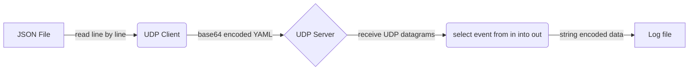
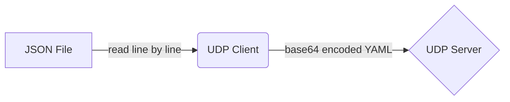
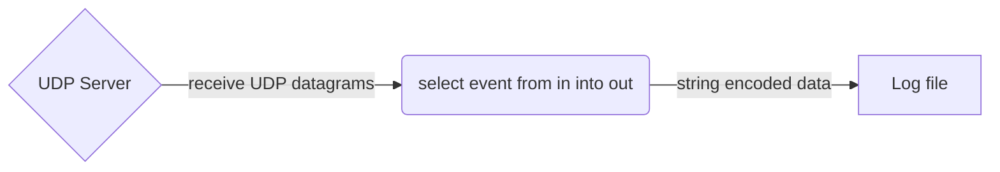

# The `udp` Connector

The `udp` connector allows UDP based datagram clients and servers to be integrated with tremor.

## Configuration

### Client

```tremor title="config.troy"
define connector `udp-out` from udp_client
with
  codec = "yaml",
  postprocessors = ["base64"],
  config = {
    "url": "localhost:4242",
  }
end;
```

### Server

```tremor title="config.troy"
define connector `udp-in` from udp_server
with
  codec = "string",
  config = { 
    "url": "localhost:4242",
  }
end;
```

## UDP configuration example

This is a relatively simple client server system that replays JSON formatted lines of data
from a text file over UDP to a server. The JSON data is transformed to base64 encoded YAML
before sending to the UDP server. The server receives UDP datagrams and writes them to a
log file encoding the log entries as naked string data.

The client and server are implemented as treomr flows.

A high level summary of the overall flow:



### JSON file over UDP as base64 encoded YAML

A tremor flow that consumes JSON formatted data line by line
from a file and sends each event as a base64 encoded YAML formatted
event via UDP to a UDP service.

High level flow summary:



In deployable form

```tremor title="config.troy"
define flow main
flow
  use tremor::connectors;
  use integration;


  define connector in from file
  with codec = "json",
    preprocessors = ["lines"],
    config = {
        "path": "in.json",
        "mode": "read"
    }
  end;

  define connector `udp-out` from udp_client
  with
    codec = "yaml",
    postprocessors = ["base64"],
    config = {
      "url": "localhost:4242",
    }
  end;
  
  create pipeline main from integration::out_or_exit;
  create connector in;
  create connector `udp-out`;
  create connector exit from connectors::exit;

  connect /connector/in/out to /pipeline/main/in;
  connect /pipeline/main/out to /connector/`udp-out`/in;
  connect /pipeline/main/exit to /connector/exit/in;
end;

deploy flow main;
```

### UDP server that logs base64 encoded YAML as one string per line to a file

A tremor flow that consumes UDP datagram events and writes them
to a file encoding as raw strings.

High level flow summary:




```tremor title="config.troy"
define flow main
flow
  use tremor::connectors;
  use integration;
  
  # Encapsulate a UDP server that processes datagrams as strings
  define connector `udp-in` from udp_server
  with
    codec = "string",
    config = { 
      "url": "localhost:4242",
    }
  end;

  # Encapsualte a file based sink that stores events per line as a string
  define connector out from file
  with
    codec = "string",
    postprocessors = ["lines"],
    config = {
      "path": "../gen.log",
      "mode": "truncate"
    }
  end;


  create pipeline main from integration::out_or_exit;
  create connector `udp-in`;
  create connector debug from connectors::console;
  create connector exit from connectors::exit;
  create connector out;

  connect /connector/`udp-in` to /pipeline/main/in;
  connect /pipeline/main/out to /connector/out;
  connect /pipeline/main/out to /connector/debug;
  connect /pipeline/main/exit to /connector/exit/in;
end;

deploy flow main;
```

## Notes

### Running as an integration test

This is how we run this test sceanario within our integration test suite.

```bash
$ export TREMOR_PATH=/path/to/tremor-runtime/tremor-script/lib:/path/to/tremor-runtime/tremor-cli/tests/lib
$ tremor test integration .
```

### Running as long running service

The logic can be used as starting point for your own client or service via `tremor server run`.

```bash
$ export TREMOR_PATH=/path/to/tremor-runtime/tremor-script/lib:/path/to/tremor-runtime/tremor-cli/tests/lib
$ tremor server run config.troy
```

### Running as a long running service, with pretty printed JSON output

During development, pretty printing the JSON output on standard output might be useful.

We typically use the wonderful [`jq`](https://stedolan.github.io/jq/) for this purpose

```bash
$ export TREMOR_PATH=/path/to/tremor-runtime/tremor-script/lib:/path/to/tremor-runtime/tremor-cli/tests/lib
$ tremor server run config.troy | jq
```

### Exercises

* Modularise the solution allowing the following combinations
  * Deploy the client and server in separate tremor instances
  * Deploy the client and server in a single tremor instance
  * Use the `msgpack` codec instead of `base64` encoded YAML
  * Unpack the `base64` encoded YAML and write to a log file as line-delimited JSON
  * Add compression and decmopression


