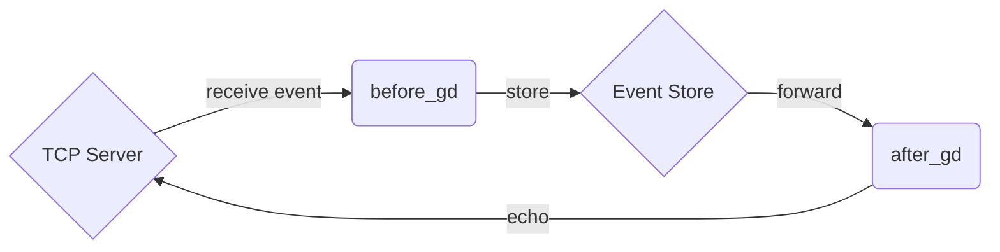

# The `wal` Connector

The `wal` connector provides a write-ahead log implementation for use with transactional streams
to deliver guaranteed delivery between a source and a downstream connected target system.

The connector detects and responds to circuit breaker and event acknowledgements to provide the
guarantee of delivery through a persistent write ahead log it maintains and updates for each
user event it sees.

## Configuration

```tremor
define connector my_wal from wal
with
  "config": {
    # required - directory where WAL storage is configured
    "path" = "state",

    # Maximum chunk size in bytes
    "chunk_size" = 1024,

    # Retention based on maximum number of chunks
    "max_chunks" = 100,
  }
end;
```


## How do I configure a recoverable TCP server?

In this example we modify the `server` flow from the [TCP](./tcp) connector reference
echo server and introduce the `wal` for persistence of events.



We replace the `pipelines::passthrough` stage in the original flow with an
inbound passthrough before the write-ahead log persistance and after rewiring
the flow accordingly.

The reconfigured flow for the `server` definition now looks as follows:

```tremor
define flow server
flow
  use integration;
  use tremor::pipelines;
  use tremor::connectors;

  define connector tcp_server from tcp_server
  with
    preprocessors = ["separate"],
    postprocessors = ["separate"],
    codec = "json",
    config = {
      "url": "0.0.0.0:65535",
      "buf_size": 1024,
    }
  end;

  # Configure the WAL with a `state` directory for indexed persisted events in an
  # isntance of a write-ahead-log with retention for up to 100 events of no more
  # than 1K in data size
  define connector my_wal from wal
  with
    config = {
      "path": "server_state",
      "chunk_size":  1024,
      "max_chunks": 100,
    }
  end;

  create connector server_out from integration::write_file
  with
    file = "server_out.log"
  end;
  create connector stdio from connectors::console;
  create connector tcp_server;

  # Create an instance of our wal in the `server` flow
  create connector wal from my_wal;

  # Process events through our WAL
  create pipeline before_gd from pipelines::passthrough;
  create pipeline gd from pipelines::passthrough;
  create pipeline after_gd from pipelines::passthrough;

  create pipeline debug from pipelines::passthrough;

  # flow from tcp_server to file
  connect /connector/tcp_server to /pipeline/before_gd;
  connect /pipeline/before_gd to /connector/wal;
  connect /connector/wal to /pipeline/after_gd;
  connect /connector/tcp_server/err to /pipeline/debug;
  connect /pipeline/after_gd to /connector/server_out;

  # aaaand echo it back
  connect /pipeline/after_gd to /connector/tcp_server;

  # debugging
  connect /pipeline/debug to /connector/stdio;
end;

define flow client
flow
  # unchanged ...
end;

deploy flow server;
deploy flow client;
```

## Exercises

* Split the [TCP](./tcp) flow into separately deployable client `client.troy` and server `server.troy` flows
   * Change the server flow as above
   * Add a client state folder ( `mkdir client_state` ) and add the WAL to the client state
* Replace the client flow with a metronome producing events periodically
   * Arbitrarily stop the client and server
* Modify other flows to use the `wal` connector and test recovery despite failure of upstream and downstream connectors
  or restarts of the `tremor` processes
* Use a `best effort` connector like the [UDP](./udp) connector to test the limits of guaranteed delivery
* Use a high quality transactional connector like [Kafka](./kafka) to test the upper limits of guaranteed delivery

## Notes

Recovery __WILL__ ordinarily result in duplicate events. Investigate strategies for de-duplicating events and be aware
of this behaviour when designing systems that leverage guaranteed delivery.


