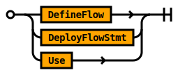
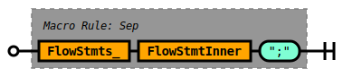

# Deploy Grammar

## Rule Deploy

The `Deploy` rule defines the logical entry point into Tremor's command
oriented deployment syntax. The deployment grammar defines units of
deployment that the runtime manages on behalf of users.

The grammar embeds the statement oriented query syntax and expression
oriented scripting syntax where appropriate.

A legal deployment is composed of:
* An optional set of module comments
* A sequence of top level expressions. There must be at least one defined.
* An optional end of stream token.

At least one *deploy* command.


```ebnf
rule Deploy ::=
    ConfigDirectives ModComment DeployStmts 
  | ModComment DeployStmts 
  ;

```


```troy
define flow test
flow
  define connector metronome from metronome
  with
    config = {
      "interval": 1
    }
  end;
  define connector exit from exit;
  define pipeline identity
  args
    snot = "badger",
  pipeline
    select args.snot from in into out;
  end;
  create connector metronome;
  create connector exit;
  create pipeline identity with
    snot = "snot"
  end;
  connect /connector/metronome to /pipeline/identity;
  connect /pipeline/identity to /connector/exit;
end;

deploy flow test
```


## Rule ConfigDirectives

The `ConfigDirectives` rule allows line delimited compiler, interpreter or
runtime hints to be specified.


```ebnf
rule ConfigDirectives ::=
    ConfigDirective ConfigDirectives 
  | ConfigDirective 
  ;

```


<!-- Added to avoid `lint` warnings from the lalrpop docgen tool. No epilog content needed for this rule -->

See `ConfigDirective` for supported directives.


## Rule ModComment

The `ModComment` rule specifies module comments in tremor.

Documentation comments for modules are optional.

A module documentation comment begins with a `###` triple-hash and they are line delimited.

Muliple successive comments are coalesced together to form a complete comment.

The content of a module documentation comment is markdown syntax.


```ebnf
rule ModComment ::=
    ( ModComment_ ) ?  
  ;

```


### Example

Module level comments are used throughout the tremor standard library
and used as part of our document generation process.

Here is a modified snippet from the standard library to illustrate

```tremor
### The tremor language standard library it provides the following modules:
###
### * [array](std/array.md) - functions to deal with arrays (`[]`)
### * [base64](std/base64.md) - functions for base64 en and decoding
### * [binary](std/base64.md) - functions to deal with binary data (`<< 1, 2, 3 >>`)
### * [float](std/float.md) - functions to deal with floating point numbers
### * [integer](std/integer.md) - functions to deal with integer numbers
### * [json](std/json.md) - functions to deal with JSON
...
```


## Rule DeployStmts

The `DeployStmts` rule defines the statements that are legal in a deployment
module.

Statements in a deployment modules are `;` semi-colon delimited.

There MUST be at least one.

There MAY be more than one.


```ebnf
rule DeployStmts ::=
    DeployStmt  ';' DeployStmts 
  | DeployStmt  ';' ?  
  ;

```


<!-- Added to avoid `lint` warnings from the lalrpop docgen tool. No epilog content needed for this rule -->


## Rule DeployStmt

The `DeployStmt` rule constrains the statements that are legal in a `.troy` deployment module.

Importing modules via the `use` clause is allowed.

Flow definitions and `deploy` commands are allowed.




```ebnf
rule DeployStmt ::=
    DefineFlow 
  | DeployFlowStmt 
  | Use 
  ;

```


<!-- Added to avoid `lint` warnings from the lalrpop docgen tool. No epilog content needed for this rule -->


## Rule DefineFlow

The `DefineFlow` rule defines a flow.

A flow is a runtime artefact that informs tremor how to interconnect and launch
instances of pipelines and connectors.

A flow can define or use multiple in scope and already define pipelines and
connectors and interconnect their streams together.


```ebnf
rule DefineFlow ::=
    DocComment  'define'  'flow' Ident DefinitionArgs  'flow' FlowStmts  'end' 
  ;

```


```troy
define flow test
flow
  define connector metronome from metronome
  with
    config = {
      "interval": 1
    }
  end;
  define connector exit from exit;
  define pipeline identity
  args
    snot = "badger",
  pipeline
    select args.snot from in into out;
  end;
  create connector metronome;
  create connector exit;
  create pipeline identity;
  connect /connector/metronome to /pipeline/identity;
  connect /pipeline/identity to /connector/exit;
end;

deploy flow test
```

A flow definition is a runnable or executable streaming program that describes
the connectivity, the logic and how they are interconnected. A deploy statement
is responsible for the actual deployment.


## Rule DeployFlowStmt

The `DeployFlowStmt` rule defines the content of a command to tremor
to deploy a flow.

The flows can be re-parameterized through overriding the default
parameters set in their originating source definitions via a `with`
clause.


```ebnf
rule DeployFlowStmt ::=
    DocComment  'deploy'  'flow' Ident  'from' ModularTarget CreationWithEnd 
  | DocComment  'deploy'  'flow' Ident CreationWithEnd 
  ;

```


```troy
define flow test
flow
  define connector metronome from metronome
  with
    config = {
      "interval": 1
    }
  end;
  define connector exit from exit;
  define pipeline identity
  pipeline
    select event from in into out;
  end;
  create connector metronome;
  create connector exit;
  create pipeline identity;
  connect /connector/metronome to /pipeline/identity;
  connect /pipeline/identity to /connector/exit;
end;

# The `deploy` statements commands tremor to instanciate the flow `test` - the flow in turn
# will result in a metronome, exit connector, pipeline to be started and interconnected as
# per the `test` definition above
deploy flow test
```


## Rule Use

Imports definitions from an external source for use in the current source file.

The contents of a source file form a module.

### TREMOR_PATH

The `TREMOR_PATH` environment path variable is a `:` delimited set of paths.

Each path is an absolute or relative path to a directory.

When using relative paths - these are relative to the working directory where the
`tremor` executable is executed from.

The tremor standard library MUST be added to the path to be accessible to scripts.


```ebnf
rule Use ::=
     'use' ModularTarget 
  |  'use' ModularTarget  'as' Ident 
  ;

```


### Modules

Modules can be scripts. Scripts can store function and constant definitions.

Scripts are stored in `.tremor` files.

Modules can be queries. Queries can store window, pipeline, script and operator definitions.

Scripts are stored in `.trickle` files.

Modules can be deployments. Deployments can store connector, pipeline and flow definitions.

Deployments are stored in `.troy` files.

#### Conditioning

Modules in tremor are resolved via the `TREMOR_PATH` environment variable. The variable can
refer to multiple directory paths, each separated by a `:` colon. The relative directory
structure and base file name of the source file form the relative module path.

### Constraints

It is not recommended to have overlapping or shared directories across the set of paths
provided in the tremor path.

It is not recommended to have multiple definitions mapping to the same identifier.


## Rule DocComment

The `DocComment` rule specifies documentation comments in tremor.

Documentation comments are optional.

A documentation comment begins with a `##` double-hash and they are line delimited.

Muliple successive comments are coalesced together to form a complete comment.

The content of a documentation comment is markdown syntax.


```ebnf
rule DocComment ::=
    ( DocComment_ ) ?  
  ;

```


### Example

Documentation level comments are used throughout the tremor standard library
and used as part of our document generation process.

Here is a modified snippet from the standard library to illustrate

```tremor
## Returns the instance of tremor.
##
## Returns a `string`
intrinsic fn instance() as system::instance;
...
```

This is a builtin function implemented in rust and used in a script as follows:

```tremor
use tremor::system;

system::instance()
```


## Rule Ident

An `Ident` is an identifier - a user defined name for a tremor value.


```ebnf
rule Ident ::=
     '<ident>' 
  ;

```


### Examples of identifiers

```tremor
let snot = { "snot": "badger" };
```

### Keyword escaping

Surrounding an identifier with a tick '`' allows keywords in tremor's DSLs to be
escaped

```tremor
let `let` = 1234.5;
```

### Emoji

You can even use emoji as identifiers via the escaping mechanism.

```tremor
let `🚀` = "rocket";
```

But we cannot think of any good reason to do so!


## Rule ModularTarget

A `ModularTarget` indexes into tremor's module path.

In tremor a `module` is a file on the file system.

A `module` is also a unit of compilation.

A `ModularTarget` is a `::` double-colon delimited set of identifiers.

Leading `::` are not supported in a modular target..

Trailing `::` are not supported in a modular target.


```ebnf
rule ModularTarget ::=
    Ident 
  | ModPath  '::' Ident 
  ;

```


### Examples

#### Loading and using a builtin function
```tremor
# Load the base64 utilities
use std::base64;

# Base64 encode the current `event`.
base64::encode(event)
```

#### Loading and using a builtin function with an alias

```tremor
# Load the base64 utilities
use std::base64 as snot;

# Base64 encode the current `event`.
snot::encode(event)
```


## Rule CreationWithEnd

The `CreationWithEnd` rule defines a `with` block of expressions with a terminal `end` keyword.


```ebnf
rule CreationWithEnd ::=
    WithEndClause 
  | 
  ;

```


```tremor
with x = y end
```


## Rule ConnectorKind

The `ConnectorKind` rule identifies a builtin connector in tremor.

Connectors in tremor are provided by the runtime and builtin. They can be resolved
through an identifier. 

### Examples

The `http_server` identifies a HTTP server connector.

The `metronome` identifies a periodic metronome.


```ebnf
rule ConnectorKind ::=
    Ident 
  ;

```


The name of a builtin connector implemented in rust provided by the tremor runtime.


## Rule FlowStmts

The `FlowStmts` rule defines a mandatory `;` semi-colon delimited sequence of `FlowStmtInner` rules.


```ebnf
rule FlowStmts ::=
    FlowStmts_ 
  ;

```


<!-- Added to avoid `lint` warnings from the lalrpop docgen tool. No epilog content needed for this rule -->


## Rule FlowStmts_

The `FlowStmts_` rule defines a `;` semi-colon delimited sequence of `FlowStmtInner` rules.




```ebnf
rule FlowStmts_ ::=
    Sep!(FlowStmts_, FlowStmtInner, ";") 
  ;

```


See `FlowStmts` rule for details.

This rule wraps away a lalrpop macro call for ease of reference in other rules in the grammar source.


## Rule FlowStmtInner

The `FlowStmtInner` rule defines the body of a flow definition.


```ebnf
rule FlowStmtInner ::=
    Define 
  | Create 
  | Connect 
  | Use 
  ;

```


* A pipeline or connector definition 
* A pipeline or connector instance via `create`
* A `use` statement to import a definition
* A `connect` statement to interlink instances


## Rule CreateKind

The `CreateKind` rule encapsulates the artefact types that can be created in the tremor deploymant language.


```ebnf
rule CreateKind ::=
     'connector' 
  |  'pipeline' 
  ;

```


An internal rule that allows connectors and pipelines to be created and used by the `Create` rule.


## Rule Define

The `Define` rule allows connectors and pipelines to be specified.


```ebnf
rule Define ::=
    DefinePipeline 
  | DefineConnector 
  ;

```


Within a flow definition, allows pipeline and connectors to be defined.


## Rule Create

The `Create` rule creates instances of connectors and pipelines in a flow.


```ebnf
rule Create ::=
     'create' CreateKind Ident  'from' ModularTarget CreationWithEnd 
  |  'create' CreateKind Ident CreationWithEnd 
  ;

```


### Create a connector

```troy
create connector foo from snot::foo end;
```

### Create a pipeline

```troy
create pipeline bar from badger::bar end;
```


## Rule Connect

The `Connect` rule defines routes between connectors and pipelines running in a flow.


```ebnf
rule Connect ::=
     'connect'  '/' ConnectFromConnector  'to'  '/' ConnectToPipeline 
  |  'connect'  '/' ConnectFromPipeline  'to'  '/' ConnectToConnector 
  |  'connect'  '/' ConnectFromPipeline  'to'  '/' ConnectToPipeline 
  ;

```


### Defines how to interconnect pipeline and connectors

Given

```troy
create connector ingest;
create connector egress;
create pipeline logic;

connect /connector/ingress/out to /pipeline/logic/in;
connect /pipeline/logic/out to  /connector/egress/in;
```

Defines how the `ingress`, `egress` and `logic` runtime instances
are interconnected for data to flow through them in a specified
order.


## Rule DefinePipeline

The `DefinePipeline` rule creates a named pipeline.

A pipeline is a query operation composed using the query langauge DSL
instead of a builtin operation provided by tremor written in the rust
programming language.

The named pipeline can be parameterized and instanciated via the `CreatePipeline` rule


```ebnf
rule DefinePipeline ::=
    DocComment  'define'  'pipeline' Ident (  'from' Ports ) ?  (  'into' Ports ) ?  DefinitionArgs Pipeline 
  ;

```


```troy
define pipeline identity
pipeline
  select event from in into out;
end;
```


## Rule DefineConnector

The `DefineConnector` rule defines a connector.

A connector is a runtime artefact that allows tremor to connect to the outside
world, or for the outside connector to connect to tremor to send and/or receive
data.

The named connector can be parameterized and instanciated via the `Create` rule


```ebnf
rule DefineConnector ::=
    DocComment  'define'  'connector' Ident  'from' ConnectorKind ArgsWithEnd 
  ;

```


```troy
define connector metronome from metronome
  with
    config = {
      "interval": 1
    }
end;
```

Define user defind connector `metronome` from the builtin `metronome` connector
using a 1 second periodicity interval.

```troy
define connector exit from exit;
```

Define user dfeind connector `exit` from the builtin `exit` connector
with no arguments specified.


## Rule ConnectFromConnector

The `ConnectFromConnector` rule defines a route from a connector instance.


```ebnf
rule ConnectFromConnector ::=
     'connector'  '/' Ident MaybePort 
  ;

```


```tremor
connector/console/out
```

Connection from the `console` connector definition via the standard `out` port.

```tremor
connector/console
```

The shorthand form where the standard `out` port is implied can also be used.


## Rule ConnectToPipeline

The `ConnectToPipeline` rule defines route to a pipeline instance.


```ebnf
rule ConnectToPipeline ::=
     'pipeline'  '/' Ident MaybePort 
  ;

```


```tremor
pipeline/filter/in
```

Connection to the `filter` pipeline definition via the standard `in` port.

```tremor
pipeline/console
```

The shorthand form where the standard `in` port is implied can also be used.


## Rule ConnectFromPipeline

The `ConnectFromPipeline` rule defines route from a pipeline instance.


```ebnf
rule ConnectFromPipeline ::=
     'pipeline'  '/' Ident MaybePort 
  ;

```


```tremor
pipeline/filter/out
```

Connection from the `filter` pipeline definition via the standard `out` port.

```tremor
pipeline/console
```

The shorthand form where the standard `out` port is implied can also be used.


## Rule ConnectToConnector

The `ConnectToConnector` rule defines a route to a connector instance.


```ebnf
rule ConnectToConnector ::=
     'connector'  '/' Ident MaybePort 
  ;

```


```tremor
connector/console/in
```

Connection to the `console` connector definition via the standard `in` port.

```tremor
connector/console
```

The shorthand form where the standard `in` port is implied can also be used.


## Rule MaybePort

The `MaybePort` rule defines an optional `Port`.


```ebnf
rule MaybePort ::=
    (  '/' Ident ) ?  
  ;

```


When interconnecting pipelines and connectors in flow definitions
default ports can be inferred by the tremor runtime.

When an alternate port is required, the port specification can be
used to explicitly select from available inbound or outbound ports.


## Rule ArgsWithEnd

The `ArgsWithEnd` rule defines an arguments block with an `end` block.


```ebnf
rule ArgsWithEnd ::=
    ArgsClause ?  WithEndClause 
  | 
  ;

```


An internal rule that defines an optional `args` block with and optional `end` token.

This rule is used and shared in other rules as part of their definitions.


## Rule DefinitionArgs

The `DefinitionArgs` rule defines an arguments block without an `end` block.


```ebnf
rule DefinitionArgs ::=
    ArgsClause ?  
  ;

```


An optional argument block

```tremor
args arg1, arg 2
```

This is a shared internal rule used in other rules as part of their definition.


