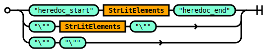
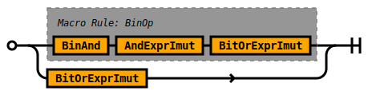
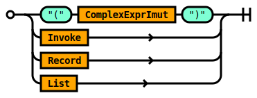

# Script Grammar

## Rule Script

The `Script` rule defines the logical entry point into Tremor's expression
oriented scripting language. The scripting langauge can be embedded into
queries via the `script` operator. The scripting language is also used to
specify configuration of connectors, pipelines, flows, and operators in
the query language.

A legal script is composed of:
* An optional set of module comments
* A sequence of top level expressions. There must be at least one defined.
* An optional end of stream token


```ebnf
rule Script ::=
    ModComment TopLevelExprs  '<end-of-stream>' ?  
  ;

```


### Type system

Tremor supports a data oriented or value based type system with a syntax
that is backwards compatible with JSON.

Any well-formed and legal JSON document is a valid literal in tremor.

Tremor literals for `null`, `boolean`, `string` ( utf-8 ), integer ( 64-bit unsigned ),
 float ( 64-bit ieee ), arrays, and records are equivalent to their JSON counterparts.

Tremor also supports a binary literal for transporting and processing opaque binary data.

### Asymmetric

JSON literals are valid tremor value literals.

Tremor literals MAY NOT always be valid JSON literal.


```tremor
# The following literal is valid JSON and valid Tremor
[1, "snot", {}];

# The following literal is valid in tremor only
[1, "snot", {}, << data/binary >>, ];
```

Tremor supports comments, JSON does not.
Tremor supports trailing commas in arrays and records, JSON does not.
Tremor supports binary literal data, JSON does not.

Note: By default, most connectors in tremor serialize to and from `json` via a codec. The
type system in tremor however is agnostic to the wire format of data that flows through
tremor. So data originate as `json`, as `msgpack`.

### Computations

Tremor also supports a rich expression language with the same support for additive, mutliplicate,
comparitive, and logical unary and binary expressions as languages like `rust` and `java`.

As most of the data that flows through tremor is heirarchically structured or JSON-like tremor
also has rich primitives for structural pattern matching, structural comprehension or iterating
over data structures.

### Loops

Tremor does not support `while` `loop` or other primitives that can loop, recurse or iterate
indefinitely.

In an event based system, events are streaming continuously - so infinite loops that can block
streams from making forward progress are considered harmful.

There are no loops.

We do support iteration over finite arrays.

We do support depth-limited tail recursive functional programming.

### Expression oriented

The script processing is expression oriented. This is to say that every structural
form supported by tremor returns a data structure as a result.


### Event oriented

Scripts in tremor can `emit` or `drop` an `event that is being processed.

The `event` keyword is the subject. It identifies the value currently being processed.

The `emit` keyword halts processing succesfully with a value.

The `drop` keyword halts processing by discarding the current event.


### Illustrative example

```tremor
# Propagate events marked as important and convert them to system alerts
match event of
  case %{ present important } => { "alert": event.message }
  default => drop
end;
```


## Rule ModComment

The `ModComment` rule specifies module comments in tremor.

Documentation comments for modules are optional.

A module documentation comment begins with a `###` triple-hash and they are line delimited.

Muliple successive comments are coalesced together to form a complete comment.

The content of a module documentation comment is markdown syntax.


```ebnf
rule ModComment ::=
    ( ModComment_ ) ?  
  ;

```


### Example

Module level comments are used throughput the tremor standard library
and used as part of our document generation process.

Here is a modified snippet from the standard library to illustrate

```tremor
### The tremor language standard library it provides the following modules:
###
### * [array](std/array.md) - functions to deal with arrays (`[]`)
### * [base64](std/base64.md) - functions for base64 en and decoding
### * [binary](std/base64.md) - functions to deal with binary data (`<< 1, 2, 3 >>`)
### * [float](std/float.md) - functions to deal with floating point numbers
### * [integer](std/integer.md) - functions to deal with integer numbers
### * [json](std/json.md) - functions to deal with JSON
...
```


## Rule TopLevelExprs

The `TopLevelExprs` rule defines semi-colon separated sequence of top level
tremor expressions with an optional terminating semi-colon


```ebnf
rule TopLevelExprs ::=
    TopLevelExpr  ';' TopLevelExprs 
  | TopLevelExpr  ';' ?  
  ;

```


## Rule TopLevelExpr

The `TopLevelExpr` rule specifies the expression forms that are legal at the
outer most scope of a tremor script definition.

The legal forms are:
* Use declarations - these allow external modules to be referenced.
* Constant expressions - these are immutable compile time constants.
* Function definitions - these are user defined functions.
* Intrinsic function definitions - these are builtin funtions provided by the runtime.


```ebnf
rule TopLevelExpr ::=
    Const 
  | FnDefn 
  | Intrinsic 
  | Expr 
  | Use 
  ;

```


### Example

In the tremor standard library many of the top level expressions
are `use` definitions importing sub modules from the module path.

```tremor
use std::array;     # Import the std array utilities
use std::base64     # Import the std base64 utilities;
use std::binary;    # ...
use std::float;
use std::integer;
use std::json;
```


## Rule InnerExprs

The `InnerExprs` rule defines the expression forms permissible within another
containing scope. Like `TopLevelExprs`, inner expressions are separated by semi-colons.
The semi-colon is optional for the last expression in a set of expressions.

At least one expression MUST be provided.


```ebnf
rule InnerExprs ::=
    Expr  ';' InnerExprs 
  | Expr  ';' ?  
  ;

```


## Rule Expr

The `Expr` rule aliases the `SimpleExpr` rule.

The alias allows higher levels of the DSL such as the rules
in the deployment or query language to avoid some of the internal
complexity in the scripting language.

Within the scripting DSLs grammar the different forms and
variations of expression are significant.

Hoewver, in the higher level we limit exposure to a subset of
these forms. This is done for convenience, and for consistency
of usage, and ease of learning the language.


```ebnf
rule Expr ::=
    SimpleExpr 
  ;

```


## Rule Const

The `Const` rule defines a rule that binds an immutable expression to an identifier.

As the value cannot be changed at runtime.


```ebnf
rule Const ::=
    DocComment  'const' Ident  '=' ComplexExprImut 
  ;

```


### Example

```tremor
use std::base64;
const snot = "snot";
const badger = "badger";
const snot_badger = { "#{snot}": "#{base64::encode(badger)}" };
```


## Rule FnDefn


```ebnf
rule FnDefn ::=
    DocComment  'fn' Ident  '('  '.'  '.'  '.'  ')'  'with' InnerExprs  'end' 
  | DocComment  'fn' Ident  '(' FnArgs  ','  '.'  '.'  '.'  ')'  'with' InnerExprs  'end' 
  | DocComment  'fn' Ident  '('  ')'  'with' InnerExprs  'end' 
  | DocComment  'fn' Ident  '(' FnArgs  ')'  'with' InnerExprs  'end' 
  | DocComment  'fn' Ident  '('  ')'  'of' FnCases  'end' 
  | DocComment  'fn' Ident  '(' FnArgs  ')'  'of' FnCases  'end' 
  ;

```


## Rule Intrinsic

The `intrinsic` rule defines intrinsic function signatures.

This rule allows tremor maintainers to document the builtin functions implemented as
native rust code. The facility also allows document generation tools to document builtin
intrinsic functions in the same way as user defined functions.

In short, these can be thought of as runtime provided.

For information on how to define user defined functions see the [function](#rule-fndecl) rule.


```ebnf
rule Intrinsic ::=
    DocComment  'intrinsic'  'fn' Ident  '('  ')'  'as' ModularTarget 
  | DocComment  'intrinsic'  'fn' Ident  '(' FnArgs  ')'  'as' ModularTarget 
  | DocComment  'intrinsic'  'fn' Ident  '(' FnArgs  ','  '.'  '.'  '.'  ')'  'as' ModularTarget 
  | DocComment  'intrinsic'  'fn' Ident  '('  '.'  '.'  '.'  ')'  'as' ModularTarget 
  ;

```


### Example

From our standard library generated documentation, we can see that the base64
encode function is an intrinsic function.

```tremor
## Encodes a `binary` as a base64 encoded string
##
## Returns a `string`
intrinsic fn encode(input) as base64::encode;
```


## Rule Use

Imports definitions from an external source for use in the current source file.

The contents of a source file form a module.

### TREMOR_PATH

The `TREMOR_PATH` environment path variable is a `:` delimited set of paths.

Each path is an absolute or relative path to a directory.

When using relative paths - these are relative to the working directory where the
`tremor` executable is executed from.

The tremor standard library MUST be added to the path to be accessible to scripts.


```ebnf
rule Use ::=
     'use' ModularTarget 
  |  'use' ModularTarget  'as' Ident 
  ;

```


### Modules

Modules can be scripts. Scripts can store function and constant definitions.

Scripts are stored in `.tremor` files.

Modules can be queries. Queries can store window, pipeline, script and operator definitions.

Scripts are stored in `.trickle` files.

Modules can be deployments. Deployments can store connector, pipeline and flow definitions.

Deployments are stored in `.troy` files.

#### Conditioning

Modules in tremor are resolved via the `TREMOR_PATH` environment variable. The variable can
refer to multiple directory paths, each separated by a `:` colon. The relative directory
structure and base file name of the source file form the relative module path.

### Constraints

It is not recommended to have overlapping or shared directories across the set of paths
provided in the tremor path.

It is not recommended to have multiple definitions mapping to the same identifier.


## Rule DocComment

The `DocComment` rule specifies documentation comments in tremor.

Documentation comments are optional.

A documentation comment begins with a `##` double-hash and they are line delimited.

Muliple successive comments are coalesced together to form a complete comment.

The content of a documentation comment is markdown syntax.


```ebnf
rule DocComment ::=
    ( DocComment_ ) ?  
  ;

```


## Rule Ident

An `Ident` is an identifier - a user defined name for a tremor value.


```ebnf
rule Ident ::=
     '<ident>' 
  ;

```


### Examples of identifiers

```tremor
let snot = { "snot": "badger" };
```

### Keyword escaping

Surrounding an identifier with a tick '`' allows keywords in tremor's DSLs to be
escaped

```tremor
let `let` = 1234.5;
```

### Emoji

You can even use emoji as identifiers via the escaping mechanism.

```tremor
let `🚀` = "rocket";
```

But we cannot think of any good reason to do so!


## Rule ComplexExprImut

The `ComplexExprImut` rule defines complex immutable expression in tremor.


```ebnf
rule ComplexExprImut ::=
    MatchImut 
  | ForImut 
  | ExprImut 
  ;

```


## Rule SimpleExpr

The `SimpleExpr` rule defines all the structural and simple expressions and literals in tremor.


```ebnf
rule SimpleExpr ::=
    Match 
  | For 
  | Let 
  | Drop 
  | Emit 
  | ExprImut 
  ;

```


## Rule Match

The `Match` rule defines a mutable match statement in tremor.


```ebnf
rule Match ::=
     'match' ComplexExprImut  'of' Predicates  'end' 
  ;

```


## Rule For

The `For` rule defines an mutable `for` comprehension.


```ebnf
rule For ::=
     'for' ComplexExprImut  'of' ForCaseClauses  'end' 
  ;

```


## Rule Let

The `Let` rule allows an expression to be bound to a `Path`.

The `Path` references the subject of the assignment based on tremor's `Path` rules.

The bound `Path` is mutable.


```ebnf
rule Let ::=
     'let' Assignment 
  ;

```


## Rule Drop

Drop halts event processing for the current event being processed returning
control to the tremor runtime, dropping the event.

### Constraints

The `drop` operation should be used with care as the in-flight event is
discarded by the runtime. Where circuit breakers, guaranteed delivery and
quality of service operations are being managed by the engine downstream
these should be carefully programmed so that `drop` operations have no
side-effects on non-functional behaviours of the tremor runtime.

Here be dragons!


```ebnf
rule Drop ::=
     'drop' 
  ;

```


## Rule Emit

###

Emit halts event processing for the current event being processed returning
control to the tremor runtime, emitting a synthetic event as output.

By default, the emit operation will emit events to the standard output port `out`.

The operation can be redirected to an alternate output port.


```ebnf
rule Emit ::=
     'emit' ComplexExprImut  '=>' StringLiteral 
  |  'emit' ComplexExprImut 
  |  'emit'  '=>' StringLiteral 
  |  'emit' 
  ;

```


## Rule ExprImut

The `ExprImut` is the root of immutable expressions in tremor.


```ebnf
rule ExprImut ::=
    OrExprImut 
  ;

```


## Rule AlwaysImutExpr

The `AlwaysImutExpr` defines the immutable expression forms in tremor.

Immutable expressions can be reduced at compile time and folded into literals.


```ebnf
rule AlwaysImutExpr ::=
    Patch 
  | Merge 
  | Invoke 
  | Literal 
  | Path 
  | Record 
  | List 
  | StringLiteral 
  | BytesLiteral 
  | Recur 
  ;

```


## Rule Patch

The `Patch` rule defines the `patch` statement in tremor.


```ebnf
rule Patch ::=
     'patch' ComplexExprImut  'of' PatchOperations  'end' 
  ;

```


## Rule Merge

The `Merge` rule defines a merge operation of two complex immutable expressions.


```ebnf
rule Merge ::=
     'merge' ComplexExprImut  'of' ComplexExprImut  'end' 
  ;

```


## Rule Invoke

The `Invoke` rule specifies the syntax of a function invocation.


```ebnf
rule Invoke ::=
    FunctionName  '(' InvokeArgs  ')' 
  | FunctionName  '('  ')' 
  ;

```


## Rule Literal

The `Literal` rule defines the set of primitive literals supported in tremor.


```ebnf
rule Literal ::=
    Nil 
  | Bool 
  | Int 
  | Float 
  ;

```


## Rule Path

The `Path` rule defines path operations over expressions.

Path operations structures to be tersely indexed in a path like structure.

Path operations are supported on
* A subset of expressions ( record, array, function )
* Meta keywords like `$`, `args`, `state`, `event`, `group`, `window`


```ebnf
rule Path ::=
    MetaPath 
  | EventPath 
  | StatePath 
  | LocalPath 
  | ConstPath 
  | AggrPath 
  | ArgsPath 
  | ExprPath 
  ;

```


## Rule Record

The `Record` rule defines a set of name-value pairs delimited by `,` a comma.

Records are enclosed in `{` and `}` curly braces.

The record structure in tremor is backwards compatible with JSON.

All JSON records can be read by tremor.

Not all tremor records can be read by a JSON reader as tremor supports computations, comments and trailiing `,` commas
in its record and array structures.


```ebnf
rule Record ::=
     '{' Fields  '}' 
  |  '{'  '}' 
  ;

```


## Rule List

The `List` rule defines a `[` and `]` square bracket delimited sequence of zero or many ',' delimited expressions.


```ebnf
rule List ::=
     '[' ListElements  ']' 
  |  '['  ']' 
  ;

```


## Rule StringLiteral

The `StringLiteral` rule defines a string literal in tremor.

Strings are `"` single-quote or `"""` triple-quote delimited blocks of UTF-8 text.

A single-quote string is a single line string, supporting sting interpolation.

A triple-quote string is a multi-line string, supporting sting interpolation.




```ebnf
rule StringLiteral ::=
     'heredoc_start' StrLitElements  'heredoc_end' 
  |  '\\' StrLitElements  '\\' 
  |  '\\'  '\\' 
  ;

```


## Rule BytesLiteral

The `BytesLiteral` is a representation of opaque binary data literals in tremor

The syntax is a subset of the [bit syntax](https://www.erlang.org/doc/reference_manual/expressions.html#bit_syntax) representation in the Erlang Programming Language. 

We ❤️  Erlang. 

We ❤️  bit syntax!


```ebnf
rule BytesLiteral ::=
     '<<'  '>>' 
  |  '<<' Bytes  '>>' 
  ;

```


### Examples

```tremor
# Import standard tremor binary utility functions
use std::binary;

# Structure of a TCP packet header
#  0                   1                   2                   3
#  0 1 2 3 4 5 6 7 8 9 0 1 2 3 4 5 6 7 8 9 0 1 2 3 4 5 6 7 8 9 0 1
# +-+-+-+-+-+-+-+-+-+-+-+-+-+-+-+-+-+-+-+-+-+-+-+-+-+-+-+-+-+-+-+-+
# |          Source Port          |        Destination Port       |
# +-+-+-+-+-+-+-+-+-+-+-+-+-+-+-+-+-+-+-+-+-+-+-+-+-+-+-+-+-+-+-+-+
# |                        Sequence Number                        |
# +-+-+-+-+-+-+-+-+-+-+-+-+-+-+-+-+-+-+-+-+-+-+-+-+-+-+-+-+-+-+-+-+
# |                     Acknowledgment Number                     |
# +-+-+-+-+-+-+-+-+-+-+-+-+-+-+-+-+-+-+-+-+-+-+-+-+-+-+-+-+-+-+-+-+
# | Offset|  Res. |     Flags     |             Window            |
# +-+-+-+-+-+-+-+-+-+-+-+-+-+-+-+-+-+-+-+-+-+-+-+-+-+-+-+-+-+-+-+-+
# |            Checksum           |         Urgent Pointer        |
# +-+-+-+-+-+-+-+-+-+-+-+-+-+-+-+-+-+-+-+-+-+-+-+-+-+-+-+-+-+-+-+-+
# |                    Options                    |    Padding    | IGNORED
# +-+-+-+-+-+-+-+-+-+-+-+-+-+-+-+-+-+-+-+-+-+-+-+-+-+-+-+-+-+-+-+-+

# Record representation of a TCP packet
let event = {
  "src": {"port": 1234},
  "dst": {"port": 2345},
  "seq": event,
  "ack": 4567,
  "offset": 1,
  "res": 2,
  "flags": 3,
  "win": 4,
  "checksum": 5,
  "urgent": 6,
  "data": "snot badger!"
};

# Convert the record into a binary encoded TCP packet
binary::into_bytes(<<
  # Header segment
  event.src.port:16,  event.dst.port:16,
  event.seq:32,
  event.ack:32,
  event.offset:4, event.res:4, event.flags:8, event.win:16,
  event.checksum:16, event.urgent:16,
  # Data segment
  event.data/binary
>>)
```


## Rule Recur

The `Recur` rule defines stack-depth-limited tail-recursion in tremor functions.


```ebnf
rule Recur ::=
     'recur'  '('  ')' 
  |  'recur'  '(' InvokeArgs  ')' 
  ;

```


## Rule InvokeArgs

The `InvokeArgs` rule defines a sequence of expression statements.


```ebnf
rule InvokeArgs ::=
    InvokeArgs_ 
  ;

```


## Rule OrExprImut

The `OrExprImut` rule supports logical or expressions in tremor.

Binary logical or expressions take precedence over logical exclusive or expressions.


```ebnf
rule OrExprImut ::=
    BinOp!(BinOr, ExprImut, XorExprImut) 
  | XorExprImut 
  ;

```


## Rule BinOr

The `BinOr` rule defines binary or operation

|Operator|Description|
|---|---|
|`xor`|Binary or|


```ebnf
rule BinOr ::=
     'or' 
  ;

```


## Rule XorExprImut

The `XorExprImut` rule supports logical exclusive or expressions in tremor.

Binary logical exclusive or expressions take precedence over logical and expressions.


```ebnf
rule XorExprImut ::=
    BinOp!(BinXor, XorExprImut, AndExprImut) 
  | AndExprImut 
  ;

```


## Rule BinXor

The `BinXor` rule defines binary exclusive or operation

|Operator|Description|
|---|---|
|`xor`|Binary exlusive or|


```ebnf
rule BinXor ::=
     'xor' 
  ;

```


## Rule AndExprImut

The `AndExprImut` rule supports logical and expressions in tremor.

Binary logical and expressions take precedence over bitwise or expressions.




```ebnf
rule AndExprImut ::=
    BinOp!(BinAnd, AndExprImut, BitOrExprImut) 
  | BitOrExprImut 
  ;

```


## Rule BinAnd

The `BinAnd` rule defines binary and operation

|Operator|Description|
|---|---|
|`and`|Binary and|


```ebnf
rule BinAnd ::=
     'and' 
  ;

```


## Rule BitOrExprImut

The `BitOrExprImut` rule supports bitwise or expressions in tremor.

Binary bitwise or expressions take precedence over bitwise exclusive or expressions.


```ebnf
rule BitOrExprImut ::=
    BitXorExprImut 
  ;

```


## Rule BitXorExprImut

The `BitXorExprImut` rule supports bitwise exclusive or expressions in tremor.

Binary bitwise exclusive or expressions take precedence over bitwise and expressions.


```ebnf
rule BitXorExprImut ::=
    BinOp!(BinBitXor, BitXorExprImut, BitAndExprImut) 
  | BitAndExprImut 
  ;

```


## Rule BinBitXor

The `BinBitXor` rule defines binary bitwise exlusive-or operation

|Operator|Description|
|---|---|
|`^`|Binary logical `xor` exclusive or|


```ebnf
rule BinBitXor ::=
     '^' 
  ;

```


## Rule BitAndExprImut

The `BitAndExprImut` rule supports bitwise and expressions in tremor.

Binary bitwise and expressions take precedence over equality expressions.


```ebnf
rule BitAndExprImut ::=
    BinOp!(BinBitAnd, BitAndExprImut, EqExprImut) 
  | EqExprImut 
  ;

```


## Rule BinBitAnd

The `BinBitAnd` rule defines binary bitwise and operation

|Operator|Description|
|---|---|
|`&`|Binary logical `and`|


```ebnf
rule BinBitAnd ::=
     '&' 
  ;

```


## Rule EqExprImut

The `EqExprImut` rule supports equality expressions in tremor.

Binary equality expressions take precedence over comparitive expressions.


```ebnf
rule EqExprImut ::=
    BinOp!(BinEq, EqExprImut, CmpExprImut) 
  | CmpExprImut 
  ;

```


## Rule BinEq

The `BinEq` rule defines binary equality operations

|Operator|Description|
|---|---|
|`==`|Binary equality|
|`!=`|Binary non-equality|


```ebnf
rule BinEq ::=
     '==' 
  |  '!=' 
  ;

```


## Rule CmpExprImut

The `CmpExprImut` rule supports comparative expressions in tremor.

Binary comparative expressions take precedence over bit shift expressions.


```ebnf
rule CmpExprImut ::=
    BinOp!(BinCmp, CmpExprImut, BitShiftExprImut) 
  | BitShiftExprImut 
  ;

```


## Rule BinCmp

The `BinCmp` rule defines binary comparitive operations

|Operator|Description|
|---|---|
|`>=`|Binary greater than or equal to|
|`>`|Binary greater than|
|`<=`|Binary less than or equal to|
|`<`|Binary less than|


```ebnf
rule BinCmp ::=
     '>=' 
  |  '>' 
  |  '<=' 
  |  '<' 
  ;

```


## Rule BitShiftExprImut

The `BitShiftExprImut` rule supports bit shift expressions in tremor.

Binary bit shift expressions take precedence over bitwise additive expressions.


```ebnf
rule BitShiftExprImut ::=
    BinOp!(BinBitShift, BitShiftExprImut, AddExprImut) 
  | AddExprImut 
  ;

```


## Rule BinBitShift

The `BinBitShift` rule defines bit shift operations

|Operator|Description|
|---|---|
|`>>>`|Binary bit shift right, with `1` injected|
|`>>`|Binary bit shift right, with `0` injected|
|`<<`|Binary bit shift left, with `0` injected|


```ebnf
rule BinBitShift ::=
     '>>' 
  |  '>>>' 
  |  '<<' 
  ;

```


## Rule AddExprImut

The `AddExprImut` rule supports additive expressions in tremor.

Binary additive expressions take precedence over multiplicative expressions.


```ebnf
rule AddExprImut ::=
    BinOp!(BinAdd, AddExprImut, MulExprImut) 
  | MulExprImut 
  ;

```


## Rule BinAdd

The `BinAdd` rule defines additive operations

|Operator|Description|
|---|---|
|`+`|Binary addition|
|`-`|Binary subtraction|

Note that the `+` binary operation is also used for string concatenation.


```ebnf
rule BinAdd ::=
     '+' 
  |  '-' 
  ;

```


## Rule MulExprImut

The `MulExprImut` rule supports multiplicative expressions in tremor.

Binary multiplicative expressions take precedence over unary expressions.


```ebnf
rule MulExprImut ::=
    BinOp!(BinMul, MulExprImut, UnaryExprImut) 
  | UnaryExprImut 
  ;

```


## Rule BinMul

The `BinMul` rule defines multiplicative operations

|Operator|Description|
|---|---|
|`*`|Binary multiplication|
|`/`|Binary division|
|`%`|Binary modulo|


```ebnf
rule BinMul ::=
     '*' 
  |  '/' 
  |  '%' 
  ;

```


## Rule UnaryExprImut

The `UnaryExprImut` rule specifies unary expression operations.

Expressions can be marked as `+` positive, `-` negative explicitly when needed.

Otherwise, the expression reduces to a simple unary expression.

The simple unary expression has lower precedence.


```ebnf
rule UnaryExprImut ::=
     '+' UnaryExprImut 
  |  '-' UnaryExprImut 
  | UnarySimpleExprImut 
  ;

```


## Rule UnarySimpleExprImut

The `UnarySimpleExprImut` rule specifies predicate unary expression operations.

Expressions can be marked explicitly with `not` or `!` to negate the target simple presence expression.

Otherwise, the expression reduces to a simple presence expression.

The simple presence expression has lower precedence.


```ebnf
rule UnarySimpleExprImut ::=
     'not' UnarySimpleExprImut 
  |  '!' UnarySimpleExprImut 
  | PresenceSimplExprImut 
  ;

```


## Rule PresenceSimplExprImut

The `PresenceSimplExprImut` rule specifies presence and simple expressions

Expressions path predicate tests based on the `present` and `absent` predicate test
expressions, or a simple expression.

Otherwise, the expression reduces to a simple expression.

The simple expression has lower precedence.


```ebnf
rule PresenceSimplExprImut ::=
     'present' Path 
  |  'absent' Path 
  | SimpleExprImut 
  ;

```


## Rule SimpleExprImut

The `SimpleExprImut` rule defines optionally parenthesized simple immutable expressions in tremor.


```ebnf
rule SimpleExprImut ::=
     '(' ComplexExprImut  ')' 
  | AlwaysImutExpr 
  ;

```


## Rule MatchImut

The `MatchImut` rule defines a `match` statement in tremor.


```ebnf
rule MatchImut ::=
     'match' ComplexExprImut  'of' PredicatesImut  'end' 
  ;

```


## Rule ForImut

The `ForImut` rule defines an immutable `for` comprehension.


```ebnf
rule ForImut ::=
     'for' ComplexExprImut  'of' ForCaseClausesImut  'end' 
  ;

```


## Rule ModularTarget

A `ModularTarget` indexes into tremor's module path.

In tremor a `module` is a file on the file system.

A `module` is also a unit of compilation.

A `ModularTarget` is a `::` double-colon delimited set of identifiers.

Leading `::` are not supported in a modular target..

Trailing `::` are not supported in a modular target.


```ebnf
rule ModularTarget ::=
    Ident 
  | ModPath  '::' Ident 
  ;

```


### Examples

#### Loading and using a builtin function
```tremor
# Load the base64 utilities
use std::base64;

# Base64 encode the current `event`.
base64::encode(event)
```

#### Loading and using a builtin function with an alias

```tremor
# Load the base64 utilities
use std::base64 as snot;

# Base64 encode the current `event`.
snot::encode(event)
```


## Rule FnArgs

The `FnArgs` rule defines `,` comma delimited arguments to a tremor function.


```ebnf
rule FnArgs ::=
    Ident 
  | FnArgs  ',' Ident 
  ;

```


## Rule FnCases

The `FnCases` rule defines a sequence of cases for structural pattern matching in tremor pattern functions.


```ebnf
rule FnCases ::=
    FnCaseClauses FnCaseDefault 
  | FnCaseDefault 
  ;

```


## Rule FnCaseClauses

The `FnCaseClauses` defines the case syntax to structurally matched function signatures in tremor.


```ebnf
rule FnCaseClauses ::=
    FnCase 
  | FnCaseClauses FnCase 
  ;

```


## Rule FnCaseDefault

The `FnCaseDefines` rule defines a default match clause for use in pattern match function signatures in tremor.


```ebnf
rule FnCaseDefault ::=
     'default' Effectors 
  ;

```


## Rule Effectors

The `Effectors` rule defines an effect block.


```ebnf
rule Effectors ::=
     '=>' Block 
  ;

```


## Rule FnCase

The `FnCase` rule defines an array predicate pattern supporting match clause for use in pattern match function signatures in tremor.


```ebnf
rule FnCase ::=
     'case'  '(' ArrayPredicatePatterns  ')' WhenClause Effectors 
  ;

```


## Rule ArrayPredicatePatterns

The `ArrayPredicatePatterns` rule defines a set of comma delimited `ArrayPredicatePattern` rules.


```ebnf
rule ArrayPredicatePatterns ::=
    ArrayPredicatePatterns  ',' ArrayPredicatePattern 
  | ArrayPredicatePattern 
  ;

```


## Rule WhenClause

The `WhenClause` rule defines an optional guard expression.


```ebnf
rule WhenClause ::=
    (  'when' ComplexExprImut ) ?  
  ;

```


## Rule Nil


```ebnf
rule Nil ::=
     'nil' 
  ;

```


### Example

```tremor
null # The `null` literal value
```


## Rule Bool

The `Bool` rule defines the syntax of boolean literal in tremor.


```ebnf
rule Bool ::=
     'bool' 
  ;

```


### Example

```tremor
true # The boolean `true` literal
```

```tremor
false # The boolean `false` literal
```


## Rule Int

The `Int` rule literal specifes the syntax of integer literals in tremor.


```ebnf
rule Int ::=
     'int' 
  ;

```


## Rule Float

The `Float` rule literal specifes the syntax of IEEE float literals in tremor.


```ebnf
rule Float ::=
     'float' 
  ;

```


## Rule StrLitElements

The `StrLitElements` rule defines the internal structure of a string literal in tremor.

String literal in tremor support string interpolation via the `#{` and `}` escape
sequence. Content within the escape sequence can be any legal and valid tremor
expression.


```ebnf
rule StrLitElements ::=
    StringPart StrLitElements 
  |  '\\\\#' StrLitElements 
  |  '#{' ExprImut  '}' StrLitElements 
  | StringPart 
  |  '\\\\#' 
  |  '#{' ExprImut  '}' 
  ;

```


## Rule StringPart

The `StringPart` rule defines a simple or heredoc style string part.


```ebnf
rule StringPart ::=
     'string' 
  |  'heredoc' 
  ;

```


## Rule ListElements

The `ListElements` rule defines a `,` comma delimited sequence of expression elements.


```ebnf
rule ListElements ::=
    ListElements_ 
  ;

```


## Rule ListElements_

The `ListElements_` rule is internal to the `ListElements` rule.

The rule defines a sequence of `,` comma delimited expression elements using the `Sep` macro rule.


```ebnf
rule ListElements_ ::=
    Sep!(ListElements_, ComplexExprImut, ",") 
  ;

```


## Rule Fields

The `Fields` rule defines a set of comma delimited `Field` rules.


```ebnf
rule Fields ::=
    Fields_ 
  ;

```


## Rule Field

The `Field` rule defines a `:` colon delimited name value pair for a record literal.

The name is a string literal.

The value is an expression.


```ebnf
rule Field ::=
    StringLiteral  ':' ComplexExprImut 
  ;

```


## Rule MetaPath

The `MetaPath` rule defines path operations for event metadata references.

In the context of a streaming event, allows metadata generated by the runtime
to be accessed via path operations.

It is also possible to write to metadata to hint at the runtime to perform
certain functions on the event data being forwarded. Tremor operators and
connectors can read and write metadata.


```ebnf
rule MetaPath ::=
     '$' Ident PathSegments 
  |  '$' Ident 
  |  '$' 
  ;

```


## Rule EventPath

The `EventPath` rule defines path operations for streaming events in tremor.

Allows the current streaming `event` to be dereferenced via path operations.


```ebnf
rule EventPath ::=
     'event' PathSegments 
  |  'event' 
  ;

```


## Rule StatePath

The `StatePath` rule defines path operations for user defined in memory state in tremor.

Allows the `state` value to be dereferenced via path operations.


```ebnf
rule StatePath ::=
     'state' PathSegments 
  |  'state' 
  ;

```


## Rule LocalPath

The `LocalPath` rule enables path operations on locally scoped identifiers.


```ebnf
rule LocalPath ::=
    Ident PathSegments 
  | Ident 
  ;

```


## Rule ConstPath

The `ConstPath` rule enables path operations on module scoped references.


```ebnf
rule ConstPath ::=
    ModPath  '::' LocalPath 
  ;

```


## Rule AggrPath

The `AggrPath` rule defines path operations for `group` and `window` references.

In the context of a windowed operation, enables the `group` and `window` meta
keywords to partipcate in path operations.


```ebnf
rule AggrPath ::=
     'group' PathSegments 
  |  'group' 
  |  'window' PathSegments 
  |  'window' 
  ;

```


## Rule ArgsPath

The `ArgsPath` rule defines path operations for `args` references.


```ebnf
rule ArgsPath ::=
     'args' PathSegments 
  |  'args' 
  ;

```


## Rule ExprPath

The `ExprPath` rule defines path operations for expressions.


```ebnf
rule ExprPath ::=
    ExprPathRoot PathSegments 
  ;

```


## Rule ExprPathRoot

The `ExprPathRoot` rule defines a subset of expressions where path operations are supported.

These are:
* Record literals or references to records.
* Array literals or references to arrays.
* The result of function invocations.
* The result of Parenthetic expressions.




```ebnf
rule ExprPathRoot ::=
     '(' ComplexExprImut  ')' 
  | Invoke 
  | Record 
  | List 
  ;

```


## Rule PathSegments

The `PathSegments` rule specifies the continuation of a path rule.

|Form Variation|Description|
|---|---|
|`.<Ident>`|A terminal segment dereferencing a record field|
|`<Ident><PathSegments>`|A non-terminal segment dereferencing a record field|
|`[<Selector>]`|A range or index segment dereferencing an array|
|`[<Selector>]`|A terminal range or index segment dereferencing an array|
|`[<Selector>]<PathSegments>`|A non-terminal range or index segment dereferencing an array|


```ebnf
rule PathSegments ::=
     '.' Ident PathSegments 
  |  '[' Selector  ']' PathSegments 
  |  '[' Selector  ']' 
  |  '.' Ident 
  ;

```


## Rule ModPath

The `ModPath` rule defines a modular path.

A modular path is a sequence of `Ident`s separated by a `::` double-colon.


```ebnf
rule ModPath ::=
    ModPath  '::' Ident 
  | Ident 
  ;

```


## Rule Selector

The `Selector` rule specifies an index or range of an array.

A range is a `:` colon separated pair of expressions.

An index is a single expression.


```ebnf
rule Selector ::=
    ComplexExprImut  ':' ComplexExprImut 
  | ComplexExprImut 
  ;

```


## Rule FunctionName

The `FunctionName` rule defines a path to a function in tremor.

It can be an `Ident` for functions defined in local scope.

It can be a `ModPath` for functions in a modular scope.


```ebnf
rule FunctionName ::=
    Ident 
  | ModPath  '::' Ident 
  ;

```


## Rule InvokeArgs_

The `InvokeArgs_` rule is an internal rule of the `InvokeArgs` rule.

The rule specifies a `;` semi-colon delimited sequence of expression statements.


```ebnf
rule InvokeArgs_ ::=
    Sep!(InvokeArgs_, ComplexExprImut, ",") 
  ;

```


## Rule Assignment

The `Assignment` rule allows an expression to be bound to a `Path`.

The `Path` references the subject of the assignment based on tremor's `Path` rules.


```ebnf
rule Assignment ::=
    Path  '=' SimpleExpr 
  ;

```


## Rule PatchOperations

The `PatchOperations` rule defines a sequence of semi-colon delimited patch operations.


```ebnf
rule PatchOperations ::=
    PatchOperationClause 
  | PatchOperations  ';' PatchOperationClause 
  ;

```


## Rule PatchOperationClause

The `PatchOperationClause` rule defines operations of a `patch` statement.

A patch operation can:
* Insert, update, copy ( clone ), move ( rename ), merge or erase fields in a record.
* Apply a default operation on a field or on the whole input record.


```ebnf
rule PatchOperationClause ::=
     'insert' PatchField  '=>' ComplexExprImut 
  |  'upsert' PatchField  '=>' ComplexExprImut 
  |  'update' PatchField  '=>' ComplexExprImut 
  |  'erase' PatchField 
  |  'move' PatchField  '=>' PatchField 
  |  'copy' PatchField  '=>' PatchField 
  |  'merge' PatchField  '=>' ComplexExprImut 
  |  'merge'  '=>' ComplexExprImut 
  |  'default' PatchField  '=>' ComplexExprImut 
  |  'default'  '=>' ComplexExprImut 
  ;

```


## Rule PatchField

The `PatchField` is a string literal identifying a the field of a record to which a `PatchOperationClause` is being applied.


```ebnf
rule PatchField ::=
    StringLiteral 
  ;

```


## Rule ForCaseClauses

The `ForCaseClausest` defines a sequence of case clauses in an mutable `for` comprehension.


```ebnf
rule ForCaseClauses ::=
    ForCaseClause 
  | ForCaseClauses ForCaseClause 
  ;

```


## Rule ForCaseClause

The `ForCaseClause` defines the case clause for mutable `for` comprehensions.


```ebnf
rule ForCaseClause ::=
     'case'  '(' Ident  ',' Ident  ')' WhenClause Effectors 
  ;

```


## Rule ForCaseClausesImut

The `ForCaseClausesImut` defines a sequence of case clauses in an immutable `for` comprehension.


```ebnf
rule ForCaseClausesImut ::=
    ForCaseClauseImut 
  | ForCaseClausesImut ForCaseClauseImut 
  ;

```


## Rule ForCaseClauseImut

The `ForCaseClauseImut` defines the case clause for immutable `for` comprehensions.


```ebnf
rule ForCaseClauseImut ::=
     'case'  '(' Ident  ',' Ident  ')' WhenClause EffectorsImut 
  ;

```


### Record Comprehension

```tremor
for { "snot": "badger" } of
  case (name, value) => value
end;
```

### Array Comprehension

```tremor
for [1, "foo", 2, "bar"] of
  case (index, value) => value
end;
```


## Rule EffectorsImut

The `EffectorsImut` rule defines the result value block sequence of pattern rule.

The effectors block provides the result value of `case` and `default` clauses in
match statements, for comprehensions.


```ebnf
rule EffectorsImut ::=
     '=>' BlockImut 
  ;

```


## Rule Predicates

The `Predicates` rule defines a sequence of mutable `PredicateClause` rules in tremor.


```ebnf
rule Predicates ::=
    PredicateClause 
  | Predicates PredicateClause 
  ;

```


## Rule PredicateClause

The `PredicateClause` rule defines the forms of a mutable match statement in tremor.


```ebnf
rule PredicateClause ::=
     'case' CasePattern WhenClause Effectors 
  |  'default' Effectors 
  ;

```


## Rule CasePattern

The `CasePattern` rule defines the valid structural pattern matching forms
available in a match statement's `case` clause.


```ebnf
rule CasePattern ::=
    RecordPattern 
  | ArrayPattern 
  | TuplePattern 
  | ComplexExprImut 
  |  '_' 
  |  '~' TestExpr 
  | Ident  '=' CasePattern 
  ;

```


## Rule Block

The `Block` rule defines a semi-colon delimited set of `Expr` rules.


```ebnf
rule Block ::=
    Expr 
  | Block  ';' Expr 
  ;

```


## Rule PredicatesImut

The `PredicatesImut` rule defines a sequence of `PredicateClauseImut` rules.


```ebnf
rule PredicatesImut ::=
    PredicateClauseImut 
  | PredicatesImut PredicateClauseImut 
  ;

```


## Rule PredicateClauseImut

The `PredicateClauseImut` rule defines valid clauses of a match statement.

Two forms are supported:

* A `case` expression with optional guard expression and mandatory effector block.
* A `default` case expression with effector block.


```ebnf
rule PredicateClauseImut ::=
     'case' CasePattern WhenClause EffectorsImut 
  |  'default' EffectorsImut 
  ;

```


## Rule RecordPattern

The `RecordPattern` defines structural patterns against record values.

Record patterns start with the `%{` operator and end with '}'.

Patterns may be empty `%{}`, or a sequence of record pattern fields.

Record patterns are search oriented based on predicate matching.

Ordinal, order or position based matching in records is not defined.


```ebnf
rule RecordPattern ::=
     '%{' PatternFields  '}' 
  |  '%{'  '}' 
  ;

```


## Rule ArrayPattern

The `ArrayPattern` defines structural patterns against array values.

Array patterns start with the `%[` operator and end with `]`.

Patterns may be empty `%[]`, or a sequence of array predicate patterns.

Array patterns are search oriented based on predicate matching.

Where ordinal matching is needed then a `TuplePattern` may be preferential.


```ebnf
rule ArrayPattern ::=
     '%[' ArrayPredicatePatterns  ']' 
  |  '%['  ']' 
  ;

```


## Rule TuplePattern

The `TuplePattern` defines structural patterns against tuple values.

Tuple patterns start with the `%(` operator and end with `)`.

Patterns may be empty `%()`, `%(...)` any, or a sequence of tuple patterns
followed by an optional open tuple `...` match.

Tuple patterns are ordinal patterns defined against arrays.

Where search like predicate filters are preferential the `ArrayPattern` may be a better choice.


```ebnf
rule TuplePattern ::=
     '%(' TuplePredicatePatterns OpenTuple  ')' 
  |  '%('  ')' 
  |  '%('  '.'  '.'  '.'  ')' 
  ;

```


## Rule TestExpr

The `TestExpr` defines an extractor with an optional microformat body.

A test expression has a predicate component. The `Ident` defines the
expected microformat the value being tested in a structural pattern
match should conform to.

If this validates, then an optional microformat expression that is
specific to the extractor named by the `Ident` is employed to extract
content from the value into a value that tremor can process.


```ebnf
rule TestExpr ::=
    Ident TestLiteral 
  ;

```


## Rule BlockImut

The `BlockImut` rule defines a comma delimited sequence of complex immutable expressions.


```ebnf
rule BlockImut ::=
    ComplexExprImut 
  | BlockImut  ',' ComplexExprImut 
  ;

```


## Rule PredicateFieldPattern

The `PredicateFieldPattern` rule defines the legal predicate tests available
within record patterns.

Record patterns can use:
* Extractor test expressions against fields.
* Record, array and tuple patterns against fields.
* Equality and comparison predicate patterns against fields.
* Presence patterns against fields.


```ebnf
rule PredicateFieldPattern ::=
    Ident  '~=' TestExpr 
  | Ident  '=' Ident  '~=' TestExpr 
  | Ident  '~=' RecordPattern 
  | Ident  '~=' ArrayPattern 
  | Ident  '~=' TuplePattern 
  |  'present' Ident 
  |  'absent' Ident 
  | Ident BinCmpEq ComplexExprImut 
  ;

```


## Rule BinCmpEq

The `BinCmpEq` rule allows binary or comparative operations

Comparitive and Equality operations have the same precedence.


```ebnf
rule BinCmpEq ::=
    BinEq 
  | BinCmp 
  ;

```


## Rule TestLiteral

The `TestLiteral` rule specifies an extractor microformat block.

An extractor takes the general form:

```ebnf
Ident '|' MicroFormat '|'
```

Where

The `ident` is the name of a builtin extractor such as `json` or `base64`.

The `Microformat` content depends on the extractor being used


```ebnf
rule TestLiteral ::=
     '<extractor>' 
  ;

```


### Extracting JSON embedded within strings

```tremor
let example = { "snot": "{\"snot\": \"badger\"" };
match example of
  case extraction=%{ snot ~= json|| } => extraction.snot
  default => "no match"
end;
```

When executed this will result in:

```tremor
"badger"
```

### Decoding base64 embedded within strings

```tremor
let example = { "snot": "eyJzbm90IjogImJhZGdlciJ9Cg==" };
match example of
  case extraction=%{ snot ~= base64|| } => extraction.snot
  default => "no match"
end;
```

When executed this will result in:

```tremor
"{\"snot\": \"badger\"}
```

### Wrap and Extract

We can decode the base64 decoded string through composition:

```tremor
let example = { "snot": "eyJzbm90IjogImJhZGdlciJ9Cg==" };
match example of
  case decoded = %{ snot ~= base64|| } =>
    match { "snot": decoded.snot } of
      case json = %{ snot ~= json|| } => json.snot.snot
      default => "no match - json"
    end
  default => "no match - base64"
end;

```


## Rule PatternFields

The `PatternFields` rule defines a set of comma delimited `PredicateFieldPattern` rules.


```ebnf
rule PatternFields ::=
    PatternFields_ 
  ;

```


## Rule TuplePredicatePatterns

The `TuplePredicatePatterns` rule defines a set of comma delimited `TuplePredicatePattern` rules.


```ebnf
rule TuplePredicatePatterns ::=
    TuplePredicatePatterns  ',' TuplePredicatePattern 
  | TuplePredicatePattern 
  ;

```


## Rule OpenTuple

The `OpenTuple` rule defines a tuple pattern that matches any element in a tuple
from the position it is used and subseuent elements.

It can only be used as an optional final predicate in a `TuplePattern`.


```ebnf
rule OpenTuple ::=
    (  ','  '.'  '.'  '.' ) ?  
  ;

```


## Rule TuplePredicatePattern

The syntax of the `TuplePredicatePattern` is the same as that of the `ArrayPredicatePattern`.


```ebnf
rule TuplePredicatePattern ::=
    ArrayPredicatePattern 
  ;

```


## Rule ArrayPredicatePattern

The `ArrayPredicatePattern` rule defines predicate patterns for structural pattern matching
against array values.


```ebnf
rule ArrayPredicatePattern ::=
     '~' TestExpr 
  |  '_' 
  | ComplexExprImut 
  | RecordPattern 
  ;

```


## Rule PatternFields_

The `PatternFields_` rule is a rule that defines a comma separated set of `PatternField` definitions.

The rule follows the semantics defined in the `Sep` macro.


```ebnf
rule PatternFields_ ::=
    Sep!(PatternFields_, PredicateFieldPattern, ",") 
  ;

```


## Rule Fields_

The `Fields_` rule is a rule that defines a comma separated set of field definitions.

The rule follows the semantics defined in the `Sep` macro.


```ebnf
rule Fields_ ::=
    Sep!(Fields_, Field, ",") 
  ;

```


## Rule Bytes

The `Bytes` rule defines a sequence of bit syntax patterns in a binary tremor literal representation.

A legal sequence of bytes MUST contain at least one byte part segment.

Byte part segments are comma ( ',' ) delimited.


```ebnf
rule Bytes ::=
    BytesPart 
  | Bytes  ',' BytesPart 
  ;

```


### Example: How do I encode a TCP packet?

```tremor
# Convert the record into a binary encoded TCP packet
binary::into_bytes(<<
  # Encode source and destination TCP ports, each 16 bits wide
  event.src.port:16,  event.dst.port:16,
  # Encode sequence, 32 bits wide
  event.seq:32,
  # Encode acknowldgement, 32 bits wide
  event.ack:32,
  # Encode TCP conditioning and flags fields
  event.offset:4, event.res:4, event.flags:8, event.win:16,
  # Encode checksum; and urgent bytes from first byte
  event.checksum:16, event.urgent:16,
  # Encode data using the encoded length of another binary literal
  event.data/binary
>>)
```


## Rule BytesPart

The `BytesPart` rule represents sub segment of a binary encoded literal

If the part is the last segment in a bytes literal, it can be of arbitrary length.

If the part is not the last segment, it must specify its length in bits.


```ebnf
rule BytesPart ::=
    SimpleExprImut 
  | SimpleExprImut  ':'  'int' 
  | SimpleExprImut  '/' Ident 
  | SimpleExprImut  ':'  'int'  '/' Ident 
  ;

```


### Form

The part may take the following general form

```ebnf
SimpleExprImut  ':'  'int'  '/' Ident 
```

Where:
* The `SimpleExprImut can be a literal or identifier to the data being encoded.
* A optional size in bits, or defaulted based on the data being encoded.
* An optional encoding hint as an identifier

### Size constraints

The size must be zero or greater, up to and including but no larger than 64 bits.

### Encoding Hints

|Ident|Description|
|---|---|
|`binary`|Encoded in binary, using network ( big ) endian|
|`big-unsigned-integer`|Unsigned integer encoding, big endian|
|`little-unsigned-integer`|Unsigned integer encoding, little endian|
|`big-signed-integer`|Signed integer encoding, big endian|
|`little-signed-integer`|Signed integer encoding, little endian|


## Rule Sep

The `Sep` rule is a [LALRPOP](http://lalrpop.github.io/lalrpop/) convenience that allows defining
a [macro rule](http://lalrpop.github.io/lalrpop/tutorial/006_macros.html) template for a common 
sub rule sequence.

The `Sep` macro rule definition in tremor DSLs allows lists or sequences of expressions to
be separated by a specified delimiter. The delimiter is optional for the final item in a list
or sequence.


|Argument|Description|
|---|---|
|T|The term rule - specifies what is to be separated|
|D|The delimiter rule - specifies how elements are separated|
|L|A list of accumulated terms|


```ebnf
macro Sep<L, T, D> ::=
    T D L 
  | T D ?  
  ;

```


## Rule BinOp

The `BinOp` rule is a [LALRPOP](http://lalrpop.github.io/lalrpop/) convenience that allows defining
a [macro rule](http://lalrpop.github.io/lalrpop/tutorial/006_macros.html) template for a common 
sub rule sequence.

The `BinOp` macro rule definition in tremor DSLs allows binary operations to be defined tersely

|Argument|Description|
|---|---|
|Current|The current rule permissible for the LHS of the expression|
|Operation|The operation to be performeed|
|Next|The current rule permissible for the RHS of the expression|

The macro imposes rule precedence where the left hand side expression takes
higher precedence relative to the right hand side expression when interpreted
by tremor.

### Considerations

Tremor performs compile time optimizations such as constant folding. So literal expressions
of the form `1 + 2` may compile to a constant ( `3` in this case ) and have no runtime cost.


```ebnf
macro BinOp<Op, Current, Next> ::=
    ( Current ) ( Op ) Next 
  ;

```


