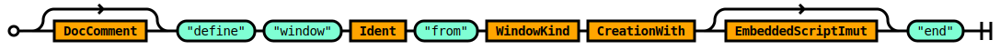
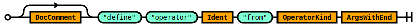
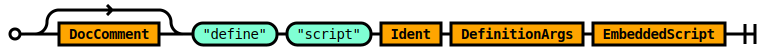
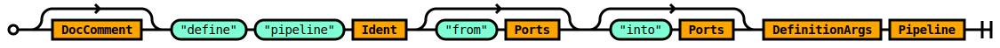
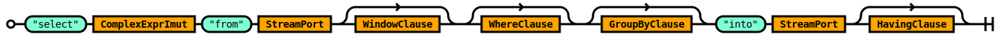
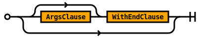

# Query Grammar

## Rule Query

The `Query` rule defines the logical entry point into Tremor's statement
oriented query grammar. The grammar is embedded into deployments via
`define pipeline` statements.

Pipelines effectively provide a continous streaming abstraction for
event processing. The pipeline query is a graph of connected streams
and operators. The operators can be builtin or provided by users through
the `script` operator.

Window definitions for use in windowed statements such as those supported by
the `select` operation  are also defined and named so that they can be used
by multiple operations and to compose tilt frames - chains of successive
windows of data in a streaming continuous select operation.

The syntax supports the definition of sub queries through the same `define pipeline`
syntax as in the deployment grammar.


```ebnf
rule Query ::=
    ConfigDirectives Stmts 
  | Stmts 
  ;

```


## Rule ConfigDirectives

The `ConfigDirectives` rule allows line delimited compiler, interpreter or
runtime hints to be specified.


```ebnf
rule ConfigDirectives ::=
    ConfigDirective ConfigDirectives 
  | ConfigDirective 
  ;

```


<!-- Added to avoid `lint` warnings from the lalrpop docgen tool. No epilog content needed for this rule -->

See `ConfigDirective` for supported directives.


## Rule Stmts

The `Stmts` rule defines a `;` semi-colon delimited sequence of `Stmt` rules.


```ebnf
rule Stmts ::=
    Stmt  ';' Stmts 
  | Stmt  ';' ?  
  ;

```


### Example for a query pipeline

```tremor
use tremor;
create stream snot;
create stream badger;

# ...
```


## Rule Stmt

The `Stmt` rule defines the legal statements in a query script.

Queries in tremor support:
* Defining named `window`, `operator`, `script` and `pipeline` definitions.
* Creating node instances of `stream`, `pipeline`, `operator` and `script` operations.
* Linking nodes togther to form an execution graph via the `select` operation.


```ebnf
rule Stmt ::=
    Use 
  | DefineWindow 
  | DefineOperator 
  | DefineScript 
  | DefinePipeline 
  | CreateOperator 
  | CreateScript 
  | CreatePipeline 
  | CreateStream 
  | OperatorSelect 
  ;

```


<!-- Added to avoid `lint` warnings from the lalrpop docgen tool. No epilog content needed for this rule -->


## Rule Use

Imports definitions from an external source for use in the current source file.

The contents of a source file form a module.

### TREMOR_PATH

The `TREMOR_PATH` environment path variable is a `:` delimited set of paths.

Each path is an absolute or relative path to a directory.

When using relative paths - these are relative to the working directory where the
`tremor` executable is executed from.

The tremor standard library MUST be added to the path to be accessible to scripts.


```ebnf
rule Use ::=
     'use' ModularTarget 
  |  'use' ModularTarget  'as' Ident 
  ;

```


### Modules

Modules can be scripts. Scripts can store function and constant definitions.

Scripts are stored in `.tremor` files.

Modules can be queries. Queries can store window, pipeline, script and operator definitions.

Scripts are stored in `.trickle` files.

Modules can be deployments. Deployments can store connector, pipeline and flow definitions.

Deployments are stored in `.troy` files.

#### Conditioning

Modules in tremor are resolved via the `TREMOR_PATH` environment variable. The variable can
refer to multiple directory paths, each separated by a `:` colon. The relative directory
structure and base file name of the source file form the relative module path.

### Constraints

It is not recommended to have overlapping or shared directories across the set of paths
provided in the tremor path.

It is not recommended to have multiple definitions mapping to the same identifier.


## Rule DefineWindow

The `DefineWindow` rule defines a temporal window specification.

A window is a mechanism that caches, stores or buffers events for processing
over a finite temporal range. The time range can be based on the number of
events, the wall clock or other defined parameters.

The named window can be instanciated via operations that support windows such
as the `select` operation.




```ebnf
rule DefineWindow ::=
    ( DocComment ) ?   'define'  'window' Ident  'from' WindowKind CreationWith ( EmbeddedScriptImut ) ?   'end' 
  ;

```


```tremor
define window four from tumbling
with
  size = 4
end;
```


## Rule DefineOperator

The `DefineOperator` rule defines an operator.

An operator is a query operation composed using the builtin 
operators provided by tremor written in the rust programming language.

The named operator can be parameterized and instanciated via the `CreateOperator` rule




```ebnf
rule DefineOperator ::=
    ( DocComment ) ?   'define'  'operator' Ident  'from' OperatorKind ArgsWithEnd 
  ;

```


```tremor
define pipeline subq
pipeline
  define operator counter from generic::counter;
  create operator counter;
  select event from in into counter;
  select event from counter into out;
end;

create pipeline subq;

select event from in into subq;
select event from subq into out;
```

Uses the builtin counter sequencing operator to numerate a stream.


## Rule DefineScript

The `DefineScript` rule defines a named operator based on a tremor script.

A script operator is a query operation composed using the scripting language
DSL rather than the builtin operators provided by tremor written in the
rust programming language.

The named script can be parameterized and instanciated via the `CreateScript` rule
 




```ebnf
rule DefineScript ::=
    ( DocComment ) ?   'define'  'script' Ident DefinitionArgs EmbeddedScript 
  ;

```


```tremor
define operator bucket from grouper::bucket;

define script categorize
script
  let $rate = 1;
  let $dimensions = event.logger_name;
  let $class = "test";
  event
end;

create operator bucket;
create script categorize;

select event from in into categorize;
select event from categorize into bucket;
select event from bucket into out;
```


## Rule DefinePipeline

The `DefinePipeline` rule creates a named pipeline.

A pipeline is a query operation composed using the query langauge DSL
instead of a builtin operation provided by tremor written in the rust
programming language.

The named pipeline can be parameterized and instanciated via the `CreatePipeline` rule




```ebnf
rule DefinePipeline ::=
    ( DocComment ) ?   'define'  'pipeline' Ident (  'from' Ports ) ?  (  'into' Ports ) ?  DefinitionArgs Pipeline 
  ;

```


```tremor
define pipeline identity
pipeline
  select event from in into out;
end;
```


## Rule CreateOperator

The `CreateOperator` rule creates an operator.

An operator is a query operation composed using the builtin 
operators provided by tremor written in the rust programming language.

The rule causes an instance of the referenced operator definition to be
created an inserted into the query processing execution graph.


```ebnf
rule CreateOperator ::=
     'create'  'operator' Ident CreationWithEnd 
  |  'create'  'operator' Ident  'from' ModularTarget CreationWithEnd 
  ;

```


```tremor

# Define a round robin operator with 3 slots
define operator roundrobin from qos::roundrobin
with
  outputs = ["one", "two", "three"]
end;

# create an instance of the operator
create operator roundrobin;

# Filter all inbound events into the rond robin
select event from in into roundrobin;

# Union slots inot outbound port
select event from roundrobin/one into out;
select event from roundrobin/two into out;
select event from roundrobin/three into out;
```


## Rule CreateScript

The `CreateScript` rule creates an operator based on a tremor script.

A script operator is a query operation composed using the scripting language
DSL rather than the builtin operators provided by tremor written in the
rust programming language.

The rule causes an instance of the referenced script definition to be
created an inserted into the query processing execution graph.


```ebnf
rule CreateScript ::=
     'create'  'script' Ident CreationWithEnd 
  |  'create'  'script' Ident  'from' ModularTarget CreationWithEnd 
  ;

```


```tremor
define operator bucket from grouper::bucket;

define script categorize
script
  let $class = "test";
  let $dimensions = [event.type, event.application];
  let $rate = 1;
  event;
end;

create operator bucket;

create script categorize;

select event from in into categorize;

select event from categorize into bucket;

select event from bucket into out;
```


## Rule CreatePipeline

The `CreatePipeline` rule creates a pipeline.

A pipeline is a query operation composed using the query langauge DSL
instead of a builtin operation provided by tremor written in the rust
programming language.

The rule causes an instance of the referenced pipeline definition to be
created an inserted into the query processing execution graph.


```ebnf
rule CreatePipeline ::=
     'create'  'pipeline' Ident CreationWithEnd 
  |  'create'  'pipeline' Ident  'from' ModularTarget CreationWithEnd 
  ;

```


```tremor

# Define a pipeline called `identity`
define pipeline identity
pipeline
  select event from in into out;
end;

# Create an instance of the pipeline
create pipeline identity
````


## Rule CreateStream

The `CreateStream` allows users to create user defined streams beyond the basic
buitin set of `in`, `out` and `err` provided by the runtime for a pipeline query.


```ebnf
rule CreateStream ::=
     'create'  'stream' Ident 
  ;

```


```tremor
create stream ctrl;
```

Creates a user defined stream by the provided name `ctrl`


## Rule OperatorSelect

The `OperatorSelect` rule provides the `select` statement in streaming queries.

The statement has
* A target expression
* A stream and port from which to consume events
* A stream and port to which synthetic events are produced
* An optional set of iwndow definitions
* An optional `where` filter
* An optional `having` filter
* An optional `group by`

Unlike ANSI-ISO SQL select operations in tremor do not presume tabular or columnar data. The
target expression can be any well-formed and legal value supported by tremor.




```ebnf
rule OperatorSelect ::=
     'select' ComplexExprImut  'from' StreamPort ( WindowClause ) ?  ( WhereClause ) ?  ( GroupByClause ) ?   'into' StreamPort ( HavingClause ) ?  
  ;

```


The builtin `select` operator in queries.

### A simple non-windowed non-grouped select

```tremor
select event from in into out;
```

### A simple non-windowed grouped select

```tremor
select event from in into out group by event.key;
```

### A windowed grouped select operation

```tremor
select event from in[one_sec] by event.key into out;
```

Multiple windows can be configured in lower resolutions
for multi-resolution windowed expressions where lower
resolutions are merged into from higher resolution windows

```tremor
select aggr::stats::hdr(event.count) form in[one_sec, fifteen_sec, one_min, one_hour] into out;
```


## Rule DocComment

The `DocComment` rule specifies documentation comments in tremor.

Documentation comments are optional.

A documentation comment begins with a `##` double-hash and they are line delimited.

Muliple successive comments are coalesced together to form a complete comment.

The content of a documentation comment is markdown syntax.


```ebnf
rule DocComment ::=
     '<doc-comment>' 
  | DocComment  '<doc-comment>' 
  ;

```


### Example

Documentation level comments are used throughout the tremor standard library
and used as part of our document generation process.

Here is a modified snippet from the standard library to illustrate

```tremor
## Returns the instance of tremor.
##
## Returns a `string`
intrinsic fn instance() as system::instance;
...
```

This is a builtin function implemented in rust and used in a script as follows:

```tremor
use tremor::system;

system::instance()
```


## Rule Ident

An `Ident` is an identifier - a user defined name for a tremor value.


```ebnf
rule Ident ::=
     '<ident>' 
  ;

```


### Examples of identifiers

```tremor
let snot = { "snot": "badger" };
```

### Keyword escaping

Surrounding an identifier with a tick '`' allows keywords in tremor's DSLs to be
escaped

```tremor
let `let` = 1234.5;
```

### Emoji

You can even use emoji as identifiers via the escaping mechanism.

```tremor
let `🚀` = "rocket";
```

But we cannot think of any good reason to do so!


## Rule WindowKind

### Tumbling

A `tumbling` window defines a wall-clock-bound or data-bound window of non-overlapping
time for storing events. The windows can not overlap, and there are no gaps between
windows permissible.

### Sliding

A `sliding` window defines a wall-clock-bound or data-bound window of events that captures
an intervalic window of events whose extent derives from the size of the window. A sliding
window of size 2 captures up to to events. Every subsequent event will evict the oldest and
retain the newest event with the previous ( now oldest ) event.

### Conditioning

Both kinds of window store events in arrival order


```ebnf
rule WindowKind ::=
     'sliding' 
  |  'tumbling' 
  ;

```


Currently only `tumbling` is implemented.


## Rule CreationWith

The `CreationWith` rule defines an optional `with` block of expressions without a terminal `end` keyword.


```ebnf
rule CreationWith ::=
    WithClause 
  | 
  ;

```


<!-- Added to avoid `lint` warnings from the lalrpop docgen tool. No epilog content needed for this rule -->


## Rule EmbeddedScriptImut

The `EmbeddedScriptImut` rule defines an optional embedded `script`.
 


```ebnf
rule EmbeddedScriptImut ::=
     'script' EmbeddedScriptContent 
  ;

```


## Rule OperatorKind

The `OperatorKind` rule defines a modular path like reference to a builtin tremor operator.

Operators are programmed in rust native code and referenced via a virtual module path.


```ebnf
rule OperatorKind ::=
    Ident  '::' Ident 
  ;

```


A modular path identifying a builtin operator.

```tremor
define operator roundrobin from qos::roundrobin;
```


## Rule ArgsWithEnd

The `ArgsWithEnd` rule defines an arguments block with an `end` block.




```ebnf
rule ArgsWithEnd ::=
    ArgsClause ?  WithEndClause 
  | 
  ;

```


An internal rule that defines an optional `args` block with and optional `end` token.

This rule is used and shared in other rules as part of their definitions.


## Rule DefinitionArgs

The `DefinitionArgs` rule defines an arguments block without an `end` block.


```ebnf
rule DefinitionArgs ::=
    ArgsClause ?  
  ;

```


An optional argument block

```tremor
args arg1, arg 2
```

This is a shared internal rule used in other rules as part of their definition.


## Rule EmbeddedScript

The `EmbeddedScript` rule defines a script using the [Script DSL](Script) [ [Full](Full#rule-script) ].

The script is enclosed in `script` .. `end` blocks.


```ebnf
rule EmbeddedScript ::=
     'script' TopLevelExprs  'end' 
  ;

```


```tremor
script
  event
end
```


## Rule Ports

The `Ports` rule defines a `,` comma delimited set of stream ports.


```ebnf
rule Ports ::=
    Sep!(Ports, <Ident>, ",") 
  ;

```


A set of `ports` exposed in pipeline definitions in their `from` and `into` clauses

```tremor
define pipeline example
  from in, out, err, ctrl
  into in, out, err, ctrl
pipeline
  # A pipeline query implementation
  ...
end
```

The `from` and `into` ports do not need to be the same.

Tremor's compiler and runtime can use these definitions to validate deployments
are correct, or discover deployments that are invalid. It is an error to send
data to or receive data from a pipeline port that is not specified.


## Rule Pipeline

The `Pipeline` rule defines a block of statements in a `pipeline` .. `end` block.

The block MAY begin with an optional set of `ConfigDirectives`.


```ebnf
rule Pipeline ::=
     'pipeline' ConfigDirectives ?  PipelineCreateInner  'end' 
  ;

```


An internal rule to the `DefinePipeline` rule where the pipeline logic is provided.


## Rule ComplexExprImut

The `ComplexExprImut` rule defines complex immutable expression in tremor.


```ebnf
rule ComplexExprImut ::=
    MatchImut 
  | ForImut 
  | ExprImut 
  ;

```


<!-- Added to avoid `lint` warnings from the lalrpop docgen tool. No epilog content needed for this rule -->


## Rule StreamPort

The `StreamPort` rule defines a stream by name with an optional named `Port`.

When the `Port` is omitted, tremor will internally default the `Port` to the
appropriate `in` or `out` port. Where the `err` or user defined `Port`s are
preferred, the optional `Port` specification SHOULD be provided.


```ebnf
rule StreamPort ::=
    Ident MaybePort 
  ;

```


```tremor
in/snot
```

Within a query, allows the port of a specific stream to be referenced directly.


## Rule WindowClause

The `WindowClause` rule defines an optional window definition for a supporting operation.


```ebnf
rule WindowClause ::=
    WindowDefn 
  ;

```


<!-- Added to avoid `lint` warnings from the lalrpop docgen tool. No epilog content needed for this rule -->


## Rule WhereClause

The `WhereClause` defines a predicate expression used to filter ( forward or discard ) events in an operation.

The `where` clause is executed before a operation processes an event.


```ebnf
rule WhereClause ::=
     'where' ComplexExprImut 
  ;

```


```tremor
select event from in
where present event.important
into out
```

The `where` filters events before computations occur upon them in operators
that support the clause. Any predicate ( boolean ) expression can be used
in a `where` filter.


## Rule GroupByClause

The `GroupByClause` defines the group by clause of a supporting operation in tremor.

An operator that uses a group by clause maintains the operation for each group captured
by the grouping dimensions specified in this clause.


```ebnf
rule GroupByClause ::=
     'group'  'by' GroupDef 
  ;

```


```tremor
select event from in[one_second]
having present event.important
group by event.priority
into out
```

The `group by` clause groups events based on a group expression. Each computed group effectively
has its own memory and computation allocated.

For windowed operations the windows are allocated for each group.

These groups and their windows are independant. This means that opening, closing, filling and
recycling of windows is by group.


## Rule HavingClause

The `HavingClause` defines a predicate expression used to filter ( forward or discard ) events in an operation.

The `having` clause is executed after an operation has processed an event.


```ebnf
rule HavingClause ::=
     'having' ComplexExprImut 
  ;

```


```tremor
select event from in
having present event.important
into out
```

The `having` filters events __after__ computations has occured within them in operators
that support the clause. Any predicate ( boolean ) expression can be used
in a `having` filter.

When appropriate, the `where` clause should be used in preference over the `having` clause.
It is better to filter early before computation occurs when this is practicable or possible.


## Rule CreationWithEnd

The `CreationWithEnd` rule defines a `with` block of expressions with a terminal `end` keyword.


```ebnf
rule CreationWithEnd ::=
    WithEndClause 
  | 
  ;

```


```tremor
with x = y end
```


## Rule ModularTarget

A `ModularTarget` indexes into tremor's module path.

In tremor a `module` is a file on the file system.

A `module` is also a unit of compilation.

A `ModularTarget` is a `::` double-colon delimited set of identifiers.

Leading `::` are not supported in a modular target..

Trailing `::` are not supported in a modular target.


```ebnf
rule ModularTarget ::=
    Ident 
  | ModPath  '::' Ident 
  ;

```


### Examples

#### Loading and using a builtin function
```tremor
# Load the base64 utilities
use std::base64;

# Base64 encode the current `event`.
base64::encode(event)
```

#### Loading and using a builtin function with an alias

```tremor
# Load the base64 utilities
use std::base64 as snot;

# Base64 encode the current `event`.
snot::encode(event)
```


## Rule MaybePort

The `MaybePort` rule defines an optional `Port`.


```ebnf
rule MaybePort ::=
    (  '/' Ident ) ?  
  ;

```


When interconnecting pipelines and connectors in flow definitions
default ports can be inferred by the tremor runtime.

When an alternate port is required, the port specification can be
used to explicitly select from available inbound or outbound ports.


## Rule WindowDefn

The `WindowDefn` defines a temporal basis over which a stream of events is applicable.


```ebnf
rule WindowDefn ::=
     '[' Windows  ']' 
  ;

```


Operations supporting windowed aggregate functions in tremor such as the `select`
statement can window incoming streams in the `from` clause:

```tremor
select aggr::count(event) from in[one_second, ten_second]
...
```

Here, we stream events from the `in` stream into a `one_second` window.
Every second, we stream the aggregate result from the one second window
into the `ten_second` window.

So, even if we have 1 million events per second, the `one_second` and `ten_second`
windows will convert the event firehose into a `trickle`. Fun fact: this pun is where the
query language got its name from.


## Rule Windows

The `Windows` rule defines a sequence of window definitions that are `,` comma delimited.


```ebnf
rule Windows ::=
    Windows_ 
  ;

```


Wraps the `Windows_` internal rule for other rules to consume in their definitions


## Rule Windows_

The `Windows_` rule defines a sequence of window definitions that are `,` comma delimited.


```ebnf
rule Windows_ ::=
    Sep!(Windows_, Window, ",") 
  ;

```


A comma delimited set of window references.

Windows can be local or modular

```tremor
win, my_module::one_sec, my_module::five_sec
```

The identifers refer to a window definition and can be used
in operators to define a temporally bound set of events based
on the semantics of the window definition.

In a tilt frame - or set of windows, the output of a window can
is the input the next window in a sequence. This is a form of
temporal window-driven event compaction that allows memory be
conserved.

At 1000 events per second, a 1 minute window needs to store 60,000
events per group per second. But 60 1 second windows can be merged
with aggregate functions like `dds` and `hdr` histograms.

Say, each histogram is 1k of memory per group per frame - that is
a cost of 2k bytes per group.

In a streaming system - indefinite aggregation of in memory events is
always a tradeoff against available reosurces, and the relative business
value.

Often multiple windows in a tilt frame can be more effective than a
single very long lived window.


## Rule Window

The `Window` rule defines a modular target to a window definition.


```ebnf
rule Window ::=
    ModularTarget 
  ;

```


<!-- Added to avoid `lint` warnings from the lalrpop docgen tool. No epilog content needed for this rule -->


## Rule GroupDef

The `GroupDef` rule defines the parts of a grouping dimension.

Group segments can be derived from:
* Expressions - for which their serialized values are used.
* Set expressions - which computes a set based on an expression.
* Each expressions - which iterates an expression to compute a set.


```ebnf
rule GroupDef ::=
    ExprImut 
  |  'set'  '(' GroupDefs  ')' 
  |  'each'  '(' ExprImut  ')' 
  ;

```


### Example group definitions

A string value
```tremor
event.string
```

The serialization of any legal tremor data value

```tremor
event
```

A set based on multiple expressions:

```tremor
set(event.key, state[key])
```

An set computed from an interation

let keys = ['snot', 'badger', 'goose'];

# ...

each(keys)
```


## Rule ExprImut

The `ExprImut` is the root of immutable expressions in tremor.


```ebnf
rule ExprImut ::=
    OrExprImut 
  ;

```


The effective root of the subset of the expression langauge applicable in most immutable
processing context in tremor is captured by this rule.


## Rule GroupDefs

The `GroupDefs` rule defines a `,` comma delimited set of `GroupDef` rules.


```ebnf
rule GroupDefs ::=
    GroupDefs_ 
  ;

```


Wraps a macro call for use by other productions in the grammar


## Rule GroupDefs_

The `GroupDefs_` rule defines a `,` comma delimited set of `GroupDef` rules.


```ebnf
rule GroupDefs_ ::=
    Sep!(GroupDefs_, GroupDef, ",") 
  ;

```


A comma delimited set of `GroupDef` productions


## Rule EmbeddedScriptContent

The `EmbeddedScriptContent` rule defines an embedded script expression. 


```ebnf
rule EmbeddedScriptContent ::=
    ExprImut 
  ;

```


A single expression embedded within an embedded script


## Rule TopLevelExprs

The `TopLevelExprs` rule defines semi-colon separated sequence of top level
tremor expressions with an optional terminating semi-colon


```ebnf
rule TopLevelExprs ::=
    TopLevelExpr  ';' TopLevelExprs 
  | TopLevelExpr  ';' ?  
  ;

```


The `ToplEvelExprs` specifies the expressions that are legal at the top level
of a `script` expression.

```tremor
script
  event.sum * 2
end
```

A sequence of ';' semi-colon delimited expressions of the following form are permissible:

* Constants
* Function definitions
* Intrinsic function definitions in the standard library 
  * Provided by the runtime to document builtins - not user modifiable without a pull request or feature enhancement
* Arbitrary complex expressions
* Use definitions


## Rule PipelineCreateInner

The `PipelineCreateInner` is an internal rule of the `Pipeline` rule.

The rule defines a `;` semi-colon delimited set of one or many `Stmt`s.


```ebnf
rule PipelineCreateInner ::=
    Stmt  ';' Stmts 
  | Stmt  ';' ?  
  ;

```


This rule allows queries to be defined in the context of a pipeline definition.


