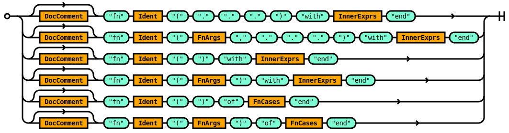
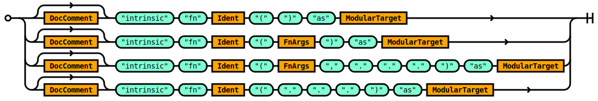
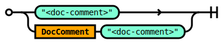
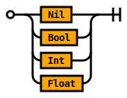
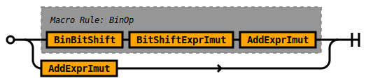
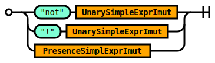
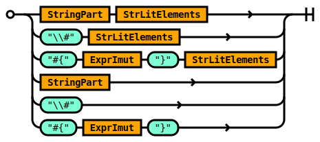
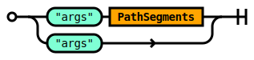
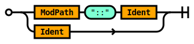

# Script Grammar

## Rule Script

The `Script` rule defines the logical entry point into Tremor's expression
oriented scripting language. The scripting langauge can be embedded into
queries via the `script` operator. The scripting language is also used to
specify configuration of connectors, pipelines, flows, and operators in
the query language.

A legal script is composed of:
* An optional set of module comments
* A sequence of top level expressions. There must be at least one defined.
* An optional end of stream token

### Scripting Language Entrypoint

This is the top level of the tremor scripting language `tremor`


```ebnf
rule Script ::=
    ( ModComment ) ?  TopLevelExprs 
  ;

```


### Type system

Tremor supports a data oriented or value based type system with a syntax
that is backwards compatible with JSON.

Any well-formed and legal JSON document is a valid literal in tremor.

Tremor literals for `null`, `boolean`, `string` ( utf-8 ), integer ( 64-bit unsigned ),
 float ( 64-bit ieee ), arrays, and records are equivalent to their JSON counterparts.

Tremor also supports a binary literal for transporting and processing opaque binary data.

### Asymmetric

JSON literals are valid tremor value literals.

Tremor literals MAY NOT always be valid JSON literal.


```tremor
# The following literal is valid JSON and valid Tremor
[1, "snot", {}];

# The following literal is valid in tremor only
[1, "snot", {}, << data/binary >>, ];
```

Tremor supports comments, JSON does not.
Tremor supports trailing commas in arrays and records, JSON does not.
Tremor supports binary literal data, JSON does not.

Note: By default, most connectors in tremor serialize to and from `json` via a codec. The
type system in tremor however is agnostic to the wire format of data that flows through
tremor. So data originate as `json`, as `msgpack`.

### Computations

Tremor also supports a rich expression language with the same support for additive, mutliplicate,
comparitive, and logical unary and binary expressions as languages like `rust` and `java`.

As most of the data that flows through tremor is heirarchically structured or JSON-like tremor
also has rich primitives for structural pattern matching, structural comprehension or iterating
over data structures.

### Loops

Tremor does not support `while` `loop` or other primitives that can loop, recurse or iterate
indefinitely.

In an event based system, events are streaming continuously - so infinite loops that can block
streams from making forward progress are considered harmful.

There are no loops.

We do support iteration over finite arrays.

We do support depth-limited tail recursive functional programming.

### Expression oriented

The script processing is expression oriented. This is to say that every structural
form supported by tremor returns a data structure as a result.


### Event oriented

Scripts in tremor can `emit` or `drop` an `event that is being processed.

The `event` keyword is the subject. It identifies the value currently being processed.

The `emit` keyword halts processing succesfully with a value.

The `drop` keyword halts processing by discarding the current event.


### Illustrative example

```tremor
# Propagate events marked as important and convert them to system alerts
match event of
  case %{ present important } => { "alert": event.message }
  default => drop
end;
```


## Rule ModComment

The `ModComment` rule specifies module comments in tremor.

Documentation comments for modules are optional.

A module documentation comment begins with a `###` triple-hash and they are line delimited.

Muliple successive comments are coalesced together to form a complete comment.

The content of a module documentation comment is markdown syntax.


```ebnf
rule ModComment ::=
     '<mod-comment>' 
  | ModComment  '<mod-comment>' 
  ;

```


### Example

Module level comments are used throughout the tremor standard library
and used as part of our document generation process.

Here is a modified snippet from the standard library to illustrate

```tremor
### The tremor language standard library it provides the following modules:
###
### * [array](std/array.md) - functions to deal with arrays (`[]`)
### * [base64](std/base64.md) - functions for base64 en and decoding
### * [binary](std/base64.md) - functions to deal with binary data (`<< 1, 2, 3 >>`)
### * [float](std/float.md) - functions to deal with floating point numbers
### * [integer](std/integer.md) - functions to deal with integer numbers
### * [json](std/json.md) - functions to deal with JSON
...
```


## Rule TopLevelExprs

The `TopLevelExprs` rule defines semi-colon separated sequence of top level
tremor expressions with an optional terminating semi-colon


```ebnf
rule TopLevelExprs ::=
    TopLevelExpr  ';' TopLevelExprs 
  | TopLevelExpr  ';' ?  
  ;

```


The `ToplEvelExprs` specifies the expressions that are legal at the top level
of a `script` expression.

```tremor
script
  event.sum * 2
end
```

A sequence of ';' semi-colon delimited expressions of the following form are permissible:

* Constants
* Function definitions
* Intrinsic function definitions in the standard library 
  * Provided by the runtime to document builtins - not user modifiable without a pull request or feature enhancement
* Arbitrary complex expressions
* Use definitions


## Rule TopLevelExpr

The `TopLevelExpr` rule specifies the expression forms that are legal at the
outer most scope of a tremor script definition.

The legal forms are:
* Use declarations - these allow external modules to be referenced.
* Constant expressions - these are immutable compile time constants.
* Function definitions - these are user defined functions.
* Intrinsic function definitions - these are builtin funtions provided by the runtime.


```ebnf
rule TopLevelExpr ::=
    Const 
  | FnDefn 
  | Intrinsic 
  | Expr 
  | Use 
  ;

```


### Example

In the tremor standard library many of the top level expressions
are `use` definitions importing sub modules from the module path.

```tremor
use std::array;     # Import the std array utilities
use std::base64     # Import the std base64 utilities;
use std::binary;    # ...
use std::float;
use std::integer;
use std::json;
```


## Rule InnerExprs

The `InnerExprs` rule defines the expression forms permissible within another
containing scope. Like `TopLevelExprs`, inner expressions are separated by semi-colons.
The semi-colon is optional for the last expression in a set of expressions.

At least one expression MUST be provided.


```ebnf
rule InnerExprs ::=
    Expr  ';' InnerExprs 
  | Expr  ';' ?  
  ;

```


### Example

The following basic forms are permissible

```tremor
for event.object of case (k, v) => v end;
for event.list of case (i, e) => e end;
match event of case %{} => "record" default => "not a record" end;
let list = event.list;
drop;
"any literal or basic expression";
1 + 2 * 3;
emit {"snot": "badger" }
# ...
```


## Rule Expr

The `Expr` rule aliases the `SimpleExpr` rule.

The alias allows higher levels of the DSL such as the rules
in the deployment or query language to avoid some of the internal
complexity in the scripting language.

Within the scripting DSLs grammar the different forms and
variations of expression are significant.

However, in the higher level we limit exposure to a subset of
these forms. This is done for convenience, and for consistency
of usage, and ease of learning the language.


```ebnf
rule Expr ::=
    SimpleExpr 
  ;

```


The effective root of the subset of the expression langauge applicable in most processing
context in tremor is captured by this rule.


## Rule Const

The `Const` rule defines a rule that binds an immutable expression to an identifier.

As the value cannot be changed at runtime.


```ebnf
rule Const ::=
    ( DocComment ) ?   'const' Ident  '=' ComplexExprImut 
  ;

```


### How do I create new immutable constant variable in tremor?

```tremor
use std::base64;
const snot = "snot";
const badger = "badger";
const snot_badger = { "#{snot}": "#{base64::encode(badger)}" };
```


## Rule FnDefn

The `FnDefn` rule allows user defined functions to be defined.

This rule allows tremor users to create functions for reuse in one or many tremor applications.




```ebnf
rule FnDefn ::=
    ( DocComment ) ?   'fn' Ident  '('  '.'  '.'  '.'  ')'  'with' InnerExprs  'end' 
  | ( DocComment ) ?   'fn' Ident  '(' FnArgs  ','  '.'  '.'  '.'  ')'  'with' InnerExprs  'end' 
  | ( DocComment ) ?   'fn' Ident  '('  ')'  'with' InnerExprs  'end' 
  | ( DocComment ) ?   'fn' Ident  '(' FnArgs  ')'  'with' InnerExprs  'end' 
  | ( DocComment ) ?   'fn' Ident  '('  ')'  'of' FnCases  'end' 
  | ( DocComment ) ?   'fn' Ident  '(' FnArgs  ')'  'of' FnCases  'end' 
  ;

```


### Pattern match based function arguments

Functions defined with an `of` keyword in their signature use pattern matching against arguments

```tremor
fn fib_(a, b, n) of
  case (a, b, n) when n > 0 => recur(b, a + b, n - 1)
  default => a
end;
```

### Ordinary functions

Functions defined with a `with` keyword in their signature use ordinary
arity based matching.

```
fn fib(n) with
  fib_(0, 1, n)
end;
```

## Function documentation

In modular functions, it is customary to provide user level documentation for the intended
users of a function. Here is an example from the tremor standard library

```tremor
### Trace Identifiers
###
###

use std::type;
use std::binary;
use std::array;
use std::string;

## Is the `trace_id` valid
##
## Checks the `trace_id` argument to see if it is a valid
## trace id. A legal trace id is one of:
##
## * An array of integers in the range of [0..=255] of length 8
## * A binary 16 byte value
## * A 32-byte hex-encoded string
## * An array of 16 int values
## * Regardless of representation, the value must not be all zeroes
##
## Returns a record when the representation is well-formed of the form:
##
## ```tremor
## {
##    "kind": "string"|"binary"|"array", # Depends on input
##    "valid": true|false,               # True if well-formed and valid
##    "value": "<trace_id>"              # Representation depends on `kind`
## }
## ```
##
## Returns an empty record `{}` when the representation not well-formed
##
fn is_valid(trace_id) of
    # String representation
    case(trace_id) when type::is_string(trace_id) =>
      { "kind": "string", "valid": trace_id != "00000000000000000000000000000000" and string::bytes(trace_id) == 32, "value": trace_id }
    # Binary representation
    case(trace_id) when type::is_binary(trace_id) =>
      let arr = binary::into_bytes(trace_id);
      { "kind": "binary", "valid": binary::len(arr) == 16 and trace_id != << 0:64, 0:64 >>, "value": trace_id }
    # Array representation
    case(trace_id) when type::is_array(trace_id) =>
      { "kind": "array", "valid":  array::len(arr) == 16 and trace_id != [ 0, 0, 0, 0, 0, 0, 0, 0], "value": trace_id }
    default =>
      false
end
```


## Rule Intrinsic

The `intrinsic` rule defines intrinsic function signatures.

This rule allows tremor maintainers to document the builtin functions implemented as
native rust code. The facility also allows document generation tools to document builtin
intrinsic functions in the same way as user defined functions.

In short, these can be thought of as runtime provided.

For information on how to define user defined functions see the [function](#rule-fndecl) rule.




```ebnf
rule Intrinsic ::=
    ( DocComment ) ?   'intrinsic'  'fn' Ident  '('  ')'  'as' ModularTarget 
  | ( DocComment ) ?   'intrinsic'  'fn' Ident  '(' FnArgs  ')'  'as' ModularTarget 
  | ( DocComment ) ?   'intrinsic'  'fn' Ident  '(' FnArgs  ','  '.'  '.'  '.'  ')'  'as' ModularTarget 
  | ( DocComment ) ?   'intrinsic'  'fn' Ident  '('  '.'  '.'  '.'  ')'  'as' ModularTarget 
  ;

```


### Example

From our standard library generated documentation, we can see that the base64
encode function is an intrinsic function.

```tremor
## Encodes a `binary` as a base64 encoded string
##
## Returns a `string`
intrinsic fn encode(input) as base64::encode;
```


## Rule Use

Imports definitions from an external source for use in the current source file.

The contents of a source file form a module.

### TREMOR_PATH

The `TREMOR_PATH` environment path variable is a `:` delimited set of paths.

Each path is an absolute or relative path to a directory.

When using relative paths - these are relative to the working directory where the
`tremor` executable is executed from.

The tremor standard library MUST be added to the path to be accessible to scripts.


```ebnf
rule Use ::=
     'use' ModularTarget 
  |  'use' ModularTarget  'as' Ident 
  ;

```


### Modules

Modules can be scripts. Scripts can store function and constant definitions.

Scripts are stored in `.tremor` files.

Modules can be queries. Queries can store window, pipeline, script and operator definitions.

Scripts are stored in `.trickle` files.

Modules can be deployments. Deployments can store connector, pipeline and flow definitions.

Deployments are stored in `.troy` files.

#### Conditioning

Modules in tremor are resolved via the `TREMOR_PATH` environment variable. The variable can
refer to multiple directory paths, each separated by a `:` colon. The relative directory
structure and base file name of the source file form the relative module path.

### Constraints

It is not recommended to have overlapping or shared directories across the set of paths
provided in the tremor path.

It is not recommended to have multiple definitions mapping to the same identifier.


## Rule DocComment

The `DocComment` rule specifies documentation comments in tremor.

Documentation comments are optional.

A documentation comment begins with a `##` double-hash and they are line delimited.

Muliple successive comments are coalesced together to form a complete comment.

The content of a documentation comment is markdown syntax.




```ebnf
rule DocComment ::=
     '<doc-comment>' 
  | DocComment  '<doc-comment>' 
  ;

```


### Example

Documentation level comments are used throughout the tremor standard library
and used as part of our document generation process.

Here is a modified snippet from the standard library to illustrate

```tremor
## Returns the instance of tremor.
##
## Returns a `string`
intrinsic fn instance() as system::instance;
...
```

This is a builtin function implemented in rust and used in a script as follows:

```tremor
use tremor::system;

system::instance()
```


## Rule Ident

An `Ident` is an identifier - a user defined name for a tremor value.


```ebnf
rule Ident ::=
     '<ident>' 
  ;

```


### Examples of identifiers

```tremor
let snot = { "snot": "badger" };
```

### Keyword escaping

Surrounding an identifier with a tick '`' allows keywords in tremor's DSLs to be
escaped

```tremor
let `let` = 1234.5;
```

### Emoji

You can even use emoji as identifiers via the escaping mechanism.

```tremor
let `🚀` = "rocket";
```

But we cannot think of any good reason to do so!


## Rule ComplexExprImut

The `ComplexExprImut` rule defines complex immutable expression in tremor.


```ebnf
rule ComplexExprImut ::=
    MatchImut 
  | ForImut 
  | ExprImut 
  ;

```


<!-- Added to avoid `lint` warnings from the lalrpop docgen tool. No epilog content needed for this rule -->


## Rule SimpleExpr

The `SimpleExpr` rule defines all the structural and simple expressions and literals in tremor.


```ebnf
rule SimpleExpr ::=
    Match 
  | For 
  | Let 
  | Drop 
  | Emit 
  | ExprImut 
  ;

```


### Structural expressions

* Match
* For

### Assignment

* Let

### Flow

* Emit
* Drop

### Basic expressions

Binary, unary and literal expressions


## Rule Match

The `Match` rule defines a mutable match statement in tremor.


```ebnf
rule Match ::=
     'match' ComplexExprImut  'of' Predicates  'end' 
  ;

```


An illustration of the rule is a set of case statements, followed by an optional `default` case

```tremor
  match event of
    case %{} => "I am a possibly non-empty record",
    case %[] => "I am a possibly non-empty array",
    case %( "snot" ) => "I am a list with 1 element which is the string \"snot\"
    default => "I'm something else"
  end
```


## Rule For

The `For` rule defines an mutable `for` comprehension.


```ebnf
rule For ::=
     'for' ComplexExprImut  'of' ForCaseClauses  'end' 
  ;

```


An illustration of the rule is a set of case statements, followed by an optional `default` case

```tremor
  for event of
    ## Cases
  end
```

The `ForCaseClause` rule has examples of the two basic forms for record and array comprehensions.


## Rule Let

The `Let` rule allows an expression to be bound to a `Path`.

The `Path` references the subject of the assignment based on tremor's `Path` rules.

The bound `Path` is mutable.


```ebnf
rule Let ::=
     'let' Assignment 
  ;

```


### How do i create a local mutable variable in tremor?

```
let my_var = "this is a string";
```


## Rule Drop

Drop halts event processing for the current event being processed returning
control to the tremor runtime, dropping the event.

### Constraints

The `drop` operation should be used with care as the in-flight event is
discarded by the runtime. Where circuit breakers, guaranteed delivery and
quality of service operations are being managed by the engine downstream
these should be carefully programmed so that `drop` operations have no
side-effects on non-functional behaviours of the tremor runtime.

Here be dragons!


```ebnf
rule Drop ::=
     'drop' 
  ;

```


```tremor
define script boring
script
  drop
end;
create script boring;
select event from in into boring;
select event from boring into out;
```

Drop signals to the tremor runtime that an event is not interesting and can
be dropped without any further handling by the engine. Drop statements in
a script or query result in the processing of the current event halting without
any further action bye the tremor runtime.

The dropped event is discarded by the engine.


## Rule Emit

###

Emit halts event processing for the current event being processed returning
control to the tremor runtime, emitting a synthetic event as output.

By default, the emit operation will emit events to the standard output port `out`.

The operation can be redirected to an alternate output port.


```ebnf
rule Emit ::=
     'emit' ComplexExprImut  '=>' StringLiteral 
  |  'emit' ComplexExprImut 
  |  'emit'  '=>' StringLiteral 
  |  'emit' 
  ;

```


```tremor
define script route
script
  emit => "not_out"
end;

create script route;
select event from in into route;
select event from route/not_out into out;
```

Emit signals to the tremor runtime that an event has been processed fully and
processing can stop at the point emit is invoked and a synthetic value returned
without any further processing.

The emitted event is forwarded by the engine.


## Rule ExprImut

The `ExprImut` is the root of immutable expressions in tremor.


```ebnf
rule ExprImut ::=
    OrExprImut 
  ;

```


The effective root of the subset of the expression langauge applicable in most immutable
processing context in tremor is captured by this rule.


## Rule AlwaysImutExpr

The `AlwaysImutExpr` defines the immutable expression forms in tremor.

Immutable expressions can be reduced at compile time and folded into literals.


```ebnf
rule AlwaysImutExpr ::=
    Patch 
  | Merge 
  | Invoke 
  | Literal 
  | Path 
  | Record 
  | List 
  | StringLiteral 
  | BytesLiteral 
  | Recur 
  ;

```


<!-- Added to avoid `lint` warnings from the lalrpop docgen tool. No epilog content needed for this rule -->


## Rule Patch

The `Patch` rule defines the `patch` statement in tremor.


```ebnf
rule Patch ::=
     'patch' ComplexExprImut  'of' PatchOperations  'end' 
  ;

```


### Patch insert a field in a record

```tremor
let a = patch event of
  insert "test" => 1
end;
```

### Default patch templates
```tremor
patch event of
  default => {"snot": {"badger": "goose"}}
end


## Rule Merge

The `Merge` rule defines a merge operation of two complex immutable expressions.


```ebnf
rule Merge ::=
     'merge' ComplexExprImut  'of' ComplexExprImut  'end' 
  ;

```


## How do I merge two two records?

```tremor
merge {"a": 1, "b": 2, "c": 3 } of
  { "b": "bravo", "c": "charlie", "d": "delta" }
end;
```

The merge expression loosely follows the semantics of [RFC 7396 - JSON Merge Patch](https://datatracker.ietf.org/doc/html/rfc7396).

From our example:
* The field `a` is not patched and preserved
* The field `b` is patched with the value `bravo` - the original value is replaced
* The field `d` is not in the original, and is added.

The expression is useful when one record with another.

An alternative to the `Merge` expression is the `Patch` expression which is operation
rather than value based.


## Rule Invoke

The `Invoke` rule specifies the syntax of a function invocation.


```ebnf
rule Invoke ::=
    FunctionName  '(' InvokeArgs  ')' 
  | FunctionName  '('  ')' 
  ;

```


```tremor
use std::string;

string::len("snot")
```


## Rule Literal

The `Literal` rule defines the set of primitive literals supported in tremor.




```ebnf
rule Literal ::=
    Nil 
  | Bool 
  | Int 
  | Float 
  ;

```


Primitive literal types in tremor are integer, floating point, boolean and the `null` reference.

String literals are UTF-8 encoded values and support interpolation with single line ( regular ) and
multi line ( heredoc style ) variant forms.


## Rule Path

The `Path` rule defines path operations over expressions.

Path operations structures to be tersely indexed in a path like structure.

Path operations are supported on
* A subset of expressions ( record, array, function )
* Meta keywords like `$`, `args`, `state`, `event`, `group`, `window`


```ebnf
rule Path ::=
    MetaPath 
  | EventPath 
  | StatePath 
  | LocalPath 
  | ConstPath 
  | AggrPath 
  | ArgsPath 
  | ExprPath 
  ;

```


Path expressions are how events and in memory state in tremor are referenced
in scripts.

### How to reference metadata

The tremor runtime can provide and consume metadata with the events
being processed by the runtime.

Metadata is distinguished by a `$` dollar sign

```tremor
let foo = $request # The local path `foo` is a copy of the metadata `$request`
```

Connectors such as `kafka` and `http` can generate metadata that scripts, queries
and pipelines can manipulate and process to tune tremor's runtime behaviour.

### How to reference the current streaming event

The current event streaming through tremor in the current pipeline will
be available to queries, logics and scripts via the `event` keyword.

The `event` keyword can be further dereferenced via path statements

```tremor
# Where event is a record
let foo = event.snot; # The local path `foo` is a copy of the `snot` field from the current event
```

```tremor
# Where event is an array
let foo = event[10]; The local path `foo` is a copy of the 10th element of the current event.
```

### How to reference pipeline state

Scripts in tremor can store state that is available for the lifetime of a pipeline
via the `state` keyword.

The `state` keyword can be further dereferenced via path statements

```tremor
# Where state is a record
let foo = state.snot; # The local path `foo` is a copy of the `snot` field from the state record 
```

```tremor
# Where state is an array
let foo = state[10]; The local path `foo` is a copy of the 10th element of the state array

### How to reference arguments

For operators and structures that support arguments the `args` keyword can be
used to dereference values via path statements.

```tremor
# Where state is a record
let foo = args.snot; # The local path `foo` is a copy of the `snot` field from the args record 
```

Args are nominal and always record values in tremor.

### How can window state be referenced

Operations supporting windows and groups can dereference the cached state via the
`window` and `group` keywords which both support path operations.


## Rule Record

The `Record` rule defines a set of name-value pairs delimited by `,` a comma.

Records are enclosed in `{` and `}` curly braces.

The record structure in tremor is backwards compatible with JSON.

All JSON records can be read by tremor.

Not all tremor records can be read by a JSON reader as tremor supports computations, comments and trailiing `,` commas
in its record and array structures.


```ebnf
rule Record ::=
     '{' Fields  '}' 
  |  '{'  '}' 
  ;

```


### How are literal records or map types or key-value collections defined in tremor?

We use `{` .. `}` squigly braces to delimit record -like data.

### Can records be nested?

Record values can be any valid primitive of structural type supported by tremor, including other records.

### Does tremor support typed records?

No. A record in tremor can have element values from any supported primitive or
structural type in tremor.

Validation that a record conforms to a shape, schema or structure can be achieved
through match expressions.

```tremor
use std::type;

let bad = { "list-of-bool": [true, false, "snot"] };
let good = { "list-of-bool": [true, false ], "flag": true };

fn list_of_bool(l) with
  let valid = true;
  for l of
    case (i,e) when type::is_bool(e) and valid == true => let valid = true
    case (i, otherwise) => let valid = false
  end;
  valid # return true if list is all bool, false otherwise
end;

fn is_good_record(r) with
  let valid = false;
  match r of
    case extract=%{ present flag, list-of-bool ~= %[] } 
      when list_of_bool(extract["list-of-bool"]) => 
       let valid = true
    default => 
      let valid = false
  end;
  valid
end;

is_good_record(bad); # should fail
is_good_record(good); # should succeed
```

This user defined function can then be used in guard clauses like `when type::is_bool(e) ...` in the
example code.


## Rule List

The `List` rule defines a `[` and `]` square bracket delimited sequence of zero or many ',' delimited expressions.


```ebnf
rule List ::=
     '[' ListElements  ']' 
  |  '['  ']' 
  ;

```


### How are literal array or list or vectorc data collections defined in tremor?

We use `[` .. `]` square brackets to delimit list-like data.

### Are multi-dimensional arrays supported?

Multi-dimensional arrays are compositional and can be nested

### Does tremor support typed lists?

No. A list in tremor can have elements from any supported primitive or
structural type.

Validation that a list is for a single type - such as a list of boolean
values can be defined as follows:

```tremor
use std::type;

let bad = [true, false, "snot"];
let good = [true, false ];

fn list_of_bool(l) with
  let valid = true;
  for l of
    case (i,e) when type::is_bool(e) and valid == true => let valid = true
    case (i, otherwise) => let valid = false
  end;
  valid # return true if list is all bool, false otherwise
end;

list_of_bool(bad); # should fail
list_of_bool(good); # should succeed
```

This user defined function can then be used in guard clauses like `when type::is_bool(e) ...` in the
example code.


## Rule StringLiteral

The `StringLiteral` rule defines a string literal in tremor.

Strings are `"` single-quote or `"""` triple-quote delimited blocks of UTF-8 text.

A single-quote string is a single line string, supporting sting interpolation.

A triple-quote string is a multi-line string, supporting sting interpolation.


```ebnf
rule StringLiteral ::=
     'heredoc_start' StrLitElements  'heredoc_end' 
  |  '\\' StrLitElements  '\\' 
  |  '\\'  '\\' 
  ;

```


### How do I define single line string literals?

A single line string MUST be on a single line with raw newline characters ( unless escaped ).

```tremor
"I am a literal string"
```

### How do i define multi line string literals?

A multi line string MUST span multiple lines with raw newline characters.

Multi line strings 
```tremor
"""
I am a
multi
line
string
"""
```

The following example is a malformed multi line string:

```tremor
""" snot """
```

Which when executed will result in a compile time error:

```
Error:
    1 | """ snot """
      | ^^^ It looks like you have characters tailing the here doc opening, it needs to be followed by a newline
```

### Simple and nested Interpolation

Strings in tremor can be interpolated with internal scripts

```tremor
"""

I am an #{interpolated} #{event.sum / event.count} string

Interpolations can be simple, as above, or #{
merge event of
  { "#{snot}": """

    #{badger * 1000 + crazy_snake }

    """ }
}
"""
```

This will result in the output:

```tremor
"\nI am an interpolated 5.0 string\n\nInterpolations can be simple, as above, or {\"sum\":10,\"count\":2,\"snot\":\"\\n    20001\\n\\n    \"}\n"
```

Note that the merge operation merges an event `{ "sum": 10, "count": 10 }` with in scope values of `snot` that evaluates to the literal string `"snot"` and the numerics `badger` ( `20` ) and crazy_snake ( `1` ). Interpolations are nestable and field names or any other string literal in tremor can be interpolated.

However, we do not recommend complex nested interpolated strings. Defining a function and calling it may be a better
alternative for most applications and uses.


## Rule BytesLiteral

The `BytesLiteral` is a representation of opaque binary data literals in tremor

The syntax is a subset of the [bit syntax](https://www.erlang.org/doc/reference_manual/expressions.html#bit_syntax) representation in the Erlang Programming Language. 

We ❤️  Erlang. 

We ❤️  bit syntax!


```ebnf
rule BytesLiteral ::=
     '<<'  '>>' 
  |  '<<' Bytes  '>>' 
  ;

```


### Examples

```tremor
# Import standard tremor binary utility functions
use std::binary;

# Structure of a TCP packet header
#  0                   1                   2                   3
#  0 1 2 3 4 5 6 7 8 9 0 1 2 3 4 5 6 7 8 9 0 1 2 3 4 5 6 7 8 9 0 1
# +-+-+-+-+-+-+-+-+-+-+-+-+-+-+-+-+-+-+-+-+-+-+-+-+-+-+-+-+-+-+-+-+
# |          Source Port          |        Destination Port       |
# +-+-+-+-+-+-+-+-+-+-+-+-+-+-+-+-+-+-+-+-+-+-+-+-+-+-+-+-+-+-+-+-+
# |                        Sequence Number                        |
# +-+-+-+-+-+-+-+-+-+-+-+-+-+-+-+-+-+-+-+-+-+-+-+-+-+-+-+-+-+-+-+-+
# |                     Acknowledgment Number                     |
# +-+-+-+-+-+-+-+-+-+-+-+-+-+-+-+-+-+-+-+-+-+-+-+-+-+-+-+-+-+-+-+-+
# | Offset|  Res. |     Flags     |             Window            |
# +-+-+-+-+-+-+-+-+-+-+-+-+-+-+-+-+-+-+-+-+-+-+-+-+-+-+-+-+-+-+-+-+
# |            Checksum           |         Urgent Pointer        |
# +-+-+-+-+-+-+-+-+-+-+-+-+-+-+-+-+-+-+-+-+-+-+-+-+-+-+-+-+-+-+-+-+
# |                    Options                    |    Padding    |
# +-+-+-+-+-+-+-+-+-+-+-+-+-+-+-+-+-+-+-+-+-+-+-+-+-+-+-+-+-+-+-+-+
#                                                                 |
#  Data section proceeding packet header is optional and may or   |
#  it is up to the user whether or not to include this in a       |
#  binary literal or not                                          |
#                                                                 |
#  . . . . . . . . . . . . . . . . . . . . . . . . . . . . . . . .|

# Record representation of a TCP packet
let event = {
  "src": {"port": 1234},
  "dst": {"port": 2345},
  "seq": event,
  "ack": 4567,
  "offset": 1,
  "res": 2,
  "flags": 3,
  "win": 4,
  "checksum": 5,
  "urgent": 6,
  "data": "snot badger!" # For encoding we 
};

# Convert the record into a binary encoded TCP packet
binary::into_bytes(<<
  # Header segment
  event.src.port:16,  event.dst.port:16,
  event.seq:32,
  event.ack:32,
  event.offset:4, event.res:4, event.flags:8, event.win:16,
  event.checksum:16, event.urgent:16,
  # Data segment
  event.data/binary
>>)
```


## Rule Recur

The `Recur` rule defines stack-depth-limited tail-recursion in tremor functions.


```ebnf
rule Recur ::=
     'recur'  '('  ')' 
  |  'recur'  '(' InvokeArgs  ')' 
  ;

```


```tremor
fn fib_(a, b, n) of
  case (a, b, n) when n > 0 => recur(b, a + b, n - 1)
  default => a
end;

fn fib(n) with
  fib_(0, 1, n)
end;
```

Tremor's functional programming langauge supports tail recursion via the
`recur` keyword. Tail recursion in tremor is limited to a fixed stack
depth - infinite recursion is not permissible.


## Rule InvokeArgs

The `InvokeArgs` rule defines a sequence of expression statements.


```ebnf
rule InvokeArgs ::=
    InvokeArgs_ 
  ;

```


A comma delimited sequence of complex expressions


## Rule OrExprImut

The `OrExprImut` rule supports logical or expressions in tremor.

Binary logical or expressions take precedence over logical exclusive or expressions.


```ebnf
rule OrExprImut ::=
    BinOp!(BinOr, ExprImut, XorExprImut) 
  | XorExprImut 
  ;

```


```tremor
let example = a or (b & 0);
```


## Rule BinOr

The `BinOr` rule defines binary or operation

|Operator|Description|
|---|---|
|`xor`|Binary or|


```ebnf
rule BinOr ::=
     'or' 
  ;

```


### Logical OR

```tremor
false or false	# false

false or true	# true

true or false	# true

true or true	# true
```


## Rule XorExprImut

The `XorExprImut` rule supports logical exclusive or expressions in tremor.

Binary logical exclusive or expressions take precedence over logical and expressions.


```ebnf
rule XorExprImut ::=
    BinOp!(BinXor, XorExprImut, AndExprImut) 
  | AndExprImut 
  ;

```


```tremor
let example = a ^ (b & 0);
```


## Rule BinXor

The `BinXor` rule defines binary exclusive or operation

|Operator|Description|
|---|---|
|`xor`|Binary exlusive or|


```ebnf
rule BinXor ::=
     'xor' 
  ;

```


### Logical Exclusive Or

```tremor
    false xor false # false

    false xor true  # true

    true xor false  # true

    true xor true   # false
```
 


## Rule AndExprImut

The `AndExprImut` rule supports logical and expressions in tremor.

Binary logical and expressions take precedence over bitwise or expressions.


```ebnf
rule AndExprImut ::=
    BinOp!(BinAnd, AndExprImut, BitOrExprImut) 
  | BitOrExprImut 
  ;

```


```tremor
x + y
```


## Rule BinAnd

The `BinAnd` rule defines binary and operation

|Operator|Description|
|---|---|
|`and`|Binary and|


```ebnf
rule BinAnd ::=
     'and' 
  ;

```


### Logical And

```tremor
false and false   # false

false and true    # false 

true and false    # false

true and true     # true
```


## Rule BitOrExprImut

The `BitOrExprImut` rule supports bitwise or expressions in tremor.

Binary bitwise or expressions take precedence over bitwise exclusive or expressions.


```ebnf
rule BitOrExprImut ::=
    BitXorExprImut 
  ;

```


```tremor
let example = a | (b & 0);
```


## Rule BitXorExprImut

The `BitXorExprImut` rule supports bitwise exclusive or expressions in tremor.

Binary bitwise exclusive or expressions take precedence over bitwise and expressions.


```ebnf
rule BitXorExprImut ::=
    BinOp!(BinBitXor, BitXorExprImut, BitAndExprImut) 
  | BitAndExprImut 
  ;

```


```tremor
let example = a ^ (b & 0);
```


## Rule BinBitXor

The `BinBitXor` rule defines binary bitwise exlusive-or operation

|Operator|Description|
|---|---|
|`^`|Binary logical `xor` exclusive or|


```ebnf
rule BinBitXor ::=
     '^' 
  ;

```


### Bitwise behaviour, when used with integers

```tremor
  42 ^ 2	# 40
  42 ^ -2	# -44
  42 ^ 0	# 42
  -42 ^ 2	# -44
  -42 ^ -2	# 40
```

### Logical behaviour, when used with boolean predicates

```tremor
  true ^ true	# false
  true ^ false  # true
```


## Rule BitAndExprImut

The `BitAndExprImut` rule supports bitwise and expressions in tremor.

Binary bitwise and expressions take precedence over equality expressions.


```ebnf
rule BitAndExprImut ::=
    BinOp!(BinBitAnd, BitAndExprImut, EqExprImut) 
  | EqExprImut 
  ;

```


```tremor
let example = a & (b & 0);
```


## Rule BinBitAnd

The `BinBitAnd` rule defines binary bitwise and operation

|Operator|Description|
|---|---|
|`&`|Binary logical `and`|


```ebnf
rule BinBitAnd ::=
     '&' 
  ;

```


### Bitwise behaviour, when used with integers

```tremor
  42 & 2 	# 2
  42 & -2 	# 42
  42 & 0 	# 0
  -42 & 2 	# 2
  -42 & -2 	# -42
```

### Logical behaviour, when used with boolean predicates


```tremor
  true & true	# true
  false & true,	# false
```


## Rule EqExprImut

The `EqExprImut` rule supports equality expressions in tremor.

Binary equality expressions take precedence over comparitive expressions.


```ebnf
rule EqExprImut ::=
    BinOp!(BinEq, EqExprImut, CmpExprImut) 
  | CmpExprImut 
  ;

```


```tremor
let example = a == (b & 0);
```


## Rule BinEq

The `BinEq` rule defines binary equality operations

|Operator|Description|
|---|---|
|`==`|Binary equality|
|`!=`|Binary non-equality|


```ebnf
rule BinEq ::=
     '==' 
  |  '!=' 
  ;

```


### Are these values the same

```tremor
let predicate = a == b
```

### Are these values different

```tremor
let predicate = a != b
```


## Rule CmpExprImut

The `CmpExprImut` rule supports comparative expressions in tremor.

Binary comparative expressions take precedence over bit shift expressions.


```ebnf
rule CmpExprImut ::=
    BinOp!(BinCmp, CmpExprImut, BitShiftExprImut) 
  | BitShiftExprImut 
  ;

```


```tremor
x > y
```


## Rule BinCmp

The `BinCmp` rule defines binary comparitive operations

|Operator|Description|
|---|---|
|`>=`|Binary greater than or equal to|
|`>`|Binary greater than|
|`<=`|Binary less than or equal to|
|`<`|Binary less than|


```ebnf
rule BinCmp ::=
     '>=' 
  |  '>' 
  |  '<=' 
  |  '<' 
  ;

```


### Is greater than

```tremor
let predicate = a > b
```

### Is greater than or or equal to

```tremor
let predicate = a >= b
```


### Is less than or equal to

```tremor
let predicate = a <= b
```

### Is less than

```tremor
let predicate = a < b
```


## Rule BitShiftExprImut

The `BitShiftExprImut` rule supports bit shift expressions in tremor.

Binary bit shift expressions take precedence over bitwise additive expressions.




```ebnf
rule BitShiftExprImut ::=
    BinOp!(BinBitShift, BitShiftExprImut, AddExprImut) 
  | AddExprImut 
  ;

```


```tremor
let example = a >>> (b & 0);
```


## Rule BinBitShift

The `BinBitShift` rule defines bit shift operations

|Operator|Description|
|---|---|
|`>>>`|Binary bit shift right, unsigned|
|`>>`|Binary bit shift right, signed|
|`<<`|Binary bit shift left, signed|


```ebnf
rule BinBitShift ::=
     '>>' 
  |  '>>>' 
  |  '<<' 
  ;

```


~~~tremor
[
  "right bit shift (signed)",
  42 >> 0, 	# 0
  42 >> 2, 	# 10
  -42 >> 2,	# -11
  42 >> 63,	# 0

  # right bit shift (signed) (invalid)
  #42 >> 64,
  #42 >> -1,
  #42 >> 2.0,
  #42 >> "2",
  #42 >> true

  "right bit shift (unsigned)",
  42 >>> 0,	# 42
  42 >>> 2,	# 10
  -42 >>> 2,	# 4611686018427387893
  42 >>> 63,	# 0

  # right bit shift (unsigned) (invalid)
  #42 >>> 64,
  #42 >>> -1,
  #42 >>> 2.0,
  #42 >>> "2",
  #42 >>> true

  "left bit shift",
  42 << 0,	# 42
  42 << 2,	# 168
  -42 << 2,	# -168
  42 << 63	# 0

  # left bit shift (invalid)
  #42 << 64
  #a << 64
  #42 << -1
  #42 << 2.0
  #42 << "2"
  #a << "2"
  #42 << true
  #42 <<< 2
]
~~~


## Rule AddExprImut

The `AddExprImut` rule supports additive expressions in tremor.

Binary additive expressions take precedence over multiplicative expressions.


```ebnf
rule AddExprImut ::=
    BinOp!(BinAdd, AddExprImut, MulExprImut) 
  | MulExprImut 
  ;

```


```tremor
x - y
```


## Rule BinAdd

The `BinAdd` rule defines additive operations

|Operator|Description|
|---|---|
|`+`|Binary addition|
|`-`|Binary subtraction|

Note that the `+` binary operation is also used for string concatenation.


```ebnf
rule BinAdd ::=
     '+' 
  |  '-' 
  ;

```


## Numeric addition

```tremor
1 + 2 # Addition, if one operand is a float, the result will be a float
```

## Numeric subtraction
```tremor
1 - 2 # Subtraction, if one operand is a float, the result will be a float
```


## Rule MulExprImut

The `MulExprImut` rule supports multiplicative expressions in tremor.

Binary multiplicative expressions take precedence over unary expressions.


```ebnf
rule MulExprImut ::=
    BinOp!(BinMul, MulExprImut, UnaryExprImut) 
  | UnaryExprImut 
  ;

```


```tremor
x * y
```


## Rule BinMul

The `BinMul` rule defines multiplicative operations

|Operator|Description|
|---|---|
|`*`|Binary multiplication|
|`/`|Binary division|
|`%`|Binary modulo|


```ebnf
rule BinMul ::=
     '*' 
  |  '/' 
  |  '%' 
  ;

```


### Numeric multiplication

```tremor
2 * 1.5 # multiplication, if any argument is floating point, result is floating point
```

### Numeric division

```tremor
2 / 1.5 # division, results is always a floating point value
```

### Integer numeric Modulus

```tremor
5  % 2 # modulus - operands must not integers
```


## Rule UnaryExprImut

The `UnaryExprImut` rule specifies unary expression operations.

Expressions can be marked as `+` positive, `-` negative explicitly when needed.

Otherwise, the expression reduces to a simple unary expression.

The simple unary expression has lower precedence.


```ebnf
rule UnaryExprImut ::=
     '+' UnaryExprImut 
  |  '-' UnaryExprImut 
  | UnarySimpleExprImut 
  ;

```


Is the root expression for unary expressions in the language.

```tremor
-(1)
```


## Rule UnarySimpleExprImut

The `UnarySimpleExprImut` rule specifies predicate unary expression operations.

Expressions can be marked explicitly with `not` or `!` to negate the target simple presence expression.

Otherwise, the expression reduces to a simple presence expression.

The simple presence expression has lower precedence.




```ebnf
rule UnarySimpleExprImut ::=
     'not' UnarySimpleExprImut 
  |  '!' UnarySimpleExprImut 
  | PresenceSimplExprImut 
  ;

```


```tremor
not (a and b)
```


## Rule PresenceSimplExprImut

The `PresenceSimplExprImut` rule specifies presence and simple expressions

Expressions path predicate tests based on the `present` and `absent` predicate test
expressions, or a simple expression.

Otherwise, the expression reduces to a simple expression.

The simple expression has lower precedence.


```ebnf
rule PresenceSimplExprImut ::=
     'present' Path 
  |  'absent' Path 
  | SimpleExprImut 
  ;

```


```tremor
present $.request.method
```

```tremor
absent state.cache
```


## Rule SimpleExprImut

The `SimpleExprImut` rule defines optionally parenthesized simple immutable expressions in tremor.


```ebnf
rule SimpleExprImut ::=
     '(' ComplexExprImut  ')' 
  | AlwaysImutExpr 
  ;

```


A parenthetic or simple non-parenthetic expression

```tremor
( 1 + 2 ) * 3;
```


## Rule MatchImut

The `MatchImut` rule defines a `match` statement in tremor.


```ebnf
rule MatchImut ::=
     'match' ComplexExprImut  'of' PredicatesImut  'end' 
  ;

```


An illustration of the rule is a set of case statements, followed by an optional `default` case

```tremor
  match event of
    case %{} => "I am a possibly non-empty record",
    case %[] => "I am a possibly non-empty array",
    case %( "snot" ) => "I am a list with 1 element which is the string \"snot\"
    default => "I'm something else"
  end
```


## Rule ForImut

The `ForImut` rule defines an immutable `for` comprehension.


```ebnf
rule ForImut ::=
     'for' ComplexExprImut  'of' ForCaseClausesImut  'end' 
  ;

```


An illustration of the rule is a set of case statements, followed by an optional `default` case

```tremor
  for event of
    ## Cases
  end
```

The `ForCaseClauseImut` rule has examples of the two basic forms for record and array comprehensions.


## Rule ModularTarget

A `ModularTarget` indexes into tremor's module path.

In tremor a `module` is a file on the file system.

A `module` is also a unit of compilation.

A `ModularTarget` is a `::` double-colon delimited set of identifiers.

Leading `::` are not supported in a modular target..

Trailing `::` are not supported in a modular target.


```ebnf
rule ModularTarget ::=
    Ident 
  | ModPath  '::' Ident 
  ;

```


### Examples

#### Loading and using a builtin function
```tremor
# Load the base64 utilities
use std::base64;

# Base64 encode the current `event`.
base64::encode(event)
```

#### Loading and using a builtin function with an alias

```tremor
# Load the base64 utilities
use std::base64 as snot;

# Base64 encode the current `event`.
snot::encode(event)
```


## Rule FnArgs

The `FnArgs` rule defines `,` comma delimited arguments to a tremor function.


```ebnf
rule FnArgs ::=
    Ident 
  | FnArgs  ',' Ident 
  ;

```


<!-- Added to avoid `lint` warnings from the lalrpop docgen tool. No epilog content needed for this rule -->


## Rule FnCases

The `FnCases` rule defines a sequence of cases for structural pattern matching in tremor pattern functions.


```ebnf
rule FnCases ::=
    FnCaseClauses FnCaseDefault 
  | FnCaseDefault 
  ;

```


```tremor
connector/console/in
```

The connector `console` via its standard `in` port


## Rule FnCaseClauses

The `FnCaseClauses` defines the case syntax to structurally matched function signatures in tremor.


```ebnf
rule FnCaseClauses ::=
    FnCase 
  | FnCaseClauses FnCase 
  ;

```


<!-- Added to avoid `lint` warnings from the lalrpop docgen tool. No epilog content needed for this rule -->


## Rule FnCaseDefault

The `FnCaseDefines` rule defines a default match clause for use in pattern match function signatures in tremor.


```ebnf
rule FnCaseDefault ::=
     'default' Effectors 
  ;

```


<!-- Added to avoid `lint` warnings from the lalrpop docgen tool. No epilog content needed for this rule -->


## Rule Effectors

The `Effectors` rule defines an effect block.


```ebnf
rule Effectors ::=
     '=>' Block 
  ;

```


### Example

An effector is an `=>` arrow followed by `Block` sequence.

In many of the structural forms such as `match`, `for` or `patch` and effector is
a sequence of logic that is executed when certain conditions occur. The final statement
in an effector is the result of the sequence of executions.

As an example, here is a `for` compresension that enumerates a list
and computes the stringified representation of the elements of the list.

The `for` expression collects each iterations result from the effector's `block`
statement and aggregates them into a list.

```tremor
for [1, 2, 3, 4, 5] of
  case (i, e) => "#{e}";
end;

```


## Rule FnCase

The `FnCase` rule defines an array predicate pattern supporting match clause for use in pattern match function signatures in tremor.


```ebnf
rule FnCase ::=
     'case'  '(' ArrayPredicatePatterns  ')' WhenClause Effectors 
  ;

```


A case definition in a pattern match function definition

```tremor
use std::type;

fn snottify(s) of
  # Matches the literal string "badger"
  case ("badger") => "snot badger, hell yea!"
  # Matches any well formed json argument
  case (~ json||) => let s.snot = true; s
  # Matches any literal string
  case (s) when type::is_string(s) => "snot #{s}"
  # Matches, everything else
  default => "snot caller, you can't snottify that!"
end;
```


## Rule ArrayPredicatePatterns

The `ArrayPredicatePatterns` rule defines a set of comma delimited `ArrayPredicatePattern` rules.


```ebnf
rule ArrayPredicatePatterns ::=
    ArrayPredicatePatterns  ',' ArrayPredicatePattern 
  | ArrayPredicatePattern 
  ;

```


<!-- Added to avoid `lint` warnings from the lalrpop docgen tool. No epilog content needed for this rule -->


## Rule WhenClause

The `WhenClause` rule defines an optional guard expression.


```ebnf
rule WhenClause ::=
    (  'when' ComplexExprImut ) ?  
  ;

```


### Implicit guard

When no `when` clause is provided it is always executed equivalent to

```tremor
when true
```

### Explicit guards

Guards are predicate or boolean expressions, so any expression that reduces
to a boolean result can be used in the `WhenClause`

```tremor
when present state.snot and present event.badger
```

In the above rule, the state must be a record with a field `snot` 
present and the current event must be a record with a field `badger` present


## Rule Nil

The `Nil` rule defines the syntax of the nil literal in tremor.


```ebnf
rule Nil ::=
     'nil' 
  ;

```


### Example

```tremor
null # The `null` literal value
```


## Rule Bool

The `Bool` rule defines the syntax of boolean literal in tremor.


```ebnf
rule Bool ::=
     'bool' 
  ;

```


### Example

```tremor
true # The boolean `true` literal
```

```tremor
false # The boolean `false` literal
```


## Rule Int

The `Int` rule literal specifes the syntax of integer literals in tremor.


```ebnf
rule Int ::=
     'int' 
  ;

```


### Integer literals

Integer literals in tremor are 64 bit signed values of the form

```
1234
```

Values can be separated by an `_` ( underscore ) for easy reading

```
let million = 1_000_000
```


## Rule Float

The `Float` rule literal specifes the syntax of IEEE float literals in tremor.


```ebnf
rule Float ::=
     'float' 
  ;

```


### Floating point literals

Floating point literals in tremor are 64 bit signed IEEE floating point values of the form

```
1234.0e10
```

Values can be separated by an `_` ( underscore ) for easy reading

```
let million = 1_000_000.1234e-5
```


## Rule StrLitElements

The `StrLitElements` rule defines the internal structure of a string literal in tremor.

String literal in tremor support string interpolation via the `#{` and `}` escape
sequence. Content within the escape sequence can be any legal and valid tremor
expression.




```ebnf
rule StrLitElements ::=
    StringPart StrLitElements 
  |  '\\\\#' StrLitElements 
  |  '#{' ExprImut  '}' StrLitElements 
  | StringPart 
  |  '\\\\#' 
  |  '#{' ExprImut  '}' 
  ;

```


### Inside a literal tremor string

A string literal in tremor is a composition of multiple segments or parts.

These can be composed of:
* One or many single line string parts
* One or many multi line string parts
* A blackslash escaped `\\#` to escape interpolated syntax, optinally followed by more string literal parts
* Or, a `#{` .. `}` delimited interpolated section
  * Within an interpolated section there are no constraints on raw newline usage
  * For complex interpolated sections, prefer good indentation!


## Rule StringPart

The `StringPart` rule defines a simple or heredoc style string part.


```ebnf
rule StringPart ::=
     'string' 
  |  'heredoc' 
  ;

```


The `"` delimited string is single line

The `"""` delimited string is multi line

The forms can be mixed to construct a string literal

Interpolation is supported by both forms


## Rule ListElements

The `ListElements` rule defines a `,` comma delimited sequence of expression elements.


```ebnf
rule ListElements ::=
    ListElements_ 
  ;

```


### List literals

Unlike JSON, trailing commas are supported

```tremor
[foo,] # A non empty list, a trailing comma is optionally permissible
```

Except in empty lists, where the idiomatic form is preferred:

```tremor
[] # An empty list - no trailing comma here!
```


## Rule ListElements_

The `ListElements_` rule is internal to the `ListElements` rule.

The rule defines a sequence of `,` comma delimited expression elements using the `Sep` macro rule.


```ebnf
rule ListElements_ ::=
    Sep!(ListElements_, ComplexExprImut, ",") 
  ;

```


See `ListElements` rule for details.

This rule wraps away a lalrpop macro call for ease of reference in other rules in the grammar source.


## Rule Fields

The `Fields` rule defines a set of comma delimited `Field` rules.


```ebnf
rule Fields ::=
    Fields_ 
  ;

```


### Example for record patterns

```tremor
%{ present snot, badger == "badger", list = %[] }
```


## Rule Field

The `Field` rule defines a `:` colon delimited name value pair for a record literal.

The name is a string literal.

The value is an expression.


```ebnf
rule Field ::=
    StringLiteral  ':' ComplexExprImut 
  ;

```


### How do i define record fields?

The syntax is similar to JSON:

```tremor
{ "field": "value" }
```

With the exception that fields may have an optional ',' terminal trailing comma

### Interpolated field names

As literal strings in tremor support string interpolation the following
variants are equivalent:

```tremor
{ "snot": "badger" }

let snot = "snot";
{ "#{snot}": "badger" };
```

But, not all legal variations are recommended:

```tremor
let snot = """
snot"""; # This may result in tears
{ "#{snot}": "badger" };
```

Another legal but likely not useful variation:

```tremor
let snot = { "snot": "badger" };
{ "#{snot}": "badger" };
```

Will result in a stringifield json being encoded as the field name:

```json
{"{\"snot\":\"badger\"}":"badger"}
```


## Rule MetaPath

The `MetaPath` rule defines path operations for event metadata references.

In the context of a streaming event, allows metadata generated by the runtime
to be accessed via path operations.

It is also possible to write to metadata to hint at the runtime to perform
certain functions on the event data being forwarded. Tremor operators and
connectors can read and write metadata.


```ebnf
rule MetaPath ::=
     '$' Ident PathSegments 
  |  '$' Ident 
  |  '$' 
  ;

```


### How do i reference event metadata?

Events in tremor encapsulate data from other systems sent and received
from tremor via configured connectors. Information about that data or
metadata can also be provided by the runtime, and used in some operators
and connectors to control tremor's runtime behaviour.

Meta-data is accessed via the `$` dollar symbol.

```tremor
let metadata = $;
```

Metadata can be any legal tremor value, but it is typically a record
structure

```tremor
let metastring = "snot" + $;
```

Meta-data can be written through via a `let` operation

```tremor
let $command = { "do-things": "with-this-meta-request" }
```


## Rule EventPath

The `EventPath` rule defines path operations for streaming events in tremor.

Allows the current streaming `event` to be dereferenced via path operations.


```ebnf
rule EventPath ::=
     'event' PathSegments 
  |  'event' 
  ;

```


### How do i dereference event data?

The current event is accessed via the `event` keyword.

The event can be any legal tremor value. If it is a record or
an array, then it can be dereferenced via the path language in
the usual way.

```tremor
event.snot; # Event record, field 'snot'
```

```tremor
let badger = event[0]; Event array, first element
```

Events can be mutated and manipulated and used as an output

```tremor
select { "wrapped-event": event } from in into out;
```


## Rule StatePath

The `StatePath` rule defines path operations for user defined in memory state in tremor.

Allows the `state` value to be dereferenced via path operations.


```ebnf
rule StatePath ::=
     'state' PathSegments 
  |  'state' 
  ;

```


### How do i reference state in tremor?

Tremor programs can be stateful in many ways - such as through the state managed
by operators and windowed operations by the runtime on behalf of the user provided
program.

The `state` keyword allows an arbitrary value controlled by a users program to be
maintained and managed by the user program.

```tremor
let my_state = state;
```

State can be written through via a `let` operation

```tremor
let state = match state of
  case null => { "count": 1 }
  default => { "count"": state.count + 1 }
end;
```


## Rule LocalPath

The `LocalPath` rule enables path operations on locally scoped identifiers.


```ebnf
rule LocalPath ::=
    Ident PathSegments 
  | Ident 
  ;

```


A local path is simply a path structure that is bounded to a locally defined value

```tremor
let snot = { "snot": "badger" };

snot.snot # The field 'snot', on the local path reference 'snot'
```


## Rule ConstPath

The `ConstPath` rule enables path operations on module scoped references.


```ebnf
rule ConstPath ::=
    ModPath  '::' LocalPath 
  ;

```


A fully scoped path that does not include dynamic resolution or runtime type information.


## Rule AggrPath

The `AggrPath` rule defines path operations for `group` and `window` references.

In the context of a windowed operation, enables the `group` and `window` meta
keywords to partipcate in path operations.


```ebnf
rule AggrPath ::=
     'group' PathSegments 
  |  'group' 
  |  'window' PathSegments 
  |  'window' 
  ;

```


### How do I reference the computed group dimension?

```tremor
use std::record;
define window by_2 from tumbling
with
  size = 2
end;

select {
  "g": group[0], # Extract current group dimension
  "c": aggr::stats::sum(event.c),
}
from in[by_2]
group by set(each(record::keys(event.g))) into out;
```


## Rule ArgsPath

The `ArgsPath` rule defines path operations for `args` references.




```ebnf
rule ArgsPath ::=
     'args' PathSegments 
  |  'args' 
  ;

```


### How do i reference arguments?

Arguments are encapsualted via the `args` keyword symbol.

```tremor
let what = args;
```

Arguments are always record structured

```tremor
    1 | let args = 1;
      |     ^^^^^^^^ Can't assign to a constant expression
```

Arguments cannot be assigned to or overridden in scripts.


## Rule ExprPath

The `ExprPath` rule defines path operations for expressions.


```ebnf
rule ExprPath ::=
    ExprPathRoot PathSegments 
  ;

```


Allows dereferencing literal values vi path expressions

```tremor
{"snot": 0, "badger": 1, "goose": 2}["badger"];
{"snot": 0, "badger": 1, "goose": 2}.badger;

...

some_record_fn().record_field
```


## Rule ExprPathRoot

The `ExprPathRoot` rule defines a subset of expressions where path operations are supported.

These are:
* Record literals or references to records.
* Array literals or references to arrays.
* The result of function invocations.
* The result of Parenthetic expressions.


```ebnf
rule ExprPathRoot ::=
     '(' ComplexExprImut  ')' 
  | Invoke 
  | Record 
  | List 
  ;

```


An internal rule to the `ExprPath` rule that defines legal roots for a dynamic path dereference.


## Rule PathSegments

The `PathSegments` rule specifies the continuation of a path rule.

|Form Variation|Description|
|---|---|
|`.<Ident>`|A terminal segment dereferencing a record field|
|`<Ident><PathSegments>`|A non-terminal segment dereferencing a record field|
|`[<Selector>]`|A range or index segment dereferencing an array|
|`[<Selector>]`|A terminal range or index segment dereferencing an array|
|`[<Selector>]<PathSegments>`|A non-terminal range or index segment dereferencing an array|


```ebnf
rule PathSegments ::=
     '.' Ident PathSegments 
  |  '[' Selector  ']' PathSegments 
  |  '[' Selector  ']' 
  |  '.' Ident 
  ;

```


``tremor
a.b
a["b"]
a[0..5]
```

Defines how structural values in tremor can be dereferenced to get at internal parts such as
an element of an array, or a field of a record.


## Rule ModPath

The `ModPath` rule defines a modular path.

A modular path is a sequence of `Ident`s separated by a `::` double-colon.




```ebnf
rule ModPath ::=
    ModPath  '::' Ident 
  | Ident 
  ;

```


### How do i reference something from the standard library?

The standard library contains reusable constants, functions
and other definitions that can be used in scripts via the
`Use` and `ModPath` rules.

For example, if you have a file called `foo.tremor` in a `src`
folder you can append this to your `TREMOR_PATH` environment
variable

```bash
export TREMOR_PATH=/path/to/src
```

Assuming `foo.tremor` contains the following code:

```tremor
fn meaning_of_life() of
  42
end;
```

We can use this in another script as follows:

```tremor
use foo;

let meaning = foo::meaning_of_life();
```


## Rule Selector

The `Selector` rule specifies an index or range of an array.

A range is a `:` colon separated pair of expressions.

An index is a single expression.


```ebnf
rule Selector ::=
    ComplexExprImut  ':' ComplexExprImut 
  | ComplexExprImut 
  ;

```


### Field selection for records

Selecing a record field using array notation

```tremor
let snot = badger["snot"]
```

Select the field 'snot' from the record 'badger'

### Ordinal selection for arrays

```tremor
let e = badger[0];
```

Select the 0th ( first ) element of the array 'badger'

### Range selection for arrays

```tremor
let e = badger[0:5];
```

Select the 0th up to but no including the 5th element of the array 'badger'


## Rule FunctionName

The `FunctionName` rule defines a path to a function in tremor.

It can be an `Ident` for functions defined in local scope.

It can be a `ModPath` for functions in a modular scope.


```ebnf
rule FunctionName ::=
    Ident 
  | ModPath  '::' Ident 
  ;

```


<!-- Added to avoid `lint` warnings from the lalrpop docgen tool. No epilog content needed for this rule -->


## Rule InvokeArgs_

The `InvokeArgs_` rule is an internal rule of the `InvokeArgs` rule.

The rule specifies a `;` semi-colon delimited sequence of expression statements.


```ebnf
rule InvokeArgs_ ::=
    Sep!(InvokeArgs_, ComplexExprImut, ",") 
  ;

```


See `InvokeArgs` rule for details.

This rule wraps away a lalrpop macro call for ease of reference in other rules in the grammar source.


## Rule Assignment

The `Assignment` rule allows an expression to be bound to a `Path`.

The `Path` references the subject of the assignment based on tremor's `Path` rules.


```ebnf
rule Assignment ::=
    Path  '=' SimpleExpr 
  ;

```


The rule assigns an expression to a path by reference.

```tremor
x = 2
```

Assigns `x` to the value literal 2

```tremor
x.y = 2
```

Assigns the field y on record x to the value literal 2

Assignments expressions can be constant such as via the `Const` rule or mutable such as via the `Let` rule.


## Rule PatchOperations

The `PatchOperations` rule defines a sequence of semi-colon delimited patch operations.


```ebnf
rule PatchOperations ::=
    PatchOperationClause 
  | PatchOperations  ';' PatchOperationClause 
  ;

```


A sequence of patch operations


## Rule PatchOperationClause

The `PatchOperationClause` rule defines operations of a `patch` statement.

A patch operation can:
* Insert, update, copy ( clone ), move ( rename ), merge or erase fields in a record.
* Apply a default operation on a field or on the whole input record.


```ebnf
rule PatchOperationClause ::=
     'insert' PatchField  '=>' ComplexExprImut 
  |  'upsert' PatchField  '=>' ComplexExprImut 
  |  'update' PatchField  '=>' ComplexExprImut 
  |  'erase' PatchField 
  |  'move' PatchField  '=>' PatchField 
  |  'copy' PatchField  '=>' PatchField 
  |  'merge' PatchField  '=>' ComplexExprImut 
  |  'merge'  '=>' ComplexExprImut 
  |  'default' PatchField  '=>' ComplexExprImut 
  |  'default'  '=>' ComplexExprImut 
  ;

```


### How do I insert a new value into a record?

```tremor
patch {"a": 1, "b": 2, "c": 3 } of
  insert "d" => "delta"
end;
```

It is a semantic error to insert a value if the field already exists:

```tremor
Error in foo.tremor:2:3
    1 | patch {"a": 1, "b": 2, "c": 3 } of
    2 |   insert "b" => "bravo"
      |   ^^^^^^^^^^^^^^^^^^^^^ The key that is supposed to be written to already exists: b
    3 | end;
```

### How do I update an existing value in a record?

```tremor
patch {"a": 1, "b": 2, "c": 3 } of
  update "b" => "bravo"
end;
```

It is a semantic error to update a value if the field does not already exist:


```tremor
    1 | patch {"a": 1, "b": 2, "c": 3 } of
    2 |   update "d" => "delta"
      |   ^^^^^^^^^^^^^^^^^^^^^ The key that is supposed to be updated does not exists: d
    3 | end;
```

### How do I insert or update a value in a record?

If the distinction between an `insert` and an `update` is not significant the
`upsert` operation will insert a new field, or update an existing field. This
operation is more flexible, but does not offer compile time errors to protect
against invalid usage. Where possible, use `insert` or `update` in preference
to `upsert` when a new field or replacing an existing fields value would be
an error given the business logic at hand.

### How do I erase a field from a record?

```tremor
patch {"a": 1, "b": 2, "c": 3 } of
  erase "d"
end;
```

The field `c` is removed from our record

### How do I rename a field?

```tremor
patch {"a": 1, "b": 2, "c": 3 } of
  move "c" => "d" # The value MUST be a string literal as it represents a field name
end;
```

The `c` field is removed and a `d` field is added with the value from `c`

## How do I duplicate a field?

Similar to `move`, the `copy` operation copies the value of one field to a new field

```tremor
patch {"a": 1, "b": 2, "c": 3 } of
  copy "c" => "d" # The value MUST be a string literal as it represents a field name
end;
```

The `c` field is preserved, and the `d` field is added with a copy of the value from `c`

### Can I use `patch` and `merge` together?

The `merge` operation in a `patch` expression can be applied to the patch
target record or to a specified field.

```tremor
patch {"a": 1, "b": 2, "c": 3 } of
  merge "d" => {}
end;
```

The field `d` is created in this case with the empty record.

```tremor
patch {"a": 1, "b": 2, "c": 3 } of
  merge => { "snot": "badger", "b": "bravo" } # This is a terse form of insert for `snot`, and `update for `b`
end;
```

### Defaults

For repetitive or template operations, the `default` operation allows a patch record
to be defined that is effectively merged with the target document

```tremor
patch event of
  default => {"snot": {"badger": "goose"}}
end
```

If event is an empty record, the result is the same as the `default` value expression.
If event has a `snot` field, the value for snot is preserved. The default value is not used.

Like `merge` operations, the `default` merge operation can be very effective for reducing the
boilerplate complexity of patch operations and improving the readability of the transformations
being performed by readers of the code.

For example, we could limit our `default` record patch to apply to only the `snot` field as follows:

```tremor
patch event of
  default "snot" => {"badger": "goose"}
end
```


## Rule PatchField

The `PatchField` is a string literal identifying a the field of a record to which a `PatchOperationClause` is being applied.


```ebnf
rule PatchField ::=
    StringLiteral 
  ;

```


<!-- Added to avoid `lint` warnings from the lalrpop docgen tool. No epilog content needed for this rule -->


## Rule ForCaseClauses

The `ForCaseClausest` defines a sequence of case clauses in an mutable `for` comprehension.


```ebnf
rule ForCaseClauses ::=
    ForCaseClause 
  | ForCaseClauses ForCaseClause 
  ;

```


A set of one or many case clauses for record key-value or array index-element comprehensions


## Rule ForCaseClause

The `ForCaseClause` defines the case clause for mutable `for` comprehensions.


```ebnf
rule ForCaseClause ::=
     'case'  '(' Ident  ',' Ident  ')' WhenClause Effectors 
  ;

```


### Record Comprehension

```tremor
for { "snot": "badger" } of
  case (name, value) => value
end;
```

### Array Comprehension

```tremor
for [1, "foo", 2, "bar"] of
  case (index, value) => value
end;
```

### Guards

```tremor
use std::type;

for [1, "foo", 2, "bar"] of
  case (index, value) when type::is_string(value) => { "string": value }
  case (index, value) when type::is_integer(value) => { "integer": value }
end;
```


## Rule ForCaseClausesImut

The `ForCaseClausesImut` defines a sequence of case clauses in an immutable `for` comprehension.


```ebnf
rule ForCaseClausesImut ::=
    ForCaseClauseImut 
  | ForCaseClausesImut ForCaseClauseImut 
  ;

```


A set of one or many case clauses for record key-value or array index-element comprehensions


## Rule ForCaseClauseImut

The `ForCaseClauseImut` defines the case clause for immutable `for` comprehensions.


```ebnf
rule ForCaseClauseImut ::=
     'case'  '(' Ident  ',' Ident  ')' WhenClause EffectorsImut 
  ;

```


### Record Comprehension

```tremor
for { "snot": "badger" } of
  case (name, value) => value
end;
```

### Array Comprehension

```tremor
for [1, "foo", 2, "bar"] of
  case (index, value) => value
end;
```

### Guards

```tremor
use std::type;

for [1, "foo", 2, "bar"] of
  case (index, value) when type::is_string(value) => { "string": value }
  case (index, value) when type::is_integer(value) => { "integer": value }
end;
```


## Rule EffectorsImut

The `EffectorsImut` rule defines the result value block sequence of pattern rule.

The effectors block provides the result value of `case` and `default` clauses in
match statements, for comprehensions.


```ebnf
rule EffectorsImut ::=
     '=>' BlockImut 
  ;

```


### Example

An effector is an `=>` arrow followed by `Block` sequence.

In many of the structural forms such as `match`, `for` or `patch` and effector is
a sequence of logic that is executed when certain conditions occur. The final statement
in an effector is the result of the sequence of executions.

As an example, here is a `for` compresension that enumerates a list
and computes the stringified representation of the elements of the list.

The `for` expression collects each iterations result from the effector's `block`
statement and aggregates them into a list.

```tremor
for [1, 2, 3, 4, 5] of
  case (i, e) => "#{e}";
end;

```


## Rule Predicates

The `Predicates` rule defines a sequence of mutable `PredicateClause` rules in tremor.


```ebnf
rule Predicates ::=
    PredicateClause 
  | Predicates PredicateClause 
  ;

```


An illustration of the rule is a set of case statements, followed by an optional `default` case

```tremor
  match event of
    case %{} => "I am a possibly non-empty record",
    case %[] => "I am a possibly non-empty array",
    case %( "snot" ) => "I am a list with 1 element which is the string \"snot\"
    default => "I'm something else"
  end
```


## Rule PredicateClause

The `PredicateClause` rule defines the forms of a mutable match statement in tremor.


```ebnf
rule PredicateClause ::=
     'case' CasePattern WhenClause Effectors 
  |  'default' Effectors 
  ;

```


## How do i write robust match predicate rules?

There are two basic forms of `match` expression predicate

### Case form

```tremor
  match event of
    case %{} => "I am a possibly non-empty record",
    case %[] => "I am a possibly non-empty array",
    case %( "snot" ) => "I am a list with 1 element which is the string \"snot\"
```

These are used for isolating specific cases of interest that need to specific
processing. Sometimes cases can be incomplete without a `default` case and this
is also supported.

```tremor
    default => "If i'm not one of these things, I'm something else"
end
```

If tremor can prove at compile time that a `default` case is advisable it will
emit a warning:

```tremor
match event of
  case true => "I believe you"
end;
```

```tremor
    1 | match event of
    2 |   case true => "I believe you"
    3 | end;
      | ^^^ This match expression has no default clause, if the other clauses do not cover all possibilities this will lead to events being discarded with runtime errors.
```

And, tremor will issue a runtime error when a bad case is found:

```tremor
    1 | match event of
    2 |   case true => "I believe you"
    3 | end;
      | ^^^ A match expression executed but no clause matched
      |     NOTE: Consider adding a `default => null` clause at the end of your match or validate full coverage beforehand.

```

It is almost always preferable to have a `default` case and this practice is recommended.


## Rule CasePattern

The `CasePattern` rule defines the valid structural pattern matching forms
available in a match statement's `case` clause.


```ebnf
rule CasePattern ::=
    RecordPattern 
  | ArrayPattern 
  | TuplePattern 
  | ComplexExprImut 
  |  '_' 
  |  '~' TestExpr 
  | Ident  '=' CasePattern 
  ;

```


An internal part of the match statement rule supporting
* Record, Array and Tuple structural patterns
* Complex predicate expressions
* The "_" dont care condition
* A predicate extractor
* An aliased case pattern


## Rule Block

The `Block` rule defines a semi-colon delimited set of `Expr` rules.


```ebnf
rule Block ::=
    Expr 
  | Block  ';' Expr 
  ;

```


### How does tremor process blocks?

A block of expressions is a `;` semi-colon delimited set of statements that
share the same scope. This means that the same set of metadata, `state` and
any scoped identifiers are visible to the block.

The last expression in a block of statements is the return value.

```tremor
let return = 1;
let return = return << 7 % 4;
return - 1
```

The answer as we're sure you'll agree is `7`.


## Rule PredicatesImut

The `PredicatesImut` rule defines a sequence of `PredicateClauseImut` rules.


```ebnf
rule PredicatesImut ::=
    PredicateClauseImut 
  | PredicatesImut PredicateClauseImut 
  ;

```


An illustration of the rule is a set of case statements, followed by an optional `default` case

```tremor
  match event of
    case %{} => "I am a possibly non-empty record",
    case %[] => "I am a possibly non-empty array",
    case %( "snot" ) => "I am a list with 1 element which is the string \"snot\"
    default => "I'm something else"
  end
```


## Rule PredicateClauseImut

The `PredicateClauseImut` rule defines valid clauses of a match statement.

Two forms are supported:

* A `case` expression with optional guard expression and mandatory effector block.
* A `default` case expression with effector block.


```ebnf
rule PredicateClauseImut ::=
     'case' CasePattern WhenClause EffectorsImut 
  |  'default' EffectorsImut 
  ;

```


## How do i write robust match predicate rules?

There are two basic forms of `match` expression predicate

### Case form

```tremor
  match event of
    case %{} => "I am a possibly non-empty record",
    case %[] => "I am a possibly non-empty array",
    case %( "snot" ) => "I am a list with 1 element which is the string \"snot\"
```

These are used for isolating specific cases of interest that need to specific
processing. Sometimes cases can be incomplete without a `default` case and this
is also supported.

```tremor
    default => "If i'm not one of these things, I'm something else"
end
```

If tremor can prove at compile time that a `default` case is advisable it will
emit a warning:

```tremor
match event of
  case true => "I believe you"
end;
```

```tremor
    1 | match event of
    2 |   case true => "I believe you"
    3 | end;
      | ^^^ This match expression has no default clause, if the other clauses do not cover all possibilities this will lead to events being discarded with runtime errors.
```

And, tremor will issue a runtime error when a bad case is found:

```tremor
    1 | match event of
    2 |   case true => "I believe you"
    3 | end;
      | ^^^ A match expression executed but no clause matched
      |     NOTE: Consider adding a `default => null` clause at the end of your match or validate full coverage beforehand.

```

It is almost always preferable to have a `default` case and this practice is recommended.


## Rule RecordPattern

The `RecordPattern` defines structural patterns against record values.

Record patterns start with the `%{` operator and end with '}'.

Patterns may be empty `%{}`, or a sequence of record pattern fields.

Record patterns are search oriented based on predicate matching.

Ordinal, order or position based matching in records is not defined.


```ebnf
rule RecordPattern ::=
     '%{' PatternFields  '}' 
  |  '%{'  '}' 
  ;

```


### An empty record pattern

Matches any record value

```tremor
%{ }
```

### A record with a field called 'snot'

```tremor
%{ snot }
```

### A record with a field called 'snot', with a string literal value 'badger'

```tremor
%{ snot == "badger" }
```

### A record with a field called 'snot', whose string contents is well-formed embedded JSON

```tremor
%{ snot ~= json|| }
```


## Rule ArrayPattern

The `ArrayPattern` defines structural patterns against array values.

Array patterns start with the `%[` operator and end with `]`.

Patterns may be empty `%[]`, or a sequence of array predicate patterns.

Array patterns are search oriented based on predicate matching.

Where ordinal matching is needed then a `TuplePattern` may be preferential.


```ebnf
rule ArrayPattern ::=
     '%[' ArrayPredicatePatterns  ']' 
  |  '%['  ']' 
  ;

```


```tremor
match event of
  case result = %[ 1, 2 ] => result
  case %[ _ ] => "ignore"
  default => null
end
```


## Rule TuplePattern

The `TuplePattern` defines structural patterns against tuple values.

Tuple patterns start with the `%(` operator and end with `)`.

Patterns may be empty `%()`, `%(...)` any, or a sequence of tuple patterns
followed by an optional open tuple `...` match.

Tuple patterns are ordinal patterns defined against arrays.

Where search like predicate filters are preferential the `ArrayPattern` may be a better choice.


```ebnf
rule TuplePattern ::=
     '%(' TuplePredicatePatterns OpenTuple  ')' 
  |  '%('  ')' 
  |  '%('  '.'  '.'  '.'  ')' 
  ;

```


A tuple pattern allows ordinal matching of arrays. A tuple pattern is useful
where the search oriented `%[` .. `]` array pattern syntax is insufficient or
when the order of entries or elements in an array is significant.

```tremor
use std::string;

match string::split(event, "/") of
  case %("snot") => 0	# An array with a single string literal 'snot' value
  case %("snot", ...) => 1 # An array with a first value string literal 'snot', and possibly zero or many more values
  case %("api", _, "badger", ...) => 2 # An array with first value 'api', and 3rd value 'badger'
  case %("") => 3 # An array with an empty string literal value
  case %("badger", "snot") => 4 The two element array with 1st element "badger", and 2nd element "snot"
  default => string::split(event, "/")
end
```


## Rule TestExpr

The `TestExpr` defines an extractor with an optional microformat body.

A test expression has a predicate component. The `Ident` defines the
expected microformat the value being tested in a structural pattern
match should conform to.

If this validates, then an optional microformat expression that is
specific to the extractor named by the `Ident` is employed to extract
content from the value into a value that tremor can process.


```ebnf
rule TestExpr ::=
    Ident TestLiteral 
  ;

```


```tremor
json||
```

The rule identifies an extractor by name and delimits any micro-format arguments using the '|' pipe symbol.

In the above example the extractor is a JSON recognizer that can detect well formed JSON embedded inside a
string literal. Such values will match the test expression and be parsed so that the content can be used in
logic expressions.


## Rule BlockImut

The `BlockImut` rule defines a comma delimited sequence of complex immutable expressions.


```ebnf
rule BlockImut ::=
    ComplexExprImut 
  | BlockImut  ',' ComplexExprImut 
  ;

```


### How does tremor process blocks?

A block of expressions is a `;` semi-colon delimited set of statements that
share the same scope. This means that the same set of metadata, `state` and
any scoped identifiers are visible to the block.

The last expression in a block of statements is the return value.

```tremor
let return = 1;
let return = return << 7 % 4;
return - 1
```

The answer as we're sure you'll agree is `7`.


## Rule PredicateFieldPattern

The `PredicateFieldPattern` rule defines the legal predicate tests available
within record patterns.

Record patterns can use:
* Extractor test expressions against fields.
* Record, array and tuple patterns against fields.
* Equality and comparison predicate patterns against fields.
* Presence patterns against fields.


```ebnf
rule PredicateFieldPattern ::=
    Ident  '~=' TestExpr 
  | Ident  '=' Ident  '~=' TestExpr 
  | Ident  '~=' RecordPattern 
  | Ident  '~=' ArrayPattern 
  | Ident  '~=' TuplePattern 
  |  'present' Ident 
  |  'absent' Ident 
  | Ident BinCmpEq ComplexExprImut 
  ;

```


###  Extraction

```tremor
x ~= json||
```

Tests if the field x represents an embedded json script. If true,
extracts and parses the embedded JSON and stores the parsed document
in the field `x` in the predicate patterns result, if configured.

### Aliased extraction


```tremor
alias = x ~= json||
```

Tests if the field x represents an embedded json script. If true,
extracts and parses the embedded JSON and stores the parsed document
in the field `alias` in the predicate patterns result, if configured.

### Sub records

```tremor
x ~= %{}
```

Tests if the field x represents a record value. If true, extracts embedded
record and stores it in the field `x` in the predicate patterns result, if configured.

### Sub arrays

```tremor
x ~= %[]
```

Tests if the field x represents an array value. If true, extracts embedded
array and stores it in the field `x` in the predicate patterns result, if configured.


```tremor
x ~= %()
```

Tests if the field x represents an array value. If true, extracts embedded
array and stores it in the field `x` in the predicate patterns result, if configured.

### Presence and absence

```tremor
present x
```

Is the field `x` present in the record? If true, extracts the field.

```tremor
absent x
```

Is the field `x` absent in the record?

### Comprison and Equality tests

```tremor
x >= 10
```

Tests if the numeric field x is greater than or equal to the literal 10. If true, extracts the field.


## Rule BinCmpEq

The `BinCmpEq` rule allows binary or comparative operations

Comparitive and Equality operations have the same precedence.


```ebnf
rule BinCmpEq ::=
    BinEq 
  | BinCmp 
  ;

```


<!-- Added to avoid `lint` warnings from the lalrpop docgen tool. No epilog content needed for this rule -->


## Rule TestLiteral

The `TestLiteral` rule specifies an extractor microformat block.

An extractor takes the general form:

```ebnf
Ident '|' MicroFormat '|'
```

Where

The `ident` is the name of a builtin extractor such as `json` or `base64`.

The `Microformat` content depends on the extractor being used


```ebnf
rule TestLiteral ::=
     '<extractor>' 
  ;

```


### Extracting JSON embedded within strings

```tremor
let example = { "snot": "{\"snot\": \"badger\"" };
match example of
  case extraction=%{ snot ~= json|| } => extraction.snot
  default => "no match"
end;
```

When executed this will result in:

```tremor
"badger"
```

### Decoding base64 embedded within strings

```tremor
let example = { "snot": "eyJzbm90IjogImJhZGdlciJ9Cg==" };
match example of
  case extraction=%{ snot ~= base64|| } => extraction.snot
  default => "no match"
end;
```

When executed this will result in:

```tremor
"{\"snot\": \"badger\"}
```

### Wrap and Extract

We can decode the base64 decoded string through composition:

```tremor
let example = { "snot": "eyJzbm90IjogImJhZGdlciJ9Cg==" };
match example of
  case decoded = %{ snot ~= base64|| } =>
    match { "snot": decoded.snot } of
      case json = %{ snot ~= json|| } => json.snot.snot
      default => "no match - json"
    end
  default => "no match - base64"
end;

```


## Rule PatternFields

The `PatternFields` rule defines a set of comma delimited `PredicateFieldPattern` rules.


```ebnf
rule PatternFields ::=
    PatternFields_ 
  ;

```


Wraps a macro invocation rule for for use in other rules.


## Rule TuplePredicatePatterns

The `TuplePredicatePatterns` rule defines a set of comma delimited `TuplePredicatePattern` rules.


```ebnf
rule TuplePredicatePatterns ::=
    TuplePredicatePatterns  ',' TuplePredicatePattern 
  | TuplePredicatePattern 
  ;

```


See `ArrayPredicatePattern` rule for predicate patterns avilable in tuple predicate patterns.

The predicate patterns are essentially the same, with the distinction that tuple patterns
are ordinal and array predicate patterns are search based.


## Rule OpenTuple

The `OpenTuple` rule defines a tuple pattern that matches any element in a tuple
from the position it is used and subseuent elements.

It can only be used as an optional final predicate in a `TuplePattern`.


```ebnf
rule OpenTuple ::=
    (  ','  '.'  '.'  '.' ) ?  
  ;

```


```tremor
%("snot", ...)
```

An open tuple that starts with `["snot"]` but may have zero or more extra elements


## Rule TuplePredicatePattern

The syntax of the `TuplePredicatePattern` is the same as that of the `ArrayPredicatePattern`.


```ebnf
rule TuplePredicatePattern ::=
    ArrayPredicatePattern 
  ;

```


Wraps an `ArrayPredicatePattern` as the predicates supported by Array and Tuple predicate patterns
are the same.

See the `ArrayPredicatePattern` rule for more details


## Rule ArrayPredicatePattern

The `ArrayPredicatePattern` rule defines predicate patterns for structural pattern matching
against array values.


```ebnf
rule ArrayPredicatePattern ::=
     '~' TestExpr 
  |  '_' 
  | ComplexExprImut 
  | RecordPattern 
  ;

```


### Array predicate extraction - contains embedded JSON

```
~ json||
```

### Contains records

```
%{}
```


## Rule PatternFields_

The `PatternFields_` rule is a rule that defines a comma separated set of `PatternField` definitions.

The rule follows the semantics defined in the `Sep` macro.


```ebnf
rule PatternFields_ ::=
    Sep!(PatternFields_, PredicateFieldPattern, ",") 
  ;

```


See `PatternFields` rule for details.

This rule wraps away a lalrpop macro call for ease of reference in other rules in the grammar source.


## Rule Fields_

The `Fields_` rule is a rule that defines a comma separated set of field definitions.

The rule follows the semantics defined in the `Sep` macro.


```ebnf
rule Fields_ ::=
    Sep!(Fields_, Field, ",") 
  ;

```


See `Fields` rule for details.

This rule wraps away a lalrpop macro call for ease of reference in other rules in the grammar source.


## Rule Bytes

The `Bytes` rule defines a sequence of bit syntax patterns in a binary tremor literal representation.

A legal sequence of bytes MUST contain at least one byte part segment.

Byte part segments are comma ( ',' ) delimited.


```ebnf
rule Bytes ::=
    BytesPart 
  | Bytes  ',' BytesPart 
  ;

```


### Example: How do I encode a TCP packet?

```tremor
# Convert the record into a binary encoded TCP packet
binary::into_bytes(<<
  # Encode source and destination TCP ports, each 16 bits wide
  event.src.port:16,  event.dst.port:16,
  # Encode sequence, 32 bits wide
  event.seq:32,
  # Encode acknowldgement, 32 bits wide
  event.ack:32,
  # Encode TCP conditioning and flags fields
  event.offset:4, event.res:4, event.flags:8, event.win:16,
  # Encode checksum; and urgent bytes from first byte
  event.checksum:16, event.urgent:16,
  # Encode data using the encoded length of another binary literal
  event.data/binary
>>)
```


## Rule BytesPart

The `BytesPart` rule represents sub segment of a binary encoded literal

If the part is the last segment in a bytes literal, it can be of arbitrary length.

If the part is not the last segment, it must specify its length in bits.


```ebnf
rule BytesPart ::=
    SimpleExprImut 
  | SimpleExprImut  ':'  'int' 
  | SimpleExprImut  '/' Ident 
  | SimpleExprImut  ':'  'int'  '/' Ident 
  ;

```


### Form

The part may take the following general form

```ebnf
SimpleExprImut  ':'  'int'  '/' Ident 
```

Where:
* The `SimpleExprImut can be a literal or identifier to the data being encoded.
* A optional size in bits, or defaulted based on the data being encoded.
* An optional encoding hint as an identifier

### Size constraints

The size must be zero or greater, up to and including but no larger than 64 bits.

### Encoding Hints

|Ident|Description|
|---|---|
|`binary`|Encoded in binary, using network ( big ) endian|
|`big-unsigned-integer`|Unsigned integer encoding, big endian|
|`little-unsigned-integer`|Unsigned integer encoding, little endian|
|`big-signed-integer`|Signed integer encoding, big endian|
|`little-signed-integer`|Signed integer encoding, little endian|


## Rule Sep

The `Sep` rule is a [LALRPOP](http://lalrpop.github.io/lalrpop/) convenience that allows defining
a [macro rule](http://lalrpop.github.io/lalrpop/tutorial/006_macros.html) template for a common 
sub rule sequence.

The `Sep` macro rule definition in tremor DSLs allows lists or sequences of expressions to
be separated by a specified delimiter. The delimiter is optional for the final item in a list
or sequence.


|Argument|Description|
|---|---|
|T|The term rule - specifies what is to be separated|
|D|The delimiter rule - specifies how elements are separated|
|L|A list of accumulated terms|


```ebnf
macro Sep<L, T, D> ::=
    T D L 
  | T D ?  
  ;

```


<!-- Added to avoid `lint` warnings from the lalrpop docgen tool. No epilog content needed for this rule -->


## Rule BinOp

The `BinOp` rule is a [LALRPOP](http://lalrpop.github.io/lalrpop/) convenience that allows defining
a [macro rule](http://lalrpop.github.io/lalrpop/tutorial/006_macros.html) template for a common 
sub rule sequence.

The `BinOp` macro rule definition in tremor DSLs allows binary operations to be defined tersely

|Argument|Description|
|---|---|
|Current|The current rule permissible for the LHS of the expression|
|Operation|The operation to be performeed|
|Next|The current rule permissible for the RHS of the expression|

The macro imposes rule precedence where the left hand side expression takes
higher precedence relative to the right hand side expression when interpreted
by tremor.

### Considerations

Tremor performs compile time optimizations such as constant folding. So literal expressions
of the form `1 + 2` may compile to a constant ( `3` in this case ) and have no runtime cost.


```ebnf
macro BinOp<Op, Current, Next> ::=
    ( Current ) ( Op ) Next 
  ;

```


<!-- Added to avoid `lint` warnings from the lalrpop docgen tool. No epilog content needed for this rule -->


