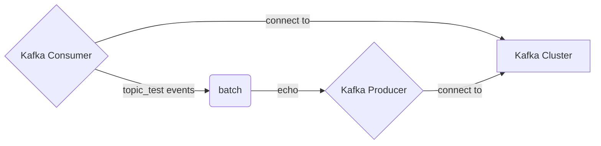

# The `kafka` Connector

The `kafka` connector provides integration with the [Apache Kafka](https://kafka.apache.org/) and compatible
products such as [Confluent Kafka](https://www.confluent.io/) and [Redpanda](https://redpanda.com/).

## Configuration

This section illustrates the configuration options for consumers and producers.

The connector is built on top of [librdkafka](https://github.com/edenhill/librdkafka) and exposes the full complement
of [configuration settings](https://github.com/edenhill/librdkafka/blob/master/CONFIGURATION.md). Care __SHOULD__ be
taken when configuring `kafka` with tremor to ensure that the configuration settings make sense given the logic
required of the resulting system.

### Consumer

Example configuration as a consumer.

```tremor title="config.troy"
define connector consumer from kafka_consumer
with
    # Enables metrics at a 1 second interval
    metrics_interval_s = 1,

    # Reconnection logic
    reconnect = {
            "retry": {
                "interval_ms": 3000,
                "max_retries": 10
            }
        },

    # Data body content is JSON formatted
    codec = "json",

    # Kafka specific consumer configuration
    config = {
    # required - List of broker bootstrap servers
            "brokers": [
                "127.0.0.1:9092"
            ],

    # required - Consumer group id
            "group_id": "test1",

    # required - list of subscription topics to register with
            "topics": [
                "tremor_test"
            ],

    # optional - Whether or not to retry failed attempts
            # When true - resets the offset to a failed message for retry
            #  - Warning: where persistent failure is expected, this will lead to persistent errors
            # When false - Only commits offset for a successful acknowledgement
            "retry_failed_events": false,

    # optional - librdkafka configuration settings ( indicative illustrative example )
            "rdkafka_options": {
                "enable.auto.commit": "false",
                "auto.offset.reset": "beginning",
            }
        }
end;
```


### Producer

Example configuration as a producer.

```tremor
    define connector producer from kafka_producer
    with
        # Enables metrics at a 1 second interval
        metrics_interval_s = 1,

        # Reconnection logic
        reconnect = {
            "retry": {
                "interval_ms": 3000,
                "max_retries": 10
            }
        },

        # Data body content is JSON formatted
        codec = "json",

	# Kafka specific producer configuration
        config = {
	    # required - List of broker bootstrap servers
            "brokers": [
                "127.0.0.1:9092",
            ],

            # required - the topic to send to
            "topic": "tremor_test",

            # optional - Key for messages, overwritten by `kafka.key` in metadata if present
            "key": "snot",

            # optional - librdkafka configuration settings ( indicative illustrative example )
            # "rdkafka_options": { ... },
        }
    end;
```


## Kafka Echo Service example

A complete kafka example echo service that bubbles consumed events to a topic.

In this example both the producer and consumer are connected to the same kafka
cluster and consume from and produce to the same topic.



The actual logic is a little more verbose. However, the basic structure will be similar for
other Kafka `consumer` and `producer` configurations and can be modularised.

```tremor title="config.troy"
# Kafka producer flow
define flow kafka_produce
flow

    use tremor::connectors;
    use tremor::pipelines;
    use integration;

    # Producer Kafka connector
    define connector producer from kafka_producer
    with
        metrics_interval_s = 1,
        reconnect = {
            "retry": {
                "interval_ms": 3000,
                "max_retries": 10
            }
        },
        codec = "json",
        config = {
            "brokers": [
                "127.0.0.1:9092",
            ],
            "topic": "tremor_test",
            "key": "snot"
        }
    end;

    # Producer logic
    define pipeline produce
    pipeline
        use std::time::nanos;

        define script add_kafka_meta
        script
            let $kafka_producer = event.meta;
            emit event["event"]
        end;
        create script add_kafka_meta;

        # Batch events by two or emit after 1 second otherwise
        define operator batch from generic::batch
        with
            count = 2,
            timeout = nanos::from_seconds(1)
        end;
        create operator batch;

        select event from in into add_kafka_meta;

        select event from add_kafka_meta 
        where 
            match event of
              case %{ batch == true } => false
              default => true
            end
        into out;
        select event from add_kafka_meta 
        where 
            match event of 
              case %{ batch == true } => true 
              default => false 
            end 
        into batch;
        select event from add_kafka_meta/err into err;

        select event from batch/err into err;
        select event from batch into out;
    end;
    
    create connector read_file from integration::read_file;
    create connector producer;
    create connector stderr from connectors::console;

    create pipeline passthrough from pipelines::passthrough;
    create pipeline produce from produce;

    connect /connector/read_file to /pipeline/produce;
    connect /connector/read_file/err to /pipeline/passthrough;
    connect /pipeline/produce/out to /connector/producer;
    connect /pipeline/produce/err to /connector/stderr/stderr;
    connect /pipeline/passthrough to /connector/stderr/stderr;

end;

# Kafka consumer flow
define flow kafka_consume
flow
    use tremor::connectors;
    use tremor::pipelines;
    use integration;

    # Consumer Kafka connector
    define connector consumer from kafka_consumer
    with
        metrics_interval_s = 1,
        reconnect = {
                "retry": {
                    "interval_ms": 3000,
                    "max_retries": 10
                }
            },
        codec = "json",
        config = {
                "brokers": [
                    "127.0.0.1:9092"
                ],
                "group_id": "test1",
                "topics": [
                    "tremor_test"
                ],
                "retry_failed_events": false,
                "rdkafka_options": {
                    "enable.auto.commit": "false",
                    "auto.offset.reset": "beginning",
                }
            }
    end;

    define pipeline consume
    into out, exit, err
    pipeline
        define script clean_kafka_meta
        script
            use std::string;
            let $kafka_consumer.key = string::from_utf8_lossy($kafka_consumer.key);
            let $kafka_consumer.timestamp = null;
            event
        end;
        create script clean_kafka_meta;

        select event from in into clean_kafka_meta;
        select {"event": event, "meta": $} from clean_kafka_meta where event != "exit" into out;
        select event from clean_kafka_meta where event == "exit" into exit;
        select event from clean_kafka_meta/err into err;
    end;
    
    create connector exit from integration::exit;
    create connector write_file from integration::write_file;
    create connector consumer;
    create connector stderr from connectors::console;

    create pipeline consume;
    create pipeline passthrough from pipelines::passthrough;

    # main logic
    connect /connector/consumer to /pipeline/consume;
    connect /pipeline/consume/out to /connector/write_file;
    connect /pipeline/consume/exit to /connector/exit;

    # debugging
    connect /connector/consumer/err to /pipeline/passthrough;
    connect /pipeline/consume/err to /connector/stderr/stderr;
    connect /pipeline/passthrough to /connector/stderr/stderr;
end;

deploy flow kafka_produce;
deploy flow kafka_consume;
```


## Exercises

* Modify the example to introduce guaranteed delivery of the tremor logic based on the [wal](./wal) write-ahead log connector
* Use a separate cluster for the consumer and producer
* Modify the `rdkafka_options` configuration to reflect production configuration in your system
* Use `$kafka_consumer.key` metadata from received kafka events
* Use `$kafka_consumer.headers` metadata from received kafka events
* Use `$kafka_consumer.topic` metadata from received kafka events
* Use `$kafka_consumer.partition` metadata from received kafka events
* Use `$kafka_consumer.offset` metadata from received kafka events
* Use `$kafka_consumer.timestamp` metadata from received kafka events
* Set `$kafka_producer.headers` metadata to propagate kafka header metadata
* Set `$kafka_producer.timestamp` metadata to alter timestamp metadata
* Set `$kafka_producer.partition` metadata to alter kafka partition metadata

