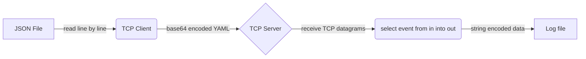
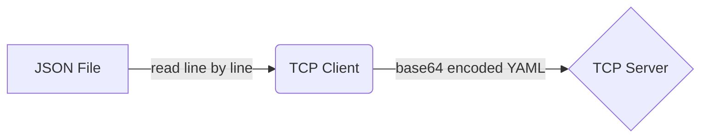
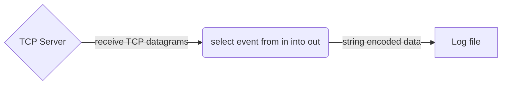

# The `tcp` Connector

The `tcp` connector allows TCP-based clients and servers to be integrated with tremor.

## Configuration

### Client

```tremor title="config.troy"
define connector `tcp-out` from tcp_client
with
  codec = "yaml",
  postprocessors = ["base64"],
  config = {
    "url": "localhost:4242",

    # Optional Transport Level Security configuration
    # "tls" = { ... },

    # Optional tuning of the Nagle algorithm ( default: true )
    # - By default no delay is preferred
    # "no_delay" = false,

    # Data buffer size ( default: 8K, limits maximum message size )
    # "buf_size" = "16K",
  }
end;
```

### Server

```tremor title="config.troy"
define connector `tcp-in` from tcp_server
with
  codec = "string",
  config = { 
    "url": "localhost:4242",

    # Optional Transport Level Security configuration
    # "tls" = { ... }

    # Data buffer size ( default: 8K, limits maximum message size )
    # "buf_size" = "16K",
  }
end;
```

## TCP configuration example

This is a relatively simple client server system that replays JSON formatted lines of data
from a text file over TCP to a server. The JSON data is transformed to `base64` encoded YAML
before sending to the TCP server. The server receives TCP datagrams and writes them to a
log file encoding the log entries as naked string data.

The client and server are implemented as treomr flows.

A high level summary of the overall flow:



### JSON file over TCP as base64 encoded YAML

A tremor flow that consumes JSON formatted data line by line
from a file and sends each event as a `base64` encoded YAML formatted
event via TCP to a TCP service.

High level flow summary:



In deployable form

```tremor title="config.troy"
define flow main
flow
  use tremor::connectors;
  use integration;


  define connector in from file
  with codec = "json",
    preprocessors = ["lines"],
    config = {
        "path": "in.json",
        "mode": "read"
    }
  end;

  define connector `tcp-out` from tcp_client
  with
    codec = "yaml",
    postprocessors = ["base64"],
    config = {
      "url": "localhost:4242",
    }
  end;
  
  create pipeline main from integration::out_or_exit;
  create connector in;
  create connector `tcp-out`;
  create connector exit from connectors::exit;

  connect /connector/in/out to /pipeline/main/in;
  connect /pipeline/main/out to /connector/`tcp-out`/in;
  connect /pipeline/main/exit to /connector/exit/in;
end;

deploy flow main;
```

### TCP server that logs base64 encoded YAML as one string per line to a file

A tremor flow that consumes TCP datagram events and writes them
to a file encoding as raw strings.

High level flow summary:




```tremor title="config.troy"
define flow server
flow
  use integration;
  use tremor::pipelines;
  use tremor::connectors;

  define connector tcp_server from tcp_server
  with
    preprocessors = ["lines"],
    postprocessors = ["lines"],
    codec = "json",
    config = {
      "url": "0.0.0.0:65535",
      "buf_size": 1024,
    }
  end;

  create connector server_out from integration::write_file
  with
    file = "server_out.log"
  end;
  create connector stdio from connectors::console;
  create connector tcp_server;

  create pipeline server_side from pipelines::passthrough;
  create pipeline debug from pipelines::passthrough;

  # flow from tcp_server to file
  connect /connector/tcp_server to /pipeline/server_side;
  connect /connector/tcp_server/err to /pipeline/debug;
  connect /pipeline/server_side to /connector/server_out;

  # aaaand echo it back
  connect /pipeline/server_side to /connector/tcp_server;

  # debugging
  connect /pipeline/debug to /connector/stdio;
end;

define flow client
flow
  use integration;
  use tremor::pipelines;
  use tremor::connectors;

  define connector tcp_client from tcp_client
  with
    preprocessors = ["lines"],
    postprocessors = ["lines"],
    codec = "json",
    config = {
      "url": "127.0.0.1:65535",
      "no_delay": false,
      "buf_size": 1024,
    },
    reconnect = {
      "retry": {
        "interval_ms": 100,
        "growth_rate": 2,
        "max_retries": 3,
      }
    }
  end;

  create connector in from integration::read_file;
  create connector client_out from integration::write_file
  with
    file = "client_out.log"
  end;
  create connector exit from integration::exit;
  create connector stdio from connectors::console;
  create connector tcp_client;

  create pipeline to_client from pipelines::passthrough;
  create pipeline from_client from integration::out_or_exit;
  create pipeline debug from pipelines::passthrough;

  connect /connector/in to /pipeline/to_client;
  connect /connector/in/err to /pipeline/debug;
  connect /pipeline/to_client to /connector/tcp_client;

  # send out any responses to the client to file `client_out.log`
  connect /connector/tcp_client to /pipeline/from_client;
  connect /connector/tcp_client/err to /pipeline/debug;
  connect /pipeline/from_client/out to /connector/client_out;
  connect /pipeline/from_client/exit to /connector/exit;

  # debugging
  connect /pipeline/debug to /connector/stdio;

end;

deploy flow server;
deploy flow client;
```

## Notes

### Running as an integration test

This is how we run this test sceanario within our integration test suite.

```bash
$ export TREMOR_PATH=/path/to/tremor-runtime/tremor-script/lib:/path/to/tremor-runtime/tremor-cli/tests/lib
$ tremor test integration .
```

### Running as long running service

The logic can be used as starting point for your own client or service via `tremor server run`.

```bash
$ export TREMOR_PATH=/path/to/tremor-runtime/tremor-script/lib:/path/to/tremor-runtime/tremor-cli/tests/lib
$ tremor server run config.troy
```

### Running as a long running service, with pretty printed JSON output

During development, pretty printing the JSON output on standard output might be useful.

We typically use the wonderful [`jq`](https://stedolan.github.io/jq/) for this purpose

```bash
$ export TREMOR_PATH=/path/to/tremor-runtime/tremor-script/lib:/path/to/tremor-runtime/tremor-cli/tests/lib
$ tremor server run config.troy | jq
```

### Exercises

* Modularise the solution allowing the following combinations
  * Deploy the client and server in separate tremor instances
  * Deploy the client and server in a single tremor instance
  * Use the `msgpack` codec instead of `base64` encoded YAML
  * Unpack the `base64` encoded YAML and write to a log file as line-delimited JSON
  * Add compression and decmopression


